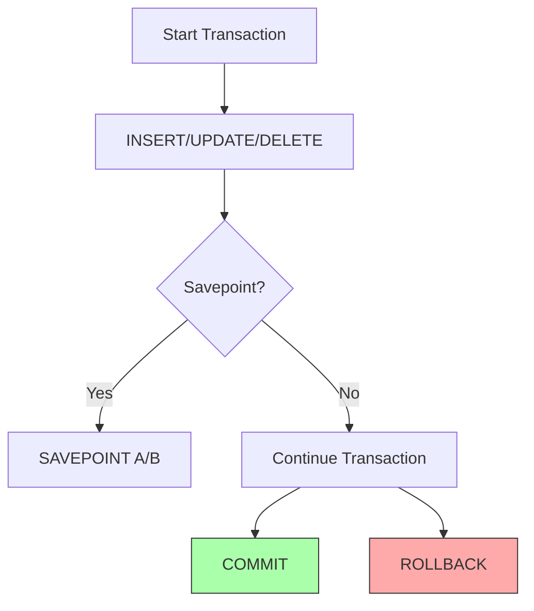
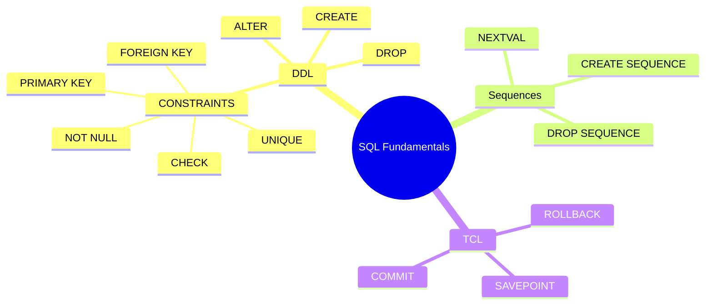

# 🧠 Database – SQL Fundamentals (Lab 4)

> [!note]
> This lab introduces **SQL Data Definition Language (DDL)** and **Transaction Control Language (TCL)**.  
> It covers commands to **create, modify, and delete database structures**, enforce **constraints**, and manage **transactions** using COMMIT, ROLLBACK, and SAVEPOINT.

---

## 🧩 Continuity with Previous Lectures
> [!note]
> Builds on prior labs about **DML (Data Manipulation Language)** by introducing structural control via DDL and transactional integrity via TCL.

---

## 🧱 Data Definition Language (DDL) 🟢

### Overview
> [!note]
> DDL commands define and modify database structures.  
> Main commands: **CREATE**, **ALTER**, **DROP**.

---

### Creating Tables
**Syntax:**
```sql
CREATE TABLE table_name (
  column_name data_type(size),
  ...
);
```

**Example:**

```sql
CREATE TABLE dept (
  deptno NUMBER(2),
  dname  VARCHAR2(14),
  loc    VARCHAR2(13)
);
```

> [!note]  
> You must specify: **table name**, **column names**, **data types**, and **sizes**.  
> Output: `Table created.`

---

### Common Data Types

|Data Type|Description|
|---|---|
|`VARCHAR2(size)`|Variable-length character (max 4000)|
|`CHAR(size)`|Fixed-length character (max 2000)|
|`NUMBER(p,s)`|Numeric with precision and scale|
|`DATE`|Date and time values|

---

### ALTER TABLE 🟡

Used to:

- Add new columns
    
- Modify existing columns
    
- Drop columns
    

#### Add a Column

```sql
ALTER TABLE dept80
ADD (job_id VARCHAR2(9));
```

> [!note]  
> New columns appear last; existing rows get `NULL` for the new field.

#### Modify a Column

```sql
ALTER TABLE dept80
MODIFY (last_name VARCHAR2(30));
```

> [!warning]  
> You can **increase** column width but **cannot reduce** it if data exists.

#### Drop a Column

```sql
ALTER TABLE dept80
DROP COLUMN job_id;
```

> [!warning]
> 
> - Only one column can be dropped at a time.
>     
> - Dropped columns **cannot be recovered**.
>     
> - All constraints on that column are removed automatically.
>     

---

### Dropping a Table

```sql
DROP TABLE dept80;
```

> [!note]  
> Removes both structure and data.  
> Option: `CASCADE CONSTRAINTS` removes dependent integrity constraints.

---

## 🔒 Table Constraints 🟡

### Purpose

> [!note]  
> Constraints ensure **data integrity** and prevent **invalid data entry**.  
> Common types:
> 
> - **NOT NULL**
>     
> - **UNIQUE**
>     
> - **PRIMARY KEY**
>     
> - **FOREIGN KEY**
>     
> - **CHECK**
>     

---

### Defining Constraints

Constraints can be defined at:

- **Column level** (within column definition)
    
- **Table level** (after all columns)
    

#### Column-Level Example

```sql
CREATE TABLE employees(
  employee_id NUMBER(6) PRIMARY KEY,
  last_name   VARCHAR2(25) UNIQUE,
  email       VARCHAR2(25),
  salary      NUMBER(8,2) CHECK (salary > 0),
  hire_date   DATE NOT NULL,
  department_id NUMBER(4)
    REFERENCES departments(department_id)
);
```

> [!tip]  
> To add multiple constraints on a single column, **separate them with spaces**.

#### Table-Level Example

```sql
CREATE TABLE employees(
  employee_id NUMBER(6),
  last_name   VARCHAR2(25),
  email       VARCHAR2(25),
  CONSTRAINT emp_email_uk UNIQUE(email),
  CONSTRAINT emp_id_pk PRIMARY KEY(employee_id)
);
```

---

### Adding Constraints After Table Creation

```sql
ALTER TABLE employees
ADD CONSTRAINT emp_dept_fk
FOREIGN KEY (department_id)
REFERENCES departments (department_id);
```

---

### FOREIGN KEY Details 🔴

> [!note]  
> Links a **child table** to a **parent table**.
> 
> - **ON DELETE CASCADE** → Deletes child rows automatically.
>     
> - **ON DELETE SET NULL** → Sets child foreign key to `NULL` if parent deleted.
>     
> - Without these → Parent row cannot be deleted if referenced.
>     

> [!warning]  
> Foreign and primary key **data types must match**.

---

### Dropping Constraints

```sql
ALTER TABLE employees
DROP CONSTRAINT emp_manager_fk;

ALTER TABLE departments
DROP PRIMARY KEY CASCADE;
```

> [!warning]  
> `CASCADE` drops all dependent foreign keys referencing the primary key.

---

## 🔢 Sequences 🟢

> [!note]  
> Sequences **generate unique numeric values**—typically for primary keys.

**Syntax:**

```sql
CREATE SEQUENCE seq_name
START WITH n
INCREMENT BY n
[MAXVALUE n | NOMAXVALUE]
[CYCLE | NOCYCLE];
```

**Example:**

```sql
CREATE SEQUENCE id_seq
START WITH 1
INCREMENT BY 1
MAXVALUE 2000;
```

**Usage:**

```sql
INSERT INTO dept VALUES (id_seq.NEXTVAL, 'Finance', 'Cairo');
```

**Drop Sequence:**

```sql
DROP SEQUENCE id_seq;
```

> [!tip]  
> Avoid using **CYCLE** if the sequence is used for **primary keys**.

---

## 💾 Transaction Control Language (TCL) 🟡

### Purpose

> [!note]  
> Manages **changes made by DML**.  
> Allows **commit**, **rollback**, and **savepoint** control over transactions.

**Main Commands:**

- `COMMIT` → Save all changes
    
- `ROLLBACK` → Undo all changes
    
- `SAVEPOINT` → Mark transaction milestones
    

---

### COMMIT

```sql
INSERT INTO dept VALUES (11, 'Finance', 'Alex');
UPDATE emp SET deptno = 40 WHERE empno = 7902;
COMMIT;
```

> [!note]  
> Changes become permanent and visible to all users.  
> Locks on rows are released.

---

### ROLLBACK

```sql
DELETE FROM test;
ROLLBACK;
```

> [!note]  
> Undoes all uncommitted changes and releases locks.

---

### SAVEPOINT

Used to **divide a transaction** into logical parts.

```sql
SAVEPOINT update_done;
INSERT INTO region (id, name) VALUES (8, 'Central');
ROLLBACK TO update_done;
```

> [!tip]  
> Use SAVEPOINT to **partially undo** operations within a transaction.

---

### Transaction States Diagram



---

## 🧩 Hands-On Practice

1. **Create a table**:
    
    ```sql
    CREATE TABLE yourname_emp (
      id NUMBER(2),
      first_name VARCHAR2(10),
      last_name VARCHAR2(10),
      salary NUMBER(6)
    );
    ```
    
2. **Add PRIMARY KEY constraint**:
    
    ```sql
    ALTER TABLE yourname_emp
    ADD CONSTRAINT emp_id_pk PRIMARY KEY (id);
    ```
    
3. **Insert rows:**
    
    ```sql
    INSERT INTO yourname_emp VALUES (11, 'Jon', 'Adams', 2000);
    INSERT INTO yourname_emp VALUES (12, 'Alan', 'Robin', 800);
    ```
    
4. **Confirm entries:**
    
    ```sql
    SELECT * FROM yourname_emp;
    ```
    

---

## 🌐 Concept Hierarchy Diagram



---

## 📚 Glossary

- **DDL**: Commands defining database schema.
    
- **TCL**: Commands managing transaction control.
    
- **Constraint**: Rule ensuring data validity.
    
- **Sequence**: Auto-increment numeric generator.
    
- **COMMIT**: Save transaction permanently.
    
- **ROLLBACK**: Undo uncommitted changes.
    
- **SAVEPOINT**: Transaction checkpoint.
    

---

## 🎯 Key Takeaways

- DDL commands alter database structure, not data.
    
- Constraints ensure data integrity at column and table levels.
    
- Sequences automate key generation.
    
- TCL controls transaction consistency.
    
- SAVEPOINT enables partial rollback of transactions.
    

---

## 🧠 Quick Review Card

**Q1:** What is the difference between DDL and DML?  
**A:** DDL modifies database structure; DML modifies data.

**Q2:** What happens when a table is dropped?  
**A:** Data and structure are deleted; constraints removed.

**Q3:** What does `ON DELETE CASCADE` do?  
**A:** Deletes child rows when the parent is deleted.

**Q4:** How do you reverse part of a transaction?  
**A:** Use `ROLLBACK TO SAVEPOINT`.

**Q5:** Why avoid `CYCLE` in sequences for primary keys?  
**A:** It can create duplicate key values.

---

## 🔗 Further Resources

- Oracle SQL Developer Documentation
    
- _Database System Concepts_ by Silberschatz et al.
    
- W3Schools: [SQL Constraints and Keys](https://www.w3schools.com/sql/sql_constraints.asp)
  
## Notes
`unique(name, email)` → creates **one composite unique constraint** on the **pair** `(name, email)`.

- The **combination** of both values must be unique.
    
- Duplicate `name` values are allowed as long as `email` differs, and vice versa.  
###### Example:  

| name | email                           | ✅ allowed? |
| ---- | ------------------------------- | ---------- |
| Amr  | [a@mail.com](mailto:a@mail.com) | yes        |
| Amr  | [b@mail.com](mailto:b@mail.com) | yes        |
| Omar | [a@mail.com](mailto:a@mail.com) | yes        |
| Amr  | [a@mail.com](mailto:a@mail.com) | **no**     |

`unique(name); unique(email);` → creates **two separate unique constraints**, one for `name` and one for `email`.

- Each column must have **globally unique** values.  
##### Example:  

| name | email                           | ✅ allowed?               |     |
| ---- | ------------------------------- | ------------------------ | --- |
| Amr  | [a@mail.com](mailto:a@mail.com) | yes                      |     |
| Amr  | [b@mail.com](mailto:b@mail.com) | **no** (name duplicate)  |     |
| Omar | [a@mail.com](mailto:a@mail.com) | **no** (email duplicate) |     |

**Summary:**

- `unique(name, email)` → ensures unique **pairs**.
    
- `unique(name); unique(email);` → ensures unique **columns individually**.