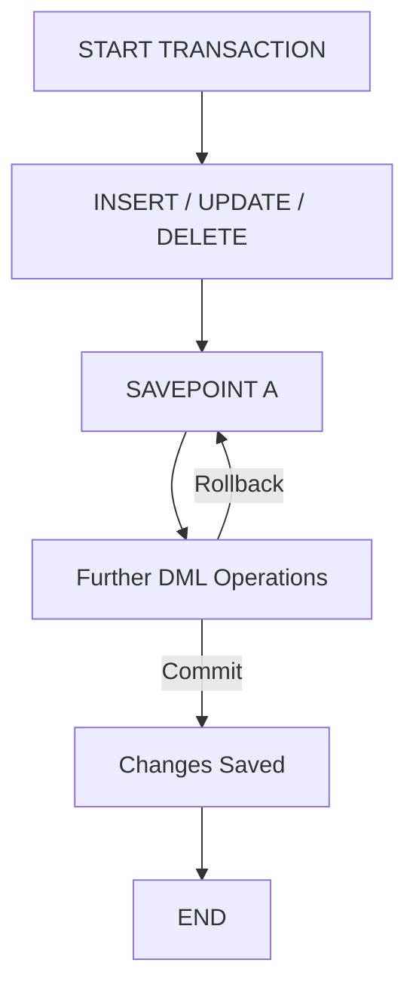

# 🧠 Database Systems – Lab 4: SQL Fundamentals (DDL & TCL)

> [!overview]
> This lab introduces **Data Definition Language (DDL)** and **Transaction Control Language (TCL)** in SQL. It covers creating and managing database objects, defining constraints, handling sequences, and controlling transactions using `COMMIT`, `ROLLBACK`, and `SAVEPOINT`.

---

## 1. Data Definition Language (DDL)

### 1.1 Core DDL Commands
- **CREATE** – Define new database objects.
- **ALTER** – Modify existing structures.
- **DROP** – Remove objects permanently.

---

## 2. Creating Tables

> [!example]
> ```sql
> CREATE TABLE dept (
>   deptno NUMBER(2),
>   dname VARCHAR2(14),
>   loc   VARCHAR2(13)
> );
> ```

### Key Points
- You must specify:
  - **Table name**
  - **Column name, data type, and size**
- Supported data types:

| Data Type        | Description                               |
| ---------------- | ----------------------------------------- |
| `VARCHAR2(size)` | Variable-length character data (max 4000) |
| `CHAR(size)`     | Fixed-length character data (max 2000)    |
| `NUMBER(p,s)`    | Numeric data with precision and scale     |
| `DATE`           | Date and time values                      |
  
---

## 3. Altering Tables

### 3.1 Adding Columns
```sql
ALTER TABLE dept80
ADD (job_id VARCHAR2(9));
```

### 3.2 Modifying Columns

```sql
ALTER TABLE dept80
MODIFY (last_name VARCHAR2(30));
```

### 3.3 Dropping Columns

```sql
ALTER TABLE dept80
DROP COLUMN job_id;
```

> [!warning]  
> Once a column is dropped, it **cannot be recovered**.  
> All constraints on that column are automatically removed.

---

## 4. Dropping Tables

```sql
DROP TABLE dept80 CASCADE CONSTRAINTS;
```

- Deletes all data and structure.
    
- `CASCADE CONSTRAINTS` removes dependent constraints.
    

---

## 5. Table Constraints

> [!note]  
> Constraints enforce **data integrity** and ensure valid relationships.

### 5.1 Types of Constraints

- **NOT NULL**
    
- **UNIQUE**
    
- **PRIMARY KEY**
    
- **FOREIGN KEY**
    
- **CHECK**
    

### 5.2 Defining Constraints

Two levels of definition:

- **Column-level** – inline with column declaration.
    
- **Table-level** – defined after all columns.
    

> [!example]  
> **Column-level example:**
> 
> ```sql
> CREATE TABLE employees (
>   employee_id NUMBER(6) PRIMARY KEY,
>   last_name   VARCHAR2(25) UNIQUE,
>   salary      NUMBER(8,2) CHECK (salary > 0),
>   hire_date   DATE NOT NULL,
>   department_id NUMBER(4) REFERENCES departments(department_id)
> );
> ```
> **Table-level example:**
> 
> ```sql
> CREATE TABLE employees (
>   employee_id NUMBER(6),
>   last_name VARCHAR2(25),
>   email VARCHAR2(25),
>   CONSTRAINT emp_email_uk UNIQUE(email),
>   CONSTRAINT emp_id_pk PRIMARY KEY(employee_id)
> );
> ```

---

## 6. Foreign Key Constraints

> [!tip]  
> Use `ON DELETE` options to control dependent record behavior.

- **`ON DELETE CASCADE`** → deletes dependent rows in child table.
    
- **`ON DELETE SET NULL`** → sets foreign key values to `NULL`.
    
- Without either option → parent rows cannot be deleted if referenced.
    

> [!example]
> 
> ```sql
> ALTER TABLE employees
> ADD FOREIGN KEY(department_id)
> REFERENCES departments(department_id)
> ON DELETE CASCADE;
> ```

---

## 7. Dropping Constraints

```sql
ALTER TABLE employees DROP CONSTRAINT emp_manager_fk;
ALTER TABLE departments DROP PRIMARY KEY CASCADE;
```

---

## 8. Sequences

### 8.1 Purpose

- Automatically generate **unique numeric values**.
    
- Commonly used for **primary keys**.
    

### 8.2 Syntax

```sql
CREATE SEQUENCE id_seq
  START WITH 1
  INCREMENT BY 1
  MAXVALUE 2000
  NOCYCLE;
```

> [!example]
> 
> ```sql
> INSERT INTO dept VALUES (id_seq.NEXTVAL, 'Finance', 'Cairo');
> ```

To remove:

```sql
DROP SEQUENCE id_seq;
```

---

## 9. Transaction Control Language (TCL)

### 9.1 Core TCL Commands

- **COMMIT** – Save all changes.
    
- **ROLLBACK** – Undo all changes.
    
- **SAVEPOINT** – Mark a specific point in a transaction.
    

---

### 9.2 State Before Commit/Rollback

- Changes visible **only to current user**.
    
- Rows are **locked** and not visible to others.
    

### 9.3 After Commit

- Data is **permanently saved**.
    
- Locks are **released**.
    
- All users can see the new data.
    

### 9.4 After Rollback

- All pending changes are **discarded**.
    
- Locks are **released**.
    

> [!example]
> 
> ```sql
> INSERT INTO dept VALUES (11, 'Finance', 'Alex');
> UPDATE emp SET deptno = 40 WHERE empno = 7902;
> COMMIT;
> ```

---

### 9.5 Using Savepoints

```sql
SAVEPOINT update_done;
ROLLBACK TO update_done;
```

> [!example]
> 
> ```sql
> UPDATE emp SET sal = sal * 1.1 WHERE job = 'CLERK';
> SAVEPOINT update_done;
> INSERT INTO region (id, name) VALUES (8, 'Central');
> ROLLBACK TO update_done;
> ```

---

## 10. Visualization



---

## Glossary

|Term|Definition|
|---|---|
|**DDL**|Data Definition Language; manages structure of database objects|
|**TCL**|Transaction Control Language; manages DML transaction flow|
|**Constraint**|Rule that enforces data validity and relationships|
|**Sequence**|Database object that generates unique numeric values|
|**Commit**|Finalizes and saves all changes|
|**Rollback**|Reverses uncommitted changes|

---

## Key Takeaways

- DDL commands define and modify database schemas.
    
- Constraints enforce **integrity and consistency**.
    
- Sequences automate **primary key generation**.
    
- TCL commands control **transaction safety**.
    

---

## Further Resources

- Oracle SQL Developer Documentation
    
- “Database System Concepts” by Silberschatz, Korth & Sudarshan
    
- [Oracle SQL Language Reference (official)](https://docs.oracle.com/en/database/oracle/oracle-database/)