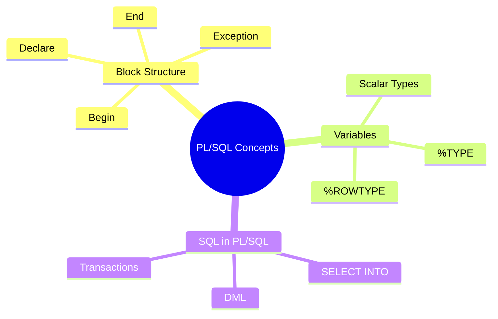

> [!note]
> **Overview**  
> This lecture introduces PL/SQL fundamentals, focusing on block structure, variable handling, attributes (%TYPE and %ROWTYPE), and retrieving data using `SELECT … INTO`.  
> Emphasis is placed on modular coding, datatype flexibility, and safe interaction with database tables.

---

## 1. What is PL/SQL? 🟢

> [!note]
> **PL/SQL** is Oracle’s procedural extension to SQL. It embeds SQL statements inside programming structures such as variables, loops, and exception handlers.

### Benefits
- **Modular** program development  
- **Control structures** (loops, conditions)  
- **Error handling** (EXCEPTION blocks)  
- **Performance efficiency** through reduced round trips to the database

---

## 2. PL/SQL Block Structure 🟢

A PL/SQL block consists of **four main sections**:

 
 ```plsql
DECLARE -- Optional  
BEGIN -- Mandatory  
EXCEPTION -- Optional  
END; -- Mandatory
```

 

### Structure Details
> [!note]
> - **DECLARE:** variables, constants, cursors, user-defined exceptions  
> - **BEGIN:** SQL operations + PL/SQL logic  
> - **EXCEPTION:** error-handling routines  
> - **END:** terminates block

---

## 3. Types of PL/SQL Blocks 🟢

### Anonymous Block
 

 ```plsql
DECLARE  
-- declarations  
BEGIN  
-- statements  
EXCEPTION  
-- error handling  
END;

```
 

### Stored Procedure 🟡
 
 ```plsql
PROCEDURE proc_name IS  
BEGIN  
-- logic  
END;
```

### Function 🟡
 


 ```plsql
FUNCTION func_name RETURN datatype IS  
BEGIN  
-- logic  
RETURN value;  
END;
```


 

> [!warning]
> Functions **must return a value**, procedures do not.

---

## 4. Variables in PL/SQL 🟢

### Core Rules
- Declare inside **DECLARE** section  
- Assign values inside **BEGIN**  
- Use `:=` or `DEFAULT` for initialization  
- One identifier per line (recommended practice)

### Syntax
 

 ```plsql
identifier [CONSTANT] datatype [NOT NULL] [:= expr];
```

 

### Common Scalar Datatypes
- **NUMBER(p,s)**
- **CHAR(n)**
- **VARCHAR2(n)**
- **DATE**
- **BOOLEAN**

### Examples
 

 ```plsql
v_totalSalary NUMBER(9,2);  
v_orderDate DATE := SYSDATE + 7;  
c_taxRate CONSTANT NUMBER(3,2) := 8.25;  
v_valid BOOLEAN NOT NULL := TRUE;
```

 `

---

## 5. Commenting Code 🟢

- Single-line: `-- comment`
- Multi-line: `/* … */`

Example:
 ```plsql
/* Compute annual salary */
-- v_sal := v_sal * 12;
```
 `

---

## 6. The %TYPE Attribute 🟡

> [!note]  
> `%TYPE` assigns a variable the **datatype of another variable or a table column**.

### Advantages

- No need to know column datatype
    
- Datatype updates automatically if table changes
    

### Example

```plsql
v_last_name       emp.last_name%TYPE;
v_balance         NUMBER(4);
v_min_balance     v_balance%TYPE := 10;
```
 

---

## 7. The %ROWTYPE Attribute 🟡

> [!note]  
> `%ROWTYPE` creates a record with **all columns of a table or view**.

### Syntax

```plsql
DECLARE
   dept_record   dept%ROWTYPE;
 
```

### Advantages

- Handles all columns at once
    
- Ideal for `SELECT * INTO ...` operations
    
- Automatically adjusts if table structure changes
    

---

## 8. Retrieving Data Using SELECT … INTO 🔴

### Syntax

```plsql
SELECT column_list
INTO   target_var | record_var
FROM   table_name
WHERE  condition;
```
 

> [!warning]  
> The query **must return exactly one row** or it will raise `NO_DATA_FOUND` or `TOO_MANY_ROWS`.

### Example

Retrieve order dates for order 102:

```plsql
DECLARE
   v_date_ordered   orders.date_ordered%TYPE;
   v_date_shipped   orders.date_shipped%TYPE;
BEGIN
   SELECT date_ordered, date_shipped
   INTO   v_date_ordered, v_date_shipped
   FROM   orders
   WHERE  orderid = 102;
END;
```
 

### %ROWTYPE Example

```plsql
DECLARE
   emp_rec  employees%ROWTYPE;
BEGIN
   SELECT *
   INTO emp_rec
   FROM employees
   WHERE employee_id = 124;

   INSERT INTO retired_emps(empno, ename, hiredate, leavedate, sal, deptno)
   VALUES (
      emp_rec.emp_id, emp_rec.last_name, emp_rec.hire_date,
      SYSDATE, emp_rec.salary, emp_rec.dept_id
   );
END;
```
 

---

## 9. Additional Real-World Examples (Requested) 🟡

### Example: Salary Update Procedure

```plsql
PROCEDURE update_salary(p_empid NUMBER, p_raise NUMBER) IS
BEGIN
   UPDATE employees
   SET salary = salary + p_raise
   WHERE employee_id = p_empid;

   COMMIT;
END;
```
 

### Example: Function Returning Annual Salary

```plsql
FUNCTION get_annual_salary(p_empid NUMBER)
RETURN NUMBER IS
   v_monthly employees.salary%TYPE;
BEGIN
   SELECT salary INTO v_monthly
   FROM employees
   WHERE employee_id = p_empid;

   RETURN v_monthly * 12;
END;
```
 

---

## 10. Concept Hierarchy Diagram


 

---

## 11. Continuity with Previous Lectures

> [!note]  
> This lecture builds on earlier SQL sessions where you learned basic queries, DML operations, and transactions.  
> PL/SQL extends these concepts by embedding SQL into procedural logic and adding variables, conditions, and exceptions.

---

## 🧩 Hands-On Practice

1. Declare variables using both **explicit datatypes** and **%TYPE**.
    
2. Write a block that retrieves one row with `SELECT … INTO`.
    
3. Create a function returning a computed value.
    
4. Write an anonymous block that inserts a row using a `%ROWTYPE` record.
    

---

## 12. Lecture Questions (Extracted)

> [!question]
> 
> - What is PL/SQL?
>     
> - What are the advantages of using %TYPE?
>     
> - What are the advantages of using %ROWTYPE?
>     

---

## Glossary

- **PL/SQL:** Oracle’s procedural SQL extension
    
- **Block:** Executable structure of PL/SQL code
    
- **%TYPE:** Variable datatype based on another variable/column
    
- **%ROWTYPE:** Record representing an entire table row
    
- **SELECT INTO:** SQL query that stores result into variables
    

---

## Key Takeaways

- PL/SQL enables procedural SQL with modular structure
    
- Variables can be declared explicitly or using `%TYPE` / `%ROWTYPE`
    
- `SELECT INTO` retrieves exactly one row into variables
    
- Exception handling is built-in
    
- PL/SQL code tightly integrates with database operations
    

---

## Quick Review Card

**Q:** What does `%TYPE` do?  
**A:** Assigns variable datatype based on another variable or column.

**Q:** What does `%ROWTYPE` represent?  
**A:** All columns of a table or view as one record.

**Q:** Which section of PL/SQL is mandatory?  
**A:** `BEGIN` and `END`.

**Q:** What happens if `SELECT INTO` returns multiple rows?  
**A:** Raises `TOO_MANY_ROWS` exception.

---

## Further Resources

- Oracle Docs: _PL/SQL Language Reference_
    
- Steven Feuerstein – _Oracle PL/SQL Programming_
    
- Oracle LiveSQL online playground
    
---
 