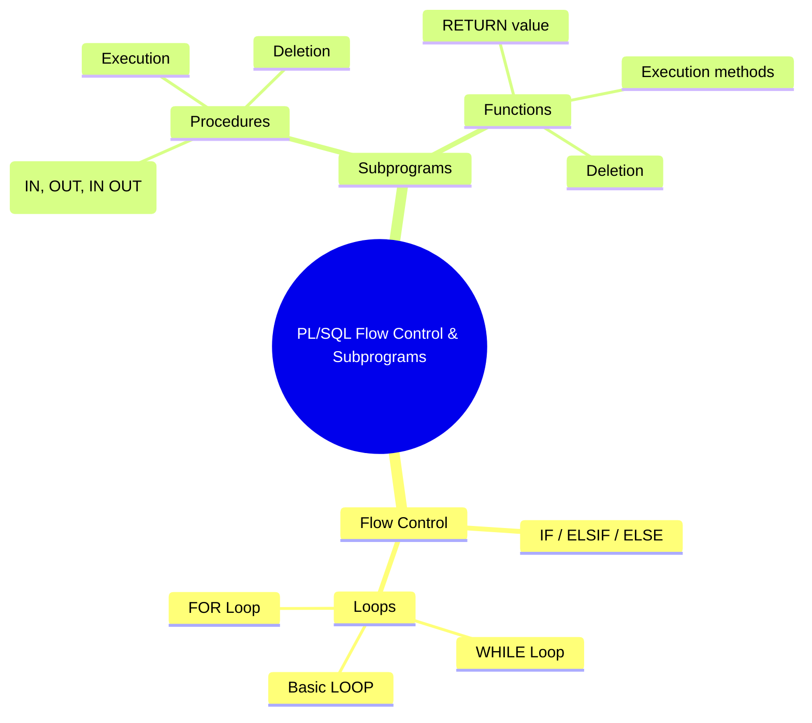

> [!note] Overview  
> This lecture introduces **flow-control structures in PL/SQL** (IF statements, loops) and covers **stored subprograms** (procedures and functions), including creation, execution, parameters, and removal. Hands-on examples reinforce PL/SQL’s procedural capabilities for real-world database logic.

---

## 1. Controlling Execution Flow in PL/SQL

### 1.1 Conditional Control – IF Statements 🟢

> [!note] Definition  
> The **IF statement** allows conditional execution based on Boolean expressions.

**Syntax:**
```sql
IF condition THEN
  statements;
ELSIF condition THEN
  statements;
ELSE
  statements;
END IF;
```

**Rules:**

- **END IF** = two words.
    
- Only **one** ELSE allowed.
    
- **ELSIF** is one word (not ELSE IF).
    

> [!example] Applied Example

```sql
IF sal > 5000 THEN
  dbms_output.put_line('Category one');
ELSIF sal > 3000 THEN
  dbms_output.put_line('Category two');
ELSE
  dbms_output.put_line('Category three');
END IF;
```

> [!warning] Common Mistake  
> Using `ELSE IF` instead of `ELSIF` will raise a compilation error.

---

## 2. Loop Control Structures

PL/SQL supports **three main loop types**, each optimized for different scenarios.

---

### 2.1 Basic LOOP 🔰 (evaluated at end) 🟢

> [!note] Definition  
> A **basic loop** runs indefinitely **until EXIT** is reached.

**Syntax:**

```sql
LOOP
  statements;
  EXIT [WHEN condition];
END LOOP;
```

**Example: Insert 10 items**

```sql
DECLARE
  v_counter NUMBER(2) := 1;
BEGIN
  LOOP
    INSERT INTO s_item (ord_id, item_id)
    VALUES (101, v_counter);

    v_counter := v_counter + 1;

    EXIT WHEN v_counter > 10;
  END LOOP;
END;
```

---

### 2.2 FOR Loop (Implicit Counter) 🟢

> [!note] Key Properties
> 
> - Loop index is **implicitly declared**.
>     
> - It is **read-only** inside the loop.
>     
> - Automatically increments.
>     
> - `REVERSE` runs backward.
>     

**Syntax:**

```sql
FOR i IN [REVERSE] lower..upper LOOP
  statements;
END LOOP;
```

> [!example] Counting 1 → 10

```sql
BEGIN
  FOR i IN 1..10 LOOP
    DBMS_OUTPUT.PUT_LINE(i);
  END LOOP;
END;
```

> [!example] Counting 10 → 1

```sql
BEGIN
  FOR i IN REVERSE 1..10 LOOP
    DBMS_OUTPUT.PUT_LINE(i);
  END LOOP;
END;
```

---

### 2.3 WHILE Loop (evaluated at start) 🟡

> [!note] Definition  
> Executes **while** the condition evaluates to TRUE.

**Syntax:**

```sql
WHILE condition LOOP
  statements;
END LOOP;
```

**Example:**

```sql
DECLARE
  v_counter NUMBER(2) := 1;
BEGIN
  WHILE v_counter <= 10 LOOP
    INSERT INTO s_item (ord_id, item_id)
    VALUES (101, v_counter);

    v_counter := v_counter + 1;
  END LOOP;
END;
```

> [!warning] Pitfall  
> Forgetting to increment the counter results in an infinite loop.

---

## 3. Subprograms in PL/SQL

### 3.1 What Are Subprograms? 🟢

> [!note] Definition  
> A **subprogram** is a named PL/SQL block stored in the database and reusable.

Types:

- **Procedures** → perform actions
    
- **Functions** → return a single value
    

---

### 3.2 Subprogram Structure 🟢

Every subprogram includes:

|Component|Mandatory?|Purpose|
|---|---|---|
|**Header**|Yes|Name, type, parameters|
|**Declarative Section**|Optional|Local variables|
|**Executable Section**|Yes|SQL + PL/SQL statements|
|**Exception Section**|Optional|Error handling|
|**END;**|Yes|Terminates subprogram|

---

## 4. Stored Procedures

### 4.1 Creating a Procedure 🟡

**Syntax:**

```sql
CREATE [OR REPLACE] PROCEDURE procedure_name
  (parameter1 [mode] datatype1, ...)
IS
  -- local declarations
BEGIN
  -- actions
END procedure_name;
```

Parameter modes:

- **IN** (default): Input only
    
- **OUT**: Return data to caller
    
- **IN OUT**: Pass in value and return updated value
    

---

### 4.2 Example Procedure

```sql
CREATE PROCEDURE change_salary
  (v_emp_id IN NUMBER, v_new_salary IN NUMBER)
IS
BEGIN
  UPDATE emp
  SET salary = v_new_salary
  WHERE empno = v_emp_id;
END change_salary;
```

### 4.3 Invoke Procedure

```sql
BEGIN
  change_salary(10, 7900);
END;
```

### 4.4 Dropping Procedures

```sql
DROP PROCEDURE procedure_name;
```

---

## 5. Stored Functions

### 5.1 Creating Functions 🟡

**Syntax:**

```sql
CREATE [OR REPLACE] FUNCTION function_name
  (parameters...)
RETURN datatype
IS
  -- locals
BEGIN
  -- actions
  RETURN expression;
END function_name;
```

> [!warning]  
> RETURN datatype must **not** specify size (e.g., NUMBER, not NUMBER(8)).

---

### 5.2 Example Function

```sql
CREATE OR REPLACE FUNCTION get_sal(v_emp_id emp.empno%TYPE)
RETURN NUMBER
IS
  v_emp_salary emp.salary%TYPE := 0;
BEGIN
  SELECT salary INTO v_emp_salary
  FROM emp
  WHERE empno = v_emp_id;

  RETURN v_emp_salary;
END get_sal;
```

### 5.3 Executing a Function

**Option 1: From DBMS_OUTPUT**

```sql
BEGIN
  dbms_output.put_line(get_sal(100));
END;
```

**Option 2: Store in a variable**

```sql
DECLARE
  sal employees.salary%TYPE;
BEGIN
  sal := get_sal(100);
END;
```

### 5.4 Dropping Functions

```sql
DROP FUNCTION get_sal;
```

---

## 6. Procedures vs. Functions

|Feature|Procedure|Function|
|---|---|---|
|Invocation|As PL/SQL statement|Inside expressions|
|RETURN clause|Not required|Required|
|Returns value|Only via OUT parameters|Must return one value|
|RETURN statement|May exist w/out value|Must contain value|

---

## 🧠 Continuity with Previous Lectures

- Builds on Lab 5: **PL/SQL Basics**, variables, and control statements.
    
- Today adds procedural abstraction with **subprograms**.
    
- Lays foundation for upcoming labs: **packages, triggers, and advanced PL/SQL**.
    

---

## 🧩 Hands-On Practice

### 1. Count Employees in a Department

> Create a function that returns number of employees in a user-given department.

Expected skeleton:

```sql
CREATE OR REPLACE FUNCTION emp_count(v_dept IN NUMBER)
RETURN NUMBER
IS
  v_total NUMBER := 0;
BEGIN
  SELECT COUNT(*) INTO v_total
  FROM emp
  WHERE deptno = v_dept;

  RETURN v_total;
END;
```

Execute:

```sql
BEGIN
  dbms_output.put_line(emp_count(10));
END;
```

---

### 2. Procedure with OUT Parameter

> Create a procedure to display number of employees who have a manager.

Skeleton:

```sql
CREATE OR REPLACE PROCEDURE count_managed_emps(v_out OUT NUMBER)
IS
BEGIN
  SELECT COUNT(*) INTO v_out
  FROM emp
  WHERE mgr IS NOT NULL;
END;
```

Execute:

```sql
DECLARE
  n NUMBER;
BEGIN
  count_managed_emps(n);
  dbms_output.put_line(n);
END;
```

---

## 🧭 Concept Hierarchy Diagram



---

## 🧩 Lecture Questions (Extracted from Slides)

- _Categorize employees according to salary using IF/ELSIF._
    
- _Insert first ten items using loops (Basic, FOR, WHILE)._
    
- _Create and execute function for employees in a department._
    
- _Create and execute procedure using OUT parameter._
    

---

## 📚 Glossary

- **IF Statement** — Conditional execution structure.
    
- **Basic LOOP** — Loop that ends only when EXIT executes.
    
- **FOR Loop** — Loop with implicit, read-only counter.
    
- **WHILE Loop** — Loop that checks condition at start.
    
- **Subprogram** — Stored, reusable PL/SQL block.
    
- **Procedure** — Subprogram performing actions.
    
- **Function** — Subprogram returning a single value.
    
- **IN/OUT/IN OUT** — Parameter modes determining data flow.
    

---

## ⭐ Key Takeaways

- PL/SQL provides robust flow control using **IF** and **three loop types**.
    
- **Procedures** perform tasks; **functions** return values.
    
- Functions must always return exactly one value.
    
- Parameter modes govern input/output behavior.
    
- Stored subprograms enable modular, maintainable database systems.
    

---

## 🎯 Quick Review Card

**Q:** When is the condition evaluated in a WHILE loop?  
**A:** At the beginning of each iteration.

**Q:** Can a FOR loop index be modified manually?  
**A:** No, it is read-only.

**Q:** What must every function include?  
**A:** A RETURN clause with a value.

**Q:** How do you remove a stored procedure?  
**A:** `DROP PROCEDURE procedure_name;`

**Q:** Difference between procedure vs function?  
**A:** Procedures perform actions; functions must return one value.

---

## 📘 Further Resources

- Oracle Docs: _PL/SQL Language Reference_
    
- Steven Feuerstein – _Oracle PL/SQL Programming_
    
- Oracle LiveSQL for testing PL/SQL online
    

```

---

If you'd like, I can also generate **Lab 6 practice solutions**, a **cheat sheet**, or integrate this into your **Obsidian vault structure**.
```