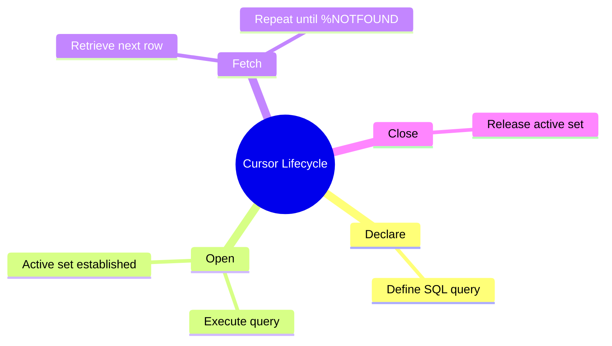
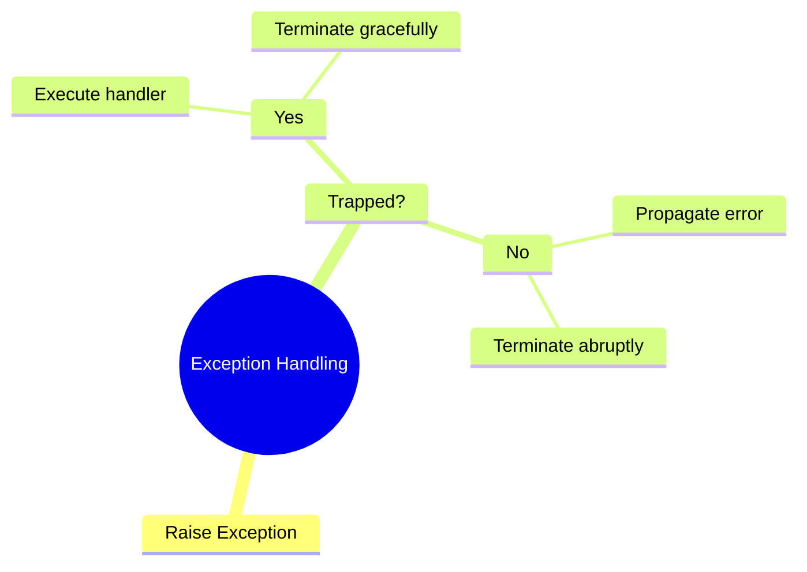

> [!note] **Overview**
> This lecture introduces **SELECT exceptions** in PL/SQL and expands into **explicit cursors**, **cursor attributes**, **cursor FOR loops**, and **exception handling mechanisms**. The session builds practical fluency in iterative row processing and robust error trapping.

---

# 1. SELECT Exceptions in PL/SQL

> [!note]  
> A PL/SQL `SELECT ... INTO` must return **exactly one row**.  
> If the result set has **zero** or **more than one** row, Oracle raises an **exception**.  
>  
> **Exceptions:**  
> - **NO_DATA_FOUND** (0 rows)  
> - **TOO_MANY_ROWS** (>1 row)

## 🔹 Examples

### TOO_MANY_ROWS  
> [!example]
> ```sql
> DECLARE
>   v_customer_id  order.customer_id%TYPE := 208;
>   v_ord_id       order.orderid%TYPE;
> BEGIN
>   SELECT orderid INTO v_ord_id
>   FROM order
>   WHERE customer_id = v_customer_id;
> END;
> -- Raises TOO_MANY_ROWS
> ```

### NO_DATA_FOUND  
> [!example]
> ```sql
> DECLARE
>   v_customer_id  order.customer_id%TYPE := 999;
>   v_ord_id       order.orderid%TYPE;
> BEGIN
>   SELECT orderid INTO v_ord_id
>   FROM order
>   WHERE customer_id = v_customer_id;
> END;
> -- Raises NO_DATA_FOUND
> ```

> [!warning]  
> These exceptions occur **before** entering the exception handling block unless properly trapped.

---

# 2. Cursors

> [!note]  
> A **cursor** is a pointer to a result set returned by a query.  
> Used when we need to **process multiple rows** in PL/SQL.

## Cursor Life-Cycle  
🟡 Intermediate

> [!note]
> 1. **DECLARE** – Define the query.  
> 2. **OPEN** – Execute the query & create the active set.  
> 3. **FETCH** – Retrieve rows one at a time.  
> 4. **CLOSE** – Release the active set.

### Visual Diagram  


---

# 3. Declaring Cursors

> [!note]  
> **Syntax:**
> 
> ```sql
> CURSOR cursor_name IS
>     select_statement;
> ```

### Example

> [!example]
> 
> ```sql
> DECLARE
>   CURSOR emp_cursor IS
>     SELECT employee_id, last_name
>     FROM employees
>     WHERE department_id = 30;
> ```

> [!tip]  
> Cursors **cannot** include `INTO` in their declaration.

---

# 4. Opening Cursors

🟢 Basic

> [!example]
> 
> ```sql
> OPEN emp_cursor;
> ```

> [!note]  
> OPEN performs:
> 
> - Executes the query
>     
> - Identifies active set
>     
> - Positions on first row
>     

---

# 5. Fetching Data

### Fetch a Single Row

> [!example]
> 
> ```sql
> FETCH emp_cursor INTO empno, lname;
> ```

### Fetching Multiple Rows with a Loop

> [!example]
> 
> ```sql
> LOOP
>   FETCH emp_cursor INTO empno, lname;
>   EXIT WHEN emp_cursor%NOTFOUND;
>   DBMS_OUTPUT.PUT_LINE(empno || ' ' || lname);
> END LOOP;
> ```

> [!warning]  
> `EXIT WHEN emp_cursor%NOTFOUND` must be placed **immediately after** the fetch to avoid printing invalid data.

---

# 6. Closing Cursors

🟢 Basic

> [!note]
> 
> ```sql
> CLOSE emp_cursor;
> ```

> [!warning]  
> Attempting to fetch from a closed cursor raises **INVALID_CURSOR**.

---

# 7. Working with Records

🟡 Intermediate

### Using `%ROWTYPE`

> [!example]
> 
> ```sql
> DECLARE
>   CURSOR emp_cursor IS
>     SELECT employee_id, last_name
>     FROM employees
>     WHERE department_id = 30;
> 
>   emp_record emp_cursor%ROWTYPE;
> 
> BEGIN
>   OPEN emp_cursor;
>   LOOP
>     FETCH emp_cursor INTO emp_record;
>   END LOOP;
> END;
> ```

---

# 8. Cursor FOR Loops

🟢 Basic

> [!note]  
> Cursor FOR loops simplify cursor operations: automatic **open**, **fetch**, **loop termination**, and **close**.

> [!example]
> 
> ```sql
> FOR emp_rec IN emp_cursor LOOP
>   DBMS_OUTPUT.PUT_LINE(emp_rec.employee_id || ' ' || emp_rec.last_name);
> END LOOP;
> ```

> [!tip]  
> Use FOR loops for clean, error-free cursor processing.

---

# 9. Cursor Attributes

🟡 Intermediate

|Attribute|Type|Meaning|
|---|---|---|
|**%ISOPEN**|Boolean|TRUE if cursor is open|
|**%FOUND**|Boolean|TRUE if last fetch returned a row|
|**%NOTFOUND**|Boolean|TRUE if last fetch returned no row|
|**%ROWCOUNT**|Number|# of rows fetched so far|

### Example: Using `%ROWCOUNT` and `%NOTFOUND`

> [!example]
> 
> ```sql
> LOOP
>   FETCH emp_cursor INTO empno, ename;
>   EXIT WHEN emp_cursor%ROWCOUNT > 10 OR emp_cursor%NOTFOUND;
> END LOOP;
> ```

---

# 10. Exception Handling in PL/SQL

> [!note]  
> An **exception** is an error raised during runtime.  
> PL/SQL blocks terminate unless the exception is **trapped**.

### Flow



---

# 11. Writing Exception Handlers

🟡 Intermediate

### Syntax

> [!note]
> 
> ```sql
> EXCEPTION
>   WHEN exception_name THEN
>      statements;
>   WHEN OTHERS THEN
>      statements;
> ```

### Guidelines

- Only **one** handler runs per exception.
    
- `WHEN OTHERS` must appear **last**.
    
- Cannot have duplicate handlers for the same exception.
    

---

# 12. Predefined Oracle Server Errors

🟢 Basic

- **NO_DATA_FOUND**
    
- **TOO_MANY_ROWS**
    
- **INVALID_CURSOR**
    
- **ZERO_DIVIDE**
    

### Example

> [!example]
> 
> ```sql
> EXCEPTION
>   WHEN TOO_MANY_ROWS THEN
>     DBMS_OUTPUT.PUT_LINE('Multiple rows retrieved. Use a cursor.');
> ```

---

# 13. Continuity with Previous Lectures

> [!note]  
> This lecture extends earlier PL/SQL sessions by transitioning from **single-row queries** to **multi-row iterative processing** and introducing **error-resilient coding** via structured exception handling.

---

# 🧩 Hands-On Practice

1. Write a cursor that prints the first 15 employees from the `employees` table.
    
2. Modify the cursor to use `%ROWCOUNT` to exit after 5 rows.
    
3. Rewrite a cursor loop using a **FOR loop** instead of explicit OPEN/FETCH/CLOSE.
    
4. Handle `NO_DATA_FOUND` when selecting from a table by primary key lookup.
    
5. Trigger `TOO_MANY_ROWS` intentionally and log the error message with `DBMS_OUTPUT`.
    

---

# Lecture Questions (Extracted)

> [!question]  
> “How many records are fetched here?” (Single FETCH example)

---

# Glossary

- **Cursor** – Pointer to the result of a query.
    
- **Active Set** – Rows returned by the cursor query.
    
- **%ROWTYPE** – Record structure matching the selected columns.
    
- **Exception** – Runtime error that interrupts execution.
    
- **NO_DATA_FOUND** – SELECT returned zero rows.
    
- **TOO_MANY_ROWS** – SELECT returned more than one row.
    

---

# Key Takeaways

- `SELECT INTO` must return exactly **one** row.
    
- Cursors provide controlled **multi-row** processing.
    
- Cursor FOR loops automate the cursor management lifecycle.
    
- Exception handling ensures **graceful degradation** of PL/SQL programs.
    
- Cursor attributes provide insights into loop control and processing status.
    

---

# Quick Review Card

**Q:** What happens if a SELECT returns >1 row?  
**A:** Oracle raises **TOO_MANY_ROWS**.

**Q:** Which cursor attribute returns TRUE when no row is fetched?  
**A:** **%NOTFOUND**

**Q:** Do cursor declarations include INTO clauses?  
**A:** No.

**Q:** What does CLOSE do?  
**A:** Releases the active set and disables the cursor.

**Q:** What does a cursor FOR loop do automatically?  
**A:** Opens, fetches, iterates, and closes the cursor.

---

# Further Resources

- _Oracle PL/SQL Programming_ – Steven Feuerstein
    
- Oracle Documentation – PL/SQL Language Reference
    
- TutorialsPoint – PL/SQL Exception Handling
    
- Oracle LiveSQL Playground
    

```

If you want, I can compress this into a **one-page revision sheet** or convert it into a **quiz deck** for Anki.
```