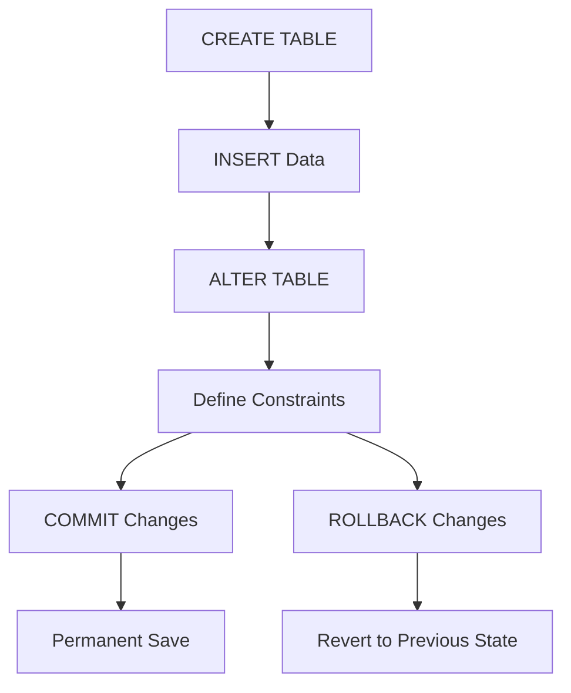

# 🗄️ Database – SQL Fundamentals (DDL & TCL)

> [!summary]
> **Overview:** This lecture introduces SQL **Data Definition Language (DDL)** and **Transaction Control Language (TCL)**. Topics include table creation, alteration, constraints, sequences, and transaction control commands such as `COMMIT`, `ROLLBACK`, and `SAVEPOINT`.

---

## 📚 Table of Contents
- [[#🧠-Main-Concepts]]
- [[#🔢-Formulas-and-Theory]]
- [[#💡-Hands-on-Examples]]
- [[#❓-Lecture-Questions]]
- [[#🎨-Visual-Aids]]
- [[#🧩-Glossary]]
- [[#🎯-Key-Takeaways]]
- [[#🔗-Further-Resources]]

---

## 🧠 Main Concepts

### 💡 Data Definition Language (DDL)
- Used to **define, modify, and delete** database structures.
- Common commands:
  - **`CREATE`** → Define a new table or object.
  - **`ALTER`** → Modify table structure.
  - **`DROP`** → Remove a table or object permanently.

### 💡 Data Types
| Type | Description |
|------|--------------|
| `VARCHAR2(size)` | Variable-length character data (max 4000) |
| `CHAR(size)` | Fixed-length character data (max 2000) |
| `NUMBER(p,s)` | Numeric with precision and scale |
| `DATE` | Stores date and time values |

### ⚙️ Table Constraints
- Enforce **data integrity**.
- Types:
  - **NOT NULL**
  - **UNIQUE**
  - **PRIMARY KEY**
  - **FOREIGN KEY**
  - **CHECK**

> [!note]
> Constraints can be defined at **column level** or **table level** using the `CONSTRAINT` keyword.

---

## 🔢 Formulas and Theory

> [!tip]
> Use these logical rules to maintain database consistency.

- **Entity Integrity:**  
  $ \text{Each table must have a unique primary key.} $

- **Referential Integrity:**  
  $ \text{Foreign key values must reference existing primary key values.} $

- **Transaction Consistency:**  
  $ \text{Commit ensures durability; Rollback ensures atomicity.} $

---

## 💡 Hands-on Examples

> [!example]
> Practical SQL commands demonstrated during the lab session.

### 🧱 Creating a Table
```sql
CREATE TABLE dept (
  deptno NUMBER(2),
  dname VARCHAR2(14),
  loc   VARCHAR2(13)
);
```

### 🧩 Altering a Table

```sql
ALTER TABLE dept
ADD (job_id VARCHAR2(9));

ALTER TABLE dept
MODIFY (dname VARCHAR2(20));

ALTER TABLE dept
DROP COLUMN job_id;
```

### ⚙️ Defining Constraints

```sql
CREATE TABLE employees (
  employee_id NUMBER(6) PRIMARY KEY,
  last_name VARCHAR2(25) UNIQUE,
  salary NUMBER(8,2) CHECK (salary > 0),
  hire_date DATE NOT NULL,
  department_id NUMBER(4)
    REFERENCES departments(department_id)
);
```

### 🔗 Foreign Key and Cascades

```sql
ALTER TABLE employees
ADD CONSTRAINT emp_dept_fk
FOREIGN KEY (department_id)
REFERENCES departments(department_id)
ON DELETE CASCADE;
```

### 🔢 Sequences

```sql
CREATE SEQUENCE id_seq
  START WITH 1
  INCREMENT BY 1
  MAXVALUE 2000
  NOCYCLE;

INSERT INTO dept VALUES (id_seq.NEXTVAL, 'Finance', 'Cairo');
```

### 💾 Transaction Control

```sql
INSERT INTO dept VALUES (11, 'Finance', 'Alex');
UPDATE emp SET deptno = 40 WHERE empno = 7902;
COMMIT;
```

> [!warning]  
> Dropping a column or table **cannot be undone**. Always back up data before executing `DROP`.

---

## ❓ Lecture Questions

> [!question]
> 
> 1. What are the three main commands in DDL?
>     
> 2. Explain the difference between **column-level** and **table-level** constraints.
>     
> 3. What happens if you delete a parent row without `ON DELETE CASCADE`?
>     
> 4. Define the purpose of a **sequence** in database management.
>     
> 5. How do `COMMIT` and `ROLLBACK` ensure data integrity?
>     

> [!tip]  
> Use short SQL scripts to test each concept on a local Oracle or MySQL environment.

---

## 🎨 Visual Aids

> [!note]  
> Diagram illustrating DDL workflow and transaction flow.



---

## 🧩 Glossary

|Term|Definition|
|---|---|
|**DDL**|Defines and modifies database structures|
|**TCL**|Manages database transactions|
|**Constraint**|A rule that ensures valid data relationships|
|**Sequence**|Object generating unique numeric values|
|**COMMIT**|Saves all pending changes permanently|
|**ROLLBACK**|Undoes changes since the last commit|
|**SAVEPOINT**|Sets a marker for partial rollback|

---

## 🎯 Key Takeaways

- DDL defines **structure**, while DML manipulates **data**.
    
- Constraints enforce **integrity and consistency**.
    
- Sequences automate **primary key generation**.
    
- TCL ensures **transaction safety** through `COMMIT`, `ROLLBACK`, and `SAVEPOINT`.
    
- Dropping objects is **irreversible** — plan schema updates carefully.
    

> [!tip]  
> Before executing destructive SQL statements, test them on a sample database.

---

## 🔗 Further Resources

- [Oracle SQL Language Reference](https://docs.oracle.com/en/database/oracle/oracle-database/)
    
- [W3Schools SQL Tutorial](https://www.w3schools.com/sql/)
    
- “Database System Concepts” – Silberschatz, Korth, Sudarshan
    
- [GeeksforGeeks – SQL Constraints](https://www.geeksforgeeks.org/sql-constraints/)