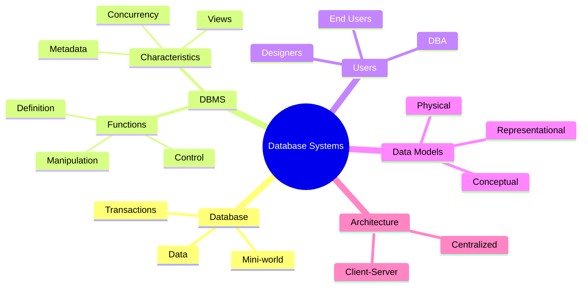

# 🧠 Database – Lecture 1: Introduction to Databases and Database System Architecture

> [!note] **Overview**  
> This lecture introduces the concept of **databases**, **database management systems (DBMS)**, and their **architectural components**.  
> It covers the evolution from file-based systems to database approaches, the role of users, data models, schemas, and languages.

---

## 🧩 Continuity with Previous Lectures

This is the **first lecture** of the Database course. It establishes the foundational vocabulary and mental model required for understanding data modeling, relational databases, and system design in later lectures.

---

## 1. Course Outline

- **Topics Covered:**
    
    - Introduction to Databases and Database Users
        
    - Database System Concepts and Architecture
        
    - ER and Enhanced ER Models
        
    - Relational Model and Normalization
        
    - Mapping ER to Relational
        
    - Relational Algebra and Query Optimization
        
    - Indexing and File Structures
        
- **Assessment Breakdown:**
    
    - Quiz (Week 5) – 5%
        
    - Project (Weeks 8 & 11) – 10%
        
    - Midterm (Week 7) – 15%
        
    - Practical – 20%
        
    - Final Exam – 50%
        

---

## 2. Databases and Database Users

### 2.1 Importance of Databases

> [!note]  
> Databases are an essential part of modern life, used in **business**, **commerce**, **medicine**, **law**, and **education**.

- Databases manage structured collections of data.
    
- They support **retrieval**, **analysis**, and **transactional operations**.
    
- Examples: banking systems, e-commerce, library catalogs, healthcare records.
    

---

## 3. Types of Databases and Applications 🟢 Basic

- **Traditional databases** – store numeric or textual data.
    
- **Multimedia databases** – store images, audio, and video.
    
- **Geographic Information Systems (GIS)** – handle maps and spatial data.
    
- **Data warehouses / OLAP systems** – analyze large datasets for decision making.
    
- **Real-time databases** – handle constantly changing data (e.g., stock markets).
    

---

## 4. Basic Definitions 🟢 Basic

> [!note] **Key Terms**
> 
> - **Data:** Facts that can be recorded and have implicit meaning.
>     
> - **Database:** Collection of related data representing a **mini-world**.
>     
> - **Mini-world:** The real-world domain the database models.
>     
> - **Transaction:** Executing program accessing or modifying database content.
>     

> [!example]  
> Example: A university’s database includes **STUDENT**, **COURSE**, and **INSTRUCTOR** entities.  
> Each student’s record, course registration, and instructor assignment form part of the **mini-world**.

> [!tip]  
> Keep the mini-world accurate — every real-world change should be reflected immediately in the database.

---

## 5. Database Management System (DBMS) 🟡 Intermediate

- **Definition:** A software system that enables creation, maintenance, and use of databases.
    
- **Components:**
    
    - **DBMS software**
        
    - **Database itself**
        
    - (Sometimes) **application programs**
        

> [!example]  
> Amazon.com’s DBMS manages **over 42 TB of data**, serving millions of users daily.

---

## 6. Typical DBMS Functionality 🟡 Intermediate

- Define database structure and constraints (via schema).
    
- Construct/load initial data.
    
- Manipulate data:
    
    - **Retrieval** (queries, reports)
        
    - **Modification** (insert, delete, update)
        
- **Concurrency control** and **security** management.
    
- **Web-based access** and **multi-user support**.
    

---

## 7. The Database Approach vs File Processing 🟡 Intermediate

> [!warning]  
> Traditional file processing leads to **redundancy**, **inconsistency**, and **maintenance complexity**.

|File-Based System|Database Approach|
|---|---|
|Each program defines its own files|Single repository for all data|
|Redundant data|Shared, consistent data|
|Difficult maintenance|Centralized management|
|Poor data sharing|Multi-user access and concurrency|

---

## 8. Main Characteristics of the Database Approach 🔴 Advanced

### 8.1 Self-Describing Nature

- DBMS stores **meta-data** (data about data) in a **catalog**.
    
- Enables independence from application structure.
    

### 8.2 Multiple Views

- Each user accesses only relevant parts of data (subsets or virtual data).
    

### 8.3 Data Sharing and Multi-User Processing

- Supports **concurrent access** with **ACID** properties:
    
    - **Atomicity**
        
    - **Consistency**
        
    - **Isolation**
        
    - **Durability**
        

> [!example]  
> Multiple airline agents booking seats simultaneously — DBMS ensures no seat is double-booked.

---

## 9. Database Users 🟢 Basic

### 9.1 Actors on the Scene

- **Database Administrators (DBA):** Manage access, performance, and recovery.
    
- **Database Designers:** Define structure, constraints, and relationships.
    
- **End Users:** Use data via queries and reports.
    

### 9.2 Workers Behind the Scene

- **DBMS developers**, **tool creators**, and **system operators**.
    

---

## 10. Advantages of Using the Database Approach 🟡 Intermediate

> [!note]  
> Core benefits stem from centralization, control, and standardization.

- Data redundancy reduction
    
- Data sharing
    
- Security and access control
    
- Backup and recovery mechanisms
    
- Multiple interfaces for diverse users
    
- Integrity constraints and business rules
    
- Enforced standards for naming, formats, and reports
    
- Reduced development time and flexible structure evolution
    

> [!example]  
> Banking and reservation systems rely on **real-time integrity** and **instant updates** for all connected users.

---

## 11. When Not to Use a DBMS 🟢 Basic

> [!warning]  
> DBMSs are powerful but not always ideal.

Avoid when:

- Application is small, simple, and static
    
- Hardware/storage is limited (e.g., embedded systems)
    
- Single-user access is sufficient
    
- Overhead of security and concurrency isn’t justified
    

---

## 12. Database System Concepts and Architecture 🟡 Intermediate

### 12.1 Data Model

> [!note]  
> **Data Model:** A set of concepts for describing data structure, operations, and constraints.

**Categories:**

- **Conceptual Models:** High-level, human-understandable (ER model).
    
- **Representational Models:** Bridge between conceptual and physical (Relational model).
    
- **Physical Models:** Low-level, storage-focused.
    

---

### 12.2 Schema and Instances 🟢 Basic

|Concept|Description|
|---|---|
|**Database Schema**|Structural description of data and constraints|
|**Schema Construct**|Components of schema (e.g., STUDENT, COURSE)|
|**Database State (Instance)**|Actual data at a given time|

> [!tip]  
> Schema changes rarely; database state changes frequently with updates.

---

### 12.3 DBMS Languages 🟡 Intermediate

- **DDL (Data Definition Language):** Defines schemas, constraints, and structure.
    
- **DML (Data Manipulation Language):** Used for querying and updating data.
    

> [!example]  
> SQL combines DDL (`CREATE TABLE`) and DML (`SELECT`, `INSERT`, `UPDATE`, `DELETE`).

---

### 12.4 DBMS Interfaces

- **Query-based (SQL prompt)**
    
- **Menu/Form-based (applications)**
    
- **Graphical interfaces (diagrams, dashboards)**
    
- **DBA tools** for account control and tuning
    

---

### 12.5 Centralized vs Client–Server Architectures 🟢 Basic

- **Centralized DBMS:** All components on one system.
    
- **Client–Server DBMS:**
    
    - Clients handle UI and local processing.
        
    - Servers manage data, storage, and transactions.
        
    - Communication via network protocols.
        

> [!example]  
> Web-based systems (e.g., hospital management, university portals) use client–server DBMSs.

---

## 🧠 Concept Hierarchy Diagram

---

## 🧩 Hands-On Practice

1. Define a conceptual model for a **university database** including students, courses, and instructors.
    
2. Identify which operations belong to DDL vs DML.
    
3. Create a table in SQL for `STUDENT` and insert example data.
    
4. Illustrate concurrency using an airline booking example.
    

---

## 🧾 Glossary

| Term            | Definition                                               |
| --------------- | -------------------------------------------------------- |
| **Database**    | Organized collection of related data                     |
| **DBMS**        | Software managing creation and manipulation of databases |
| **Metadata**    | Data describing other data                               |
| **Schema**      | Structure and definition of data                         |
| **Instance**    | Actual stored data at a specific time                    |
| **Transaction** | Unit of database access or update                        |
| **ACID**        | Properties ensuring reliable transactions                |

---

## 🧩 Key Takeaways

- Databases are structured representations of real-world data.
    
- DBMSs manage storage, retrieval, and integrity of data efficiently.
    
- Metadata allows self-description and independence from applications.
    
- Users are classified into administrators, designers, and end-users.
    
- Database architecture supports scalability via client–server design.
    

---

## 🎯 Quick Review Card

| Q                                                    | A                                                              |
| ---------------------------------------------------- | -------------------------------------------------------------- |
| What is the difference between data and information? | Data are raw facts; information is processed, meaningful data. |
| What is metadata?                                    | Data describing the structure and constraints of other data.   |
| Who manages database access rights?                  | Database Administrator (DBA).                                  |
| What is a schema vs instance?                        | Schema = structure, Instance = current content.                |
| When should DBMS not be used?                        | In simple, single-user, or embedded systems.                   |

---

## 📚 Further Resources

- Elmasri & Navathe, _Fundamentals of Database Systems_, 7th Edition
    
- Connolly & Begg, _Database Systems: A Practical Approach to Design, Implementation, and Management_
    
- YouTube: "Intro to Databases – Stanford CS145"
    
- W3Schools SQL Tutorial – [https://www.w3schools.com/sql](https://www.w3schools.com/sql)
    

---