# 🧠 Database – Query Processing and Optimization (Chapter 15)

> [!note]
> **Overview:**  
> This lecture presents the end-to-end lifecycle of query processing and optimization. It covers external sorting, selection and join algorithms, relational algebra transformations, query tree optimization, heuristic rules, and cost-based decision models.  
> The objective is to minimize disk I/O, reduce intermediate results, and generate an execution plan with the lowest total cost.

---

# 1. External Sorting
Sorting is a foundational operation in database query execution, especially for **ORDER BY**, **GROUP BY**, **sort-merge joins**, **duplicate elimination**, and **set operations** (UNION, INTERSECTION).

> [!note] Key Definition  
> **External Sorting:** Sorting algorithms designed for files that **do not fit into main memory** and therefore must use disk I/O efficiently.

---

# 1.1 Sort-Merge Strategy 🟡  
A two-phase algorithm:

### **Phase 1 – Sorting Phase (Run Generation)**
- The file is divided into **runs** (subfiles) that fit in memory.
- Each run is sorted internally and written back to disk.
- Buffer space is partitioned into equal-size blocks.

> [!example]
> If you have 1GB of data and 100MB of RAM, you create ~10 sorted runs, each 100MB.

### **Phase 2 – Merging Phase**
- Multiple merge passes combine sorted runs into larger runs.
- Final pass produces one fully sorted file.

---

# 1.2 Why External Sorting Matters 🟢
- Most large-scale DB operations rely on sorted inputs.
- JOIN algorithms like **sort-merge join** require sorted inputs for optimal performance.
- Improves efficiency of **duplicate elimination** in projection.

> [!warning]
> Failing to place SELECT or PROJECT early in the execution tree dramatically increases sort cost by increasing the size of intermediate results.

---

### 2. Algorithms for the SELECT Operation

A **SELECT** query retrieves rows based on conditions. Efficiency depends on:
- File organization,
- Index availability,
- Attribute selectivity,
- Whether conditions are simple or conjunctive.

---

# 2.1 Search Methods for Simple Selection

### **S1 Linear Search (Brute Force)** 🟢
- Scan every record; test condition.
- Used when **no index** exists.

### **S2 Binary Search (Ordered File Only)** 🟢
- Requires the file to be sorted on the attribute.
- Efficient for equality on key fields.

### **S3 Primary Index on Key Attribute** 🟢
- Use index to directly locate the record.
- Optimal for equality on primary key.

### **S4 Primary Index for Range Queries** 🟡
- Efficient for `<, <=, >, >=` on key fields.
- Locate first matching record then scan forward.

### **S5 Clustering Index on Non-key Attribute** 🟡
- Efficient when retrieving **multiple tuples** with the same attribute value.
- Useful for GROUP BY column filtering.

### **S6 Secondary Index (Key or Non-key)** 🟡
- Supports:
  - Equality searches,
  - Range queries,
  - Multi-record retrieval.

> [!example]
> **Query:** σ DNO = 5 (EMPLOYEE)  
> If DNO has a **secondary index**, retrieve all record pointers for DNO=5, then fetch records.

---

## 2.2 Complex Selection (AND Conditions)

### **S7 Conjunctive Selection Using an Index** 🟡
- Use index on **one** condition.
- Retrieve records matching that condition.
- Post-filter the rest of the conditions.

### **S8 Composite Index on Multiple Attributes** 🟢
- Directly retrieves records for conditions like:
  - `WHERE A=10 AND B='X'`

### **S9 Intersection of Record Pointers** 🔴
Applicable when:
- Secondary indexes exist on **each attribute**.
- Indexes store **record pointers**, not block pointers.

Steps:
1. Retrieve pointer sets for each condition.
2. Intersect them.
3. Fetch final records.

---

## 2.3 Disjunctive Conditions (OR) 🔴
Much harder to optimize.

> [!warning]
> If **any** OR-condition lacks an access path, the DBMS must perform a **full linear scan**.

Only if all OR predicates are indexed:
- Retrieve each set of pointers,
- Compute union,
- Remove duplicates.

---

### 3. Continuity With Previous Lectures
This lecture extends earlier topics:

- Builds on **file organization** and **index structures** (primary, clustering, secondary).  
- Uses **relational algebra** from earlier Database Theory lectures.  
- Introduces optimization strategies tying together selection, projection, and join operations.

---

### 4. Concept Hierarchy Diagram


Below is **Part 2 — JOIN Algorithms, Join Selection Factor, Query Trees (Fully Reconstructed), and Heuristic Optimization Rules**.

---

# **Part 2 — JOIN Operations + Join Selection Factor + Full Query Tree Reconstructions + Heuristics**

### 5. Algorithms for the JOIN Operation

> [!note]
> The JOIN is one of the most expensive relational operations.  
> Performance depends on file sizes, indexing, ordering, and join attribute characteristics.

##### 5.1 Types of JOINs
- **Two-way join**: Join between two relations.  
- **Multi-way join**: Join among 3+ relations (high cost).

**Examples:**
- OP6: EMPLOYEE ⋈_{DNO=DNUMBER} DEPARTMENT  
- OP7: DEPARTMENT ⋈_{MGRSSN=SSN} EMPLOYEE

---

# 5.2 Join Algorithms

## **J1 Nested-Loop Join (Brute Force)** 🟢
For each tuple in R (outer loop):
- Scan all tuples in S (inner loop),
- Output matching pairs.

> [!warning]
> Always O(rR × rS).  
> Only used when no index and no ordering is available.

---

## **J2 Single-Loop Join (Index-Based Join)** 🟡
If an index exists on S.B:
- For each tuple t in R:
  - Use index to directly retrieve matching tuples from S.

> [!example]
> If EMPLOYEE.SSN is indexed:  
> For each DEPARTMENT.MGRSSN, lookup the manager employee directly.

---

## **J3 Sort-Merge Join** 🟢
Most efficient when both relations are sorted on join attributes.

Steps:
1. Sort R on A.
2. Sort S on B.
3. Scan both files in parallel and match equal values.

> [!tip]
> Combine with **external sorting** if inputs are not yet sorted.

---

## 6. Join Selection Factor

> [!note]
> The join selection factor estimates the **fraction of tuples** in one relation that will find a match in the other relation.

### **Example (OP7)**  
- EMPLOYEE:  
  - rE = 6000 tuples, bE = 2000 blocks  
- DEPARTMENT:  
  - rD = 50 tuples, bD = 10 blocks  

Each DEPARTMENT has exactly one manager:
- All 50 DEPARTMENT tuples match exactly 1 EMPLOYEE.

### Cost Comparison

**Option A:** EMPLOYEE → DEPARTMENT  
```

bE + rE * (x_Mgr_ssn + 1)  
= 2000 + 6000 * (2 + 1)  
= 20000 block accesses

```

**Option B:** DEPARTMENT → EMPLOYEE  
```

bD + rD * (x_Ssn + 1)  
= 10 + 50 * (4 + 1)  
= 260 block accesses

```

> [!tip]
> Always place the **smaller relation** as the outer loop when using an index join.

---

### 7. Translating SQL to Relational Algebra

Example:

```sql
SELECT LNAME, FNAME
FROM EMPLOYEE
WHERE SALARY > (
  SELECT MAX(SALARY)
  FROM EMPLOYEE
  WHERE DNO = 5
);
```

Relational Algebra:

```
π LNAME, FNAME ( σ SALARY > C (EMPLOYEE) )
C = Γ MAX(SALARY) ( σ DNO=5 (EMPLOYEE) )
```

---

### 8. Full Reconstruction — Query Tree Optimization (Slides 33–37)

We now fully rebuild all 5 query trees.

**Query:**  
Find last names of employees born after 1957 who work on project “Aquarius”.

```sql
SELECT Lname
FROM EMPLOYEE, WORKS_ON, PROJECT
WHERE Pname='Aquarius'
  AND Pnumber=Pno
  AND Essn=Ssn
  AND Bdate > '1957-12-31';
```

---

#### 8.1 Query Tree 1 — Initial Tree (Unoptimized)

```mermaid
graph TD
  A[σ Pname='Aquarius' AND Pnumber=Pno AND Essn=Ssn AND Bdate > '1957-12-31'] --> B[(EMPLOYEE × WORKS_ON × PROJECT)]
  A --> C[π Lname]
```



---

### 8.2 Query Tree 2 — Push Selections Down

Break composite SELECT into separate conditions and push to leaves:

```mermaid
graph TD
  L[π Lname] --> J1[σ Essn=Ssn]
  J1 --> J2[σ Pnumber=Pno]
  J2 --> J3[σ Pname='Aquarius']
  J3 --> J4[σ Bdate > '1957-12-31']
  J4 --> C[(EMPLOYEE × WORKS_ON × PROJECT)]
```



Selections pushed down:

- `σ Bdate > ...` → EMPLOYEE
    
- `σ Pname='Aquarius'` → PROJECT
    

---

### 8.3 Query Tree 3 — Reorder Tables (Smallest First)

Place most restrictive relations first:

- PROJECT after filtering to a single tuple (Pname='Aquarius'), becomes very small.
    
- EMPLOYEE filtered by Bdate reduces tuple count significantly.
    


---

### 8.4 Query Tree 4 — Replace Cartesian Product with JOIN

```mermaid
graph TD
  L[π Lname] --> J1[⋈ Essn=Ssn]
  J1 --> E[(σ Bdate>'1957-12-31' EMPLOYEE)]
  J1 --> J2[⋈ Pnumber=Pno]
  J2 --> W[(WORKS_ON)]
  J2 --> P[(σ Pname='Aquarius' PROJECT)]
```



---

### 8.5 Query Tree 5 — Push Projections Down

Only needed attributes flow upward:

```mermaid
graph TD
  A[π Lname] --> J1[⋈ Essn=Ssn]
  J1 --> E[π Lname, Ssn σ Bdate>'1957-12-31' EMPLOYEE]
  J1 --> J2[⋈ Pnumber=Pno]
  J2 --> W[π Pno, Essn WORKS_ON]
  J2 --> P[π Pnumber σ Pname='Aquarius' PROJECT]
```



> [!tip]  
> Early projection drastically reduces tuple width, improving join performance.

---

## 9. Heuristic Rules for Algebraic Optimization

> [!note]  
> Heuristic optimization applies algebraic rules to reduce intermediate result size before considering cost.

---

## **Rule 1 — Break SELECT with AND into cascaded selections** 🟢

```
σ A AND B AND C(R)  
→ σ A(σ B(σ C(R)))
```

---

## **Rule 2 — Push SELECT as far down as possible** 🟢

If condition uses only attributes of one table:

- Move selection to leaf node.
    

---

## **Rule 3 — Reorder leaf nodes** 🟡

Evaluate most restrictive selections first:

- Fewer tuples,
    
- Smaller intermediate sizes.
    

---

## **Rule 4 — Replace Cartesian + selection with JOIN** 🟢

```
σ A=B (R × S) → R ⋈ S
```

---

## **Rule 5 — Push projections down** 🟡

Keep only needed attributes early.

> [!warning]  
> Projection pushdown must preserve join attributes.

---

### Summary of Heuristics

1. Apply operations that **reduce tuple count early**.
    
2. Perform **selection early**.
    
3. Perform **projection early**.
    
4. Execute most restrictive SELECT/JOIN first.
    
5. Replace **Cartesian product + selection** with JOIN.
    

---
# **Part 3 — Cost-Based Optimization + Catalog Metadata + Selectivity + Cardinality + Histograms + Hands-On Practice**

### 10. Using Cost Estimates in Query Optimization

> [!note]
> Cost-based optimization evaluates multiple execution strategies and picks the one with the **lowest estimated cost**, often dominated by disk I/O.

Two optimization styles:

### **Heuristic Optimization**  
- Uses algebraic rules (push selections, projections).  
- Fast, general-purpose, no numeric estimation.

### **Cost-Based Optimization**  
- DBMS computes cost of candidate plans using:
  - Disk I/O,
  - CPU processing,
  - Network transfer (distributed DBs).

---

### 11. Cost Components

### **1. Access Cost to Secondary Storage** 🟢  
- Disk block reads + writes  
- The **dominant** cost in large DBMS

### **2. Computation Cost** 🟡  
- CPU time for comparisons, hashing, sorting.

### **3. Communication Cost** 🔴  
- Only relevant for **distributed** databases.

> [!example]
> Cloud DBMSs (Snowflake, BigQuery) often treat **egress network cost** as a major optimization target.

---

### 12. Catalog Information Used in Cost Functions

The DBMS catalog stores metadata:

### **Relation Metadata**
- r = number of records  
- b = number of blocks  
- R = record size in bytes  
- bfr = blocking factor = floor(block_size / R)

### **Index Metadata**
- x = number of index levels  
- bI1 = number of first-level index blocks  
- d = number of distinct values  
- sl = selectivity  
- s = selection cardinality

> [!note]
> Selectivity and cardinality drive which access paths the optimizer chooses.

---

### 13. Selectivity (sl)

> [!note]
> **Selectivity** is the fraction of records that satisfy a condition.  
> Value is always between **0 and 1**.

### Formula:
```

sl = (# of records satisfying condition) / r

```

### Interpretation:
- sl = 0 → no record qualifies  
- sl = 1 → all records qualify  
- sl small → good filter, use early

---

### 14. Selection Cardinality (s)

> [!note]
> **Selection cardinality** = expected number of tuples returned.

### Formula:
```

s = sl × r

```

### Special Cases:

#### **Key Attribute**
- d = r  
- sl = 1/r  
- s = 1 (only one tuple)

#### **Non-Key Attribute (Uniform Assumption)**
- sl = 1/d  
- s = r/d

---

### 15. Non-Uniform Distributions — Histograms

> [!note]
> Real datasets are rarely uniform.  
> DBMS stores a **histogram** for better estimation.

### Example Distribution (200 employees):
| Dno | Count | Selectivity |
|-----|--------|-------------|
| 1 | 5 | 0.025 |
| 2 | 25 | 0.125 |
| 3 | 70 | 0.35 |
| 4 | 40 | 0.20 |
| 5 | 60 | 0.30 |

> [!tip]
> Optimizers use these values to decide:
> - index vs. full scan  
> - join order  
> - join method (hash, nested-loop, merge)

---

### 16. Concept Hierarchy (Cost-Based Layer)


---

### 17. 🧩 Hands-On Practice

### **Exercise 1 — Selecting Access Path**

EMPLOYEE has:

- r = 50,000
    
- d(DNO) = 5
    
- sl(DNO=3) = 0.35 (from histogram)
    

**Question:** Should the optimizer use a secondary index?

**Solution:**  
s = r × sl = 50,000 × 0.35 = 17,500  
Large output → **index may be slower than full scan**.

---

### **Exercise 2 — Join Cost Comparison**

EMPLOYEE (6000 tuples) and DEPARTMENT (50 tuples):

- Index on EMPLOYEE.SSN (x = 4)
    
- Index on DEPARTMENT.MGRSSN (x = 2)
    

Compute cost for index nested-loop:

**Option A:** EMPLOYEE (outer):

```
2000 blocks + 6000*(2+1) = 20000 I/Os
```

**Option B:** DEPARTMENT (outer):

```
10 blocks + 50*(4+1) = 260 I/Os
```

**Optimal:** Option B.

---

### **Exercise 3 — Selectivity Calculation**

Given:

- EMPLOYEE has r=10,000
    
- Attribute Gender has d=2 values
    
- Assume uniform distribution
    

sl = 1/2 = 0.5  
s = 5000

---

### **Exercise 4 — Histograms Change Plan**

Histogram shows:

- 90% employees are in department 3
    
- Query: `WHERE DNO=3`
    

**Index becomes useless**  
Choose **full scan**.

---
### 18. Glossary

**External Sorting**  
Sorting method for files that exceed memory capacity; relies on multi-pass merge operations.

**Run (Sorted Subfile)**  
A chunk of data that fits in memory, sorted internally during the first phase of external sorting.

**Nested-Loop Join**  
A join algorithm that compares every tuple in one relation with every tuple in another.

**Index-Based Join (Single-Loop Join)**  
A join algorithm using an index on the inner relation’s join attribute to retrieve matching tuples directly.

**Sort-Merge Join**  
A join algorithm that sorts both relations on join attributes and merges them sequentially.

**Selectivity (sl)**  
Fraction of tuples that satisfy a predicate; ranges between 0 and 1.

**Selection Cardinality (s)**  
Expected number of tuples returned from a predicate: s = sl × r.

**Histogram**  
A statistical representation stored by a DBMS to model non-uniform data distribution.

**Query Tree**  
Internal representation of a query using relational algebra operations arranged in tree form.

**Heuristic Optimization**  
Rule-based query restructuring to minimize intermediate result size before cost evaluation.

**Cost-Based Optimization**  
DBMS chooses the lowest-cost execution plan using catalog metadata and cost formulas.

**Blocking Factor (bfr)**  
Number of records per block: floor(block_size / record_size).

---

### 19. Key Takeaways

- Query optimization focuses on minimizing disk I/O, the dominant cost in DBMS operations.
- External sorting enables scalable sorting operations necessary for JOIN, ORDER BY, and duplicate elimination.
- SELECT optimization hinges on exploiting indexes and pushing selections as far down the tree as possible.
- JOIN cost varies dramatically based on join order, indexing, and relation sizes.
- Heuristic rules dramatically reduce intermediate result size before applying cost-based optimization.
- Selectivity and histogram-based statistics drive access path selection and join ordering decisions.
- Pushing projections down the tree reduces tuple width and improves join performance.

---

### 20. Quick Review Cards

> **Q1: What is the primary goal of query optimization?**  
> **A1:** To minimize total execution cost, mainly disk I/O, by selecting the fastest execution plan.

> **Q2: Why push SELECT operations down the query tree?**  
> **A2:** Early selection reduces tuple count and shrinks intermediate relations.

> **Q3: When is binary search applicable for SELECT?**  
> **A3:** When the file is ordered on the search attribute.

> **Q4: When does a secondary index become less useful?**  
> **A4:** When selectivity is high (many tuples satisfy the predicate).

> **Q5: What transformation replaces Cartesian product followed by selection?**  
> **A5:** Replace with a JOIN operator.

---

# ## 21. Further Resources

**Books**
- Elmasri & Navathe — *Fundamentals of Database Systems* (Chapter 15)
- Silberschatz, Korth & Sudarshan — *Database System Concepts*
- Garcia-Molina, Ullman, Widom — *Database Systems: The Complete Book*

**Articles / Whitepapers**
- Oracle Query Optimization Concepts (Oracle Docs)
- PostgreSQL Query Planner and Statistics
- SQL Server Query Optimizer Technical Overview (Microsoft)

**Videos**
- CMU Database Group — Query Optimization Lectures  
- Stanford Online — Relational Algebra & Query Processing  
- freeCodeCamp — SQL Performance Explained

