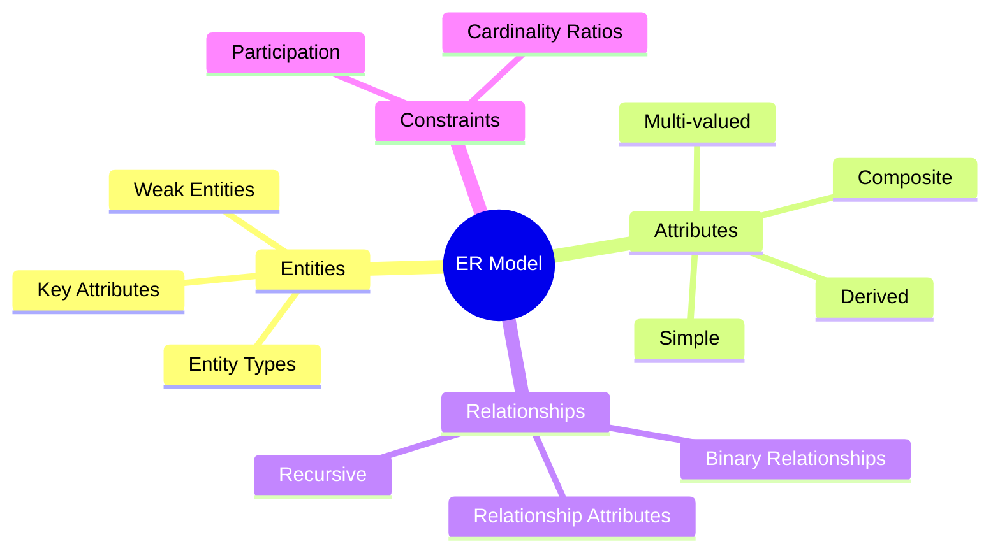
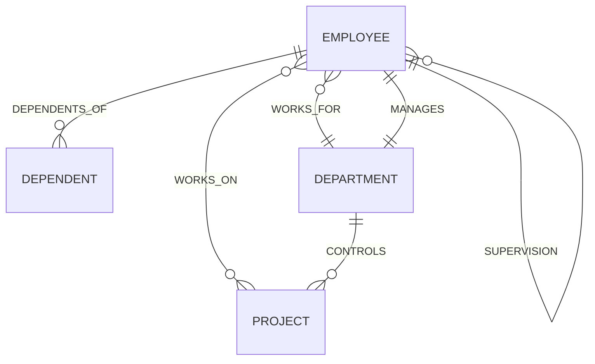

# 3️⃣ Chapter 3 – Data Modeling Using the Entity–Relationship (ER) Model

> [!note] **Overview**
> This lecture introduces **data modeling** using the **Entity–Relationship (ER) Model**.  
> It explains how to identify **entities, attributes, relationships, constraints**, and represent them in an **ER diagram** for database design.

---

## 🧩 Continuity with Previous Lectures
> [!note]
> Builds upon the database design process and schema creation concepts from earlier lectures.  
> Focus now shifts from logical structuring to **conceptual modeling** using the **ER model**.

---

## 🏗️ Overview of Database Design Process
- **Two main activities:**
  1. **Database design** – conceptual schema of the data.
  2. **Application design** – programs and interfaces that access the data.
- This chapter focuses on **database design**, which is part of **software engineering**.
![[Pasted image 20251003164046.png]]
---

## 🧱 Example Database: COMPANY Schema
> [!example]
> The COMPANY database is used to illustrate ER modeling.

**Requirements Summary**
- **Departments**
  - Each has a **name**, **number**, and a **manager** (with start date).
  - May have multiple **locations**.
- **Projects**
  - Each has a **unique name**, **unique number**, and one **location**.
- **Employees**
  - Attributes: **SSN, name, address, salary, sex, birthdate**.
  - Work for **one department**, but may work on **many projects**.
  - Work hours per project are tracked.
  - Have a **direct supervisor**.
- **Dependents**
  - Attributes: **name, sex, birthdate, relationship to employee**.
  - Used for insurance purposes.

---

## 🧩 ER Model Concepts

### Entities and Attributes 🟢
- **Entity**: a distinguishable object (e.g., *EMPLOYEE*, *PROJECT*).
- **Attribute**: describes a property of an entity (e.g., *Name*, *SSN*).
- Each attribute has a **value set (domain)** such as integer or string.

> [!example]
> **EMPLOYEE John Smith** → `Name='John Smith'`, `SSN='123456789'`, `Sex='M'`, `BirthDate='09-JAN-55'`

![[Pasted image 20251003164257.png]]

---

## 🔢 Types of Attributes

| Type              | Description                    | Example                                       |
| ----------------- | ------------------------------ | --------------------------------------------- |
| **Simple**        | Atomic value                   | ![[Pasted image 20251027184426.png]]          |
| **Composite**     | Consists of subcomponents      | ![[Pasted image 20251003164841.png]]          |
| **Single-valued** | One value per entity           | ![[Pasted image 20251027184438.png]]          |
| **Multi-valued**  | Multiple values possible       | ![[Pasted image 20251003164917.png]]          |
| **Derived**       | Computed from other attributes | ![[Pasted image 20251003165030.png]]          |
| **Stored**        | Physically saved in DB         | BirthDate![[Pasted image 20251027184459.png]] |

> [!tip]
> **Mnemonic:**  
> **SCSMD** → *Simple, Composite, Single-valued, Multi-valued, Derived.*

> [!example]
> **Derived attribute example:**  
> `Age = CurrentDate - BirthDate`  
> `Number_of_employees = COUNT(EMPLOYEE in DEPARTMENT)`

---

## ⚙️ Null Values
- **Not applicable:** e.g., *Apartment_number* not relevant for a person in a house.
- **Unknown:** value exists but is missing or not recorded.

---

## 🧩 Entity Types and Key Attributes

- **Entity Type:** group of entities with same attributes (e.g., *EMPLOYEE*).
- **Key Attribute:** uniquely identifies each entity instance.  
  - Example: **SSN** for *EMPLOYEE*.
- **Composite Key:** key made up of multiple fields, e.g., `(Number, State)` for *CAR*.
- **Candidate Keys:** multiple possible keys.
- **Weak Entity Type:** entity without a key (identified via another entity).

> [!warning]
> Weak entities depend on identifying relationships for their existence.

![[Pasted image 20251003165054.png]]

---

## 🧾 Displaying Entities in ER Diagrams
- **Entity type:** rectangle  
- **Attribute:** oval  
- **Composite attribute:** connected sub-ovals  
- **Key attribute:** underlined  
- **Multivalued attribute:** double oval  
![[Pasted image 20251003164331.png]]
---

## 🗃️ Entity Set
- Collection of all instances of an entity type stored in the database.
- Example: all *EMPLOYEE* records form an **EMPLOYEE entity set**.

---

## 🧩 Refining Initial Design
> [!note]
> Initial entity types for COMPANY: **DEPARTMENT, PROJECT, EMPLOYEE, DEPENDENT**.  
> Relationships are then introduced to express how entities interact.

---

## 🔗 Relationships and Relationship Types

### Definition 🟡
- A **relationship** relates two or more entities.
- **Relationship Type:** the schema defining the relationship name, participating entity types, and constraints.
- **Degree:** number of participating entities (binary, ternary, etc.).

**Examples:**
- `WORKS_FOR (EMPLOYEE, DEPARTMENT)`
- `MANAGES (EMPLOYEE, DEPARTMENT)`
- `WORKS_ON (EMPLOYEE, PROJECT)`
- `CONTROLS (DEPARTMENT, PROJECT)`
- `SUPERVISION (EMPLOYEE → EMPLOYEE)`
- `DEPENDENTS_OF (EMPLOYEE, DEPENDENT)`

> [!example]
> EMPLOYEE John works on PROJECT X → relationship instance of `WORKS_ON`.

![[Pasted image 20251003165134.png]]

---

## 🧠 Role Names and Recursive Relationships
- When the same entity type participates twice:
  - Example: **SUPERVISION**
    - EMPLOYEE as **supervisor**
    - EMPLOYEE as **subordinate**
- *Role names clarify participation* in the relationship.
![[Pasted image 20251003165155.png]]
---

## ⚙️ Weak Entity Types 🔴
- No key attribute of its own.
- Identified via:
  - **Partial key** (e.g., *Dependent Name*)
  - **Owner entity** (e.g., *Employee*)
- Always have **total participation** in identifying relationship.
- Example:  
  `DEPENDENT_OF(EMPLOYEE, DEPENDENT)`  
  → *DEPENDENT* is weak; *EMPLOYEE* is identifying.
![[Pasted image 20251003165210.png]]
> [!tip]
> **Mnemonic:** Weak entities are “dependent for identity.”

---

## 🧮 Constraints on Relationships

| Constraint | Meaning | Example |
|-------------|----------|----------|
| **1:1** | One entity relates to one | MANAGES |
| **1:N** | One to many | DEPARTMENT → PROJECT |
| **M:N** | Many to many | WORKS_ON |
| **Participation (Existence Dependency)** | Mandatory or optional | Total (double line), Partial (single line) |

> [!example]
> - **WORKS_ON:** Many EMPLOYEEs work on Many PROJECTs.  
> - **WORKS_FOR:** Each EMPLOYEE works for one DEPARTMENT (N:1).

![[Pasted image 20251027191611.png]]

> [!tip]
> **Mnemonic:** “**RCP**” → *Ratio, Cardinality, Participation*.

---

## 📊 Attributes of Relationships
- Relationships can have their own attributes.
  - Example: `HoursPerWeek` in `WORKS_ON`.
- Usually applies to **M:N relationships**.
- Can sometimes move to the N-side entity in **1:N relationships**.
---
## Higher Degree Relationships
- The **degree** of a relationship = **number of entities involved** in that relationship set.
### 🔸 Types of Relationship Degrees:

| Degree | Name                  | Description                                        | Example                                             |
| ------ | --------------------- | -------------------------------------------------- | --------------------------------------------------- |
| 1      | **Unary (Recursive)** | Relationship between entities of the **same type** | Employee supervises Employee                        |
| 2      | **Binary**            | Relationship between **two different entities**    | Student — Enrolls — Course                          |
| 3      | **Ternary**           | Relationship between **three entities**            | Doctor — Prescribes — Patient — Medicine            |
| n      | **n-ary**             | Relationship between **n entities**                | Researcher — WorksOn — Project — Department (4-ary) |
![[Pasted image 20251003165251.png]]

---
## 🧩 Hands-On Practice

1. Identify entities, attributes, and relationships from a sample scenario.  
2. Draw an ER diagram showing `EMPLOYEE`, `DEPARTMENT`, and `PROJECT` with proper constraints.  
3. Derive `WORKS_ON` attributes and cardinalities.  
4. Distinguish between **weak** and **strong** entities.

---

## 🧠 Concept Hierarchy Diagram

---

## 🧩 ER Diagram – COMPANY Schema (Simplified)

---

## 📘 Glossary

- **Entity:** Object represented in the database.
    
- **Attribute:** Property of an entity.
    
- **Key Attribute:** Uniquely identifies an entity.
    
- **Relationship:** Association among entities.
    
- **Weak Entity:** Entity dependent on another for identification.
    
- **Cardinality Ratio:** Defines numeric participation in a relationship.
    
- **Participation Constraint:** Specifies whether participation is mandatory.
    

---

## 🧩 Key Takeaways

- ER modeling creates a **conceptual schema** using entities and relationships.
    
- Attributes define properties; keys ensure uniqueness.
    
- Weak entities depend on identifying relationships.
    
- Relationships can have **roles, attributes, and constraints**.
    
- ER diagrams visually represent all schema elements.
    

---

## 🧠 Quick Review Card

|Question|Answer|
|---|---|
|What is an entity?|A distinguishable object in the mini-world.|
|What is a weak entity?|One that lacks a key and relies on another entity for identification.|
|What are the three main ER components?|Entities, Attributes, Relationships.|
|What attribute types exist?|Simple, Composite, Multi-valued, Derived.|
|What is a recursive relationship?|When an entity type relates to itself in different roles.|

---

## 📚 Further Resources

- _Elmasri & Navathe_, **Fundamentals of Database Systems**, Chapter 3.
    
- TutorialsPoint: [ER Model in DBMS](https://www.tutorialspoint.com/dbms/er_model_basic_concepts.htm)
    
- YouTube: “ER Model Explained with COMPANY Example” – Neso Academy.
---
### Cheat sheet
![[Chen_ERD_Symbols_03ae16f08a.webp]]![[One_to_one_6246d05ee6 1.webp]]
![[ERD_Attribute_Symbols_ba3cee7175.webp]]
![[ERD_Relationship_Symbols_40e1412474.webp]]

