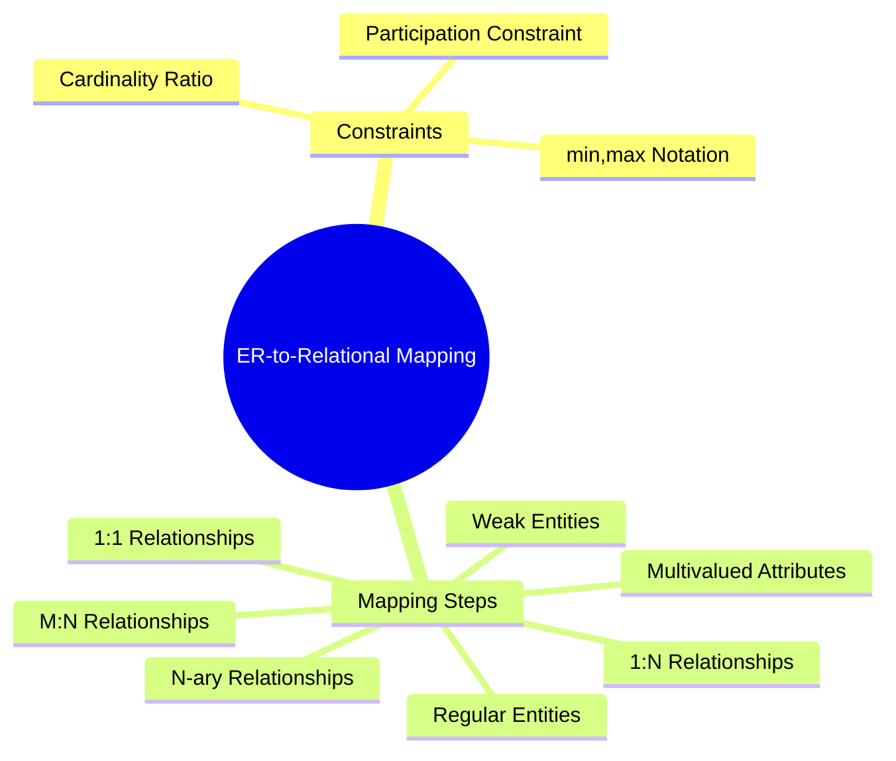

# 🧠 Database – ER Constraints & ER-to-Relational Mapping

> [!note] **Overview**
> This lecture covers **relationship constraints in ER modeling** and the **ER-to-Relational Mapping algorithm**, which converts ER diagrams into relational schemas. It also introduces **n-ary relationships** and their mapping to relations.

---
![[Pasted image 20251027192716.png|700]]
## 🔗 Constraints on Relationships

> [!note]
> Relationship constraints define the **structural rules** between entities, such as how many instances of one entity relate to another.

### 🟢 Types of Constraints

- **Cardinality Ratio** (Maximum participation)
  - **1:1** – One entity instance relates to only one in another.
  - **1:N / N:1** – One entity instance relates to many in another.
  - **M:N** – Many instances relate to many others.

- **Participation Constraint** (Minimum participation)
  - **Total participation** → existence-dependent (double line)
  - **Partial participation** → optional (single line)

> [!example]
> **WORKS_FOR** (Employee–Department): 1:N  
> **MANAGES** (Department–Manager): 1:1  
> **WORKS_ON** (Employee–Project): M:N

![[Pasted image 20251027192742.png|700]]
### 🟡 Alternative (min, max) Notation

Defines both minimum and maximum participation:
- `(min, max)` next to each entity type in the relationship.
- Default: `(0, n)` meaning optional and unlimited.
  
> [!example]
> - **EMPLOYEE–MANAGES**: (0,1) for EMPLOYEE, (1,1) for DEPARTMENT  
> - **EMPLOYEE–WORKS_FOR**: (1,1) for EMPLOYEE, (0,n) for DEPARTMENT

---

## 🧩 Attributes of Relationship Types

> [!note]
> A relationship can have its own **attributes** describing properties of the association.

![[Pasted image 20251027192853.png|252]]
- Example: `HoursPerWeek` in **WORKS_ON**
  - Depends on `(Employee, Project)` pair.
- Typically used with **M:N relationships**.
- In **1:N relationships**, attributes can move to the entity on the **N-side**.

> [!example]
> `Start_Date` in **WORKS_FOR** → moved to `Employee`.

---

## 📘 ER Diagram Notation Summary

- **Cardinality ratio** → 1:1, 1:N, M:N  
- **Participation constraint** → total (double line), partial (single line)
- **Attributes of relationship** → labeled diamond

![[Pasted image 20251027192805.png|700]]

> [!tip]
> Remember: *“One side gives the key, many side keeps the key.”*

---
## 🧾 Alternative Diagrammatic Notations

> [!note]
> **ER Diagrams** are a popular method for representing database schemas. However, alternative notations are also used in various modeling tools and literature.

### 🟢 Other Notations

- **UML Class Diagrams**
  - Represent ER concepts (entities, attributes, relationships).
  - Widely adopted in commercial design tools.
  - Provide additional semantics such as inheritance and multiplicity.

### 🟡 Additional Modeling Notes

- There can be **multiple relationships** between the same entities.
- **Self-relationships** (recursive) are allowed.
- **No isolated entities** — every entity must participate in at least one relationship.
- **No generic “system” entity** should exist.
- **Weak entities** can include **multivalued or composite attributes**.
- Every **entity must have a key**.
- Every **relationship must have defined cardinality**.

---

## 🧩 Chapter Summary

> [!note]
> The lecture summarizes key components of the **Entity-Relationship Model** and its constraints.

- **ER Model Concepts**: Entities, attributes, relationships  
- **Constraints in the ER Model**: Cardinality, participation, and (min,max) constraints  
- **Conceptual Schema Design**: Applying ER design to the **COMPANY** database  
- **ER Diagram Notation**: Standard symbols for entities, relationships, and attributes  
- **Alternative Notations**: UML Class Diagrams and other modeling methods

> [!tip]
> UML class diagrams can represent ER concepts while integrating object-oriented features like inheritance and associations.

![[Pasted image 20251027223652.png|700]]

---
# 7️⃣ Chapter 7
## 🧮 ER-to-Relational Mapping Algorithm
![[Pasted image 20251027223307.png]]
> [!note]
> Converts conceptual ER schema into relational schema for implementation in a relational DBMS.

### Step 1: Mapping Regular Entity Types 🟢 Basic
- Create a relation **R** for each strong entity.
- Include all **simple attributes**.
- Choose **primary key** (or composite if needed).
- if key is **composite** , all its parts are written not the composite ( Fname , Minit , Lname ).

> [!example]
> `EMPLOYEE(SSN, Name, Address, ...)`

![[Pasted image 20251027223448.png]]

---

### Step 2: Mapping Weak Entity Types 🟡 Intermediate
- Create relation **R** for weak entity **W**.
- Include **attributes of W** + **owner’s PK** as FK.
- **PK of R = FK of owner + partial key of W**.

> [!example]
> `DEPENDENT(ESSN, Dependent_Name, Relationship)`  
> PK = {ESSN, Dependent_Name}

![[Pasted image 20251027223509.png]]

---

### Step 3: Mapping Binary 1:1 Relationships 🟡 Intermediate
Three approaches:
1. **Foreign Key approach** – place FK in entity with *total participation*.
2. **Merged Relation approach** – *merge* entities if *both sides total*.
3. **Relationship Relation approach** – create *new relation for cross-reference*.

> [!example]
> **MANAGES** → `DEPARTMENT(DNUMBER, DNAME, MSSN, Start_Date)`

![[Pasted image 20251027224611.png]]

---

### Step 4: Mapping Binary 1:N Relationships 🟢 Basic
- Place **FK of “1” side** in the **relation of “N” side**.
- Include attributes of the relationship if any.

> [!example]
> **WORKS_FOR** → `EMPLOYEE(DNO)` references `DEPARTMENT(DNUMBER)`

> [!tip]
> “Many side gets the key.”

![[Pasted image 20251027230444.png]]
![[Pasted image 20251027230427.png]]

---

### Step 5: Mapping Binary M:N Relationships 🟡 Intermediate
- Create new **relation R** for the relationship.
- Include **FKs of both<<<< participating entities**.
- **PK = combination of both FKs**.
- Add any **relationship attributes**.

> [!example]
> `WORKS_ON(ESSN, PNO, HOURS)`  
> PK = {ESSN, PNO}

![[Pasted image 20251027230456.png|421]]
![[Pasted image 20251027230504.png]]

---
### Step 6: Mapping Multivalued Attributes 🔴 Advanced
- Create new relation **R**.
- Include:
  - Attribute **A** (multivalued)
  - PK of owning entity as FK
- **PK = {A, FK}**

> [!example]
> `DEPT_LOCATIONS(DNUMBER, DLOCATION)`

![[Pasted image 20251027230514.png|400]]
![[Pasted image 20251027230521.png]]

---

### Step 7: Mapping N-ary (≥3) Relationship Types 🔴 Advanced
- Create new relation **R**.
- Include **PKs of all participating entities** as FKs.
- **PK = combination of all FKs**.
- Add any **relationship attributes**.

> [!example]
> `SUPPLY(SNAME, PARTNO, PROJNAME)`  
> PK = {SNAME, PARTNO, PROJNAME}

**Example of a ternary relationship**
![[Pasted image 20251027230616.png]]

###### ER to relation mapping
![[Pasted image 20251027230649.png]]
![[Pasted image 20251027230657.png|513]]

---

## 🧩 Hands-On Practice

> [!example]
> **Exercise 1:**  
> Map the following ER relationship:  
> STUDENT —(Enrolls)— COURSE (Attributes: Grade, Semester)  
> → `ENROLLMENT(SID, CID, Grade, Semester)`  

> [!example]
> **Exercise 2:**  
> Model an employee managing multiple projects with hours worked.  
> → `WORKS_ON(ESSN, PNO, HOURS)`

---

## 🧠 Concept Hierarchy Diagram

---

## 📚 Continuity with Previous Lectures

* Builds on **ER Modeling** (entities, attributes, and relationships).
* Introduces **conversion to relational schema**.
* Prepares for **Normalization** in next lectures.

---

## 📖 Glossary

| Term                         | Definition                                            |
| ---------------------------- | ----------------------------------------------------- |
| **Cardinality Ratio**        | Maximum number of entity instances in a relationship. |
| **Participation Constraint** | Specifies minimum participation (total or partial).   |
| **Weak Entity**              | Entity dependent on another for identification.       |
| **Foreign Key (FK)**         | Attribute referencing a primary key in another table. |
| **Multivalued Attribute**    | Attribute with multiple possible values per entity.   |
| **N-ary Relationship**       | Relationship among more than two entity types.        |

---

## 🏁 Key Takeaways

* Constraints control entity participation and association strength.
* (min,max) notation defines both optionality and multiplicity.
* Mapping rules convert ER diagrams to relational tables systematically.
* Weak entities depend on strong ones for PK.
* N-ary relationships require a new relation including all FKs.

---

## 🧠 Quick Review Card

> **Q:** What does total participation mean?
> **A:** Every entity instance must participate in the relationship.

> **Q:** Where do we place the FK in a 1:N relationship?
> **A:** On the N-side.

> **Q:** What forms the PK of an M:N relationship table?
> **A:** Combination of FKs from both sides.

> **Q:** What is the PK of a weak entity’s relation?
> **A:** Owner’s PK + partial key.

> **Q:** When do we merge entities in mapping?
> **A:** When both sides of a 1:1 relationship have total participation.

---

## 📘 Further Resources

* *Fundamentals of Database Systems* by **Elmasri & Navathe** (Chapter 7)
* TutorialsPoint – *ER to Relational Mapping*
* YouTube: *Database Design – ER to Relational Mapping (Neso Academy)*
* W3Schools SQL Schema Design Guide
---
## 🧠 Simplified Steps of ER-to-Relational Mapping (Egyptian Arabic Style)

> [!note]
> الهدف من التحويل ده إننا ناخد **ER Diagram** اللي فيها entities وrelationships ونحوّلها لــ **Relational Schema** نقدر نطبّقها في قاعدة بيانات SQL.  
> يعني ببساطة: “كل Entity تبقى Table، وكل Relationship تتحول إلى مفاتيح أو جدول جديد حسب نوعها”.

---

## 🧩 Step 1: Regular Entities (الكيانات العادية)

> [!note]
> أي **Strong Entity** بنعملها **Table** لوحدها.

- نحط كل الـ **simple attributes** فيها.
- نختار منها **Primary Key (PK)**.
- لو الـ PK مركّب، يبقى نجمع attributes بتاعته كلها.

🧱 Example:  
`EMPLOYEE(SSN, Name, Address, Salary)`  
→ **SSN** هو الـ Primary Key.

> [!tip]
> 🎓 Mnemonic: **"Each strong stands alone."**  
> يعني كل كيان قوي بيبقى جدول لوحده.

---

## 🧩 Step 2: Weak Entities (الكيانات الضعيفة)

> [!note]
> الـ Weak Entity ما ينفعش تعيش من غير الـ Owner، فبتاخد **FK** منه وتضمها لمفتاحها.

- نعمل Table فيها attributes الخاصة بيها + **FK** من الـ Owner.
- **Primary Key = Partial Key + FK**.

🧱 Example:  
`DEPENDENT(ESSN, Dependent_Name, Relationship)`  
**ESSN** ← جاي من `EMPLOYEE(SSN)`  
**PK = ESSN + Dependent_Name**

> [!tip]
> 🎓 Mnemonic: **"Weak borrows key from strong."**

---

## 🧩 Step 3: Binary 1:1 Relationships (علاقة واحد لواحد)

> [!note]
> في علاقة **1:1** عندنا 3 اختيارات:
> 1. نحط **FK** في الكيان اللي عنده **total participation**.  
> 2. ندمج الكيانين في **Table واحدة** لو الاتنين total.  
> 3. نعمل **Table جديدة** للعلاقة. ( when both sides are partial participation )

🧱 Example:  
`DEPARTMENT(DNUMBER, DNAME, MSSN, Start_Date)`  
**MSSN** بيربطها بـ `EMPLOYEE(SSN)` اللي هو المدير.

> [!tip]
> 🎓 Mnemonic: **"Put FK where everyone must appear."**

---

## 🧩 Step 4: Binary 1:N Relationships (علاقة واحد لمجموعة)

> [!note]
> في علاقة **1:N** نحط **FK** بتاع “1” في جدول “N”.

🧱 Example:  
`EMPLOYEE(DNO)` ← **DNO** جاي من `DEPARTMENT(DNUMBER)`  
يعني كل موظف بيتبع قسم واحد.

> [!tip]
> 🎓 Mnemonic: **"Many gets the key."**

---

## 🧩 Step 5: Binary M:N Relationships (علاقة متعدد لمتعدد)

> [!note]
> علاقة **Many-to-Many** لازم تتحول لــ **New Table**.

- نحط **FKs** من الكيانين.
- نضيف أي **Attributes** خاصة بالعلاقة.
- **PK = combination of FKs**.

🧱 Example:  
`WORKS_ON(ESSN, PNO, HOURS)`  
**ESSN** ← Employee  
**PNO** ← Project  
**HOURS** ← Attribute للعلاقة

> [!tip]
> 🎓 Mnemonic: **"M:N makes a new table."**

---

## 🧩 Step 6: Multivalued Attributes (الصفات متعددة القيم)

> [!note]
> لو attribute ليه أكتر من قيمة، بنعمله **Table جديدة**.

- نحط:
  - الـ Attribute نفسه.
  - **FK** من الجدول الأصلي.
- **PK = {FK + Attribute}**

🧱 Example:  
`DEPT_LOCATIONS(DNUMBER, DLOCATION)`  
القسم ممكن يكون ليه أكتر من مكان.

> [!tip]
> 🎓 Mnemonic: **"Multi means many rows."**

---

## 🧩 Step 7: N-ary Relationships (العلاقات الثلاثية أو أكتر)

> [!note]
> لو العلاقة فيها أكتر من كيانين (3 أو أكتر)، نعمل **New Table** فيها:
  - **FKs** لكل الكيانات.
  - أي attributes خاصة بالعلاقة.
  - **PK = كل الـ FKs مع بعض.**

🧱 Example:  
`SUPPLY(SNAME, PARTNO, PROJNAME)`  
يعني supplier بيورد parts لمشاريع.

> [!tip]
> 🎓 Mnemonic: **"N-ary needs new relation."**

---

## 🧭 Study Aid Summary Table

| Step | Type | What to Do | Mnemonic |
|------|------|-------------|-----------|
| 1 | Regular Entity | Create a table with PK | Each strong stands alone |
| 2 | Weak Entity | Add FK + partial key | Weak borrows key from strong |
| 3 | 1:1 Relationship | FK / Merge / New Table | Put FK where everyone must appear |
| 4 | 1:N Relationship | FK on N-side | Many gets the key |
| 5 | M:N Relationship | New Table | M:N makes a new table |
| 6 | Multivalued Attribute | New Table | Multi means many rows |
| 7 | N-ary Relationship | New Table | N-ary needs new relation |

---
