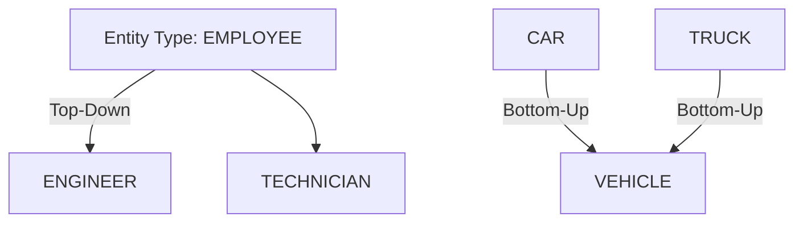

# 🧠 Database – Specialization, Generalization & EER Mapping

> [!overview]
> This lecture explores **Specialization** and **Generalization** in Enhanced ER (EER) models, their constraints, hierarchical structures, and the process of **mapping EER constructs to relational schemas** using multiple strategies.

---

## 🔹 Specialization

**Definition:**  
Specialization is the process of defining **subclasses** of a **superclass** based on distinguishing characteristics of its entities.

**Example:**  
`{SECRETARY, ENGINEER, TECHNICIAN}` is a specialization of `EMPLOYEE` based on **JobType**.

**Key Concepts:**
- A subclass **inherits** attributes and relationships of its superclass.  
- Subclasses may have **specific (local) attributes** and **specific relationships**.

> [!example]
> - Subclass attribute: `TypingSpeed` → specific to `SECRETARY`  
> - Relationship: `BELONGS_TO` → specific to `HOURLY_EMPLOYEE`

---

## 🔹 Generalization

**Definition:**  
Generalization is the **reverse of specialization**, where multiple entity types with common features are abstracted into a **superclass**.

**Example:**  
`CAR` and `TRUCK` → generalized into `VEHICLE`

**Comparison:**

| Concept | Direction | Example |
|----------|------------|----------|
| Specialization | Top-down | EMPLOYEE → ENGINEER, SECRETARY |
| Generalization | Bottom-up | CAR, TRUCK → VEHICLE |

> [!note]
> Generalization combines similar entities; specialization divides entities into refined types.

---

## 🔹 Conceptual Process

- **Specialization:** Top-down refinement  
- **Generalization:** Bottom-up synthesis  



---

## 🔹 Constraints on Specialization and Generalization

### 1. Predicate-Defined (Condition-Defined)

Subclasses are defined using a **condition** (predicate).  
Example: `EMPLOYEE` where `JobType = 'Engineer'`

### 2. Attribute-Defined

Membership in subclass depends on a **defining attribute** of the superclass.  
Example: `JobType` defines `{SECRETARY, TECHNICIAN, ENGINEER}`.

### 3. User-Defined

Membership manually assigned by users (no defining attribute).

---

## 🔹 Disjointness and Completeness Constraints

### Disjointness Constraint

An entity can belong to **only one subclass**.

- Symbol: `d` in EER
    
- Opposite: **Overlapping** (`o`)
    

### Completeness Constraint

Determines if all superclass entities appear in subclasses.

- **Total specialization:** Every entity must belong to a subclass (double line).
    
- **Partial specialization:** Some may not (single line).
    

|Type|Disjointness|Completeness|
|---|---|---|
|Disjoint Total|d + Total||
|Disjoint Partial|d + Partial||
|Overlapping Total|o + Total||
|Overlapping Partial|o + Partial||

---

## 🔹 Hierarchies, Lattices, and Shared Subclasses

**Hierarchy:**  
Each subclass has **one superclass** (single inheritance).

**Lattice:**  
Subclasses can have **multiple superclasses** (multiple inheritance).

**Shared Subclass:**  
Subclass inheriting from multiple superclasses.  
Example: `ENGINEERING_MANAGER` inherits from `ENGINEER`, `MANAGER`, and `SALARIED_EMPLOYEE`.

> [!tip]  
> Hierarchies form a tree; lattices form a network.

---

## 🔹 Categories (Union Types)

**Definition:**  
A **category** (or **union type**) is a subclass derived from the **union** of multiple superclasses.

**Example:**  
`OWNER` = union of `{PERSON, BANK, COMPANY}`  
→ Owner may exist in **one** superclass.

**Difference from Shared Subclass:**

|Type|Membership|Logic|
|---|---|---|
|Shared Subclass|Must exist in **all** superclasses|AND|
|Category (Union Type)|Must exist in **at least one** superclass|OR|

**Representation:**

- **Total Category:** Double line
    
- **Partial Category:** Single line
    

---

## 🔹 Mapping EER Constructs to Relational Schemas

**Goal:** Convert EER diagram elements into relational tables.

### Step 8: Mapping Specialization / Generalization

Let superclass `C(k, a1, …, an)` and subclasses `{S1, S2, …, Sm}`.

#### **Option 8A – Multiple Relations (Superclass + Subclasses)**

- Create table for `C` and one for each `Si`.
    
- Works for **all types** (disjoint/overlapping, total/partial).
    

```sql
CREATE TABLE Employee (
  EmpID INT PRIMARY KEY,
  Name VARCHAR(50),
  JobType VARCHAR(30)
);

CREATE TABLE Engineer (
  EmpID INT PRIMARY KEY REFERENCES Employee(EmpID),
  EngType VARCHAR(30)
);
```

#### **Option 8B – Subclass Relations Only**

- Create only subclass tables including superclass attributes.
    
- Works **only for total** specialization.
    

#### **Option 8C – Single Relation with Type Attribute**

- One table with a **type discriminator**.
    
- Works **only for disjoint** specializations.
    
- May cause **NULL** values for unused subclass fields.
    

#### **Option 8D – Single Relation with Multiple Boolean Type Attributes**

- Add Boolean flags (e.g., `isEngineer`, `isManager`).
    
- Works for **overlapping or disjoint** cases.
    

> [!warning]  
> Use Option 8A for maximum flexibility; Option 8C or 8D for compact schemas with known disjointness.

---

## 🔹 Mapping Shared Subclasses (Multiple Inheritance)

- Shared subclass must share the **same key attribute** among superclasses.
    
- If keys differ → model as a **Category (Union Type)**.
    

---

## 🔹 Step 9: Mapping Union Types (Categories)

When superclasses have **different keys**, introduce a **surrogate key**.

```sql
CREATE TABLE Owner (
  OwnerID INT PRIMARY KEY,
  CategoryType VARCHAR(20),
  CHECK (CategoryType IN ('PERSON', 'BANK', 'COMPANY'))
);
```

---

## 🔹 Mathematical Expression (Conceptual)

Subclass inheritance:  
$$  
Attributes(S_i) = Attributes(C) \cup Attributes(S_i^{local})  
$$

---

## 📘 Glossary

|Term|Definition|
|---|---|
|**Specialization**|Defining subclasses from a superclass.|
|**Generalization**|Combining similar entities into a superclass.|
|**Disjointness**|Restriction that entities belong to one subclass only.|
|**Completeness**|Specifies total or partial participation in subclasses.|
|**Hierarchy**|Tree structure of inheritance.|
|**Lattice**|Graph structure allowing multiple inheritance.|
|**Category (Union Type)**|Subclass formed from the union of multiple superclasses.|
|**Surrogate Key**|Artificial key introduced when superclasses have different keys.|

---

## 🎯 Key Takeaways

- Specialization and generalization structure data semantics.
    
- Constraints control entity membership and completeness.
    
- EER mapping offers four schema design options for implementation.
    
- Shared subclasses → multiple inheritance; Categories → union-based.
    
- Choosing the right mapping impacts query simplicity and data integrity.
    

---

## 🔗 Further Resources

- _Ramez Elmasri & Shamkant Navathe_, _Fundamentals of Database Systems_, Ch. 4 & 7.
    
- [Database Systems Concepts – Silberschatz, Korth, Sudarshan]
    
- [w3schools.com/sql](https://www.w3schools.com/sql) – SQL Schema Design