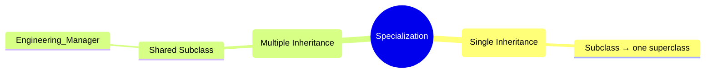
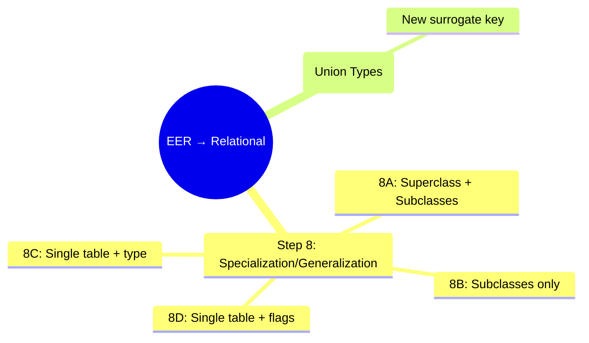

# 🧠 Database – Specialization, Generalization & Mapping EER to Relations

> [!note] **Overview**
> This lecture explains **specialization**, **generalization**, and how they are represented in **Enhanced ER (EER) models**.  
> It also covers **constraints**, **hierarchies/lattices**, **union types (categories)**, and **EER-to-relational mapping** with **steps 8–9** and mapping **options 8A–8D**.

---

## 🧩 Continuity with Previous Lectures
This lecture extends **ER-to-Relational Mapping** by handling **EER constructs** such as specialization, generalization, and categories.  
It builds upon **entity and relationship mapping** steps 1–7 introduced earlier.

---

## 1. 🔹 Specialization

> [!note]
> **Definition:** The process of defining **subclasses of a superclass** based on distinguishing characteristics.

- Each subclass represents a **subset** of the superclass.
- Entities are divided according to attributes like **job type**, **method of pay**, etc.

> [!example]
> Example:  
> EMPLOYEE specialized into {SECRETARY, ENGINEER, TECHNICIAN} based on **JobType**.

> [!tip]
> 🧠 Mnemonic: **Spec → Split**  
> *Specialization splits one entity (superclass) into many (subclasses).*

### Characteristics
- **Subclasses** may have:
  - Specific (local) attributes → e.g., `TypingSpeed` for `SECRETARY`
  - Specific relationships → e.g., `BELONGS_TO` for `HOURLY_EMPLOYEE`
- One superclass can have **multiple specializations**.

---

## 2. 🔹 Generalization

> [!note]
> **Definition:** The reverse of specialization.  
> Combines several entity types with common features into a **superclass**.

> [!example]
> Example: `{CAR, TRUCK}` → generalized into `VEHICLE`.

> [!tip]
> 🧠 Mnemonic: **Gen → Gather**  
> *Generalization gathers many entities into one superclass.*

### Relation Between Both
- `{CAR, TRUCK}` as **specialization** of `VEHICLE`
- Or, `VEHICLE` as **generalization** of `{CAR, TRUCK}`

---

## 3. 🔹 Top-Down vs Bottom-Up

| Process | Approach | Description |
|----------|-----------|-------------|
| **Specialization** | Top-down | Start with one entity and define its subclasses |
| **Generalization** | Bottom-up | Start with several entities and find a common superclass |

---

## 4. 🔹 Constraints on Specialization & Generalization

### 4.1 Predicate-Defined (Condition-Defined)
- Subclass membership is determined by a **condition or predicate**.  
  Example: `JobType = 'Engineer'` defines subclass ENGINEER.

### 4.2 Attribute-Defined
- Membership is based on a **specific attribute** of the superclass.  
  Example: `JobType` defines specialization `{SECRETARY, ENGINEER, TECHNICIAN}`.

### 4.3 User-Defined
- Membership assigned **manually by users**, not by condition.

---

## 5. 🔹 Key Constraints

| Constraint Type | Description | EER Symbol |
|------------------|--------------|-------------|
| **Disjointness** | Entity can belong to **only one subclass** | `d` |
| **Overlapping** | Entity can belong to **multiple subclasses** | `o` |
| **Completeness (Total)** | Every superclass entity **must** belong to a subclass | **Double line** |
| **Completeness (Partial)** | Some superclass entities **may not** belong to any subclass | **Single line** |

> [!tip]
> Mnemonic: **DOT O**  
> **D**isjoint / **O**verlapping / **T**otal / **O**ptional (Partial)

### 5.1 The Four Combinations
| Type | Disjointness | Completeness |
|------|---------------|---------------|
| **Disjoint Total** | d | Total |
| **Disjoint Partial** | d | Partial |
| **Overlapping Total** | o | Total |
| **Overlapping Partial** | o | Partial |

---

## 6. 🔹 Hierarchies, Lattices, and Shared Subclasses

> [!note]
> A **hierarchy** or **lattice** forms when subclasses or superclasses appear at multiple levels.

### 6.1 Hierarchy
- Each subclass has **one superclass** → **Single Inheritance**
- Tree structure

### 6.2 Lattice
- A subclass can have **multiple superclasses** → **Multiple Inheritance**
- The subclass is called a **Shared Subclass**

> [!example]
> Example: `ENGINEERING_MANAGER`  
> - Is an `ENGINEER`  
> - Is a `MANAGER`  
> - Is a `SALARIED_EMPLOYEE`

### 6.3 Diagram



---

## 7. 🔹 Categories (Union Types)

> [!note]  
> **Definition:** A subclass with **multiple superclasses** representing **different entity types**.

- Category = **Union of multiple superclasses**
    
- Each category member exists in **one** of its superclasses
    
- Common in **vehicle registration**, **banking**, or **ownership models**
    

> [!example]  
> Example: `OWNER` = union of {PERSON, COMPANY, BANK}

![[Pasted image 20251028000122.png]]
### Difference from Shared Subclass
![[Pasted image 20251028000110.png]]

|Aspect|Shared Subclass|Category (Union Type)|
|---|---|---|
|Superclasses|One per relationship|Multiple in one relationship|
|Member belongs to|**All** superclasses|**At least one** superclass|
|Inheritance|Intersection|Union|

### Total vs Partial Category

- **Total:** All superclass entities appear in category (double line)
    
- **Partial:** Only some appear (single line)
    

---

## 8. 🔹 Mapping EER Model Constructs to Relations

> [!note]  
> **Steps 8–9** of ER-to-Relational Mapping handle EER extensions.

### Step 8: Mapping Specialization / Generalization

Superclass `C` with attributes `{k, a1, a2,…}` and subclasses `{S1, S2,…Sm}` can be mapped using four options:

---

### Option 8A – Multiple Relations (Superclass + Subclasses)

> [!example]  
> Create one relation for `C` and one for each subclass `Si`.

✅ Works for **any type** (total/partial, disjoint/overlapping).

```text
C(k, a1, a2, …)
S1(k, …specific attributes)
S2(k, …specific attributes)
```

![[Pasted image 20251028000234.png]]
![[Pasted image 20251028000242.png]]

---

### Option 8B – Multiple Relations (Subclasses Only)

> [!example]  
> Create one relation per subclass containing superclass attributes.

✅ Works **only for total** specializations.

```text
S1(k, a1, a2, …, specific attributes)
S2(k, a1, a2, …, specific attributes)
```

![[Pasted image 20251028000306.png]]
![[Pasted image 20251028000313.png]]

---

### Option 8C – Single Relation with One Type Attribute

> [!example]  
> One table for all subclasses, includes **type/discriminator attribute (t)**.

✅ Works **only for disjoint** specializations.

```text
C(k, a1, a2, …, attributes of all subclasses, t)
```

> [!warning]  
> May cause **NULLs** if subclasses have many unique attributes.

![[Pasted image 20251028000428.png]]
![[Pasted image 20251028000435.png]]

---

### Option 8D – Single Relation with Multiple Type Attributes

> [!example]  
> One table with **Boolean flags (t1, t2, …)** indicating subclass membership.

✅ Works for **overlapping** or **disjoint** specializations.

```text
C(k, a1, a2, …, attributes of all subclasses, t1, t2, …)
```

![[Pasted image 20251028000443.png]]
![[Pasted image 20251028000449.png]]

---
### Summary Table

| Option | Relations                 | Works For               | Type Indicator | Null Risk |
| ------ | ------------------------- | ----------------------- | -------------- | --------- |
| **8A** | Superclass + Subclasses   | All                     | None           | Low       |
| **8B** | Subclasses only           | Total only              | None           | Low       |
| **8C** | Single (1 type attr)      | Disjoint only           | One attribute  | High      |
| **8D** | Single (multi-type attrs) | Overlapping or disjoint | Boolean flags  | Moderate  |

![[Pasted image 20251028000528.png]]![[Pasted image 20251028000532.png]]

---

### Step 9: Mapping Union Types (Categories)

- Create a relation for the **category**
    
- If superclasses have different keys → introduce **surrogate key**
    

> [!example]  
> Example:
> 
> ```text
> OWNER(OwnerID, attributes)
> ```
> 
> `OwnerID` = surrogate key

![[Pasted image 20251028000549.png]]![[Pasted image 20251028000556.png]]

---

## 🧩 Hands-On Practice

1. Design a **specialization** for `EMPLOYEE` with subclasses based on **JobType**.
    
2. Create **EER diagrams** showing **disjoint total** and **overlapping partial** constraints.
    
3. Implement mapping using **Option 8C** and **Option 8D** in SQL.
    
4. Model a **category** (union type) for `OWNER` combining `PERSON`, `COMPANY`, and `BANK`.
    

---

## 🧠 Glossary

|Term|Definition|
|---|---|
|**Specialization**|Splitting an entity into subclasses|
|**Generalization**|Combining entities into a superclass|
|**Disjointness**|Entity belongs to one subclass only|
|**Completeness**|Whether all entities are covered by subclasses|
|**Lattice**|Structure allowing multiple inheritance|
|**Union Type (Category)**|Subclass formed from multiple superclasses|
|**Surrogate Key**|Artificial key used when superclasses have different keys|

---

## 🧭 Key Takeaways

- Specialization = Top-down, Generalization = Bottom-up.
    
- Four constraints: **Disjoint/Overlapping**, **Total/Partial**.
    
- Hierarchies allow **single inheritance**; lattices allow **multiple inheritance**.
    
- Categories (union types) model entities from different superclasses.
    
- Mapping options (8A–8D) depend on specialization structure.
    

---

## 🎓 Quick Review Card

|Q|A|
|---|---|
|What is specialization?|Defining subclasses of a superclass|
|Difference between hierarchy and lattice?|Single vs multiple inheritance|
|When is a category used?|When a subclass has multiple heterogeneous superclasses|
|Which mapping option is for disjoint specialization?|Option 8C|
|What does "total" completeness mean?|Every superclass entity must belong to a subclass|

---

## 📚 Further Resources

- _Ramez Elmasri & Shamkant Navathe, Fundamentals of Database Systems (7th Ed.)_, Ch. 4–7
    
- TutorialsPoint: [EER Model and Specialization](https://www.tutorialspoint.com/dbms/er_extended.htm)
    
- GeeksforGeeks: [ER to Relational Mapping](https://www.geeksforgeeks.org/er-to-relational-model-mapping-in-dbms/)
---
## 🧠 Database – Simplified Mapping EER Model Constructs to Relations 🇪🇬

> [!note] **Overview**
> المحاضرة دي بتشرح بطريقة بسيطة إزاي نحول **EER Diagram** إلى **Relational Schema**  
> يعني نحول entities, attributes, relationships, subclasses, … إلخ إلى **tables** في قاعدة البيانات.

---

## 🧩 Steps 1 → 7 (الخطوات العادية)

> [!note]
> الخطوات دي كنا أخدناها في المحاضرات اللي قبل كده، وبتتعامل مع الـ basic ER model.

| Step | Description (بالعربي والإنجليزي) |
|------|----------------------------------|
| **1. Regular Entity → Table** | كل entity بتبقى table. كل attribute بيبقى column. والـ key يبقى الـ PK. |
| **2. Weak Entity → Table + FK** | Table جديدة ومعاها FK للـ owner. |
| **3. Binary 1:1 Relationship** | ممكن نحط FK في واحدة من الـ entities. |
| **4. Binary 1:N Relationship** | الـ “many side” تاخد FK من الـ “one side”. |
| **5. M:N Relationship** | Table جديدة فيها الـ FKs من الكيانين + attributes بتاعة الـ relationship. |
| **6. Multivalued Attribute** | Table منفصلة فيها الـ key + الـ multivalue. |
| **7. N-ary Relationship** | Table جديدة فيها FKs من كل الـ entities اللي داخلة في العلاقة. |

---

## 🧠 Step 8 – Mapping Specialization / Generalization

> [!note]
> لو عندك **superclass** ومعاه **subclasses**, عندك 4 اختيارات (Options) عشان تعمل الـ mapping.

خلينا نقول عندنا:
- `C` (superclass) فيها attributes: {k, a1, a2, …, an}  
- `S1, S2, …, Sm` subclasses  

---

### 🅰️ Option 8A – Multiple Tables (Superclass + Subclasses)

> [!example]
> - نعمل Table للـ superclass  
> - نعملTable لكل subclass فيها نفس الـ key بتاع الـ superclass

```text
C(k, a1, a2, …)
S1(k, …attributes of S1)
S2(k, …attributes of S2)
```

✅ شغالة مع أي نوع specialization (total / partial / disjoint / overlapping)

> [!tip]  
> 🧠 **Mnemonic:** “All together but separate”  
> كل واحدة ليها table، بس الـ key واحد مشترك.

---

### 🅱️ Option 8B – Multiple Tables (Subclasses Only)

> [!example]  
> نعمل Table لكل subclass فقط، وننسخ attributes بتاعة الـ superclass جوه كل واحدة.

```text
S1(k, a1, a2, …, attributes of S1)
S2(k, a1, a2, …, attributes of S2)
```

✅ ينفع **بس لو الـ specialization total**  
(يعني كل كيان في الـ superclass لازم يبقى موجود في subclass).

> [!tip]  
> 🧠 **Mnemonic:** “Below only” → بس الـ subclasses.

---

### 🅲️ Option 8C – Single Table with One Type Attribute

> [!example]  
> نعمل Table واحدة فيها كل attributes بتاعة superclass + subclasses،  
> ونضيف attribute اسمه **type** يوضح الكيان تابع لأنهي subclass.

```text
C(k, a1, a2, …, attributes of all subclasses, type)
```

✅ تنفع **بس مع disjoint** specializations  
⚠️ فيها **NULLs كتير** لو الـ subclasses مختلفة جدًا.

> [!tip]  
> 🧠 **Mnemonic:** “C = Combined” → كله متحد في Table واحدة.

---

### 🅳 Option 8D – Single Table with Multiple Type Attributes (Booleans)

> [!example]  
> Table واحدة فيها كل attributes + Boolean flags لكل subclass.

```text
C(k, a1, a2, …, IsEngineer, IsTechnician, IsManager)
```

✅ تنفع مع **overlapping** أو **disjoint** specializations.

> [!tip]  
> 🧠 **Mnemonic:** “D = Double flags”  
> يعني كل subclass ليها flag خاص بيها.

---

### 🧾 Summary Table

|Option|Tables|Works For|Type Attribute|Mnemonic|Nulls|
|---|---|---|---|---|---|
|**8A**|Superclass + Subclasses|All|❌|All together but separate|Low|
|**8B**|Subclasses only|Total only|❌|Below only|Low|
|**8C**|One table (one type)|Disjoint|✅ 1|Combined|High|
|**8D**|One table (multi-type)|Overlapping / Disjoint|✅ Boolean|Double flags|Medium|

---

## 🧠 Step 9 – Mapping Union Types (Categories)

> [!note]  
> لما يكون الـ subclass ليه أكتر من superclass مختلفين (زي PERSON و COMPANY و BANK).

- لو superclasses ليهم **different keys**  
    نعمل **surrogate key** جديد في Table الـ category.
    

> [!example]
> 
> ```text
> OWNER(OwnerID, attributes...)
> ```
> 
> و OwnerID هو المفتاح الجديد (surrogate key).

✅ ينفع لما الـ category تمثل **Union** من كذا superclass.

> [!tip]  
> 🧠 **Mnemonic:** “U = Union key” → category دايمًا ليها key جديد يوحّد الكل.

---

## 🧩 Study Mnemonics Summary

> [!tip]  
> 🧠 احفظهم كده بالترتيب السهل:

|Step|Mnemonic|Meaning|
|---|---|---|
|**8A**|All together but separate|Tables للكل بس كل subclass مستقلة|
|**8B**|Below only|بس الـ subclasses|
|**8C**|Combined|كلهم في Table واحدة + type|
|**8D**|Double flags|Boolean لكل subclass|
|**9**|Union key|category ليها key جديد|

---

## 🧠 Quick Mindmap



---

## 🧭 Key Takeaways

- Step 8 يخص **Specialization/Generalization**
    
- Step 9 يخص **Union Types (Categories)**
    
- كل Option ليه use case حسب **type** و **constraint**
    
- احفظ mnemonics:  
    **A – All**, **B – Below**, **C – Combined**, **D – Double**, **U – Union**
    

---

## 🎓 Quick Review

| Q                                    | A                                    |
| ------------------------------------ | ------------------------------------ |
| إمتى أستخدم Option 8A؟               | لما specialization يكون أي نوع       |
| إمتى أستخدم Option 8B؟               | لما specialization يكون Total        |
| إمتى أستخدم Option 8C؟               | لما subclasses تكون Disjoint         |
| إمتى أستخدم Option 8D؟               | لما subclasses تكون Overlapping      |
| ليه بنستخدم surrogate key في Step 9؟ | عشان superclasses ليهم مفاتيح مختلفة |

---

## 📚 Further Resources

- _Elmasri & Navathe – Fundamentals of Database Systems, Ch. 4–7_
    
- YouTube: “EER to Relational Mapping Explained”
    
- GeeksforGeeks: [ER to Relational Mapping](https://www.geeksforgeeks.org/er-to-relational-model-mapping-in-dbms/)