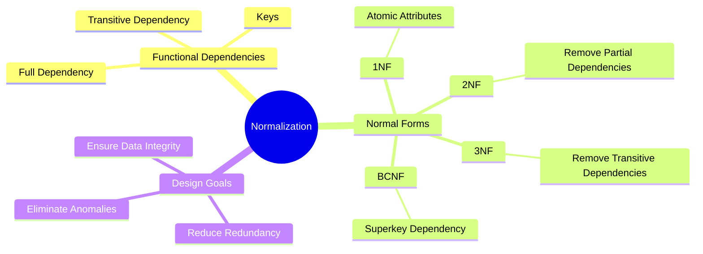

# Chapter 10

> [!note] **Overview**
> This lecture introduces the principles of **relational database design** focusing on **functional dependencies (FDs)** and **normalization**.  
> It explores how poor schema design causes redundancy and anomalies, then outlines how to refine relations into **1NF**, **2NF**, **3NF**, and **BCNF** for consistency and efficiency.

---

## 🧩 Continuity with Previous Lectures
This lecture builds upon prior discussions of the **relational model** and **schema design**, extending them with **formal rules** for assessing data structure quality.  
Where earlier lectures focused on **ER modeling**, this one emphasizes the **logical optimization** of relations.

---

## 1. Informal Design Guidelines for Relational Databases

### 1.1 Semantics of Relation Attributes 🟢
> [!note]
> **Guideline 1:** Each tuple in a relation should represent **one entity or relationship instance**.  
> - Attributes from different entities (e.g., **EMPLOYEE**, **DEPARTMENT**) must not be mixed.  
> - **Foreign keys** are used to link entities.  
> - The schema should be **semantically interpretable**, with each relation’s meaning clear and independent.

> [!example]
> The `EMP_DEPT` relation should not include attributes belonging to both employees and departments directly — use foreign keys like `Dno` instead.

---
### 1.2 Redundant Information and Update Anomalies 🟡
> [!note]
> **Guideline 2:** Avoid redundancy and anomalies in schema design.
> Redundant information wastes storage and leads to:
> - **Insertion anomaly:** Cannot insert data unless another tuple exists.
> - **Deletion anomaly:** Removing a tuple unintentionally removes related data.
> - **Modification anomaly:** A change in one place must be repeated elsewhere.

> [!example]
> In relation `EMP_PROJ(Emp#, Proj#, Ename, Pname, No_hours)`:
> - **Update anomaly:** Changing project name `P1` requires updating all employees on that project.
> - **Insert anomaly:** Cannot add a new project without an assigned employee.
> - **Delete anomaly:** Deleting an employee might delete the only record of a project.

> [!warning]
> A well-designed schema minimizes these anomalies by **separating entities** into multiple relations and linking them via **foreign keys**.


![[Pasted image 20251114151525.png]]
![[Pasted image 20251114151546.png]]

---

### 1.3 Null Values in Tuples 🟢
> [!note]
> **Guideline 3:** Design relations to minimize **NULL values**.  
> - Frequent null attributes should be moved to separate relations.  
> - Reasons for NULLs:
>   - Attribute not applicable or invalid.
>   - Attribute value unknown (may exist).
>   - Value exists but is temporarily unavailable.

> [!tip]
> Group attributes by dependency and relevance to reduce NULL frequency.

---

## 2. Functional Dependencies (FDs)

### 2.1 Definition 🟢
> [!note]
> A **functional dependency (FD)** expresses a constraint between attributes in a relation.  
> - **X → Y** means: for any tuples `t1` and `t2` in a relation `r`, if `t1[X] = t2[X]`, then `t1[Y] = t2[Y]`.  
> - FDs are derived from **real-world semantics**.

> [!example]
> - `SSN → ENAME`  
> - `PNUMBER → {PNAME, PLOCATION}`  
> - ` .{SSN, PNUMBER} → HOURS`

---

> [!tip]
> **Keys** are special FDs where the determinant set uniquely identifies all attributes:  
> If `K` is a **key** of relation `R`, then `K → all attributes in R`.

---

## 3. Normalization of Relations

### 3.1 Concept and Purpose 🟡
> [!note]
> **Normalization** decomposes “bad” relations into smaller, better-structured ones to eliminate redundancy.  
> **Normal forms** are rules based on keys and FDs that measure schema quality.

> [!example]
> Transforming `EMP_PROJ(Emp#, Proj#, Ename, Pname, No_hours)` into separate relations:
> - `EMPLOYEE(Emp#, Ename)`
> - `PROJECT(Proj#, Pname)`
> - `WORKS_ON(Emp#, Proj#, No_hours)`

> [!tip]
> Normalization typically proceeds up to **3NF** or **BCNF** in practical databases.  
> Higher forms may overcomplicate without major benefit.

---

### 3.2 Denormalization ⚙️
> [!note]
> Sometimes databases are **denormalized** for performance — joining multiple relations into one.  
> This improves read speed but reintroduces redundancy risks.

---

## 4. Normal Forms Based on Primary Keys

### 4.1 First Normal Form (1NF) 🟢
> [!note]
> - Disallows **multivalued attributes**.  
> - Each attribute value must be **atomic** (indivisible).  
> - Every tuple-cell intersection contains a **single value**.

>In original source (composite & multivalued attributes and nested relations )

> [!example]
> ```
> Before:
> DEPT(Dno, Dname, Loc1, Loc2, Loc3)
> 
> After 1NF:
> DEPT_LOC(Dno, Dname, Location)
> ```
> Here, multi-location entries are replaced with multiple tuples.

---

### 4.2 Second Normal Form (2NF) 🟡
> [!note]
> - Based on **full functional dependency**.  
> - A relation is in 2NF if every **non-prime attribute** is **fully functionally dependent** on the **entire primary key**.  
> - Removes **partial dependencies**.

> [!example]
> In `EMP_PROJ(SSN, PNUMBER, HOURS, ENAME)`:  
> - `SSN → ENAME` (partial dependency) violates 2NF.  
> - Split into:
>   - `EMPLOYEE(SSN, ENAME)`
>   - `WORKS_ON(SSN, PNUMBER, HOURS)`

> [!warning]
> Ignoring partial dependencies can cause redundant storage of employee names for every project.

---

### 4.3 Third Normal Form (3NF) 🔴
> [!note]
> - Eliminates **transitive dependencies**.  
> - A relation is in 3NF if it is in 2NF and **no non-prime attribute** depends **transitively** on the primary key. (non primary depend on non primary)

> [!example]
> In `EMP(SSN, DNUMBER, DMGRSSN)`:
> - `SSN → DNUMBER` and `DNUMBER → DMGRSSN`
> - Hence, `SSN → DMGRSSN` is **transitive**.
> Solution: Decompose into:
> - `EMPLOYEE(SSN, DNUMBER)`
> - `DEPARTMENT(DNUMBER, DMGRSSN)`

> [!tip]
> Rule of thumb:
> - **1NF:** Attributes depend on the key  
> - **2NF:** Attributes depend on the **whole** key  
> - **3NF:** Attributes depend on **nothing but** the key

---

### 4.4 Boyce-Codd Normal Form (BCNF) 🔴
> [!note]
> - A stronger version of 3NF.  
> - A relation is in BCNF if, for every non-trivial FD `X → A`, `X` is a **superkey**.  
> - Ensures maximum elimination of redundancy.

- Every **2NF** *relation* is in **1NF**
- Every **3NF** *relation* is in **2NF**
- Every **BCNF** *relation* is in **3NF**

> [!example]
> Some 3NF relations are **not in BCNF** if an FD exists with a determinant that is not a superkey.

> [!warning]
> Over-normalization may reduce query efficiency; balance theoretical purity with practical needs.

---

## 🧠 Concept Hierarchy Diagram



---

## 🧩 Hands-On Practice

1. Identify FDs from the schema `STUDENT(CourseID, StudentID, Instructor, Grade)`.
    
    - Which dependencies hold?
        
    - Which normal form does it satisfy?
        
2. Convert the following to **3NF**:
    
    ```
    EMP_PROJ(Emp#, Proj#, Ename, Pname, No_hours)
    ```
    
3. For each normal form (1NF–BCNF), sketch an **ERD** that represents the decomposed structure.
    

---

## 📘 Glossary

|Term|Definition|
|---|---|
|**Functional Dependency (FD)**|Relationship where one attribute uniquely determines another.|
|**Full Functional Dependency**|Dependency on all attributes of the key.|
|**Transitive Dependency**|When A → B and B → C, then A → C indirectly.|
|**1NF**|All attribute values are atomic.|
|**2NF**|Non-key attributes depend on the whole key.|
|**3NF**|Non-key attributes depend only on the key.|
|**BCNF**|Every determinant is a superkey.|

---

## 🔑 Key Takeaways

- Normalization improves **data integrity** and reduces **redundancy**.
    
- **Functional dependencies** define relationships among attributes.
    
- **1NF–3NF** remove different types of dependency problems.
    
- **BCNF** ensures strongest normalization.
    
- **Denormalization** trades some redundancy for performance.
    

---

## 🧩 Quick Review Card

**Q1:** What is the purpose of normalization?  
**A1:** To eliminate redundancy and anomalies by decomposing relations based on FDs.

**Q2:** Difference between partial and transitive dependency?  
**A2:** Partial → on part of key; Transitive → through another non-key attribute.

**Q3:** What defines BCNF?  
**A3:** Every determinant must be a superkey.

**Q4:** Why avoid NULLs?  
**A4:** They complicate queries and may indicate poor schema design.

**Q5:** What’s the difference between normalization and denormalization?  
**A5:** Normalization reduces redundancy; denormalization reintroduces it for performance.

---

## 📚 Further Resources

- **Elmasri & Navathe (7th Ed.)**, _Fundamentals of Database Systems_, Chapter 10
    
- **C.J. Date**, _An Introduction to Database Systems_
    
- **Stanford Online** – Relational Database Design (CS145 Module 4)
    
- **Khan Academy** – Database normalization tutorial
    

---