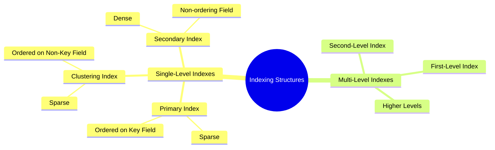

# Chapter 14

> [!note] **Overview**
> This lecture introduces **indexing structures** used to optimize record retrieval in large files. It covers **primary, clustering, and secondary indexes**, explains **dense vs. sparse indexing**, and demonstrates performance improvements using **binary search** and **multi-level indexes**.

---

## 1. Introduction to File Indexing 🟡
Indexes act as **auxiliary access paths** that improve search performance without changing the physical data layout.

> [!note] **Key Idea**
> An **index** is a separate file containing **key values + pointers** to data blocks or records, allowing faster access than linear search.

### Why indexes?
- Reduce disk accesses during search.
- Allow efficient access on non-ordering attributes.
- Support multiple alternative access paths.

---

## 2. Indexes as Access Paths 🟢

> [!note] **Definition**
> An **access path** is any structure that allows efficient retrieval of records meeting a specific search condition.

### Characteristics
- Index defined on an **indexing field** (one or more attributes).
- Stores **<field value, pointer>** pairs.
- Typically much **smaller** than the data file → faster binary search.
- Can be **dense** or **sparse**.

### Dense vs. Sparse Indexes
- **Dense index** → one entry per record.
- **Sparse index** → one entry per block or per distinct key.

---

## 3. Types of Single-Level Indexes 🟢

### Summary
1. **Primary Index** (sparse)
2. **Clustering Index** (sparse)
3. **Secondary Index** (dense)

---

## 4. Primary Index 🟡

> [!note] **Definition**
> A **primary index** is built on a file ordered by a **unique key field** (ordering key).  
> Exactly **one index entry per data block** → **sparse index**.

### Structure
Each entry:  
**<K(i), P(i)>**  
- **K(i)**: ordering key of the first record (block anchor)  
- **P(i)**: pointer to the block

### Properties
- One entry per block → fewer index records.
- Faster search vs. binary search on full data file.
- Required when file physically ordered on a key.

> [!example] **Cost Analysis Example (From Slides)**
> - Records: **30,000**, size 100 bytes  
> - Block size: **1024 bytes**  
> - **10 records/block → 3000 blocks**
> - Binary search on file: **log₂(3000) ≈ 12 accesses**
> - Primary index entry size: 15 bytes → **68 entries/block**
> - Index blocks: **45**
> - Binary search on index: **log₂(45) ≈ 6**  
> - Add 1 data block access → **7 accesses total**

> [!warning]
> Primary index **cannot** exist alongside a clustering index because a file can only be physically ordered one way.

---

## 5. Clustering Index 🟡

> [!note] **Definition**
> A **clustering index** is built on a file ordered by a **non-key attribute** (clustering field).  
> One entry per **distinct value** → **sparse index**.

### Use Cases
- When many records share the same attribute value (e.g., employees grouped by department).
- Accelerates retrieval of groups of records.

### Structure
**<clustering field value, pointer to first block having that value>**

> [!example]
> If EMPLOYEE file ordered by **DEPTNUMBER**, the clustering index provides quick access to all employees in a department.

---

## 6. Secondary Index 🟡

> [!note] **Definition**
> A **secondary index** provides an additional access path on a **non-ordering** field.

### Key Features
- Can be built on **key or non-key** fields.
- **Dense index** → one entry per record.
- Requires more storage than primary/clustering indexes.

### Search Performance
- Binary search on full file would be impossible since file is *not ordered* on this field.
- Secondary index drastically reduces search cost.

> [!example] **Dense Secondary Index Example**
> - Same file of 30,000 records.
> - Dense index → **30,000 entries**
> - Index block count: **442**
> - Binary search: **log₂(442) ≈ 9**
> - Total search cost: **9 + 1 = 10 accesses**
> - Compared to linear search: **1500 accesses**

---

## 7. Multi-Level Indexes 🔴

> [!note] **Definition**
> A **multi-level index** uses an index on top of another index, creating multiple levels until the top level fits into a single block.

### Benefits
- Reduces search cost to **t + 1** block accesses  
  where *t = number of index levels*.

### Example (From Slides)
- Level 1 blocks: **442**
- Level 2 blocks: **7**
- Level 3 blocks: **1 (top)**  
→ **3 levels total**

Search cost:  
**t + 1 = 3 + 1 = 4 block accesses**  
Much faster than 10 (single-level).

---

## 8. Continuity With Previous Lectures
This lecture builds on:
- **File organization** (heap, ordered files)
- **Block and record structure**
- **Query cost estimation**

Indexes form the foundation for **B+ Trees**, discussed in upcoming lectures.

---

## 🧩 Hands-On Practice

### 1. Compute Blocking Factor
Given:
- Block size: 2048 bytes
- Record length: 80 bytes  
Compute:  
$$bfr = \left\lfloor \frac{2048}{80} \right\rfloor$$

### 2. Dense vs. Sparse Identification
Classify the following:
- One entry per block → ?
- One entry per record → ?

### 3. Multilevel Index Construction
Given first-level blocks = 500, fan-out = 50  
Compute number of levels.

---

## 9. Lecture Questions (From Slides)

> [!question]
> None of the slides include explicit instructor questions.

---

## 🔰 Difficulty Tags
- Index Concepts: 🟢  
- Primary/Clustering/Secondary Indexes: 🟡  
- Cost Analysis & Multilevel Indexing: 🔴  

---

## 10. Concept Hierarchy Diagram

---

## Glossary

- **Index**: Auxiliary file providing fast access paths using key–pointer pairs.
    
- **Primary Index**: Sparse index on a file ordered by a unique key.
    
- **Clustering Index**: Sparse index on a file ordered by a non-key field.
    
- **Secondary Index**: Dense index on a non-ordering field.
    
- **Dense Index**: Contains one entry per record.
    
- **Sparse Index**: Contains one entry per block or distinct value.
    
- **Block Anchor**: First record in a block used in primary index entries.
    
- **Fan-out**: Number of index entries per block, determines multilevel height.
    

---

## Key Takeaways

- Indexes significantly reduce disk I/O during search operations.
    
- Primary and clustering indexes are **sparse**, secondary indexes are **dense**.
    
- Dense secondary indexes improve search drastically when files are unordered.
    
- Multi-level indexes further cut search cost to **t + 1** block accesses.
    
- Index design depends on data distribution, ordering, and query patterns.
    

---

## Quick Review Card

**Q:** What differentiates a primary index from a clustering index?  
**A:** Primary index uses a **key field**, clustering index uses a **non-key field**.

**Q:** Which index type is always dense?  
**A:** Secondary index.

**Q:** How many block accesses does a multilevel index require?  
**A:** **t + 1**, where _t_ is number of index levels.

**Q:** What is a block anchor?  
**A:** First record in a block used by primary index.

**Q:** When is a secondary index used?  
**A:** When accessing records based on **non-ordering fields**.

---

## Further Resources

- Elmasri & Navathe, _Fundamentals of Database Systems_, Chapter 14.
    
- Ramakrishnan & Gehrke, _Database Management Systems_, Indexing chapters.
    
- Stanford CS245 Notes on Indexing.
    
- PostgreSQL Documentation — Index Types & Internals.