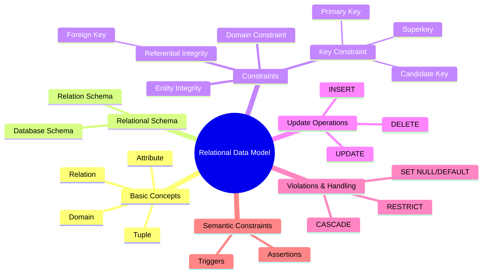

> [!note]
> This lecture introduces the **core concepts of the relational model**, including relations, tuples, domains, schemas, integrity constraints, and update operations. It also explains how constraints maintain correctness and consistency across relational databases.

---

# 1. Informal Concepts of the Relational Model

## 1.1 What is a Relation?

> [!note]
> A **relation** is conceptually a **table of values** where:
> - Each **row** represents a fact about an entity or relationship (formally, a **tuple**).
> - Each **column** represents an attribute describing the tuple.
> - Every attribute has a **domain** (set of valid values).

🟢 Basic

>**Key of a Relation:**  Each row has a value of a data item (or set of items) that uniquely identifies that row in the table

>**Artificial key or surrogate key:** Sometimes row-ids or sequential numbers are assigned as keys to identify the rows in a table

### Example Relation: STUDENT
Columns: **SSN**, **Name**, **Phone**, **Address**, …

![[Pasted image 20251122160031.png]]

> [!example]
> A STUDENT table where `SSN` uniquely identifies each row.

---

# 2. Formal Definitions

## 2.1 Relation Schema

> [!note]
> A **relation schema** is defined as:  
> **R(A1, A2, …, An)**  
> where:
> - **R** is the relation name  
> - **A1..An** are attribute names  
> - Every attribute has an associated **domain**

Example:  
**CUSTOMER(Cust-id, Cust-name, Address, Phone)**
- CUSTOMER is the relation name 
- Defined over the four attributes: Cust-id, Cust-name, Address, Phone#
Each attribute has a domain or a set of valid values.
	For example, the domain of Cust-id is 6 digit numbers

🟢 Basic

---

## 2.2 Tuple

> [!note]
> A **tuple** is an ordered set of values (enclosed in angled brackets ‘< … >’)
>  
>  A relation is a set of such tuples (rows)
>  
> ⟨v1, v2, …, vn⟩ where vi ∈ dom(Ai)

🟢 Basic

### Example 4-tuple:
<⟨632895, "John Smith", "101 Main St.", "(404) 894-2000"⟩>
	A tuple (row) in the CUSTOMER relation

---

## 2.3 Domain

> [!note]
> A **domain** is a set of valid values with a logical description and format.

Examples:
- `USA_phone_number` with format `(ddd)ddd-dddd`
- Attribute `Invoice-date` and `Payment-date` may share the domain `DATE` but have different meanings.

🟢 Basic

---

# 3. Relational Database Schema

> [!note]
> A **relational database schema** S is a set of relation schemas:
>  
> **S = {R1, R2, …, Rn}**

🟢 Basic

### Example: COMPANY Database Schema  
Includes relations: EMPLOYEE, DEPARTMENT, PROJECT, WORKS_ON, etc.

---
![[Pasted image 20251122164546.png]]


---
# 4. Characteristics of Relations

## 4.1 Ordering

> [!note]
> - **Tuples are unordered**  
> - **Attributes are ordered** (for simplicity)  
> - Tuple values must be **atomic**

🟢 Basic

---
#### Values in a tuple:
 - All values are considered **atomic** (indivisible).
 - Each value in a tuple must **be from the domain** of the attribute for that column
 - If tuple t = <v1, v2, …, vn> is a tuple (row) in the relation state r of R(A1, A2, …, An)
 - Then each vi must be a value from dom(Ai)
## 4.2 Null Values

> [!note]
> A null represents:
> - Unknown value  
> - Inapplicable value  

🟢 Basic

---

# 5. Relational Integrity Constraints

> [!note]
> Constraints ensure that *all valid database states* obey the rules of the relational model.

Three primary constraint categories:

1. **Key constraints**  
2. **Entity integrity constraints**  
3. **Referential integrity constraints**  
4. (Implicit) **Domain constraints**

🟡 Intermediate

---

# 6. Key Constraints

## 6.1 Superkey

> [!note]
> A **superkey** is any set of attributes that uniquely identifies tuples.

> Is a set of attributes SK of R with the following condition:
>  - No two tuples in any valid relation state r(R) will have the same value for SK
>  - This condition must hold in any valid state r(R)

🟢 Basic
## 6.2 Key (Candidate Key)

> [!note]
> A **minimal superkey**—no subset of it can uniquely identify tuples.
> - removal of any attribute from K results in a set of attributes that is not a superkey

🟡 Intermediate

##### Example: CAR(State, Reg#, SerialNo, Make, Model, Year)

- Key 1: {State, Reg#}  
- Key 2: {SerialNo}  
- {SerialNo, Make} → Superkey, not a key

---

## 6.3 Primary Key

> [!note]
> One key is chosen as the **primary key**.  
> - Must be **minimal**, stable, and non-null  
> - Attributes are **underlined** in schema diagrams

🟢 Basic

---

# 7. Entity Integrity Constraint

> [!note]
> Primary key attributes **cannot be null**.  
>  
> For relation R with primary key PK:  
>  
> t[PK] ≠ null for any tuple t ∈ r(R)

🟡 Intermediate

---

# 8. Referential Integrity Constraint

> [!note]
> A **foreign key (FK)** in R1 must reference an existing **primary key (PK)** in R2, or be null.

involving **two** relations

Formally:
1. FK value ∈ existing PK values of R2  
2. OR FK is null (unless FK is part of R1’s PK)

🟡 Intermediate

> [!example]
> WORKS_ON(Essn, Pno)  
> - Essn references EMPLOYEE.Ssn  
> - Pno references PROJECT.Pnumber

---

# 9. Displaying Constraints in Schemas

### ER-to-Relational Mapping produces:

- Underlined **primary key** attributes  
- Arrows from **foreign key → referenced primary key**  

---

# 10. Other Types of Constraints

> [!note]
> **Semantic Integrity Constraints**  
> - Based on business rules  
> - Not enforceable by the basic relational model  
> - SQL allows **TRIGGERS** and **ASSERTIONS** to implement them

Example:  
"Employee cannot work > 56 hours/week"

🔴 Advanced

---

# 11. Database States and Updates

## 11.1 Database State

> [!note]
> The **current content** of all relations at a point in time.  
> Any INSERT, DELETE, or UPDATE creates a new database state.

🟢 Basic

---

## 11.2 Update Operations

1. **INSERT**  
2. **DELETE**  
3. **UPDATE**

> [!warning]
> All updates must preserve:  
> **Domain, Key, Entity Integrity, Referential Integrity**.

🟡 Intermediate

---

# 12. Constraint Violations

## 12.1 INSERT Violations

> [!warning]
> INSERT may violate:
> - Domain constraint  
> - Key constraint  
> - Referential integrity  
> - Entity integrity  

## 12.2 DELETE Violations

> [!warning]
> DELETE may violate **referential integrity**  
> If deleted PK is referenced as an FK elsewhere.

Possible actions:
- RESTRICT  
- CASCADE  
- SET NULL / SET DEFAULT  

## 12.3 UPDATE Violations

> [!WARNING]
> Updating:
> - PK → similar to DELETE + INSERT  
> - FK → may violate referential integrity  
> - Ordinary attribute → may violate domain constraints

🟡 Intermediate

---

# Continuity with Previous Lectures

> [!note]
> This lecture builds directly on relational model fundamentals introduced earlier:
> - Relation structure (schema, tuples, domains)
> - ER-to-Relational mapping  
>  
> It extends foundational modeling with **rules that ensure data correctness**, preparing you for SQL constraints, triggers, and cascades.

---

# 🧩 Hands-On Practice

1. Identify candidate keys, primary keys, and foreign keys for a given schema.  
2. For a set of INSERT statements, determine which violate domain, key, or referential integrity.  
3. Given a COMPANY-style schema, illustrate all FK → PK relationships in Mermaid.  
4. Perform a conceptual RESTRICT vs CASCADE vs SET NULL analysis for a DELETE operation.  
5. Validate a tuple against domain rules and explain each violation type.

---

# Lecture Questions
(No explicit slide questions; the content consisted of definitions and diagrams.)

---

# Difficulty Tags
- 🟢 Basic — Relations, tuples, domains, schemas  
- 🟡 Intermediate — Keys, referential integrity, update rules  
- 🔴 Advanced — Semantic constraints, cascades, update propagation  

---

# Concept Hierarchy Diagram



---

# Glossary

- **Relation** — Table with rows (tuples) and columns (attributes).
    
- **Tuple** — Ordered set of values representing one row.
    
- **Domain** — Valid set of attribute values.
    
- **Relation Schema** — Structure of a relation.
    
- **Database Schema** — Collection of relation schemas.
    
- **Superkey** — Any attribute set uniquely identifying tuples.
    
- **Candidate Key** — Minimal superkey.
    
- **Primary Key** — Chosen candidate key.
    
- **Foreign Key** — Attribute referencing another relation’s primary key.
    
- **Entity Integrity** — PK must not be null.
    
- **Referential Integrity** — FK must reference existing PK or be null.
    
- **Cascade** — Automatically propagate updates/deletes.
    

---

# Key Takeaways

- The relational model is rigorously defined using **schemas, domains, tuples, and constraints**.
    
- **Key, entity, and referential integrity** ensure correctness and eliminate anomalies.
    
- **Foreign keys** enforce relationships among relations.
    
- Update operations must always respect all constraints.
    
- Semantic constraints extend beyond the power of the relational model.
    

---

# Quick Review Card

**Q1:** What makes a candidate key different from a superkey?  
A: It is **minimal**; no subset can uniquely identify tuples.

**Q2:** Can a foreign key be null?  
A: Yes, unless it is part of the relation’s primary key.

**Q3:** What is entity integrity?  
A: Primary key attributes must never be null.

**Q4:** Which operation most commonly violates referential integrity?  
A: **DELETE** of a referenced tuple.

**Q5:** What are common strategies for FK violations?  
A: RESTRICT, CASCADE, SET NULL/DEFAULT.

---

# Further Resources

- _Elmasri & Navathe – Fundamentals of Database Systems_
    
- Stanford Database Lectures
    
- MIT OCW – Relational Model Modules
    
- CMU Database Course (Andy Pavlo)
    

```

If you want, I can now also generate a combined **Chapter 5 + Chapter 6 study sheet**, or produce an **ultra-condensed exam version**.
```