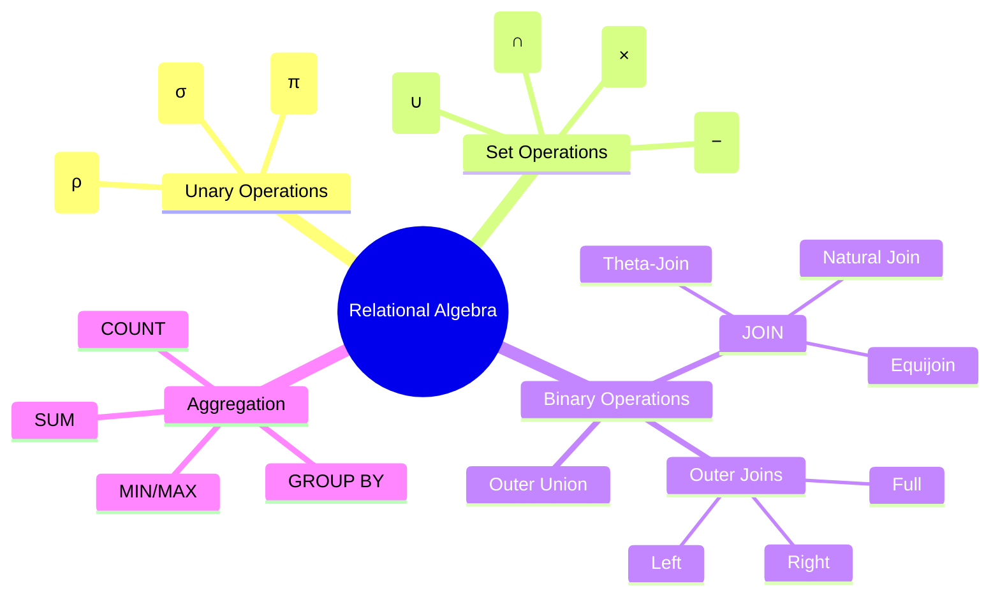

> [!note]
> This lecture introduces the full suite of **relational algebra operations** that underpin all relational database queries. It covers unary, binary, and set-theoretic operators, join variants, aggregation, and procedural vs. single-expression query construction.

---

# Overview of Relational Algebra
> [!note]
> **Relational Algebra** is a collection of **procedural**, **closed**, mathematically defined operations used for database querying.

- Closed algebra → every operation outputs a **relation**
- Queries are expressed as **expressions** built by composing operations
##### Operations include:
  - **Unary:** SELECT **σ**, PROJECT **π**, RENAME **ρ**  
  - **Set-based:** UNION **∪**, INTERSECT **∩**, DIFFERENCE **−**, CARTESIAN PRODUCT **×**  
  - **Binary:** JOIN, EQUIJOIN, NATURAL JOIN, OUTER JOIN  
  - **Additional:** AGGREGATES, GROUPING, OUTER UNION

> [!tip]
> Think of relational algebra as the **low-level engine** beneath SQL. SQL is declarative; RA is procedural.

---

# Origin of Algebra (Historical Insight)
> [!note]
> Algebra derives from **al-jabr**, a term from the 9th-century mathematician **al-Khwarizmi**, whose name also produced the word **algorithm**.

🟢 Basic

---

# Unary Relational Operations

## 1. SELECT (σ)
> [!note]
> **SELECT σ** filters rows (tuples) based on a Selection condition.

Example:  
- σ<sub>&lt;DNO=4&gt;</sub>(EMPLOYEE)  
- σ<sub>&lt;SALARY>30000&gt;</sub>(EMPLOYEE)

Properties:
- Schema remains **unchanged**
- **Commutative**
- Sequences can merge via **AND**  
  σ₁(σ₂(R)) = σ(1 AND 2)(R)

🟢 Basic

---

## 2. PROJECT (π)
> [!note]
> **PROJECT π** selects specific columns from a relation.

Example:  
π<sub>LNAME,FNAME,SALARY</sub>(EMPLOYEE)

Key properties:
- Removes **duplicate tuples**
- Reduces **degree** (number of attributes)
- **Not** commutative

🟢 Basic

---

## 3. RENAME (ρ)
> [!note]
> **RENAME ρ** changes attribute or relation names.

Forms:
- ρ<sub>S(B1,...,Bn)</sub>(R) — rename relation + attributes  
- ρ<sub>S</sub>(R) — rename relation  
- ρ<sub>(B1,...,Bn)</sub>(R) — rename attributes only

🟢 Basic

---

# Relational Algebra Expressions

Two equivalent forms:

### Single expression
π<sub>FNAME,LNAME,SALARY</sub>(σ<sub>DNO=5</sub>(EMPLOYEE))

### Stepwise with intermediates
```

DEP5_EMPS ← σ DNO=5 (EMPLOYEE)  
RESULT ← π FNAME, LNAME, SALARY (DEP5_EMPS)

```

🟡 Intermediate

---

# Set-Theoretic Operations

## UNION (R ∪ S)
> [!note]
> Combines tuples in **either or both** relations. Removes duplicates.

Requires **union compatibility**:
- Same number of attributes  
- Corresponding domains compatible

🟢 Basic

---

## INTERSECTION (R ∩ S)
> [!note]
> Returns tuples common to both relations.  
> Requires union compatibility.

🟢 Basic

---

## DIFFERENCE (R − S)
> [!note]
> Returns tuples in R **not** in S.  
> Not commutative.

🟢 Basic

---

# CARTESIAN PRODUCT (R × S)
> [!note]
> Produces all tuple combinations between R and S.  
> Degree = |R| + |S|.  
> Cardinality = |R| × |S|.

🟡 Intermediate

> [!warning]
> Meaningless alone; useful only when paired with SELECT to form **JOIN logic**.

---

# JOIN Operations

## General JOIN (⋈)
> [!note]
> JOIN = CARTESIAN PRODUCT + SELECT filtered by join condition.

Example:  
DEPT_MGR ← DEPARTMENT ⋈<sub>MGRSSN=SSN</sub> EMPLOYEE

🟡 Intermediate

---

## Theta-Join (⋈<sub>θ</sub>)
> [!note]
> Condition θ may include:
- =  
- <  
- >  
- AND, OR combinations

🟡 Intermediate

---

## EQUIJOIN
> [!note]
> JOIN where all comparisons use **=** only.  
> Produces **duplicate attribute pairs**.

🟢 Basic

---

## NATURAL JOIN (*)
> [!note]
> Removes duplicate join attributes automatically.  
> Implicit join uses all attributes with the **same name**.

Example:  
DEPT_LOCS ← DEPARTMENT * DEPT_LOCATIONS

🟡 Intermediate

---

# Complete Set of Relational Operations
> [!note]
> The set {σ, π, ∪, −, ρ, ×} is **relationally complete**.

Examples:
- R ∩ S = (R ∪ S) − ((R − S) ∪ (S − R))  
- R ⋈<sub>θ</sub> S = σ<sub>θ</sub>(R × S)

🔴 Advanced

---

# Aggregation & Grouping (ℱ)
> [!note]
> Aggregates summarize numeric attributes:
- SUM
- AVG
- MIN
- MAX
- COUNT

Example:  
ℱ<sub>MAX Salary</sub>(EMPLOYEE)

### Grouping Example
DNO ℱ<sub>COUNT SSN, AVG Salary</sub>(EMPLOYEE)

🟡 Intermediate

---

# Outer Joins

## LEFT OUTER JOIN
Keeps all tuples of R:  
R ⟕ S

## RIGHT OUTER JOIN
Keeps all tuples of S:  
R ⟖ S

## FULL OUTER JOIN
Keeps all tuples of both:  
R ⟗ S

Fields without matches are padded with **NULL**.

🟡 Intermediate

---

# Outer Union
> [!note]
> Combines relations with partially overlapping schemas.

Example result schema:  
(Name, SSN, Department, Advisor, Rank)

🔴 Advanced

---

# Procedural Query Examples

## Q1: Employees in "Research"
```

RESEARCH_DEPT ← σ DNAME='Research' (DEPARTMENT)  
RESEARCH_EMPS ← RESEARCH_DEPT ⋈ DNUMBER=DNO EMPLOYEE  
RESULT ← π FNAME, LNAME, ADDRESS (RESEARCH_EMPS)

```

## Q6: Employees with no dependents
```

ALL_EMPS ← π SSN(EMPLOYEE)  
EMPS_WITH_DEPS ← π ESSN(DEPENDENT)  
EMPS_WITHOUT_DEPS ← ALL_EMPS − EMPS_WITH_DEPS  
RESULT ← π LNAME, FNAME (EMPS_WITHOUT_DEPS * EMPLOYEE)

````

🟡 Intermediate

---

# Single-Expression Equivalents

## Q1
π FNAME, LNAME, ADDRESS (  
 σ DNAME='Research' (DEPARTMENT ⋈ DNUMBER=DNO EMPLOYEE)  
)

## Q6
π LNAME, FNAME (  
 (π SSN(EMPLOYEE) − ρ SSN(π ESSN(DEPENDENT))) * EMPLOYEE  
)

---

# Continuity with Previous Lectures
> [!note]
> This lecture builds on the logical database model and sets the foundation for later topics:
- Relational calculus  
- SQL translation  
- Query optimization  
- Schema design using foreign keys (JOIN dependency)

---

# 🧩 Hands-On Practice

1. Write RA to retrieve employees earning above department-average salary.  
2. Express a division-like query: “Find employees who work on all projects in department 4.”  
3. Convert the join:  
   σ<sub>DNO=5∧SEX='F'</sub>(EMPLOYEE × DEPARTMENT)  
   into a natural join expression.  
4. Use ℱ to compute average salary per department with grouping.  
5. Given relations R(A,B) and S(B,C), express NATURAL JOIN without using *.

---

# Lecture Questions (from slides)
The slides contain **procedural examples** but no explicit Q&A prompts.  
All instructor questions have been preserved in the examples section.

---

# Difficulty Map
- 🟢 SELECT, PROJECT, UNION, INTERSECT, MINUS  
- 🟡 CARTESIAN PRODUCT, JOIN, GROUPING  
- 🔴 Relational completeness, outer union, advanced join logic

---

# Concept Hierarchy Diagram



---

# Glossary

- **SELECT σ** — Filters rows based on conditions.
    
- **PROJECT π** — Selects attributes (columns).
    
- **RENAME ρ** — Renames relations/attributes.
    
- **UNION ∪** — Combines sets without duplicates.
    
- **INTERSECTION ∩** — Returns common tuples.
    
- **DIFFERENCE −** — Tuples in R not in S.
    
- **CARTESIAN PRODUCT ×** — All tuple combinations.
    
- **JOIN ⋈** — Combines related tuples across relations.
    
- **EQUIJOIN** — Join with equality conditions.
    
- **NATURAL JOIN *** — Join removing duplicate attributes.
    
- **OUTER JOIN** — Retains unmatched tuples using NULLs.
    
- **AGGREGATE ℱ** — Summaries over numerical attributes.
    

---

# Key Takeaways

- Relational algebra is **procedural**, **closed**, and forms the theoretical basis for SQL.
    
- SELECT and PROJECT are foundational; JOIN emerges from × + σ.
    
- Set operations require **union compatibility**.
    
- NATURAL JOIN and OUTER JOIN reduce redundancy and preserve information.
    
- Aggregates and grouping extend RA beyond simple tuple retrieval.
    

---

# Quick Review Card

**Q1:** What makes relational algebra “closed”?  
**A:** Every operation outputs a **relation**.

**Q2:** Why does PROJECT remove duplicates?  
**A:** RA is based on **set** theory, not bags.

**Q3:** How is JOIN defined internally?  
**A:** As **CARTESIAN PRODUCT + SELECT**.

**Q4:** What does NATURAL JOIN remove?  
**A:** Duplicate join attributes with identical values.

**Q5:** What operator computes grouped summaries?  
**A:** **Aggregate ℱ** with grouping attribute to the left.

---

# Further Resources

- _Elmasri & Navathe – Fundamentals of Database Systems_
    
- Stanford Lagunita: _Intro to Databases_
    
- CMU DB Lectures (YouTube – Andy Pavlo)
    
- “Relational Algebra & SQL Translation” – MIT OCW
    

```

If you want, I can now generate **SQL equivalents** for all operations or produce a **compact exam-only version**.
```