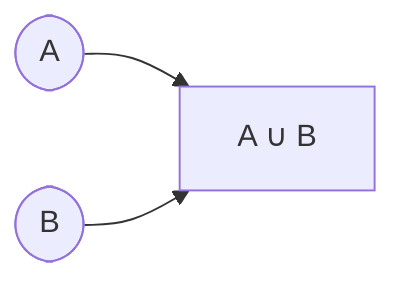

# 🧠 Discrete Mathematics – Lecture 2: Set Operations

---

## 📘 Overview

> [!summary]  
> This lecture covers **set operations** including **union, intersection, difference, and complement**. It also introduces **set identities**, **De Morgan’s laws**, and methods of proof using **membership tables** and **builder notation**.

---

## 🧩 Core Concepts

### 🔹 Union ( A ∪ B )

- The set containing all elements that are **in A, or in B, or in both**.
    
- Example: **A = {1, 3, 5}, B = {1, 2, 3} ⇒ A ∪ B = {1, 2, 3, 5}**
    
- Builder form:  
    $$A ∪ B = {x | x ∈ A ∨ x ∈ B}$$
    

---

### 🔹 Intersection ( A ∩ B )

- The set containing elements that are **in both A and B**.
    
- Example: **A = {1, 3, 5}, B = {1, 2, 3} ⇒ A ∩ B = {1, 3}**
    
- Builder form:  
    $$A ∩ B = {x | x ∈ A ∧ x ∈ B}$$
    

> [!tip]  
> Two sets are **disjoint** if their intersection is **∅**.

---

### 🔹 Difference ( A − B )

- The set of elements **in A but not in B**.
    
- Example: **A = {1, 3, 5}, B = {1, 2, 3} ⇒ A − B = {5}**
    
- Builder form:  
    $$A - B = {x | x ∈ A ∧ x ∉ B}$$
    

---

### 🔹 Complement ( A′ )

- The set of all elements **not in A**, relative to a **universal set U**.
    
- Formula:  
    $$A′ = U − A = {x | x ∉ A}$$
    

> [!note]  
> (A − B) is also called the **complement of B with respect to A**.

---

### 🔹 Cardinality

- Relationship between sizes of sets:  
    $$|A ∪ B| = |A| + |B| − |A ∩ B|$$
    

---

## 🧩 Set Identities and Proofs

### 🔹 Basic Identities

|Property|Expression|
|---|---|
|Commutative|(A ∪ B = B ∪ A,\quad A ∩ B = B ∩ A)|
|Associative|(A ∪ (B ∪ C) = (A ∪ B) ∪ C)|
|Distributive|(A ∩ (B ∪ C) = (A ∩ B) ∪ (A ∩ C))|
|De Morgan’s|((A ∩ B)′ = A′ ∪ B′,\quad (A ∪ B)′ = A′ ∩ B′)|

> [!example]  
> Prove (A ∪ (B ∩ C) = (A ∪ B) ∩ (A ∪ C))

**Method I (Logical proof):**  
$$
\begin{align*}  
x ∈ A ∪ (B ∩ C) &⟺ x ∈ A ∨ (x ∈ B ∧ x ∈ C)\  
&⟺ (x ∈ A ∨ x ∈ B) ∧ (x ∈ A ∨ x ∈ C)\  
&⟺ x ∈ (A ∪ B) ∩ (A ∪ C)  
\end{align*}  
$$

**Method II (Membership Table):**

|A|B|C|B∩C|A∪(B∩C)|A∪B|A∪C|(A∪B)∩(A∪C)|
|:-:|:-:|:-:|:-:|:-:|:-:|:-:|:-:|
|0|0|0|0|0|0|0|0|
|0|0|1|0|0|0|1|0|
|0|1|0|0|0|1|0|0|
|0|1|1|1|1|1|1|1|
|1|0|0|0|1|1|1|1|
|1|0|1|0|1|1|1|1|
|1|1|0|0|1|1|1|1|
|1|1|1|1|1|1|1|1|

> [!warning]  
> Always verify with both **logical derivation** and **membership tables** to ensure correctness.

---

### 🔹 Builder Notation Proof Example

$$
A ∪ B = {x | x ∈ A ∨ x ∈ B},\quad  
A′ = {x | x ∉ A}  
$$ 
By substituting definitions, you can derive De Morgan’s laws step by step.

---

### 🔹 Generalized Union and Intersection

For sets (A_1, A_2, … , $A_n$):  
$$
\bigcup_{i=1}^{n} A_i = A_1 ∪ A_2 ∪ … ∪ A_n  
\quad\text{and}\quad  
\bigcap_{i=1}^{n} A_i = A_1 ∩ A_2 ∩ … ∩ A_n  
$$

> [!example]  
> $Let (A={0,2,4,6,8}, B={0,1,2,3,4}, C={0,3,6,9})$
> $(A∪B∪C={0,1,2,3,4,6,8,9},;A∩B∩C={0})$

---

## 🧾 Glossary

- **Union ( ∪ ):** All elements in either or both sets.
    
- **Intersection ( ∩ ):** Elements common to both sets.
    
- **Difference ( − ):** Elements in one set but not the other.
    
- **Complement ( ′ ):** Elements not in a set relative to a universal set.
    
- **Disjoint:** Sets with no elements in common.
    
- **Cardinality:** Number of elements in a set.
    

---

## 🧭 Key Takeaways

- **Set operations** mirror **logical operators** (∨, ∧, ¬).
    
- **De Morgan’s laws** provide complement relationships.
    
- **Membership tables** validate set identities empirically.
    
- **Builder notation** formalizes set definitions.
    
- Mastery of set operations underpins **proof techniques** in discrete mathematics.