# 🧠 Discrete Mathematics – Lecture 3: Functions, Inverses, and Compositions

---

> [!summary]
> This lecture covers **functions** as mappings between sets, including their types—**injective**, **surjective**, and **bijective**—along with **inverse** and **composite** functions. It concludes with special functions such as **floor** and **ceiling**, and introduces **sequences** and **summations**.

---

## 1️⃣ Recap: Sets and Operations

### **Key Concepts**
- **Set:** An **unordered collection** of distinct objects, denoted as $\{a, b, c, d\}$  
- **Element:** A single object belonging to a set  
- **Cardinality:** The number of elements in a set  
- **Power Set:** The set of **all subsets** of a given set  
- **Cartesian Product:**  
  $$
  A \times B = \{(a, b) \mid a \in A \land b \in B\}
  $$

> [!example]
> If $A = \{1, 2\}$ and $B = \{x, y\}$,  
> then $A \times B = \{(1, x), (1, y), (2, x), (2, y)\}$.

### **Set Operations**
- **Union:** $A \cup B = \{x \mid x \in A \lor x \in B\}$  
- **Intersection:** $A \cap B = \{x \mid x \in A \land x \in B\}$  
- **Difference:** $A - B = \{x \mid x \in A \land x \notin B\}$  
- **Complement:** $\bar{A} = U - A$

> [!tip]
> **De Morgan’s Laws:**  
> $$
> \overline{A \cup B} = \bar{A} \cap \bar{B}, \quad \overline{A \cap B} = \bar{A} \cup \bar{B}
> $$

---

## 2️⃣ Functions

### **Definition**
A **function** $f : A \to B$ assigns **exactly one element** of $B$ to each element of $A$.  
If $f(a) = b$, then **b** is called the **image** of **a**.

- **Domain:** The set of inputs $(A)$  
- **Codomain:** The set of possible outputs $(B)$  
- **Range:** The set of **actual outputs**, a subset of the codomain

> [!example]
> Let $f : \mathbb{Z} \to \mathbb{Z}$ defined by $f(x) = x^2$.  
> - Domain: Integers  
> - Codomain: Integers  
> - Range: Non-negative integers $\{0, 1, 4, 9, ...\}$

---

## 3️⃣ Types of Functions

### **Injective (One-to-One)**
Each output corresponds to **at most one input**.  
$$
\forall x, y \in A, \ f(x) = f(y) \Rightarrow x = y
$$

> [!example]
> - $f(x) = x + 1$ is injective  
> - $f(x) = x^2$ is **not injective** because $f(1) = f(-1) = 1$

---

### **Surjective (Onto)**
Every element in the **codomain** is the image of at least one element in the **domain**.  
$$
\forall y \in B, \exists x \in A : f(x) = y
$$

> [!example]
> - $f(x) = x + 1$ from $\mathbb{Z}$ to $\mathbb{Z}$ is **surjective**  
> - $f(x) = x^2$ is **not surjective**, since no integer maps to $-1$

---

### **Bijective (One-to-One Correspondence)**
A function is **bijective** if it is both **injective** and **surjective**.  
Only bijective functions have inverses.

> [!note]
> Bijective functions establish a **one-to-one mapping** between domain and codomain elements.

```mermaid
graph LR
A1[a₁] -->|f| B1[b₁]
A2[a₂] -->|f| B2[b₂]
A3[a₃] -->|f| B3[b₃]
```



---

## 4️⃣ Inverse Functions

If $f : A \to B$ is bijective, then its **inverse** $f^{-1} : B \to A$ satisfies:  
$$  
f^{-1}(f(a)) = a \quad \text{and} \quad f(f^{-1}(b)) = b  
$$

> [!example]  
> If $f(x) = x + 1$, then $f^{-1}(x) = x - 1$.

> [!warning]  
> Non-bijective functions **cannot be inverted**, since their mapping is not unique or complete.

---

## 5️⃣ Composition of Functions

Given $g : A \to B$ and $f : B \to C$,  
the **composition** $(f \circ g): A \to C$ is defined as:  
$$  
(f \circ g)(x) = f(g(x))  
$$

> [!example]  
> Let $f(x) = 2x + 3$ and $g(x) = 3x + 2$:
> 
> - $(f \circ g)(x) = 2(3x + 2) + 3 = 6x + 7$
>     
> - $(g \circ f)(x) = 3(2x + 3) + 2 = 6x + 11$
>     


---

## 6️⃣ Special Functions

### **Floor Function**

The **floor** of $x$, denoted $\lfloor x \rfloor$, is the **largest integer ≤ x**.

> [!example]  
> $\lfloor 3.7 \rfloor = 3$  $\lfloor -0.5 \rfloor = -1$

### **Ceiling Function**

The **ceiling** of $x$, denoted $\lceil x \rceil$, is the **smallest integer ≥ x**.

> [!example]  
> $\lceil 3.1 \rceil = 4$  $\lceil -0.5 \rceil = 0$

---

## 7️⃣ Sequences and Summations

A **sequence** is an ordered list of numbers defined by a function $f : \mathbb{N} \to \mathbb{R}$.

### **Geometric Series**

A **geometric series** has the form:  
$$  
S_n = a + ar + ar^2 + \dots + ar^n = a \frac{r^{n+1} - 1}{r - 1}, \quad r \neq 1  
$$

> [!example]  
> For $a = 2$, $r = 3$, and $n = 4$:  
> $S_4 = 2 \frac{3^5 - 1}{3 - 1} = 242$

> [!question]  
> How does the value of $r$ affect convergence when $|r| < 1$?

```python
# Example: Compute geometric series sum in Python
a, r, n = 2, 3, 4
S_n = a * (r**(n+1) - 1) / (r - 1)
print(S_n)
```

## Summation formulas
![[Pasted image 20251031210139.png]]
---

## 📘 Glossary

|Term|Definition|
|---|---|
|**Domain**|Set of all possible inputs of a function|
|**Codomain**|Set containing all possible outputs|
|**Range**|Actual outputs (subset of the codomain)|
|**Injective**|Function where each output maps to one input|
|**Surjective**|Function where every output is mapped at least once|
|**Bijective**|Function that is both injective and surjective|
|**Inverse Function**|Function that reverses another bijective function|
|**Composition**|Combining two functions sequentially|
|**Floor/Ceiling**|Integer rounding operations on real numbers|

---

## ✅ Key Takeaways

- Functions establish **unique mappings** between sets.
    
- **Injective**, **surjective**, and **bijective** determine mapping properties.
    
- Only **bijective functions** are **invertible**.
    
- **Composition** enables chaining of mappings.
    
- **Floor** and **ceiling** map reals to integers.
    
- **Geometric series** provides a compact form for repeated ratios.
    

---

## 📚 Further Resources

- Rosen, K. H. _Discrete Mathematics and Its Applications_
    
- Wolfram MathWorld: [Function Theory](https://mathworld.wolfram.com/Function.html)
    
- Khan Academy: _Functions and Relations_