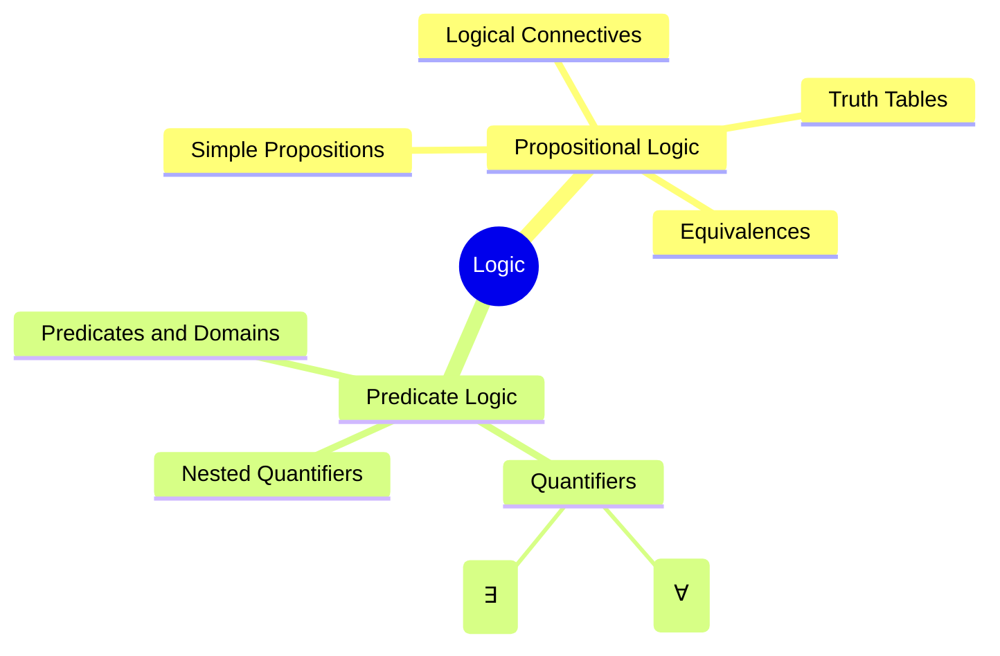

# 🧠 Discrete Mathematics – Propositional and Predicate Logic

> [!overview]
> This lecture covers the foundations of **propositional** and **predicate logic**, exploring logical connectives, truth tables, quantifiers, equivalences, and translation between natural language and formal logic. It also introduces De Morgan’s laws, nested quantifiers, and logical reasoning used in proofs and algorithms.

---

## 🔗 Continuity with Previous Lectures
This lecture builds on the foundations of mathematical reasoning introduced earlier.  
It extends simple propositions into **compound and quantified statements**, preparing for formal proofs and inference rules.

---

## 1. Propositional Logic 🟢

> [!note]
> A **proposition** is a declarative sentence that is **either true or false**, but not both.

### Examples
> [!example]
> ✅ “Washington, D.C. is the capital of the USA.”  
> ❌ “Sit down!” (not a proposition)

---

### 1.1 Constructing Propositions

- **Propositional Variables:** \( p, q, r, s, \dots \)
- **Always True:** \( T \)
- **Always False:** \( F \)
- **Compound Propositions:** Formed using **logical connectives**

#### Precedence of Operators
| Symbol | Operator | Priority |
|---------|-----------|-----------|
| ¬ | Negation | 1 |
| ∧ | Conjunction | 2 |
| ∨ | Disjunction | 3 |
| → | Implication | 4 |
| ↔ | Biconditional | 5 |

> [!tip]
> **Mnemonic:** “Not-And-Or-If-Iff” = Negation → Conjunction → Disjunction → Implication → Biconditional.

---

## 2. Logical Connectives 🟢

### 2.1 Negation (¬)
| p | ¬p |
|---|----|
| T | F |
| F | T |

> [!example]
> If \( p \): “The earth is round,” then \( ¬p \): “The earth is not round.”

---

### 2.2 Conjunction (∧)
| p | q | p ∧ q |
|---|---|-------|
| T | T | T |
| T | F | F |
| F | T | F |
| F | F | F |

---

### 2.3 Disjunction (∨)
| p | q | p ∨ q |
|---|---|-------|
| T | T | T |
| T | F | T |
| F | T | T |
| F | F | F |

---

### 2.4 Implication (→)
| p | q | p → q |
|---|---|--------|
| T | T | T |
| T | F | F |
| F | T | T |
| F | F | T |

> [!note]
> “If p then q” is **false only** when p is true and q is false.

---

### 2.5 Biconditional (↔)
| p | q | p ↔ q |
|---|---|-------|
| T | T | T |
| T | F | F |
| F | T | F |
| F | F | T |

---

### 2.6 Exclusive OR (⊕)
| p | q | p ⊕ q |
|---|---|------|
| T | T | F |
| T | F | T |
| F | T | T |
| F | F | F |

> [!example]
> “You can choose soup or salad” ⇒ one, but not both.

---

## 3. Converse, Inverse, and Contrapositive 🟡

| Form | Expression | Example |
|------|-------------|----------|
| **Converse** | \( q → p \) | “If I’m not going to town, then it’s raining.” |
| **Inverse** | \( ¬p → ¬q \) | “If it’s not raining, I’ll go to town.” |
| **Contrapositive** | \( ¬q → ¬p \) | “If I go to town, then it’s not raining.” |

---

## 4. Propositional Equivalences 🟡

### 4.1 Tautology, Contradiction, Contingency
> [!note]
> - **Tautology:** always true (e.g., \( p ∨ ¬p \))  
> - **Contradiction:** always false (e.g., \( p ∧ ¬p \))  
> - **Contingency:** sometimes true, sometimes false.

---

### 4.2 Common Equivalences

$$
¬(p ∨ q) ≡ (¬p ∧ ¬q)
$$
$$
p → q ≡ ¬p ∨ q
$$
$$
p ∨ (q ∧ r) ≡ (p ∨ q) ∧ (p ∨ r)
$$

> [!example]
> Prove: \( ¬(p → q) ≡ p ∧ ¬q \)  
> $$¬(p → q) = ¬(¬p ∨ q) = p ∧ ¬q$$

---

## 5. Predicate Logic 🔴

> [!note]
> **Predicate Logic** introduces variables and quantifiers to express relations and properties.

### 5.1 Structure
- **Variables:** \( x, y, z \)
- **Predicates:** \( P(x), Q(x,y) \)
- **Domains:** Define the set of values variables can take.

Example:
> “All men are mortal.” → \( ∀x (Man(x) → Mortal(x)) \)

---

## 6. Quantifiers 🟡

| Quantifier | Symbol | Reads As | Meaning |
|-------------|---------|----------|----------|
| **Universal** | ∀ | “For all x” | True for every element |
| **Existential** | ∃ | “There exists x” | True for at least one element |

---

### 6.1 Negating Quantifiers

| Original | Equivalent Negation |
|-----------|--------------------|
| \( ¬∀x P(x) \) | \( ∃x ¬P(x) \) |
| \( ¬∃x P(x) \) | \( ∀x ¬P(x) \) |

> [!tip]
> **Mnemonic:** “Flip the quantifier and negate inside.”

---

### 6.2 Examples

> [!example]
> “Every student took Java.” → \( ∀x(S(x) → J(x)) \)  
> “Some student took Java.” → \( ∃x(S(x) ∧ J(x)) \)

---

## 7. Nested Quantifiers 🔴

Example: “Every real number has an inverse.”  
$$∀x ∃y (x + y = 0)$$

> [!warning]
> The **order of quantifiers** changes meaning:  
> \( ∀x ∃y Q(x,y) ≠ ∃y ∀x Q(x,y) \)

---

### 7.1 Negating Nested Quantifiers

> [!example]
> Original: \( ∃w ∀a ∃f (P(w,f) ∧ Q(f,a)) \)  
> Negated: \( ∀w ∃a ∀f (¬P(w,f) ∨ ¬Q(f,a)) \)

![[Pasted image 20251025192100.png]]
---

## 🧩 Hands-On Practice

> [!question]
> Construct a truth table for \( (p ∨ q) → ¬r \).

| p | q | r | ¬r | p ∨ q | (p ∨ q) → ¬r |
|---|---|---|----|--------|----------------|
| T | T | T | F | T | F |
| T | F | F | T | T | T |
| F | T | F | T | T | T |
| F | F | T | F | F | T |

> [!tip]
> To validate equivalence, compare the last columns of two formulas.

---

## 🧭 Concept Hierarchy Diagram

---

## 📗 Glossary

|Term|Definition|
|---|---|
|**Proposition**|A declarative sentence that is true or false.|
|**Predicate**|A logical function expressing a property or relation.|
|**Quantifier**|A symbol specifying variable scope (∀, ∃).|
|**Tautology**|A statement true under all truth assignments.|
|**Contrapositive**|( ¬q → ¬p ) form of ( p → q ).|

---

## 🧾 Key Takeaways

- Logic formalizes reasoning using symbols and truth values.
    
- Compound statements are analyzed via connectives and truth tables.
    
- Predicate logic extends reasoning to variables and domains.
    
- Quantifier order critically affects meaning.
    
- De Morgan’s and implication laws simplify proofs.
    

---

## 🧠 Quick Review Card

|Q|A|
|---|---|
|What is a proposition?|A statement that is either true or false.|
|When is ( p → q ) false?|When p is true and q is false.|
|What does ( ∀x P(x) ) mean?|P(x) holds for all x in the domain.|
|Negate ( ∃x P(x) ).|( ∀x ¬P(x) ).|
|Difference between ( ∀x ∃y ) and ( ∃y ∀x )?|The order changes the scope of truth evaluation.|

---

## 📚 Further Resources

- Kenneth H. Rosen, _Discrete Mathematics and Its Applications_, 7th Edition.
    
- MIT OCW 6.042J – Mathematics for Computer Science.
    
- Brilliant.org – _Logic Fundamentals_ interactive modules.