# 🧠 Logic Design – Digital Systems and Binary Numbers

> [!note]
> This lecture introduces **digital systems**, **binary representation**, and **number base conversions**.  
> It establishes foundational concepts for understanding how data is represented, processed, and converted in digital logic circuits.

---

## 📘 Overview

- Define **Logic Design** and its relevance to modern computing.  
- Explain **Digital vs Analog systems**.  
- Study **Number Systems**: Decimal, Binary, Octal, and Hexadecimal.  
- Learn **conversion techniques** between bases.  
- Practice applied examples and unit representations (K, M, G, T).

---

## 🧩 Continuity with Previous Lectures
This is **Lecture 1**, the foundation for all later topics (Boolean algebra, minimization, combinational and sequential circuits).

---

## 🧱 1. Logic Design Fundamentals

> [!note]
> **Logic Design** is the process of determining the arrangement of **digital logic components** and their **interconnections** to perform specific computational or control functions.

### What is Design?
- Structured method to solve problems while meeting constraints (size, cost, power).

### Why Study Logic Design?
- It is the **first step** toward understanding computer architectures.
- Forms the **basis** of all computing and control devices.
- Enables development of microprocessors, memory, and networking technologies.

🟢 **Basic**

---

## 🔢 2. Digital Systems

> [!note]
> **Digital systems** represent and manipulate **discrete elements** of information.

Examples:
- Decimal digits: {0–9}  
- Alphabet letters: {A–Z}  
- Chessboard squares: {1–64}

🟢 **Basic**

---

## 🌊 3. Analog vs Digital Signals

| Type | Description | Representation |
|------|--------------|----------------|
| **Analog** | Continuous variation over a range | Voltage/time curve |
| **Digital** | Discrete values only | Steps or pulses |

> [!example]
> **Analog signal:** sound wave, temperature change  
> **Digital signal:** binary voltage levels (0 V = Logic 0, 5 V = Logic 1)

🟢 **Basic**

---

## 💡 4. Binary Digital Signals

- Two levels (0 or 1)
- Represented as:
  - Digits: **0, 1**
  - Logical states: **False/True**, **Low/High**, **Off/On**

> [!note]
> A **bit** is a single binary digit.  
> Multiple bits form **bytes**, **words**, and **addresses** in digital systems.

🟡 **Intermediate**

---

## 🔣 5. Number Systems Overview

| System | Base | Digits Used | Example | Notation |
|--------|------|-------------|----------|-----------|
| Decimal | 10 | 0–9 | (7392)₁₀ | ( )₁₀ |
| Binary | 2 | 0–1 | (11010)₂ | ( )₂ |
| Octal | 8 | 0–7 | (257)₈ | ( )₈ |
| Hexadecimal | 16 | 0–9, A–F | (B65F)₁₆ | ( )₁₆ |

> [!tip]
> **Rule:** Base = number of unique digits (from 0 to base − 1).

🟢 **Basic**

---

## 🧮 6. Decimal Number System (Base 10)

- Base (radix) = 10  
- Digits: {0 – 9}
- **Value = ∑ (Digit × $10^{Position}$ )**

> [!example]
> $(7392)_{10} = 7×10^3 + 3×10^2 + 9×10^1 + 2×10^0 = 7392$

🟢 **Basic**

---

## ⚙️ 7. Binary Number System (Base 2)

- Base (radix) = 2  
- Digits: {0, 1}
- **Value = ∑ (Digit × $2^{Position}$ )**

> [!example]
> $(11010.11)_2 = 16 + 8 + 2 + 0.5 + 0.25 = (26.75)_{10}$

> [!tip]
> Remember “**$2^n$**” rule: each bit position doubles in weight from right to left.

🟢 **Basic**

---

## 🔢 8. Octal and Hexadecimal Systems

### Octal (Base 8)
- Digits: {0–7}
- Each octal digit = **3 binary bits**

> [!example]
> $(127.4)_8 = 1×8^2 + 2×8^1 + 7×8^0 + 4×8^-1 = (87.5)_{10}$

### Hexadecimal (Base 16)
- Digits: {0–9, A–F}
- Each hex digit = **4 binary bits**

> [!example]
> $(B65F)_{16} = 11×16^3 + 6×16^2 + 5×16^1 + 15×16^0 = (46,687)_{10}$

🟡 **Intermediate**

---

## 🔁 9. Number Base Conversions

| Conversion | Method |
|-------------|---------|
| Decimal → Binary | Divide by 2 repeatedly (record remainders) |
| Decimal → Octal | Divide by 8 repeatedly |
| Decimal → Hex | Divide by 16 repeatedly |
| Fractional Conversion | Multiply by base repeatedly (record integers) |

> [!example]
> **Decimal → Binary**  
> $(13)_{10}$ ÷ 2 → Remainders (1,0,1,1)  
> **Answer:** $(1101)_2$

> [!example]
> **Fractional Conversion:**  
> $(0.625)_{10}$ → Multiply by 2: 0.625×2=1.25 → 0.25×2=0.5 → 0.5×2=1 →  
> **Answer:** $(0.101)_2$

🟡 **Intermediate**

---

## 🔗 10. Integer-base Conversions

### Binary ↔ Octal  
- Group bits in **3s**
> [!example]
> $(010110.010)_2 = (26.2)_8$

### Binary ↔ Hexadecimal  
- Group bits in **4s**
> [!example]
> $(10110.01)_2 = (16.4)_{16}$

### Octal ↔ Hexadecimal  
- Convert via **binary intermediate**

> [!warning]
> Always **pad with leading/trailing zeros** to form complete bit groups.

🟡 **Intermediate**

---

## 🧠 11. Binary System Units
> Digits in a binary number are called bits.

Computer capacity is usually given in bytes. A byte is equal to
eight bits and can accommodate

| Unit  | Power of 2   | Bytes                            | also     |
| ----- | ------------ | -------------------------------- | -------- |
| $2^0$ | Bit          | 0,1                              |          |
| $2^3$ | Byte         | 8 bits                           |          |
| 2¹⁰   | KiloByte (K) | 1 Kb = 1024 *bytes*              |          |
| 2²⁰   | MegaByte (M) | 1 Mb = 1,048,576 *bytes*         | 1024 Kb  |
| 2³⁰   | GigaByte (G) | 1 Gb = 1,073,741,824 *bytes*     | 1024  Mb |
| 2⁴⁰   | TeraByte (T) | 1 Tb = 1,099,511,627,776 *bytes* | 1024 Gb  |
### Binary system range
>from **0** to $2^{\ Number\ of\ bits } - 1$ 

![[Pasted image 20251101114331.png]]

🟢 **Basic**

---

## 🧩 Hands-On Practice

> [!question]
> Convert the following:
> 1. (41)₁₀ → Binary  
> 2. (153)₁₀ → Octal  
> 3. (0.6875)₁₀ → Binary  
> 4. (0.513)₁₀ → Octal  
> 5. (01101011.111100)₂ → Octal and Hexadecimal  
> 6. (673.12)₈ → Binary  
> 7. (306.D)₁₆ → Binary

🟢 **Basic → Intermediate**

---

## 🧭 Concept Hierarchy Diagram

```mermaid
mindmap
  root((Number Systems))
    Digital Systems
      Binary System
        Conversion
          Decimal ↔ Binary
          Binary ↔ Octal
          Binary ↔ Hexadecimal
      Octal System
      Hexadecimal System
    Signal Types
      Analog
      Digital
```

---

## 📖 Glossary

|Term|Definition|
|---|---|
|**Bit**|Binary digit (0 or 1)|
|**Byte**|8 bits|
|**Radix/Base**|Number of unique digits in a number system|
|**LSB/MSB**|Least/Most Significant Bit|
|**Kilo/Mega/Giga/Tera**|Binary-based measurement units|
|**Hexadecimal**|Base-16 system using 0–9, A–F|

---

## 🏁 Key Takeaways

- Logic Design underlies all digital computing.
    
- Binary is the foundation of digital representation.
    
- Base conversions rely on division or multiplication by base.
    
- Octal = 3-bit groups; Hex = 4-bit groups.
    
- Always check digit group alignment when converting.
    

---

## 🧠 Quick Review Card

|Q|A|
|---|---|
|What is the base of the binary system?|2|
|How many bits are in a byte?|8|
|What does each hex digit represent in binary?|4 bits|
|How do you convert (13)₁₀ to binary?|Divide by 2 → (1101)₂|
|What is (B65F)₁₆ in decimal?|46,687|

---

## 📚 Further Resources

- _Digital Design_, 5th Edition — M. Morris Mano & Michael Ciletti
    
- MIT OpenCourseWare: [Digital Systems Lectures](https://ocw.mit.edu/)
    
- YouTube: Neso Academy – Digital Electronics
    
- _Logic and Computer Design Fundamentals_, Mano & Kime
    

---