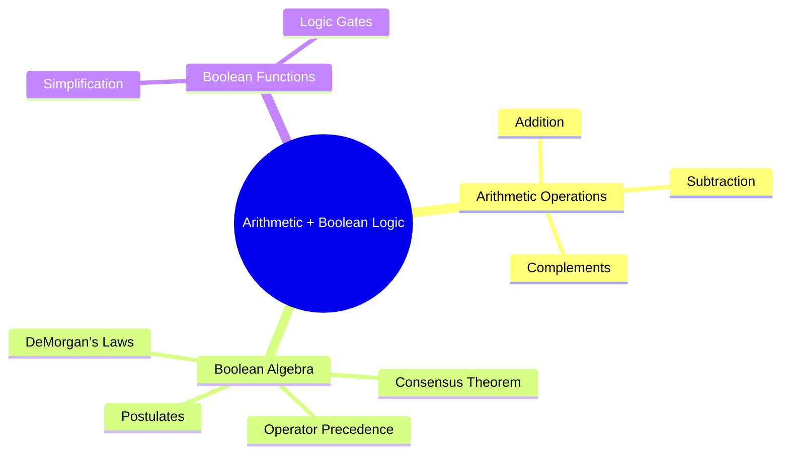

# 🧠 Logic Design – Arithmetic Operations, Boolean Algebra, and Logic Gates

> [!note]  
> This lecture introduces arithmetic operations in various number systems, complements in binary arithmetic, and foundational principles of Boolean algebra and logic gates used in digital circuit design.

---

## 🔗 Continuity with Previous Lectures

> [!note]  
> Builds upon number system concepts introduced earlier, extending them to arithmetic operations, complements, and their logical implementation using Boolean algebra.

---

## 1. Arithmetic Operations 🧮

### 1.1 Addition

> [!note]  
> Arithmetic in base-r systems follows the same rules as decimal but with digits limited to r-allowable values.

**Rule:**  
When the sum of a column ≥ base, subtract multiples of the base and carry one to the next column.

#### Binary Addition Rules

|Operation|Result|Carry|
|---|---|---|
|0 + 0|0|0|
|0 + 1 / 1 + 0|1|0|
|1 + 1|0|1|
|1 + 1 + 1|1|1|

> [!example]  
> Example:  
> $110111_2 + 011100_2 = 1011011_2$

---

### 1.2 Subtraction

> [!note]  
> In binary subtraction, borrow from the left column when needed. The borrowed value equals the base (2).

> [!example]  
> Example:  
> $110011_2 - 11100_2 = 100111_2$

---

### 1.3 Operations in Other Bases

|Base|Example|Description|
|---|---|---|
|Octal|375₈ + 465₈|Use base-8 digits (0–7)|
|Hexadecimal|A7₁₆ + F5₁₆|Use base-16 digits (0–9, A–F)|

---

## 2. Complements 🔁

> [!note]  
> Complements simplify subtraction and error detection in digital systems.

### 2.1 Diminished Radix Complement (r−1)’s Complement

Formula:  
$$(r^n − 1) − N$$

### 2.2 Radix Complement (r’s Complement)

Formula:  
$$r^n − N = [(r^n − 1) − N] + 1$$

---

### 2.3 Binary Complements

#### 1’s Complement (Diminished Radix)

> [!note]  
> Flip all bits: 0 → 1, 1 → 0.

> [!example]  
> (10110000)₂ → (01001111)₂

#### 2’s Complement (Radix)

> [!note]  
> Take the 1’s complement and add 1.

> [!example]  
> Number: 01010000  
> 1’s Comp: 10101111  
> 2’s Comp: 10110000

> [!tip]  
> **Mnemonic:** “Flip all bits, then add one.”

---

### 2.4 Subtraction Using Complements

#### Using 1’s Complement

1. Take 1’s complement of subtrahend.
    
2. Add it to the minuend.
    
3. If carry → add it to LSB.
    
4. If no carry → take 1’s complement of the result and prefix a negative sign.
    

#### Using 2’s Complement

1. Take 2’s complement of subtrahend.
    
2. Add it to the minuend.
    
3. If carry → discard.
    
4. If no carry → take 2’s complement of result and prefix a negative sign.
    

---

## 3. Boolean Algebra and Logic Gates ⚙️

> [!note]  
> Boolean algebra provides a mathematical foundation for digital circuit simplification and logical analysis.

### 3.1 Definition of Algebra

- **Algebra:** Set of elements, operators, and axioms.
    
- **Binary operators:** Two inputs (AND, OR).
    
- **Unary operator:** One input (NOT).
    

---

### 3.2 Boolean Algebra

Developed by **George Boole (1854)**, formalized by **Huntington (1904)**.

**Set:** B = {0, 1}  
**Operations:** ( + ) for OR, ( · ) for AND

> [!note]  
> **Literal:** Variable or its complement.  
> **Product term:** literals connected by (·).  
> **Sum term:** literals connected by (+).

---

### 3.3 Postulates of Boolean Algebra 🟢 Basic

|Property|Expression|Description|
|---|---|---|
|Closure|Valid for + and ·|Operations stay in set B|
|Identity|x + 0 = x, x·1 = x|Identity elements|
|Complement|x + x’ = 1, x·x’ = 0|Negation rules|
|Commutative|x + y = y + x|Order doesn’t matter|
|Associative|(x + y) + z = x + (y + z)|Grouping doesn’t matter|
|Distributive|x·(y + z) = (x·y) + (x·z)|AND distributes over OR|

---

### 3.4 Duality Principle 🟡 Intermediate

> [!note]  
> Swap OR ↔ AND and 0 ↔ 1 in any valid expression to obtain another valid one.

---

### 3.5 DeMorgan’s Theorems 🟡 Intermediate

|Law|Expression|Dual Form|
|---|---|---|
|First|(x + y)’ = x’y’|—|
|Second|(x·y)’ = x’ + y’|—|

> [!example]  
> Truth table verification confirms both expressions are equivalent.

---

### 3.6 Consensus Theorem 🟡 Intermediate

$$xy + x’z + yz = xy + x’z$$

> [!tip]  
> **Simplification Rule:** Redundant term yz can be eliminated.

> [!Mnemonic]
> When one term uses **x** and another uses **x′**,
>  the **common friend (y z)** is **useless**.

---

### 3.7 Operator Precedence

1. Parentheses
    
2. NOT (')
    
3. AND (·)
    
4. OR (+)
    

> [!example]  
> $x·y’ + z$ → Evaluate NOT, then AND, then OR.

---

## 4. Boolean Functions 🔴 Advanced

> [!note]  
> Boolean functions describe logical relationships using binary variables and operations.

Example:  
$$F_1 = xyz', \quad F_2 = x + y'z, \quad F_3 = x'y'z + x'yz + xy'$$

### Representations

|Type|Description|
|---|---|
|Boolean Expression|Many equivalent forms|
|Truth Table|Unique representation|
|Logic Diagram|Multiple possible implementations|

---

### Simplification Examples

1. $F = x(x' + y) = xy$
    
2. $F = x + x'y = (x + y)$
    
3. $F = (x + y)(x + y') = x$
    
4. $F = xy + x’z + yz = xy + x’z$
    

> [!tip]  
> Apply **Consensus Theorem** and **DeMorgan’s Laws** for simplification.

---

## 5. Logic Gates and Implementation 🧩

> [!note]  
> Logic gates are physical implementations of Boolean operations.

|Gate|Symbol|Expression|Truth Table|
|---|---|---|---|
|AND|`·`|F = A·B|1 only if both inputs are 1|
|OR|`+`|F = A + B|1 if any input is 1|
|NOT|`'`|F = A’|Inverts input|
|NAND|—|F = (A·B)’|Inverted AND|
|NOR|—|F = (A + B)’|Inverted OR|
|XOR|⊕|F = A⊕B|1 if inputs differ|
|XNOR|—|F = (A⊕B)’|1 if inputs match|

---

---

## 🧩 Hands-On Practice

1. Add $1011_2 + 111_2$ using binary rules.
    
2. Compute 2’s complement of $00101100_2$.
    
3. Simplify $(x + y)(x + y')$.
    
4. Verify DeMorgan’s law with a truth table.
    
5. Draw the logic circuit for $F = x'y + xz'$.
    

---

## 📚 Glossary

|Term|Definition|
|---|---|
|**Boolean Algebra**|Algebraic structure over {0,1} with logical operators.|
|**Complement**|Bitwise inversion of binary values.|
|**Logic Gate**|Hardware that implements a Boolean operation.|
|**Radix**|The base of a number system.|
|**Literal**|A variable or its complement in an expression.|

---

## 🧩 Key Takeaways

- Arithmetic in non-decimal systems follows consistent base-r rules.
    
- Complements simplify binary subtraction and representation of negative numbers.
    
- Boolean algebra formalizes logical reasoning for circuit design.
    
- DeMorgan’s and Consensus theorems aid in circuit simplification.
    
- Logic gates implement Boolean functions physically.
    

---

## 🧠 Quick Review Card

|Q|A|
|---|---|
|What is the 2’s complement of 1011₂?|0101₂|
|Which has higher precedence: AND or OR?|AND|
|Define Boolean algebra.|System of logical operations over binary values.|
|What is DeMorgan’s first law?|(x + y)’ = x’y’|
|Purpose of complements in binary arithmetic?|Simplify subtraction and represent negatives.|

---

## 📖 Further Resources

- M. Morris Mano, _Digital Design_, 6th Edition
    
- Floyd, _Digital Fundamentals_
    
- Khan Academy: _Binary Arithmetic and Boolean Algebra_
    
- Neso Academy (YouTube): _Logic Gates and Boolean Simplification_