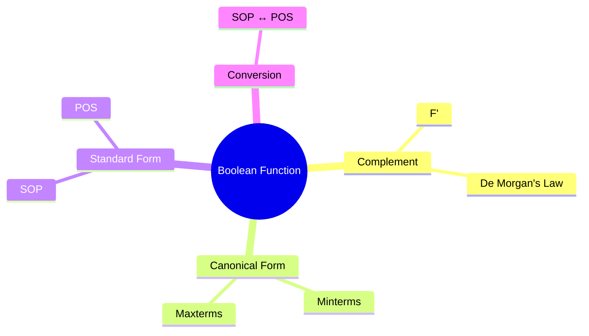
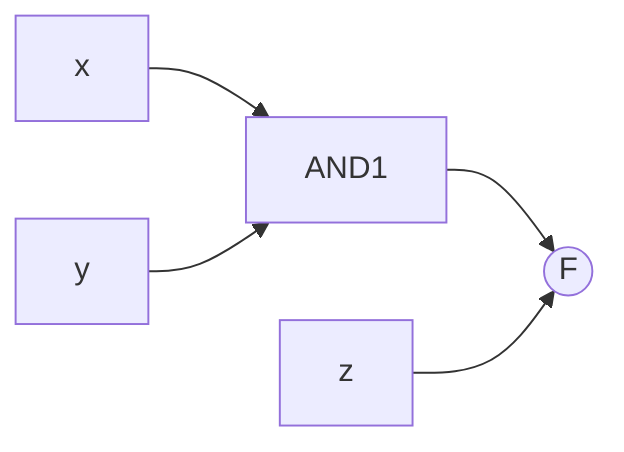

# 🧠 Logic Design – Boolean Algebra and Logic Gates

> [!note] **Overview**  
> This lecture explains **Boolean function complementation**, **canonical and standard forms**, **minterms**, **maxterms**, and **conversion between SOP and POS**. It introduces methods for expressing and simplifying Boolean functions for digital circuit design.

---

## 🔄 Complement of a Boolean Function

> [!note]  
> **Definition:**  
> The **complement** of a Boolean function **F**, denoted **F′**, is obtained by interchanging **0 ↔ 1** in the output of F.

|x|y|z|F|F′|
|---|---|---|---|---|
|0|0|0|0|1|
|0|0|1|1|0|
|0|1|0|1|0|
|0|1|1|1|0|
|1|0|0|0|1|
|1|0|1|0|1|
|1|1|0|1|0|
|1|1|1|0|1|

> [!example]  
> **Generalization using De Morgan’s laws:**
> 
> - If $F = A + B + C$, then $F' = A'B'C'$
>     
> - If $F = ABC$, then $F' = A' + B' + C'$
>     

### Worked Examples

> [!example]  
> **Example 1**  
> $F_1 = x′yz′ + x′y′z$  
> $F_1′ = (x + y′ + z)(x + y + z′)$
> 
> **Example 2**  
> $F_2 = x(y′z′ + yz)$  
> $F_2′ = x′ + yz′ + y′z$

---

## 🧩 Canonical and Standard Forms

> [!note]  
> **Canonical Form:**  
> Boolean functions expressed as a **sum of minterms (SOP)** or a **product of maxterms (POS)**.  
> Each term contains **all variables**, either in true or complemented form.

### Example: Truth Table Construction

|x|y|Function|Result|
|---|---|---|---|
|0|0|x′y′|1|
|0|1|x′y|1|
|1|0|xy′|1|
|1|1|xy|1|

Thus:  
$$ F = x′y′ + x′y + xy′ + xy = 1 $$

---

### Minterms

> [!note]  
> A **minterm** (standard product) is an **AND** term of all variables in either normal or complemented form.  
> For n variables, there are $2^n$ possible minterms.

|x|y|Term|Symbol|
|---|---|---|---|
|0|0|x′y′|m₀|
|0|1|x′y|m₁|
|1|0|xy′|m₂|
|1|1|xy|m₃|

**Sum of Minterms:**  
$$ F = \Sigma(m_0, m_1, m_3) = x′y′ + x′y + xy $$

---

### Maxterms

> [!note]  
> A **maxterm** (standard sum) is an **OR** term containing all variables.  
> There are also $2^n$ maxterms.

|x|y|Term|Symbol|
|---|---|---|---|
|0|0|(x + y)|M₀|
|0|1|(x + y′)|M₁|
|1|0|(x′ + y)|M₂|
|1|1|(x′ + y′)|M₃|

---

## ⚖️ Relationship Between Minterms and Maxterms

> [!note]
> 
> - Each **maxterm** is the **complement** of its corresponding **minterm**.
>     
> - $m_i' = M_i$
>     

> [!example]  
> $F = \Sigma(m_1, m_4, m_7) = x′y′z + xy′z′ + xyz$  
> $F = Π(M₀, M₂, M₃, M₅, M₆) = (x+y+z)(x+y′+z)(x′+y+z′)(x′+y′+z)$

---

## 🔁 Conversions Between Canonical Forms

> [!note]  
> To convert between forms:
> 
> - From **SOP → POS**: list missing indices, change Σ to Π
>     
> - From **POS → SOP**: list missing indices, change Π to Σ
>     

|Function|SOP|POS|
|---|---|---|
|F(x,y,z)|Σ(1,3,6,7)|Π(0,2,4,5)|
|F′(x,y,z)|Σ(0,2,4,5)|Π(1,3,6,7)|

---

## ⚙️ Canonical vs. Standard Forms

|Canonical Form|Standard Form|
|---|---|
|All variables appear in each term|Not all variables required|
|Used in truth table derivation|Used for simplification|
|Two-level circuit (AND–OR or OR–AND)|Compact, practical circuits|

---

## 🧮 Nonstandard to Standard and Canonical

> [!example]  
> Given $F = AB + C(B + A)$
> 
> - **Standard Form:** $F = AB + AC + BC$
>     
> - **Canonical Form:** $F = ABC + ABC′ + A′BC + AB′C$
>     

> [!tip]  
> Standard form enables **two-level circuit design**, simplifying hardware implementation.

---

## 💡 Implementation Diagrams

> [!example]  
> **Logic Diagram Types**
> 
> - **SOP (Sum of Products):** AND → OR
>     
> - **POS (Product of Sums):** OR → AND
>     

![[Pasted image 20251101135538.png]]

---

## 🧩 Hands-On Practice

1. Find F′ for $F = x′yz′ + x′y′z$.
    
2. Derive canonical SOP for $F = x + y′z$.
    
3. Convert $F = Σ(1,4,5,6,7)$ to its POS form.
    
4. Express $F = A + B′C$ as both Σ and Π canonical forms.
    
5. Build logic circuit for $F = (x+y)(x+y′)$.
    

---

## 📚 Continuity with Previous Lectures

This lecture extends Boolean laws and gate behavior from Lecture 2. It formalizes function representation needed for **K-map simplification** and **digital circuit synthesis** in later topics.

---

## 🧾 Glossary

- **Minterm:** AND term that yields 1 for one specific input combination.
    
- **Maxterm:** OR term that yields 0 for one specific input combination.
    
- **Canonical Form:** Expression where every term includes all variables.
    
- **Standard Form:** Simplified SOP or POS expression.
    
- **De Morgan’s Law:** Converts complement of AND ↔ OR.
    

---

## 🎯 Key Takeaways

- Boolean functions can be expressed as **SOP (Σ)** or **POS (Π)**.
    
- Each **minterm ↔ unique combination** where F=1.
    
- Each **maxterm ↔ unique combination** where F=0.
    
- **Complementation** interchanges Σ and Π lists.
    
- **Canonical → Standard → Simplified** → efficient hardware design.
    

---

## 🧠 Quick Review Card

|Q|A|
|---|---|
|What is a minterm?|AND of all literals for one truth table row that yields 1.|
|How to find F′ from Σ?|Replace Σ with Π and list missing indices.|
|Relation between mᵢ and Mᵢ?|$m_i′ = M_i$|
|Why prefer standard form?|Enables two-level hardware realization.|
|Example of canonical SOP?|$F = Σ(1,4,5,6,7)$|

---

## 🔗 Further Resources

- M. Morris Mano, _Digital Design_, 6th Edition
    
- Floyd, _Digital Fundamentals_
    
- MIT OCW: _Digital Systems Lecture 3 – Boolean Algebra and Logic Gates_
    
- YouTube: “Karnaugh Maps and Canonical Forms Tutorial”