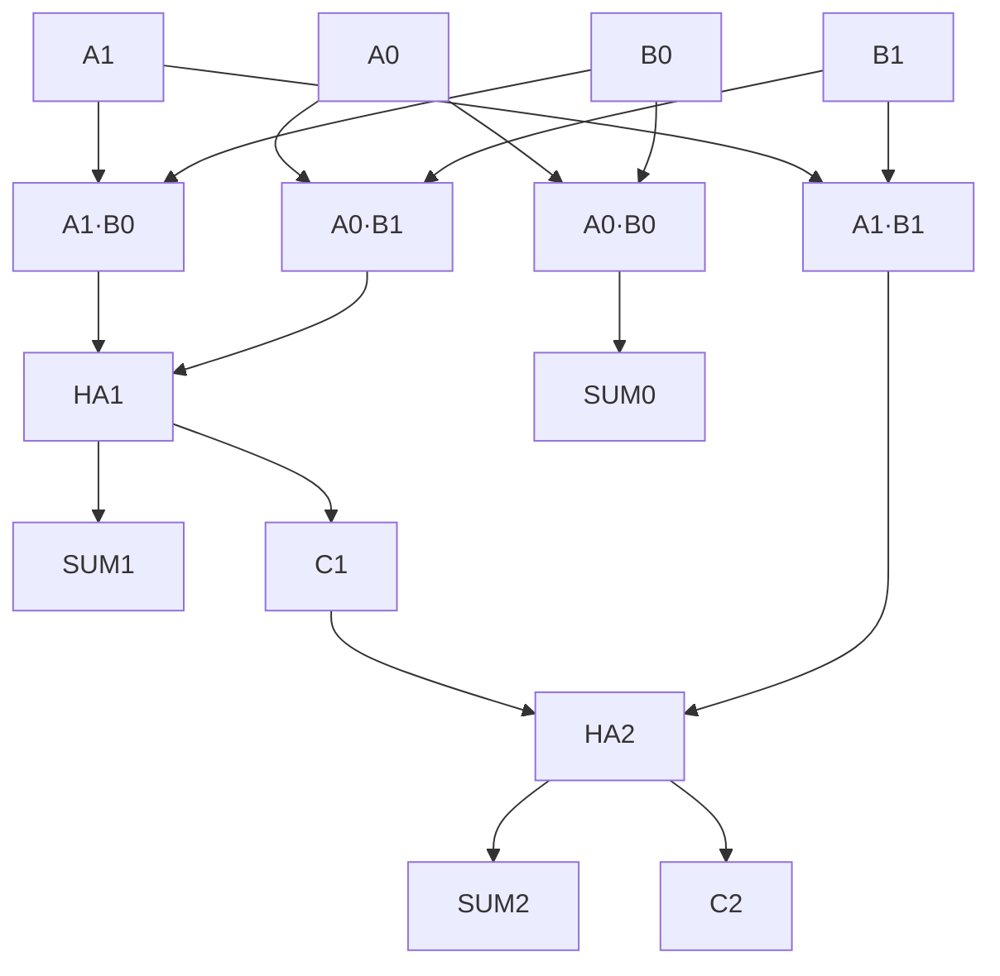
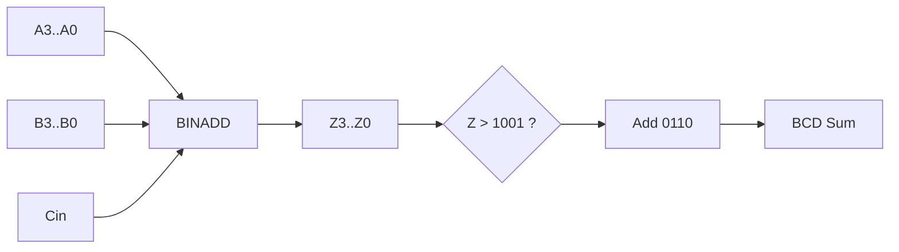
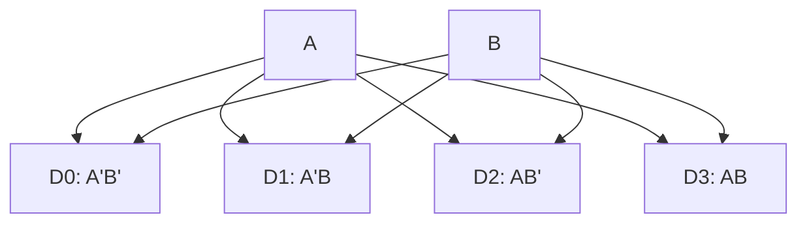
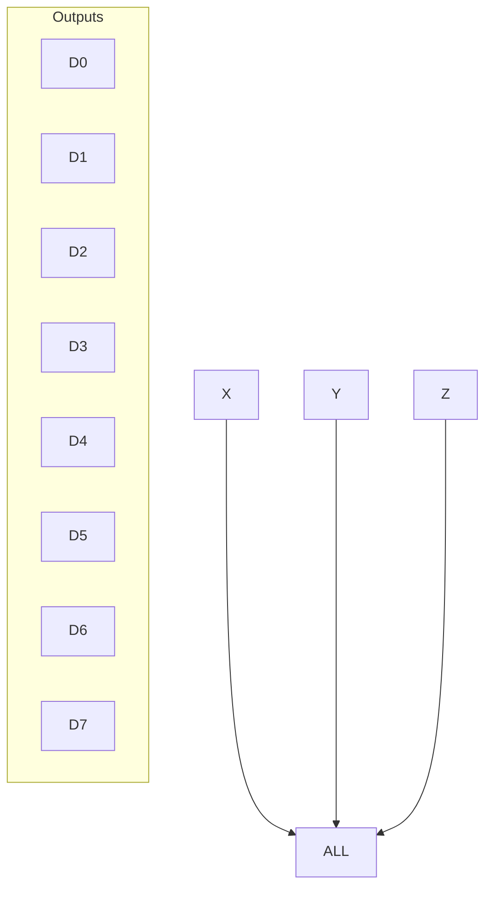
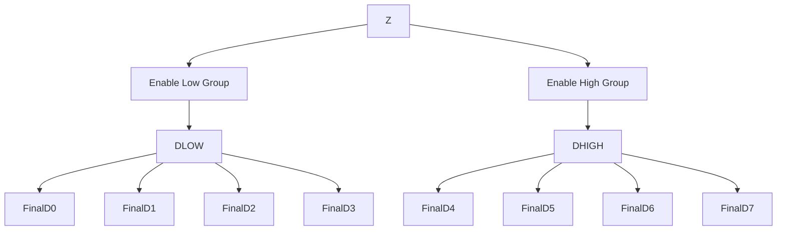
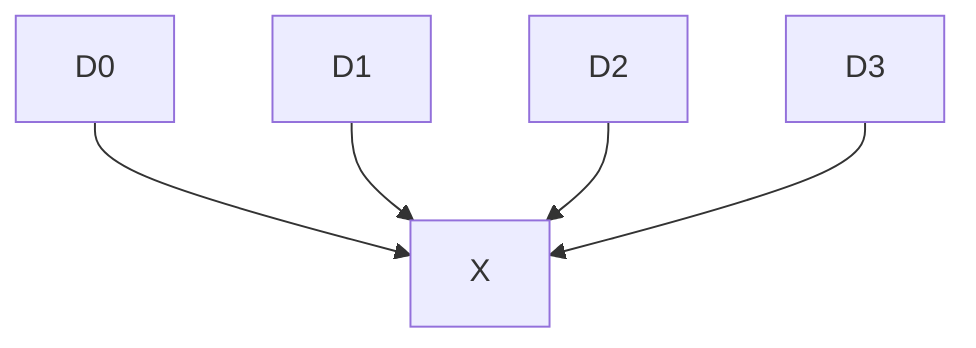
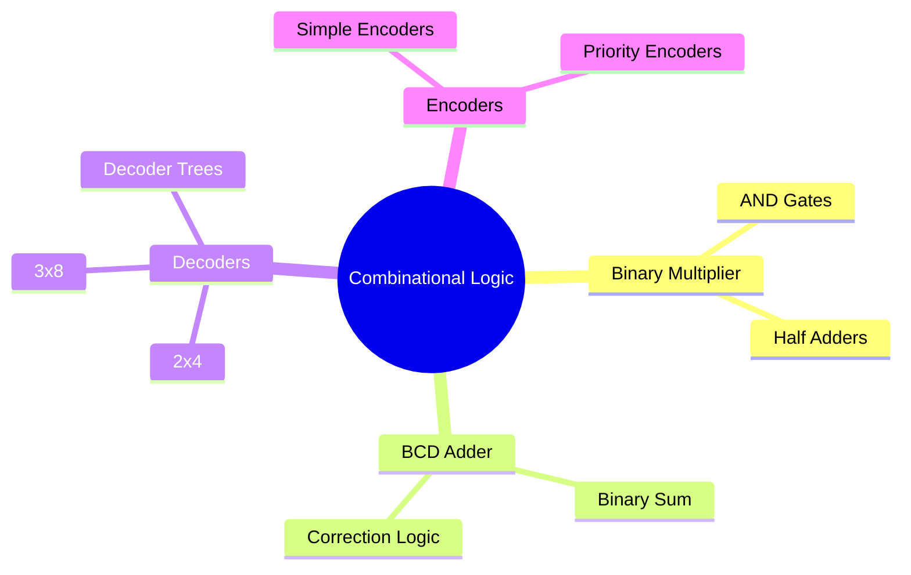

> [!note] **Overview**
> This lecture develops core combinational logic blocks used in digital systems, including **binary multipliers**, **BCD adders**, **decoders**, **encoders**, and **priority encoders**.  
> Emphasis is placed on structural design, minterm mapping, enable logic, and correctness constraints.

---

# Binary Multiplier  
🟡 Intermediate

## Two-Bit × Two-Bit Binary Multiplier

> [!note]
> Binary multiplication follows the same operational model as decimal multiplication:  
> **Multiply the multiplicand by each bit of the multiplier and shift accordingly.**

Given inputs:
- Multiplicand: **A1 A0**
- Multiplier: **B1 B0**

Partial products:
- **A0B0**, **A0B1**
- **A1B0**, **A1B1**

These enter **AND gates**, then **half adders** to accumulate carry.

## Diagram — Two-Bit Multiplier



## Worked Example

> [!example]  
> Multiply **A = 10₂ (2)** and **B = 11₂ (3)**.

Step-by-step:

1. Partial products
    
    - A0B0 = 0·1 = **0**
        
    - A0B1 = 0·1 = **0**
        
    - A1B0 = 1·1 = **1**
        
    - A1B1 = 1·1 = **1**
        
2. Add shifted products
    
    - Row1: 00
        
    - Row2: 11 (shifted left)
        
3. Binary addition
    
    ```
      11
    + 00
    ----
      11
    ```
    
4. Result = **11₂ = 3** (correct: 2×3=6 → 110₂ if full bits included)
    

---

# BCD Adder

🟡 Intermediate → 🔴 Advanced (correction rule)

## Core Rule

> [!note]  
> A BCD digit is valid only from **0000–1001**.  
> If the 4-bit binary sum exceeds **1001**, add **0110 (6)** to correct the digit.

### Correction Logic

The required correction signal:

$$ C = K + Z_8Z_4 + Z_8Z_2 $$

Where:

- **K** = carry-in
    
- **Z₈, Z₄, Z₂, Z₁** = binary adder outputs
    

## Diagram — BCD Adder



## Worked Example (Fully Expanded)

> [!example] **Add 9 (1001) + 7 (0111)**
> 
> 1. Binary addition
>     
>     ```
>        1001
>      + 0111
>      ------
>        10000
>     ```
>     
>     Result = **10000 (16)**
>     
> 2. Lower 4 bits = **0000**, carry = 1  
>     This exceeds 9 → must correct.
>     
> 3. Add 6
>     
>     ```
>        0000
>      + 0110
>      ------
>        0110
>     ```
>     
> 4. Final BCD result = **0001 | 0110** → “16”
>     
> 

---

# Decoders

🟢 Basic

> [!note]  
> An **n-to-2ⁿ decoder** asserts exactly one output high corresponding to the binary input.

## 2×4 Decoder Diagram
![[Pasted image 20251115202918.png]]



## 3×8 Decoder Diagram (Minterm Generator)
![[Pasted image 20251115202929.png]]


## Decoder Tree (Building Larger Decoders)

### 3×8 from 2×4 + 1×2



---

# Logic Implementation Using Decoders

🟡 Intermediate

### Example – Full Adder Implementation

S(x,y,z) = Σ(1,2,4,7)  
C(x,y,z) = Σ(3,5,6,7)

> [!note]  
> Select required minterms from the 3×8 decoder and OR them.

---

# Encoders

🟢 Basic

> [!note]  
> An encoder performs the inverse operation of a decoder: **2ⁿ inputs → n outputs**.

### Example: 4×2 Encoder

x = D2 + D3  
y = D1 + D3

Diagram:



---

# Priority Encoders

🟡 Intermediate → 🔴 Advanced

> [!note]  
> When multiple inputs are active, the encoder enforces **priority** (highest-order input wins).

## Problem in Simple Encoder

- If all inputs = 0 → output = 00
    
- If D0 = 1 → also outputs 00
    
- This ambiguity requires a **valid (V)** signal.
    

### 4-Input Priority Encoder Equations

$$  
x = D_2 + D_3  
$$  
$$  
y = D_3 + D_1D'_2  
$$  
$$  
V = D_0 + D_1 + D_2 + D_3  
$$

## Fully Worked Example (Truth Table Resolution)

> [!example]  
> Inputs: **D3=0, D2=1, D1=1, D0=1**

Highest priority = **D2**

1. Determine x  
    x = D2 + D3 = 1 + 0 = **1**
    
2. Determine y  
    y = D3 + D1·D’2  
    = 0 + 1·0 = **0**
    
3. Determine V  
    V = 1+1+1 = **1** (valid)
    

Output = **x y = 10**, V = **1**

---

# Continuity with Previous Lectures

This lecture extends the earlier study of **Boolean algebra** and **combinational design** by applying them to practical hardware blocks such as adders and decoders. The minterm-based design aligns with earlier K-map simplification techniques.

---

# 🧩 Hands-On Practice

1. Design a 2-bit × 2-bit multiplier using only AND gates and half adders.
    
2. For BCD: Compute **5 + 9** and perform correction.
    
3. Implement a Boolean function using a 3×8 decoder and OR gates.
    
4. Build the truth table of a 4-input priority encoder.
    

---

# Lecture Questions

(Extracted directly)

- “Are these all the input combinations?” (priority encoder slide)
    

---

# Difficulty Tags Summary

- Binary multiplier — 🟡
    
- BCD correction — 🔴
    
- Decoders — 🟢
    
- Encoders — 🟢
    
- Priority Encoder — 🟡/🔴
    

---

# Concept Hierarchy Diagram



---

# Glossary

- **BCD**: Binary-Coded Decimal.
    
- **Decoder**: Converts n-bit binary to 2ⁿ unique outputs.
    
- **Encoder**: Compresses 2ⁿ input lines into n outputs.
    
- **Priority Encoder**: Encoder with priority rules.
    
- **Minterm**: Input combination yielding output = 1.
    

---

# Key Takeaways

- Binary multipliers are structured using AND gates + adders.
    
- BCD addition requires correction when >1001.
    
- Decoders generate minterms and can implement entire functions.
    
- Encoders compress inputs; priority encoders add deterministic output selection.
    
- Enable signals allow hierarchical decoder construction.
    

---

# Quick Review Card

**Q:** When must you add 6 in BCD addition?  
**A:** When binary sum > 1001 or there is a carry out.

**Q:** How many outputs does a 4×2 encoder have?  
**A:** Two output bits.

**Q:** What is V in priority encoders?  
**A:** Indicates at least one valid input is active.

**Q:** What does a decoder generate?  
**A:** The 2ⁿ minterms of n inputs.

---

# Further Resources

- M. Morris Mano – _Digital Design_
    
- Roth & Kinney – _Fundamentals of Logic Design_
    
- Neso Academy Digital Logic video series