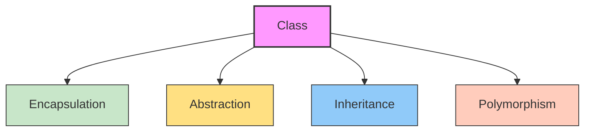
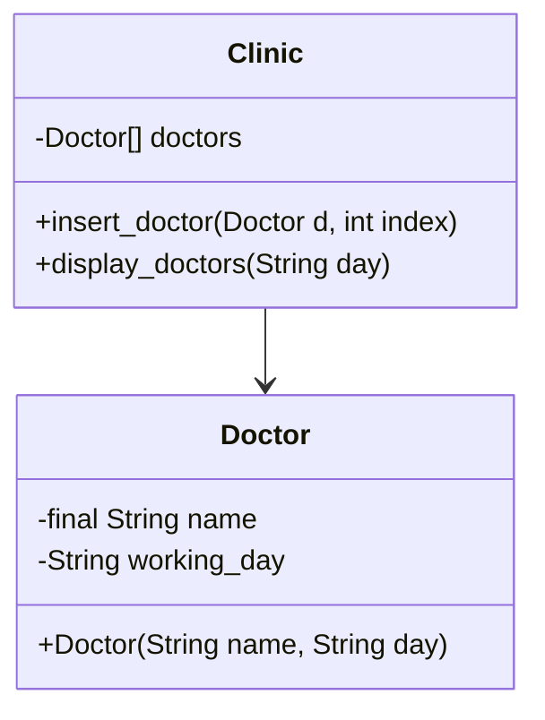

# 🧠 Object Oriented Programming – Lecture 2: Arrays, Control Structures, Classes, and Encapsulation

> [!overview]
> This lecture explores **arrays**, **control structures**, and the foundations of **Object-Oriented Programming (OOP)** in Java. Concepts include **loops**, **decision-making**, **classes**, **constructors**, and **encapsulation** with access and field modifiers.

---

## 🧩 Agenda

- Arrays in Java  
- Loops and Decision Making  
- Introduction to Object-Oriented Programming  
- Classes and Objects  
- Class Constructors  
- Encapsulation  
- Access and Field Modifiers  
- Hands-on Lab  

---

## 1. Arrays in Java

> [!note]
> Arrays in Java are **dynamically allocated**, allowing size determination at runtime.

### Declaration and Instantiation

1. **Variable Declaration**

```java
int myArr[];       // or int[] myArr;
int multiArr[][];  // or int[][] multiArr;
```

2. **Memory Allocation**
    

```java
myArr = new int[3];
multiArr = new int[2][3];
```

**General Syntax:**

```java
DataType[] variableName = new DataType[size];
```

---

## 2. Control Flow

### 🔁 Loops in Java

- **while loop**
    

```java
while (condition) {
    // statements
}
```

- **do-while loop**
    

```java
do {
    // statements
} while (condition);
```

- **for loop**
    

```java
for (int i = 0; i < N; i++) {
    // statements
}
```

- **foreach loop**
    

```java
for (DataType element : array) {
    // statements
}
```

### Decision Making in Java

- **if-else Statement**
    

```java
if (condition1) {
    // block 1
} else if (condition2) {
    // block 2
} else {
    // block 3
}
```

- **switch Statement**
    

```java
switch (expression) {
    case value1:
        // statements
        break;
    case value2:
        // statements
        break;
    default:
        // statements
}
```

> [!warning]  
> `break` is **optional**. If omitted, execution falls through to the next case.

---

## 3. Introduction to Object-Oriented Programming

### The Four Pillars of OOP

- **Encapsulation**
    
- **Abstraction**
    
- **Inheritance**
    
- **Polymorphism**
    



![[Pasted image 20251009203415.png]]
![[Pasted image 20251009203428.png]]
![[Pasted image 20251009203435.png]]

---

## 4. Classes and Objects

### Definition

- A **class** is a blueprint defining attributes and behaviors.
    
- An **object** is an instance of a class, occupying memory.
    

### Example: `Rectangle` Class

```java
public class Rectangle {
    int len, width;
    String color;

    // Default Constructor
    public Rectangle() {
        len = 0;
        width = 0;
        color = null;
    }

    // Method
    public void setColor(String color) {
        this.color = color;
    }
}
```

### Object Instantiation

```java
Rectangle myRect = new Rectangle();
```

---

## 5. Class Constructor

> [!note]  
> A **constructor** initializes an object when it is created.  
> It has the **same name as the class** and **no return type**.

### Types of Constructors

#### Default Constructor

```java
public Rectangle() {
    len = 0;
    width = 0;
    color = null;
}
```

#### Parameterized Constructor

```java
public Rectangle(int l, int w) {
    len = l;
    width = w;
    color = null;
}
```

#### Copy Constructor

```java
public Rectangle(Rectangle r) {
    len = r.len;
    width = r.width;
    color = r.color;
}
```

> [!warning]  
> If no constructor is defined, the **compiler** creates a default one.  
> If **any constructor** is defined, the compiler does **not** create a default constructor automatically.

---

## 6. Encapsulation & Modifiers

> [!tip]  
> **Encapsulation** binds data and methods together while restricting direct access to class fields.

### Access Modifiers

|Modifier|Visibility|
|---|---|
|**public**|Accessible everywhere|
|**protected**|Accessible within package and subclasses|
|_(default)_|Accessible within the package|
|**private**|Accessible only within the class|

### Getters and Setters

```java
public class Rectangle {
    private int len, width;

    public void setLen(int len) {
        this.len = len;
    }

    public int getLen() {
        return len;
    }

    public void setWidth(int width) {
        this.width = width;
    }

    public int getWidth() {
        return width;
    }
}
```

---

## 7. Field Modifiers

### `static` Modifier

> [!note]  
> A **static** member belongs to the **class**, not individual instances.

```java
public class Item {
    static int numOfItems = 0;

    public Item() {
        numOfItems++;
    }

    public static void main(String[] args) {
        Item a = new Item();
        Item b = new Item();
        System.out.println(Item.numOfItems); // 2
    }
}
```

### `final` Modifier

> [!note]  
> A **final** variable can be assigned **once**. Its value cannot be changed later.

```java
class Rectangle {
    final String msg;

    public Rectangle() {
        msg = "Constant value";
    }
}
```

---

## 8. Hands-on Lab

> [!example]  
> **Task:** Create a package `my_system` containing two public classes: `Clinic` and `Doctor`.

### Requirements

- **Doctor Class**
    
    - `final String name`
        
    - `String working_day`
        
    - `static int count`
        
    - Parameterized constructor
        
- **Clinic Class**
    
    - `private Doctor[] doctors = new Doctor[3]`
        
    - `insert_doctor(Doctor d, int index)`
        
    - `display_doctors(String day)`
        
- **Main Class**
    
    - Create `Clinic` object
        
    - Input 3 doctors
        
    - Display all doctors working on "Saturday"
        

---

## 🧮 UML Representation



---
## 🧱 Implementation

### 📦 Package: `my_system`

##### `Doctor.java`

```java
package my_system;

public class Doctor {
    final String name;
    static int counter = 0;
    String working_day;

    public Doctor(String n, String day) {
        name = n;
        working_day = day;
        counter++;
    }
}
```

##### `Clinic.java`

```java
package my_system;

public class Clinic {
    private Doctor[] doctors = new Doctor[3];

    public void insert_doctor(Doctor d, int i) {
        doctors[i] = d;
        System.out.println("Doctor count: " + Doctor.counter);
    }

    public void display_docs(String day) {
        for (int i = 0; i < doctors.length; i++) {
            if (doctors[i].working_day.equals(day)) {
                System.out.println(doctors[i].name);
            }
        }
    }
}
```

---

### 📦 Package: `main_pack`

##### `my_main.java`

```java
package main_pack;

import java.util.Scanner;
import my_system.*;

public class my_main {
    public static void main(String[] args) {
        Clinic my_clinic = new Clinic();
        Scanner input = new Scanner(System.in);

        for (int i = 0; i < 3; i++) {
            System.out.println("Enter doctor's name and working day:");
            String name = input.next();
            String day = input.next();

            Doctor d = new Doctor(name, day);
            my_clinic.insert_doctor(d, i);
        }

        System.out.println("\nDoctors working on Saturday:");
        my_clinic.display_docs("Saturday");
    }
}
```

---

## 🧩 Concept Highlight: Aggregation

> [!note]  
> **Aggregation** represents a “has-a” relationship where one class contains references to another but does not own its lifecycle.

**In this example:**

- The `Clinic` **has** multiple `Doctor` objects.
    
- `Doctor` objects are **created externally** and **passed** to the `Clinic`.
    
- Deleting a `Clinic` does **not** destroy the `Doctor` objects.
    

---

## 📘 Glossary

|Term|Definition|
|---|---|
|**Class**|Blueprint defining object structure and behavior|
|**Object**|Instance of a class|
|**Constructor**|Special method for object initialization|
|**Encapsulation**|Restricting direct access to data|
|**Static**|Class-level variable or method shared among instances|
|**Final**|Variable whose value cannot change after assignment|

---

## 🧠 Key Takeaways

- **Class vs Object**: Blueprint vs instance
    
- **Constructors**: Initialize objects automatically
    
- **Encapsulation**: Protects data using access modifiers
    
- **Static**: Shared class-level variable
    
- **Final**: Constant, immutable once assigned
    

---

## 📚 Further Resources

- _Java: The Complete Reference_ by Herbert Schildt
    
- Oracle Java Tutorials – [Classes and Objects](https://docs.oracle.com/javase/tutorial/java/javaOO/)
    
- GeeksforGeeks – [Encapsulation in Java](https://www.geeksforgeeks.org/encapsulation-in-java/)
    

---

