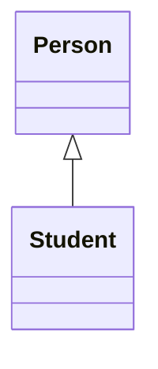
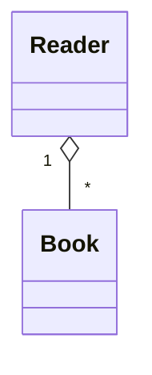
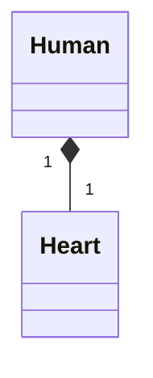

> [!overview]
> This lab covers **the `this` keyword**, **access and field modifiers**, **string handling**, and **UML class diagrams**. It demonstrates encapsulation, inheritance relationships, and object aggregation through Java code and modeling exercises.

---

## 1. `this` Keyword

### Definition
**`this`** is a reference variable that refers to the **current object** in Java.

### Usages
- Refers to **current class instance variable**.
- Invokes **current class methods**. (compiler adds it if you don't)
- Calls **current class constructors**.

> [!example]
> ```java
> class Student {
>     int rollno; String name; float fee;
>     Student(int rollno, String name, float fee) {
>         this.rollno = rollno;
>         this.name = name;
>         this.fee = fee;
>     }
>     void display() {
>         System.out.println(rollno + " " + name + " " + fee);
>     }
> }
> ```

![[Pasted image 20251202174435.png]]

> [!tip]
> Use `this` when **local variables shadow instance variables** to avoid ambiguity.

---

## 2. Access Modifiers

| Modifier      | Within Class | Within Package | Subclass | Outside Package |
| ------------- | ------------ | -------------- | -------- | --------------- |
| **private**   | ✅            | ❌              | ❌        | ❌               |
| **default**   | ✅            | ✅              | ❌        | ❌               |
| **protected** | ✅            | ✅              | ✅        | ❌               |
| **public**    | ✅            | ✅              | ✅        | ✅               |

> [!note]
> Modifiers control visibility and encapsulation of **fields, methods, and classes**.

### Common Errors
1. Using a class with **no modifier** across packages → make it **public**.
2. Accessing a **private field** directly → use **getter/setter**.
3. Calling **methods or variables** before initialization → instantiate objects first.

> [!example]
> ```java
> package main_Package;
> public class Citizen {
>     private String SSN;
>     protected String name;
>     public int ID;
>     public Citizen(String name, int ID, String SSN) {
>         this.name = name;
>         this.ID = ID;
>         this.SSN = SSN;
>     }
>     public String getSSN() { return SSN; }
> }
> ```

---

## 3. Field Modifiers

### **Static**
- Belongs to the **class**, not to instances.
- Shared among all objects.

### **Final**
- Value **cannot be changed** after initialization.
- Commonly used for **constants**.

> [!warning]
> Final variables must be initialized **once**.  
> Attempting to reassign them causes a **compile-time error**.

---

## 4. Strings in Java

### Definition
A **String** is an **object** that represents a sequence of characters.

### Creation Methods
```java
String s1 = "Hello";             // String literal
String s2 = new String("Hello"); // Using new keyword
```

> [!note]  
> Literal strings are stored in the **String Constant Pool**;  
> new Strings are created in the **heap memory**.

![[Pasted image 20251202191459.png]]
### String Comparison

- `==` → compares **references**.
    
- `.equals()` → compares **values**.
    
- `.compareTo()` → compares **lexicographically**.
    ![[Pasted image 20251202191551.png]]

### Immutability

Strings are **immutable**. Modifying a String creates a **new object**.

> [!example]
> 
> ```java
> String s = "Hello";
> s = s.concat(" World");
> System.out.println(s); // "Hello World"
> ```

---

### Common String Methods

|Method|Description|
|---|---|
|`.length()`|Number of characters|
|`.charAt(i)`|Character at index `i`|
|`.indexOf()`|Finds position of substring|
|`.substring(a,b)`|Extracts substring|
|`.concat()`|Joins two strings|
|`.toUpperCase()` / `.toLowerCase()`|Changes case|
|`.toCharArray()`|Converts to character array|

---

### Conversion Examples

```java
String s = "200";
int i = Integer.parseInt(s);
float f = Float.parseFloat("10.5");
String s1 = String.valueOf(i);
```

---

## 5. UML – Class Diagrams

### Definition

A **UML Class Diagram** describes the **structure of a system** by showing:

- **Classes**
    
- **Attributes**
    
- **Methods**
    
- **Relationships**
    


### Syntax
```
ClassName
-----------------
- attributeName : DataType
-----------------
+ methodName(param: Type) : ReturnType
```
	
* parameters are listed as (name: type).
* **Underline static** methods.
* Omit return type on constructors and when return type is
	void.
	
| Visibility | Symbol |
| ---------- | ------ |
| Public     | `+`    |
| Private    | `-`    |
| Protected  | `#`    |
| Default    | `~`    |

> [!example]
> 
> ```mermaid
> classDiagram
>     class Book {
>         -id : int
>         +bookName : String
>         +bookAuthor : String
>         +price : float
>         +Book(int, String, String, float)
>         +setId(int) : void
>         +getId() : int
>     }
> ```

---

## 6. Relationships

### **Generalization (Inheritance)**

“Is-a” / “is-Kind-of” relationship.


---
### **Aggregation (Has-a)**

- **Weak** association.
- Entities **can exist independently**.
- It is a **special form of Association** where:  
- It represents **Has-A’s relationship**.
- It is a **unidirectional association** i.e. a one-way relationship. 
- For example, a department can have students **but vice versa is not possible** and thus unidirectional in nature.
- Both entries **can survive individually** which means ending one entity will not affect the other entity.


---
### **Composition (Part-of)**

- **Strong** association.
- Composition is a **restricted form of Aggregation** in which two entities are highly dependent on each other.  
- It represents **part-of** relationship.
- Both entities are **dependent on each other**.
- When there is a composition between two entities, 
	the composed object cannot exist without the other entity.
		*Example*: House has rooms, 
			The room can’t exist if there is no house
		*Example*: Human and heart,
		 heart doesn’t exist separate to a Human. 


---
### **Aggregation vs Composition — Comparison Table**

| Feature / Aspect           | **Aggregation (Has-A)**                                            | **Composition (Part-Of)**                                       |
| -------------------------- | ------------------------------------------------------------------ | --------------------------------------------------------------- |
| **Type of Association**    | **Weak** association                                               | **Strong** association                                          |
| **Dependency Level**       | Objects **can** exist independently                                | Objects **cannot** exist independently                          |
| **Ownership**              | **Shared** ownership (non-exclusive)                               | **Exclusive** ownership (one-to-one containment)                |
| **Lifecycle Relationship** | Destroying the container does **not** destroy the contained object | Destroying the container **also destroys** the contained object |
| **Direction**              | Usually **unidirectional**                                         | Usually **unidirectional but with strict containmen**t          |
| **Example**                | Department → Student                                               | House → Room                                                    |
| **Object Survival**        | Both survive independently                                         | Part object cannot survive alone                                |
| **Relationship Meaning**   | “Has-A”                                                            | “Part-Of”                                                       |
| **UML Notation**           | **Hollow** diamond                                                 | **Solid** diamond                                               |
| **Real-World Behavior**    | Association is **loose** and **optional**                          | Association is **tight** and **mandatory**                      |
| **Code Representation**    | Class holds reference, but object can exist without owner          | Class creates and manages the lifetime of contained object      |

---

## 7. Hands-On Example

> [!example]
> 
> ```java
> public class Book {
>     private String name;
>     private final int numberOfPages;
>     private float price;
> 
>     public Book(int numberOfPages) { this.numberOfPages = numberOfPages; }
>     public Book(String name, int numberOfPages) {
>         this.name = name; this.numberOfPages = numberOfPages;
>     }
>     public Book(String name, int numberOfPages, float price) {
>         this.name = name; this.numberOfPages = numberOfPages; this.price = price;
>     }
>     public void displayBookinfo() {
>         System.out.println("Book: " + name + ", Pages: " + numberOfPages + ", Price: " + price);
>     }
> }
> ```

---

## 8. Practical Exercise

> [!question]  
> Build an **Author–Book** system using **aggregation**:
> 
> - Each `Author` can have up to 3 books.
>     
> - Implement `addBook()`, `searchBook()`, and `displayBooksData()` methods.
>     

---

## Glossary

|Term|Definition|
|---|---|
|**Encapsulation**|Bundling data and methods within a class|
|**this**|Reference to the current object|
|**Static**|Shared class member|
|**Final**|Immutable variable or method|
|**Aggregation**|“Has-a” relationship|
|**Composition**|“Part-of” relationship|

---

## Key Takeaways

- `this` resolves naming conflicts and links instance scope.
    
- Access modifiers enforce encapsulation.
    
- `static` and `final` control shared and constant values.
    
- Strings are immutable objects stored efficiently in memory.
    
- UML diagrams visualize class structure and relationships.
    

---

## Further Resources

- _Oracle Java Documentation – Classes and Objects_
    
- _Head First Java_ by Kathy Sierra
    
- _UML Distilled_ by Martin Fowler
    
- [https://docs.oracle.com/javase/tutorial/java/javaOO/](https://docs.oracle.com/javase/tutorial/java/javaOO/)