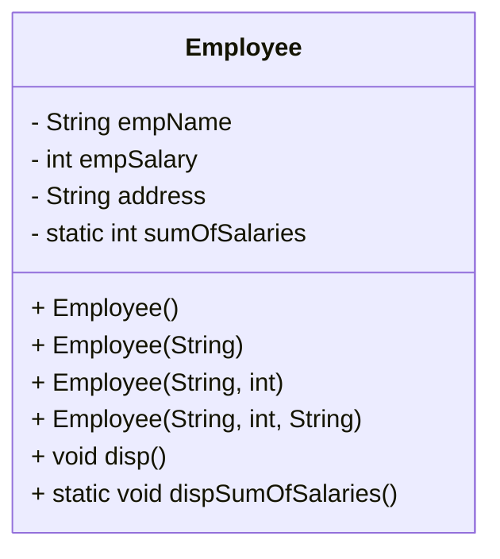
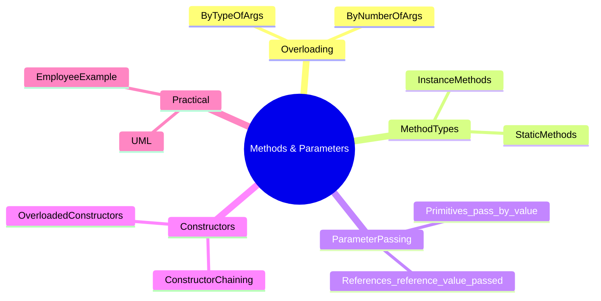

# 🧠 Object-Oriented Programming – Lab 4: Methods, Overloading, and Parameter Passing

> [!note]  
> This lab covers Java method types, method overloading, parameter passing semantics, static vs instance behavior, constructors and constructor chaining. Includes worked Employee example with UML, Mermaid concept map, study tips, and hands-on practice.

---

## Contents

1. Key Concepts Overview
    
2. Method Overloading
    
3. Method Declaration & Modifiers
    
4. Parameter Passing in Java
    
5. Instance vs Static (Class) Methods
    
6. Constructors & Constructor Chaining
    
7. Worked Example — `Employee` (full code, explanation, UML)
    
8. 🧩 Hands-On Practice (exercises)
    
9. Lecture Questions (extracted)
    
10. Difficulty Tags
    
11. Concept Hierarchy (Mermaid mindmap)
    
12. Glossary, Key Takeaways, Quick Review Cards, Further Resources
    

---

## 1. Key Concepts Overview

> [!note]  
> **Method**: named block of code that may accept parameters and optionally return a value. Methods can be overloaded. Java methods are declared with modifiers, return type, name, and parameter list.

---

## 2. Method Overloading

> [!note]  
> **Method Overloading** = same method name, different parameter lists within the same class.

- Two ways:
    
    - **Change number of parameters**.
        
    - **Change parameter types**.
        

> [!example] Java examples:

```java
class Adder {
    int add(int a, int b) { return a + b; }
    int add(int a, int b, int c) { return a + b + c; }
    double add(double a, double b) { return a + b; }
}

class TestOverloading {
    public static void main(String[] args) {
        Adder adder = new Adder();
        System.out.println(adder.add(11, 11));       // 22
        System.out.println(adder.add(11, 11, 11));   // 33
        System.out.println(adder.add(12.3, 12.6));   // 24.9
    }
}
```

> [!tip]  
> If return type differs but parameter list is identical, it is **not** overloading. Java resolves overloads at compile time by parameter signature.

---

## 3. Method Declaration & Modifiers

> [!note]  
> General form:  
> `access_modifier [static] [final|abstract] returnType methodName(parameterList) { ... }`

- **Access modifiers**: `public`, `private`, `protected` (also package-private).
    
- **static** marks class-level method.
    
- **final** prevents override.
    
- **abstract** declares method without body (must be in abstract class).
    

> [!example]  
> `public static int compute(int a, int b) { return a + b; }`

---

## 4. Parameter Passing in Java

> [!note]  
> Java is strictly **pass-by-value**. For primitives a copy of the value is passed. For reference types a copy of the reference (pointer) is passed.

- Primitive example:
    

```java
public class Main {
    public static void main(String[] args) {
        int x = 5;
        change(x);
        System.out.println(x); // prints 5
    }
    static void change(int x) { x = 10; }
}
```

- Reference example (mutating the object):
    

```java
class Test { int x; Test(int i) { x = i; } }

class MainRef {
    public static void main(String[] args) {
        Test t = new Test(5);
        change(t);
        System.out.println(t.x); // prints 10
    }
    static void change(Test ts) { ts.x = 10; }
}
```

- Reference reassign inside method does not affect caller's reference:
    

```java
static void change(Test ts) {
    ts = new Test(100);
    ts.x = 10;            // modifies new object only
}
```

> [!warning]  
> Thinking "pass-by-reference" is incorrect. The value passed for references is the reference itself.

---

## 5. Instance vs Static (Class) Methods

> [!note]  
> **Instance methods** operate on object state. They require an instance to be invoked.  
> **Static methods** belong to the class and can be called without an object.

Rules and consequences:

- Static methods can access only static members directly.
    
- Instance methods can access static and instance members.
    
- Static methods cannot use `this` or `super`.
    

> [!example]

```java
public class Example {
    int a = 10;          // instance
    static int b = 10;   // class

    public void instanceMethod() {
        a = a + 10;
        b = b + 1;
    }

    public static void staticMethod() {
        b = b + 10;
        // a = a + 1; // compile error
    }

    public static void main(String[] args) {
        Example ex = new Example();
        ex.instanceMethod();           // operate on ex.a
        System.out.println(ex.a);      // 20
        Example.staticMethod();
        System.out.println(Example.b); // 21 (or higher depending on previous ops)
    }
}
```

> [!tip]  
> Use static for utility functions and shared state. Avoid mutable static state in concurrency contexts.

---

## 6. Constructors & Constructor Chaining

> [!note]  
> **Constructor** initializes new objects. Constructors can be overloaded. You can call one constructor from another using `this(...)` — called constructor chaining.

> [!example] Rectangle constructors from lab:

```java
public class Rectangle {
    int len;
    int width;
    String color;

    public Rectangle() {
        this(0, 0, null);   // chaining to param constructor
    }

    public Rectangle(int l, int w) {
        this(l, w, null);
    }

    public Rectangle(Rectangle r) {
        this(r.len, r.width, r.color);
    }

    public Rectangle(int l, int w, String c) {
        this.len = l;
        this.width = w;
        this.color = c;
    }
}
```

---

## 7. Worked Example — `Employee` (full reformat, explanation, UML)

> [!note]  
> Task: implement `Employee` with `name`, `address`, `salary` and private static `sumOfSalaries`. Provide multiple constructors with chaining. Provide display methods and static method to show sum.

### Reformatted Java solution (cleaned)

```java
public class Employee {
    public String empName;
    public int empSalary;
    public String address;
    private static int sumOfSalaries = 0;

    // Default constructor -> chains to (name)
    public Employee() {
        this("Chaitanya");
    }

    // Name constructor -> chains to (name, salary)
    public Employee(String name) {
        this(name, 12000);
    }

    // Name + salary -> chains to (name, salary, address)
    public Employee(String name, int sal) {
        this(name, sal, "Gurgaon");
    }

    // Primary constructor
    public Employee(String name, int sal, String addr) {
        this.empName = name;
        this.empSalary = sal;
        this.address = addr;
        Employee.sumOfSalaries += sal;
    }

    // Instance display
    public void disp() {
        System.out.println("Employee Name: " + empName);
        System.out.println("Employee Salary: " + empSalary);
        System.out.println("Employee Address: " + address);
    }

    // Static display of total salaries
    public static void dispSumOfSalaries() {
        System.out.println("Sum of Salaries: " + sumOfSalaries);
    }

    // Demo main
    public static void main(String[] args) {
        Employee e1 = new Employee();                // Chained constructors used
        e1.disp();

        Employee e2 = new Employee("Hazem");         // name -> triggers chain and updates sum
        Employee.dispSumOfSalaries();                // shows sum including e1 and e2
    }
}
```

### Explanation

- `this(...)` used for constructor chaining. Only the most specific constructor updates `sumOfSalaries`.
    
- `sumOfSalaries` is `private static` so class-level and encapsulated.
    
- Creating multiple `Employee` objects aggregates salary to `sumOfSalaries`.
    
- `dispSumOfSalaries()` is static because it reports class-level aggregate.
    

### Expected output (from lab)

```
Employee Name: Chaitanya
Employee Salary: 12000
Employee Address: Gurgaon
Sum of Salaries: 24000
```

(Explanation: `e1` created via default -> salary 12000. `e2` created via `new Employee("Hazem")` -> also uses 12000 default salary in this design. Sum becomes 24000.)

---

### UML — Employee class (Mermaid)



---

## 8. 🧩 Hands-On Practice

> [!example] Tasks derived from the lab:

1. Modify `Employee` so default salary is 0 and add a constructor `Employee(int salary)` that sets name to "Unknown". Update `sumOfSalaries` accordingly and test with 3 objects.
    
2. Add a `raise(int percent)` instance method that increases `empSalary` by percent. Show how `sumOfSalaries` should be adjusted. Decide design: do you recompute total by summing or update `sumOfSalaries` incrementally?
    
3. Make `sumOfSalaries` read-only externally. Provide `public static int getSumOfSalaries()` and make field `private`.
    

> [!tip] For concurrency contexts, avoid a mutable static `sumOfSalaries`. Use `AtomicInteger` or compute on demand.

---

## 9. Lecture Questions (extracted exactly)

> [!question]  
> Let us practice .. Hands-on  
> • Create Employee’s class such that:  
> ▪ It contains name , address, salary and private static sumOfSalaries that is the sum of all salaries.  
> ▪ Create a parametrized constructor that has name, salary and address as parameters.  
> ▪ Create a name and salary parametrized constructor that uses the 3-parameter constructor “constructor chaining”  
> ▪ Create a name parametrized constructor that uses the 2-parameter constructor “constructor chaining”  
> ▪ Create default constructor that uses the parametrized constructor with name parameter “constructor chaining”  
> ▪ Implement a method that displays the Employee’s values  
> ▪ Implement a static method that display sumOfSalaries

---

## 10. Difficulty Tags

- Method Overloading: 🟢 Basic
    
- Parameter Passing semantics: 🟡 Intermediate
    
- Constructor chaining & static aggregation: 🟡 Intermediate
    
- Thread-safety for static fields: 🔴 Advanced
    

---

## 11. Concept Hierarchy Diagram (Mermaid mindmap)



---

## 12. Warnings and Common Mistakes

> [!warning]
> 
> - Confusing pass-by-value vs pass-by-reference leads to wrong assumptions about object reassignments inside methods.
>     
> - Believing static methods can access instance fields directly. They cannot.
>     
> - Assuming constructor chaining updates same state multiple times; track which constructor updates static aggregates to avoid double-counting.
>     

---

## Glossary

- **Method Overloading**: Multiple methods same name, different parameter signatures.
    
- **Instance Method**: Method invoked on an object and can access instance fields.
    
- **Static Method**: Class-level method. Can be called without instantiating the class.
    
- **Constructor Chaining**: Calling one constructor from another using `this(...)`.
    
- **Pass-by-value**: Java semantics where the method receives a copy of the variable's value. For references this copy still points to the same object.
    

---

## Key Takeaways

- Java resolves overloaded methods by parameter signatures. Return type alone does not overload.
    
- Java is pass-by-value. For objects you receive a copy of the reference. Mutations affect the original object. Reassigning the reference inside a method does not.
    
- Use `static` for class-level behavior. Avoid mutable static state without synchronization.
    
- Constructor chaining reduces duplication and centralizes initialization.
    

---

## Quick Review Card (flashcards)

1. Q: Does Java use pass-by-reference?  
    A: No. Java uses pass-by-value; object references are passed by value.
    
2. Q: Can two methods differ only by return type and be overloaded?  
    A: No. Overload must differ in parameter list.
    
3. Q: Can a static method call an instance method directly?  
    A: No. It must have an instance to call instance methods.
    
4. Q: How do you call another constructor in the same class?  
    A: Using `this(...)` as the first statement.
    
5. Q: Where should you adjust a static aggregate like `sumOfSalaries` to avoid errors?  
    A: In a single canonical constructor or via controlled setters; avoid duplicate increments.
    

---

## Further Resources

- Bloch, Joshua. _Effective Java_. Chapter on static factories and constructors.
    
- Oracle Java Tutorials: Methods and Constructors.
    
- Online: “Java: pass-by-value explained” articles and diagrams.
    
- UML & Mermaid docs for class diagrams and mindmaps.
    

---

> [!tip] Export this note to your Obsidian vault. Use the Mermaid blocks for quick visual review during exam prep.