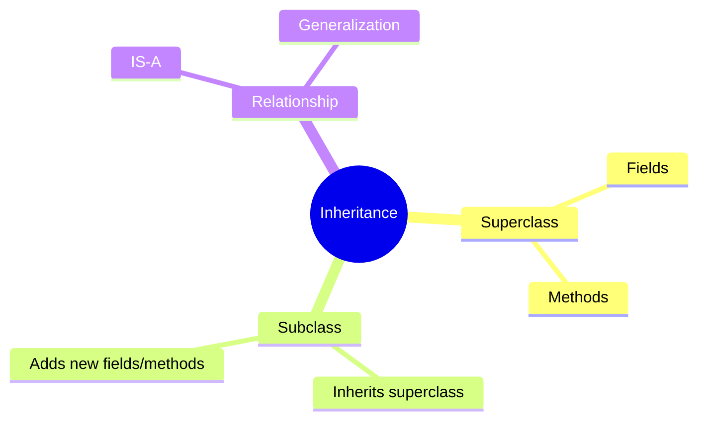
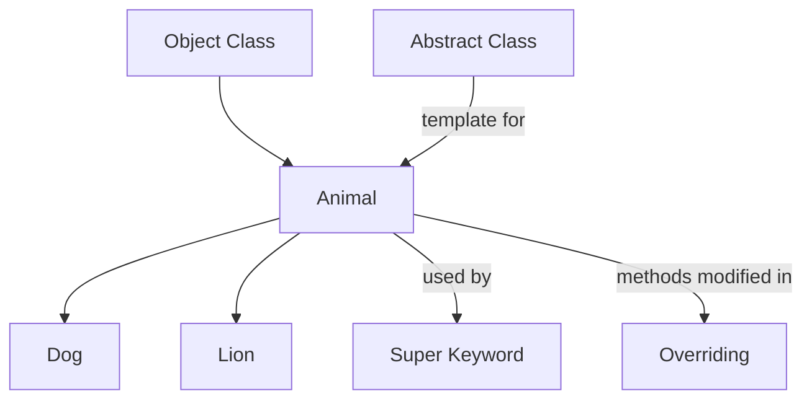

> [!note]
> This lecture covers **class inheritance**, the **super keyword**, **method overriding**, and **abstract classes** in Java. It explains how subclasses reuse and specialize behavior from parent classes to achieve reusability, extensibility, and polymorphism.

---

## 📚 Overview

- **Inheritance** enables code reuse through hierarchical relationships.  
- **Super keyword** provides access to parent class elements.  
- **Overriding** supports dynamic (runtime) polymorphism.  
- **Abstract classes** define shared structure and force subclass implementation.  
- Includes practical Java examples and UML representations.

---

## 🔗 Continuity with Previous Lectures

> [!note]
> Builds upon previous OOP foundations: **classes, objects, and encapsulation**.  
> This lecture introduces inheritance, which adds **hierarchical relationships** between objects and enables **code reuse and polymorphism**.

---
## 🧩 Inheritance

> [!note]
> **Inheritance** is the mechanism by which a **child class (subclass)** acquires properties and behaviors from a **parent class (superclass)**, forming an “**is-a**” relationship.

### 🧱 UML Representation



### Example

```java
class Employee {
  float salary = 40000;
}

class Programmer extends Employee {
  int bonus = 10000;
  
  public static void main(String args[]) {
    Programmer p = new Programmer();
    System.out.println("Salary is: " + p.salary);
    System.out.println("Bonus is: " + p.bonus);
  }
}
```

**Output:**

```
Salary is: 40000
Bonus is: 10000
```

> [!question]  
> What members are inherited from a superclass, and which are not?

### Inheritance Rules 🟢 Basic

| Member Type         | Inherited | Notes                         |
| ------------------- | --------- | ----------------------------- |
| `public`            | ✅         | Accessible everywhere         |
| `protected`         | ✅         | Accessible in subclasses      |
| `default` (package) | ❌         | Not inherited outside package |
| `private`           | ❌         | Not accessible in subclasses  |
| `static`            | ✅         | Shared across all objects     |
| `Constructor`       | ❌         | Not inherited                 |

---

## 🧭 The `super` Keyword

> [!note]  
> `super` is used to refer to **immediate parent class** members:
> 
> 1. Parent **variables**
>     
> 2. Parent **methods**
>     
> 3. Parent **constructors**
>     

### 1️⃣ Referring to Parent Variables 🟢 Basic

```java
class Animal {
  String color = "white";
}
class Dog extends Animal {
  String color = "black";
  void printColor() {
    System.out.println(color);       // prints "black"
    System.out.println(super.color); // prints "white"
  }
}
```

> [!tip]  
> Mnemonic: **“super.variable → parent field”**

### 2️⃣ Invoking Parent Method 🟡 Intermediate

```java
class Animal {
  void eat() { System.out.println("Animal is eating..."); }
}

class Dog extends Animal {
  void eat() { System.out.println("Dog is eating"); }
  void work() {
    super.eat();
    System.out.println("barking...");
  }
}
```

**Output:**

```
Animal is eating...
barking...
```

### 3️⃣ Invoking Parent Constructor 🔴 Advanced

```java
class Animal {
  Animal() { System.out.println("Animal is created"); }
}

class Dog extends Animal {
  Dog() {
    super();
    System.out.println("Dog is created");
  }
}
```

**Output:**

```
Animal is created
Dog is created
```

> [!tip]  
> If no `super()` or `this()` is specified, **Java automatically inserts `super()`** as the first statement in a constructor.

---

## 🔄 Method Overriding

> [!note]  
> **Overriding** allows a subclass to redefine a method already defined in its superclass, enabling **runtime polymorphism**.

### Example Without Overriding

```java
class Vehicle {
  void run() { System.out.println("Vehicle is running"); }
}

class Bike extends Vehicle { }

public static void main(String args[]) {
  Bike obj = new Bike();
  obj.run();  // Vehicle's method
}
```

### Example With Overriding

```java
class Vehicle {
  void run() { System.out.println("Vehicle is running"); }
}

class Bike2 extends Vehicle {
  void run() { System.out.println("Bike is running"); }
}
```

**Output:**

```
Bike is running
```

> [!warning]  
> Overriding requires **same method name, parameters, and return type**.  
> Access level cannot be reduced in overriding methods.

---

## ⚖️ Overloading vs Overriding

| Feature    | Overloading                            | Overriding                       |
| ---------- | -------------------------------------- | -------------------------------- |
| Location   | Same class                             | Parent & Child classes           |
| Parameters | Must **differ**                        | Must **match**                   |
| Type       | **Compile-time (static) polymorphism** | *Runtime (dynamic) polymorphism* |
| Keyword    | None                                   | `@Override` recommended          |

> [!tip]  
> Mnemonic:  
> **Overloading → Many methods, same name, different input**  
> **Overriding → Many classes, same method, new behavior**

---

## 🧱 Abstract Classes and Methods

> [!note]  
> An **abstract class** defines a **template** for subclasses.  
> It may contain both **implemented (concrete)** and **unimplemented (abstract)** methods.

### Rules 🟡 Intermediate

- Declared using `abstract` keyword.
    
- Cannot be instantiated directly.
    
- Subclasses must implement all abstract methods.
    
- May include constructors and fields.
    

### Example

```java
abstract class Bike {
  abstract void run();
}

class Honda4 extends Bike {
  void run() { System.out.println("Running safely"); }
}

public static void main(String args[]) {
  Bike obj = new Honda4();
  obj.run();
}
```

**Output:**

```
Running safely
```

> [!warning]  
> A class with an abstract method must itself be declared **abstract**, otherwise a **compile-time error** occurs.

---

## 🧩 Hands-On Practice

### Problem

> Create three classes: `Animal`, `Dog`, and `Lion`.  
> Each has a `set_color()` method and a `display_info()` method.

### Sample Implementation

```java
class Animal {
  protected String color;
  protected Boolean is_pet;

  Animal() { this.is_pet = true; }

  void displayInfo() {
    System.out.println("Color: " + color + " | is_pet: " + is_pet);
  }

  protected void set_Color() { color = "Default Color"; }
}

class Dog extends Animal {
  Dog(Boolean is_pet) { this.is_pet = is_pet; }
  void set_Color() { color = "Black"; }
}

class Lion extends Animal {
  Lion(Boolean is_pet) { this.is_pet = is_pet; }
  void set_Color() { color = "Brown"; }
}

public class MainClass {
  public static void main(String[] args) {
    Dog d = new Dog(true);
    Lion l = new Lion(false);
    d.set_Color(); l.set_Color();
    d.displayInfo(); l.displayInfo();
  }
}
```

---

## 🧠 Concept Hierarchy Diagram



---

## 📖 Glossary

|Term|Definition|
|---|---|
|**Inheritance**|Mechanism where a subclass derives from a superclass.|
|**Subclass**|Derived or child class extending functionality.|
|**Superclass**|Base or parent class being inherited from.|
|**super**|Keyword to access parent class members.|
|**Method Overriding**|Redefining a superclass method in subclass.|
|**Abstract Class**|Class that cannot be instantiated, containing abstract methods.|

---

## 🔑 Key Takeaways

- Inheritance enables **reusability** and **hierarchical modeling**.
    
- The `super` keyword provides **explicit parent access**.
    
- Overriding implements **runtime polymorphism**.
    
- Abstract classes enforce **contract-based design**.
    
- Proper use of visibility modifiers ensures **encapsulation**.
    

---

## 🧾 Quick Review Card

> **Q1:** What does `super()` do in a subclass constructor?  
> **A1:** Calls the immediate parent class constructor.

> **Q2:** Can abstract classes have constructors?  
> **A2:** Yes, but they cannot be directly instantiated.

> **Q3:** Difference between overriding and overloading?  
> **A3:** Overloading → compile-time; Overriding → runtime.

> **Q4:** Can private methods be overridden?  
> **A4:** No, they are not inherited.

> **Q5:** What keyword is mandatory for inheritance?  
> **A5:** `extends`

---

## 📚 Further Resources

- _Java: The Complete Reference_ by Herbert Schildt
    
- Oracle Java Documentation – Inheritance and Polymorphism
    
- [W3Schools Java Inheritance](https://www.w3schools.com/java/java_inheritance.asp)
    
- [GeeksforGeeks: Abstract Classes in Java](https://www.geeksforgeeks.org/abstract-classes-in-java/)