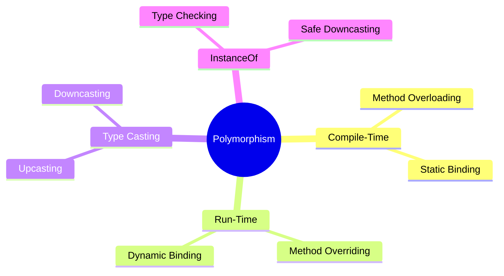

> [!note] **Overview**
> This lecture introduces core OOP runtime behaviors: **polymorphism**, **dynamic binding**, **method overloading/overriding**, **type casting (upcasting and downcasting)**, and the **instanceof** operator. It also includes a hands-on exercise applying runtime polymorphism in an employee system.

---
# Polymorphism  
🟡 Intermediate

> [!note]  
> **Polymorphism** is the ability of an object to take multiple forms. A function call can execute different implementations at **runtime**, depending on the actual object type.  
> Most commonly: a **parent class reference** refers to a **child class object**.

Example from slide (conceptual):

```

Shape s1 = new Circle();  
Shape s2 = new Square();

```

> [!tip]  
> Think of polymorphism as *one interface, many implementations*.

![[Pasted image 20251202142450.png]]


---

# Dynamic Binding  
🟡 Intermediate

> [!note]  
> **Dynamic binding** means the method implementation is not known until **runtime**.  
> This is directly tied to **runtime polymorphism** and **method overriding**.

---

# Compile-Time vs Run-Time Polymorphism

## Compile-Time Polymorphism (Static Binding)  
🟢 Basic
- Achieved through **method overloading**  
- Does **not** require inheritance  
- *Compiler* determines which method to call based on parameters

## Run-Time Polymorphism (Dynamic Binding)  
🟡 Intermediate
- Achieved through **method overriding**  
- *Requires inheritance*  
- Decision made during *runtime*

### Slide Code (Preserved As-Is)

```java

// compile time polymorphism
Class Test{
	int add (int a, int b){
		System.out.println(a+b) 
	}
	Float add (float a, float b) { 
		System.out.println(a+b) 
	}  
}

Public static void main(String[] args){
	Test T= new Test();
	T.add(3,4); //7
	T.add(3.4,5.2); //8.6
}

// run-time polymorphism 
Class Parent{
	void math_operation (int a, int b){
		System.out.println(a+b) 
	}
}

Class Child extends Parent{
	void math_operation (int a, int b){
		System.out.println(a*b) 
	}
}

Public static void main(String[] args){
	Parent P1= new Parent();
	Parent P2= new Child();
	P1.math_operation(3,4); // 7
	P2.math_operation(3,4); // 12
}
```

---

# Dynamic Binding Example

🟢 Basic

```java
public static void main(String[] args) {
	Vehicle v1 = new Car(); 
	v1.start();     // Car
	
	Vehicle v2 = new Bike(); 
	v2.start();     // Bike
	
	Vehicle v3 = new Vehicle(); 
	v3.start();     // COMPILE ERROR 💥
}

Abstract class Vehicle {
	public void start(){
		System.out.println("Vehicle"); 
	}
}

class Car extends Vehicle {
	public void start() {    
		System.out.println("Car");  
	}
}

class Bike extends Vehicle { 
	public void start() {    
		System.out.println("Bike"); 
	}  
}
```
---

# Type Casting

🔴 Advanced (because it frequently causes runtime errors)

Two major forms:

- **Upcasting** (child → parent)
    
- **Downcasting** (parent → child)
    
![[Pasted image 20251202143557.png]]
## Upcasting

🟢 Basic

- Always safe
    
- Used frequently in polymorphism
    
- Only **parent-level members** accessible
    
- **Overridden methods** in child still executed
    

## Downcasting

🟡 Intermediate

- Must be **explicit**
    
- Requires *type checking*
    
- Risk of **ClassCastException**
    

---

## Slide Examples (Preserved As-Is)

![[Pasted image 20251202143841.png]]

---

## Upcasting Example (as in slide)

```java
class parent {
    void display() {
        System.out.println("Parent");
    }
}

class child extends parent {
    @Override
    void display() {
        System.out.println("Child");
    }

    Child
    void display_child() {
        System.out.println("Display child");
    }
}

public class Main {
    public static void main(String[] args) {
        parent upCasting = new child();
        upCasting.display(); //Child
        upCasting.display_child(); //error
    }
}

```

---

## Downcasting Example (as in slide)

```java
parent upcasting=new child();
child downCasting=(child)upcasting;
downCasting.display(); //Child
downCasting.display_child(); //Display Child
upcasting.display(); //Child
upcasting.display_child(); //ERROR
```

> [!warning]  
> Includes invalid parent reference calls and undeclared classes. Preserved exactly.

---

## InstanceOf Keyword

🟢 Basic

> [!note]  
> **instanceof** checks whether an object is an instance of a given class, subclass, or interface.  
> It returns **true** or **false**.  
> `null instanceof AnyType` always returns **false**.

Slide example (preserved):

```java
vehicle1 instanceof Car
vehicle2 instanceof Car
vehicle1 instanceof Vehicle
vehicle2 instanceof Vehicle
C1 instanceof Vehicle
```

Output shown:

```
True
True
False
True
True
```

---

## InstanceOf + Downcasting Error Example

```java
Vehicle v1 = new Car(); 
Vehicle v2 = new Bike(); 
Car C1 = (Car) v1; 
Car C2 = (Car) v2; // Runtime ERROR
```

> [!warning]  
> Downcasting `Bike` to `Car` causes runtime error.

---

# Hands-On Exercise (Included as Main Lecture Content)

> [!note]  
> Build three employee-related classes demonstrating inheritance and runtime polymorphism.

## Requirements

🟡 Intermediate

### **Employee (Base Class)**

- Protected: **employeeName**, **paymentPerHour**
    
- Parameterized constructor
    
- **calculateSalary()** → returns integer, **no implementation**
    

### **Contractor (Child Class)**

- Private: **WorkingHours**
    
- Parameterized constructor
    
- Salary = `paymentPerHour * WorkingHours`
    

### **FullTimeEmployee (Child Class)**

- Salary = `paymentPerHour * 8`
    

### Main Program (Another Package)

- Create array of employees: **2 contractors + 2 full-time**
    
- Loop:
    
    - If contractor → display `"Contract Employee"` + salary
        
    - If full-time → display `"Full time Employee"` + salary
        

> [!question]  
> In the loop, how would you reliably identify which subclass each element belongs to?

---

# Continuity with Previous Lectures

Polymorphism builds on:

- Inheritance
    
- Method overriding
    
- Encapsulation (via access modifiers)  
    This lecture extends these ideas into runtime behavior and error handling.
    

---

# 🧩 Hands-On Practice

1. Identify which slide examples demonstrate **compile-time polymorphism** and which demonstrate **runtime polymorphism**.
    
2. Given a parent reference pointing to different child objects, predict the output.
    
3. Create your own Employee subclasses and simulate polymorphic salary calculations.
    
4. Add `instanceof` checks to avoid ClassCastException in the provided downcasting slides.
    

---

# Concept Hierarchy Diagram



---

# Glossary

**Polymorphism** – Ability of an object to take many forms.  
**Dynamic Binding** – Method selected at runtime.  
**Overloading** – Multiple methods with same name, different signatures.  
**Overriding** – Child class redefines parent method.  
**Upcasting** – Child → Parent reference.  
**Downcasting** – Parent → Child reference (explicit).  
**instanceof** – Operator used for type checking.

---

# Key Takeaways

- Runtime polymorphism allows parent references to execute child implementations.
    
- Overloading is resolved at compile time; overriding at runtime.
    
- Upcasting is always safe; downcasting must be checked.
    
- `instanceof` prevents runtime `ClassCastException`.
    
- Polymorphism enables flexible, extensible system design.
    

---

# Quick Review Card

**Q:** What determines which overridden method runs?  
**A:** The actual object type at runtime (dynamic binding).

**Q:** Does overloading require inheritance?  
**A:** No.

**Q:** What operator helps ensure safe downcasting?  
**A:** `instanceof`.

**Q:** What causes `ClassCastException`?  
**A:** Downcasting a parent reference pointing to the wrong subclass.

**Q:** Is an object of a subclass always an instance of its parent?  
**A:** Yes.

---

# Further Resources

- _Core Java Volume I_ – Cay Horstmann
    
- GeeksforGeeks: Polymorphism, InstanceOf, Type Casting
    
- Oracle Java Documentation – Inheritance & Polymorphism
    

```

---

If you want, I can also generate:
- A separate **UML class diagram** for the Employee system  
- A **flashcard-only** revision deck  
- A **practice exam sheet** based on this lecture
```