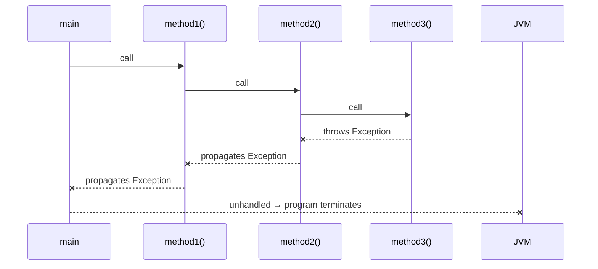
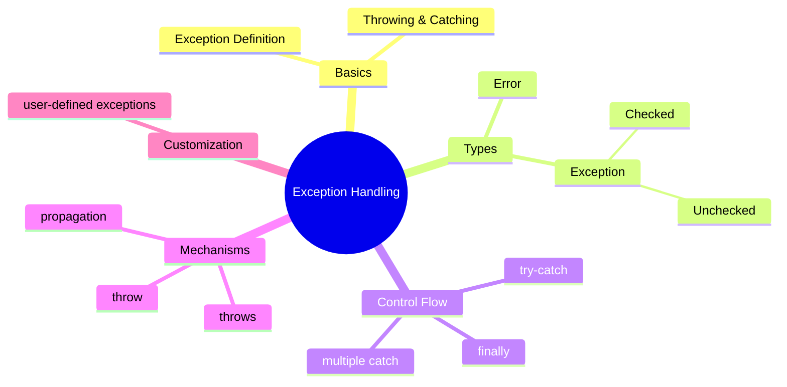

> [!note] Overview  
> This lecture introduces Java’s exception-handling model, covering exception types, checked vs. unchecked exceptions, try–catch–finally structures, the throw/throws keywords, exception propagation, and user-defined exceptions. You learn how to maintain application stability by managing runtime anomalies effectively.

---

## 1. What Is an Exception?
> [!note]  
> An **exception** is an **unwanted runtime event** that interrupts the **normal flow** of a program.  
> Examples: **divide-by-zero**, **array index out of bounds**, **null access**, file missing.

**Core value:** Exception handling maintains application stability and prevents abnormal termination. 🟢

---

## 2. How Exceptions Work
- When an error occurs, the method **creates an exception object** and **throws** it.
- The JVM searches up the call stack for matching **catch** blocks.
- If no handler is found → program terminates abnormally.
- If a handler matches → the exception is **caught**, and execution continues. 🟢

> [!example]
> ```java
> try {  
>     int k = i / j;  
> }  
> catch (ArithmeticException ae) {  
>     System.out.println("Cannot divide by zero");  
> }
> ```

---

## 3. Java Exception Hierarchy
> [!note]
> All exception classes ultimately inherit from **java.lang.Throwable**.

```

Object
└── Throwable
├── Error
└── Exception
└── RuntimeException

```

### 3.1 **Exception** (Recoverable) 🟢  
Handled by the developer; program can recover.  
Examples:
- File not found
- Invalid user input
- Divide-by-zero

### 3.2 **Error** (Unrecoverable) 🔴  
Represents JVM or system-level failures.  
Examples:
- JVM crash
- OutOfMemoryError  
Developer <font color="#c00000">cannot recover</font>.

---

## 4. Checked vs. Unchecked Exceptions
### **Checked Exceptions** 🟡  
- Verified at **compile-time**.  
- Direct subclasses of **Throwable**, except `RuntimeException` and `Error`.  
- Examples: `IOException`, `SQLException`, .

### **Unchecked Exceptions** 🟢  
- Subclasses of `RuntimeException`.  
- Checked only at **runtime**.  
- Examples: `ArithmeticException`, `NullPointerException`.

---

## 5. Handling Exceptions: try–catch
> [!note]
> Critical statements must always be placed inside a **try block**.

### Pattern
```java
try {
   // risk code
}
catch (ExceptionType e) {
   // handler
}
```

### Multiple Catch Blocks 🟡

```java
try {
    ...
}
catch(IOException e) { ... }
catch(ArithmeticException e) { ... }
catch(Exception e) { ... }
```

> **( from special to general )** in expectation order. 
> child to parent and statement order.

---

## 6. finally Block

> [!note]
> **finally** executes **always**—whether an exception occurs or not.

Typical use case: closing resources.

```java
finally {
    br.close();
}
```

---

## 7. The **throw** Keyword

Used to manually throw exceptions.

### Example: Java-defined exception

```java
if (x < 10)
    throw new Exception("Errorrrr!!");
```

---

## 8. The **throws** Keyword

> [!note]
> `throws` **declares** that a method may throw a checked exception.
> It does **not** handle the exception.

### Example

```java
public static void main(String[] args) throws Exception {
    if (x < 10)
        throw new Exception("Not Compile Error!!");
}
```

---

## 9. Exception Propagation (Call-Stack Flow) 🔴

* Considering a scenario, in which your program starts its execution at the main() method, main() calls method1(), method1() calls method2(), method2() calls method3(), 
   - Now the call stack looks like this:

![[Pasted image 20251202132439.png]]

### UML-Style Flow Diagram



### Explanation
* Exception in method3()
* Bubbles up the stack (method2 → method1 → main)
* If **no handler exists**, JVM terminates the program.

---
![[Pasted image 20251202132626.png]]

## 10. User-Defined Exceptions 🟡

> [!note]
> Custom exceptions are created by extending **Exception** or **RuntimeException**.

### Example 1

```java
class MyException extends Exception {
    public MyException(String s) {
        super(s);
    }
}

try {
    throw new MyException("YOU ARE WRONG!!");
}
catch(MyException e) {
    System.out.println(e.getMessage());
}
```

### Example 2 – Banking

```java
public class InsufficientFundsException extends Exception {
    private double amount;
    public InsufficientFundsException(String msg, double amount) {
        super(msg);
        this.amount = amount;
    }
    public double getAmount() { return amount; }
}
```

---

## 11. Concept Hierarchy Diagram



---

## 🧩 Hands-On Practice

1. **Write a program** that handles both `NumberFormatException` and `ArithmeticException`.
2. **Create a custom exception** `InvalidAgeException` and use it in a registration form.
3. **Simulate propagation:**
   Create `m1() → m2() → m3()` and throw an exception in `m3()` without handling it.

---

## Lecture Questions (Extracted)

* *"When do we need to handle an exception?"*
* *"What can a developer do after catching an exception?"*
* *"Why does show2() need the throws keyword even if it doesn't throw directly?"*

---

## Glossary

* **Exception:** Runtime anomaly interrupting program flow.
* **Throwable:** Root superclass for all errors and exceptions.
* **Checked Exception:** Compile-time validated exception.
* **Unchecked Exception:** Runtime-only checked exception.
* **throw:** Manually trigger an exception.
* **throws:** Declare that a method may throw exceptions.
* **finally:** Cleanup block that always executes.
* **Propagation:** Upward movement of an exception through the call stack.

---

## Key Takeaways

* Exceptions help maintain application stability and control failures.
* Java distinguishes between **checked** and **unchecked** exceptions.
* The **try–catch–finally** model structures safe execution.
* **throw** triggers; **throws** declares.
* Propagation continues until a suitable handler is found.

---

## Quick Review Card

**Q:** What superclass contains all exceptions and errors?
**A:** `Throwable`.

**Q:** What happens if no catch block matches?
**A:** Program terminates abnormally.

**Q:** Difference between throw and throws?
**A:** `throw` creates/throws an exception; `throws` declares potential exceptions.

**Q:** What always executes even if exceptions occur?
**A:** `finally` block.

**Q:** Which exceptions must be handled or declared?
**A:** Checked exceptions.

---

## Further Resources

* *Effective Java* by Joshua Bloch – Chapter on Exceptions
* Oracle Java Docs – Exception Handling
* howtodoinjava.com – Try/catch/finally tutorials

## Example of user-defined exception
```java

Custom exception:
 class InvalidAgeException extends Exception {
    public InvalidAgeException(String message) {
        super(message);
    }
 }
 checkAge method and main:
 public class Q17 {
    static void checkAge(int age) throws InvalidAgeException {
        if (age < 18) {
    }
        }
            throw new InvalidAgeException("Age is less than 18");
        System.out.println("Age is OK");
    public static void main(String[] args) {
        try {
            checkAge(16);
        } catch (InvalidAgeException e) {
            System.out.println("Too young");
        }
    }
 }


```