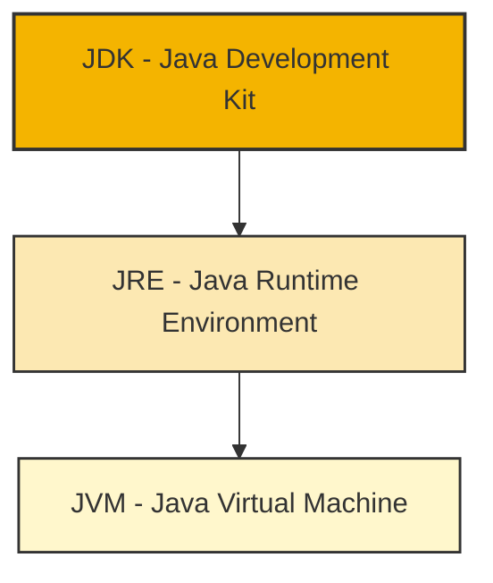
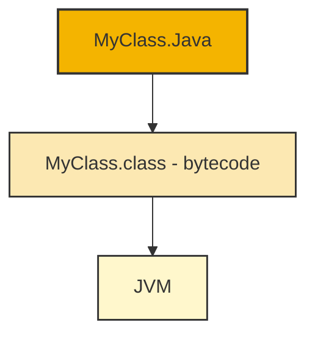
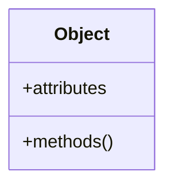
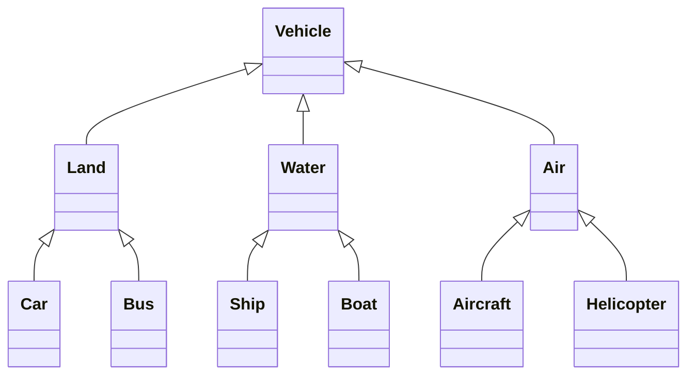

# 🧠 Object Oriented Programming – Lecture 1: Introduction to OOP

> [!overview]
> This lecture introduces the fundamentals of **Object-Oriented Programming (OOP)** using **Java**. Topics include the Java language history, technology stack, OOP principles, syntax, and example programs.

---

## 🚀 Introduction to Java Language

- **Java** is a high-level, object-oriented language, originally named **Oak (1991)** and released by **Sun Microsystems (1995)**.
- **Major Java Versions:**
  - 🟡 **1996** – JDK 1.0  
  - 🟡 **1997** – JDK 1.1 → *RMI, AWT, Servlets*  
  - 🟡 **1998** – Java 1.2 → *Reflection, Swing, Collections*  
  - 🟡 **2004** – Java 5 → *Generics, Enums*  
  - 🟡 **2014** – Java 8 → *Lambdas*  
  - 🟡 **2018** – Java 11 → *var keyword, improved GC*  
  - 🟡 **2021** – Java 17 → *Sealed classes, pattern matching*

---

## ⚙️ Java Technology Stack

- **JVM (Java Virtual Machine):** Executes bytecode; ensures platform independence.  
- **JRE (Java Runtime Environment):** Provides libraries and the JVM; excludes dev tools.  
- **JDK (Java Development Kit):** Includes JRE + compilers, debuggers, and development tools.



> [!note]  
> `.java` files compile into `.class` bytecode files executed by the **JVM**.

---

## 🧩 Properties of Java

- Object-Oriented
    
- Interpreted
    
- Portable
    
- Secure and Robust
    
- Multi-threaded
    
- Automatic Garbage Collection
    
- No Multiple Inheritance
    

---

## 💡 "Hello World" Example

```java
public class MyClass {
    public static void main(String[] args) {
        System.out.println("Hello World");
    }
}
```

> [!tip]  
> Save as **MyClass.java**, compile with `javac MyClass.java`, run with `java MyClass`.


---

## 🧹 Garbage Collection

- **Automatic memory deallocation** for unreferenced objects.
    
- Prevents memory leaks (unlike C/C++ which require manual deallocation).
    

---

## 🧱 Introduction to Object-Oriented Programming

### Object-Oriented Thinking

- **OOP** is based on **objects** combining **data (attributes)** and **behavior (methods)**.
    
- Objects communicate through **message passing**.
    



---

### Class Hierarchies

- **Class:** Blueprint for objects; defines data and behavior.
    



---

## 🧭 Four Principles of OOP

### 1. Encapsulation

Combines data and methods into a single unit (**class**) and restricts access using **modifiers**.

```java
class Person {
    private String name;
    public String getName() { return name; }
}
```

### 2. Abstraction

Hides complexity and exposes only necessary details via **classes and interfaces**.

### 3. Inheritance

Enables **hierarchical relationships** between classes and **code reuse**.

### 4. Polymorphism

Allows the same function name to act differently based on context.

- **Overloading:** Same method name, *different parameters*.
    
- **Overriding:** Subclass redefines superclass method.
    

$\text{Polymorphism}:  \begin{cases}  \text{Overloading:} & f(a),\ f(a, b) \   \\ \text{Overriding:} & \text{Subclass redefines superclass method}  \end{cases}$

---

## 🧮 Example: Simple Calculator

```java
import java.util.Scanner;
public class Calculator {
    public static void main(String[] args) {
        Scanner in = new Scanner(System.in);
        System.out.print("Enter first number: ");
        int num1 = in.nextInt();
        System.out.print("Enter second number: ");
        int num2 = in.nextInt();
        int sum = num1 + num2;
        System.out.println("Sum: " + sum);
    }
}
```

---

## 🧾 Key Java Syntax Rules

- Filename must match the **main class name** (e.g., `MyClass.java`).
    
- The `main` method must have this signature:  
    `public static void main(String[] args)`
    
- Every statement ends with a **semicolon**.
    

---

## 📘 Glossary

|Term|Definition|
|---|---|
|**Object**|Instance containing data (attributes) and methods|
|**Class**|Blueprint for creating objects|
|**JVM**|Executes Java bytecode|
|**JRE**|Provides JVM and libraries|
|**JDK**|JRE + development tools|
|**Encapsulation**|Bundling data and methods with access control|
|**Abstraction**|Hiding implementation details|
|**Inheritance**|Reuse of behavior across related classes|
|**Polymorphism**|One interface, multiple implementations|

---

## 📈 Key Takeaways

> [!summary]
> 
> - JVM enables **platform independence**.
>     
> - OOP principles: **Encapsulation, Abstraction, Inheritance, Polymorphism**.
>     
> - Java code compiles to **bytecode**, executed by JVM.
>     
> - Start with simple programs to learn syntax and workflow.
>     

---

## 📚 Further Resources

- [JDK 17 Documentation](https://docs.oracle.com/en/java/javase/17/docs/api/)
    
- [Java Tutorial – Tutorialspoint](https://www.tutorialspoint.com/java/index.htm)
    
- [Beginner’s Java Guide – BeginnersBook](https://beginnersbook.com/java-tutorial-for-beginners-with-examples)