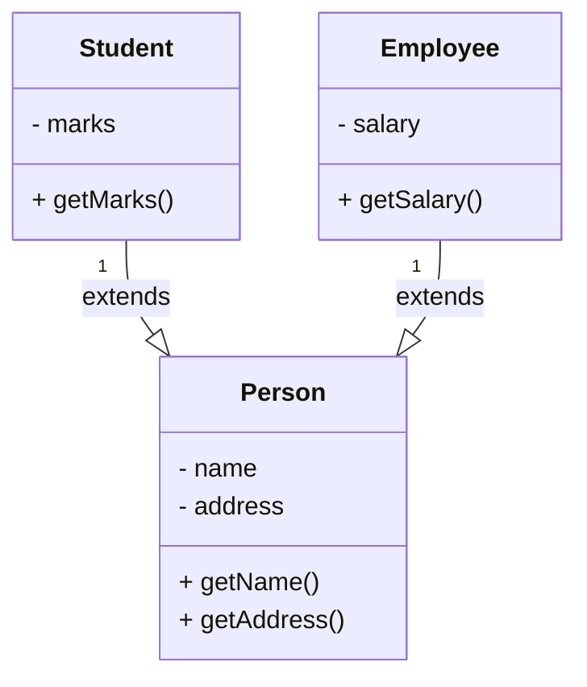

# 🧠 Object Oriented Programming – Lecture 2: Java Syntax, Control Structures, Classes, and Objects

> [!overview]
> This lecture introduces **Java syntax**, essential **control structures**, and the foundations of **Object Oriented Programming (OOP)**.  
> Topics: branching, loops, arrays, classes, objects, constructors, UML diagrams, and access modifiers.

---

## 1️⃣ Branching Structures

### 🔹 If–Else Statements
- Control program flow with conditional logic.
- Always use braces `{}` for readability.

```java
public static boolean isNegative(int num) {
    if (num < 0)
        return true;
    else
        return false;
}
```

### 🔹 Switch Statement

- Works with `int`, `enum`, or `String` types.
    
- Each `case` should end with `break`.
    
- Use `default` for unmatched values.
    

```java
int day = 4;
switch (day) {
    case 1:
        System.out.println("Saturday");
        break;
    case 2:
        System.out.println("Sunday");
        break;
    default:
        System.out.println("Not weekend");
        break;
}
```

> [!tip]  
> Adding `break` after `default` is optional but recommended.

---

## 2️⃣ Loop Structures

### 🔹 For Loop

```java
for (int i = 0; i < 10; i++) {
    System.out.println(i);
}
```

### 🔹 Foreach Loop

Used for arrays and collections.

```java
int[] arr = {1, 2, 3, 4};
for (int item : arr) {
    System.out.println(item);
}
```

### 🔹 While and Do–While

```java
while (i < 10) { ... }

do { ... } while (i < 10);
```

### 🔹 Loop Control

- `break`: exits loop immediately.
    
- `continue`: skips to next iteration.
    

> [!question]  
> Predict the output:
> 
> ```java
> int i = 0;
> while(i < 10) {
>     if(i == 5) break;
>     System.out.println(i);
>     i++;
> }
> ```

---

## 3️⃣ Arrays

- Fixed-size collection of same-type elements.
    
- Can hold primitive or object types.
    
- Uninitialized elements default to `null`.
    

```java
float[] arr = new float[5];
float[] arr2 = {1.2F, 3.4F, 5.6F, 7.8F};
```

> [!example]  
> Use a **foreach loop** to iterate through array elements.

---

## 4️⃣ Classes and Objects

### 🔹 Class Definition

Blueprint that defines fields and methods.

```java
public class Student {
    String name; // field
    float marks; // field

    public Student(String n, float m) { //Constructor
        name = n;
        marks = m;
    }

    public float addMarks(float m) { //Method
        marks += m;
        return marks;
    }
}
```

### 🔹 Object Instantiation

```java
Student stud = new Student("John Smith", 75);
```

### 🔹 Constructors

- Initialize objects.
    
- **Same name** as class.
    
- *Default constructor auto-created if none exists*.
    

---

## 5️⃣ Unified Modeling Language (UML)

- Visual system design tool for classes and relationships.
    
- Not language-specific.
    



> [!note]  
> Arrowheads show relationship types (inheritance, association, etc.).

---

## 6️⃣ Packages

- Containers for related classes (e.g., `java.util`, `java.io`).
    
- Use consistent domain-based naming.
    
- Organize code for maintainability.
    

---

## 7️⃣ Access Modifiers

### 🔹 Class Modifiers

- `public`: accessible anywhere.
    
- _(no modifier)_: package-private.
    

### 🔹 Field Modifiers

| Modifier    | Inside Class | Same Package | Subclass | Other Package |
| ----------- | :----------: | :----------: | :------: | :-----------: |
| `private`   |    **✓**     |      X       |    X     |       X       |
| _none_      |    **✓**     |    **✓**     |  **✓**   |       X       |
| `protected` |    **✓**     |    **✓**     |  **✓**   |     **✓**     |
| `public`    |    **✓**     |    **✓**     |  **✓**   |     **✓**     |

### 🔹 Static & Final

```java
public static int counter = 0;
public final int baseSalary = 1000;
```

- `static`: belongs to the class, not an object. ( constant in all objects )
    
- `final`: cannot be modified once assigned.
    

> [!warning]  
> Weak access control can break encapsulation and security.

---

## 8️⃣ Mathematical Representation

Encapsulation levels expressed as:

$\text{Access}_{\text{level}} =  \begin{cases}  \text{Private} & \text{within class} \ \\   \text{Protected} & \text{within package or subclass} \ \\   \text{Public} & \text{everywhere}  \end{cases}$

---

## 💡 Glossary

|Term|Definition|
|---|---|
|**OOP**|Paradigm using classes and objects|
|**Branching**|Conditional logic in code|
|**Looping**|Repetition through iterations|
|**Array**|Fixed-type data collection|
|**Class**|Blueprint for objects|
|**Constructor**|Initializes object data|
|**UML**|Standard for software modeling|
|**Access Modifier**|Visibility control keyword|

---

## 📋 Key Takeaways

- Java syntax and OOP fundamentals form the base for robust design.
    
- Control structures manage decision-making and repetition.
    
- Classes and objects drive modular code.
    
- UML clarifies relationships visually.
    
- Packages and modifiers maintain code organization and safety.
    

---

## 📚 Further Resources

- _Java: The Complete Reference_ — Herbert Schildt
    
- _Head First Java_ — Kathy Sierra & Bert Bates
    
- Oracle Docs: [https://docs.oracle.com/javase/](https://docs.oracle.com/javase/)
    
- UML Reference: [https://plantuml.com/class-diagram](https://plantuml.com/class-diagram)