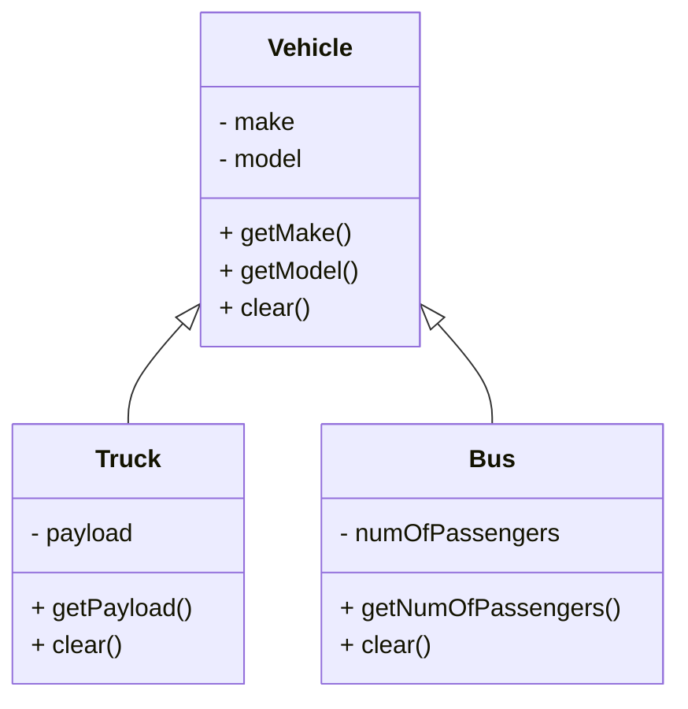

# 🧠 Object Oriented Programming – Lecture 4: Inheritance & Polymorphism

> [!overview]
> This lecture explores **class reusability**, **inheritance**, **method overriding**, **abstract classes**, and **polymorphism** in Java. It explains how inheritance enables code reuse, how polymorphism drives dynamic behavior, and how to restrict or extend class functionality effectively.

---

## 1. Class Reusability

- **Reusability** means using existing code (classes) in new programs or contexts.
- Two main forms:
  - **Composition (Has-a Relationship)** – A class contains an instance of another.
  - **Inheritance (Is-a Relationship)** – A class extends another, inheriting its members.

> [!example]
> ```java
> public class Department {
>     Employee[] employees;
> }
>
> public class Employee {
>     Department department;
> }
> ```

> [!tip]
> Use composition when relationships are **associative** and inheritance when relationships are **hierarchical**.

---

## 2. Inheritance

- **Definition:** Creating a new class (subclass) from an existing class (superclass).
- **Benefits:** Reusability, extensibility, and maintenance.
- **Syntax:**
  ```java
  public class Employee extends Person {
      private float salary;
  }
```

### Subclass Constructors

- The subclass constructor must call its superclass constructor using `super()`.
    
- The call to `super()` **must be the first statement** in the subclass constructor.
    

> [!warning]  
> Failure to invoke the superclass constructor leads to a **compilation error**.

---

## 3. Method Overriding

- **Overriding:** Redefining a method from the superclass with the **same signature** (name, parameters, and return type).
    
- Access modifier in the child method can be **same or more visible** but not less.
    

> [!example]
> 
> ```java
> public class Person {
>     public void display() {
>         System.out.println("Name = " + name);
>     }
> }
> 
> public class Student extends Person {
>     //@Override
>     public void display() {
>         System.out.println("Name = " + name + ", Marks = " + marks);
>     }
> }
> ```

### Overloading vs Overriding

|Feature|Overloading|Overriding|
|---|---|---|
|Location|Same class|Parent-child classes|
|Signature|Different parameters|Same parameters|
|Purpose|Add variations|Modify behavior|

---

## 4. Inheritance & Method Overriding Prevention

### Preventing Inheritance

- Use the `final` keyword to make a class non-extendable:
    
    ```java
    public final class Person { ... }
    ```
    

### Preventing Method Overriding

- Mark a method as `final`:
    
    ```java
    public final void display() { ... }
    ```
    

> [!note]  
> A **final class** cannot be inherited, and a **final method** cannot be overridden.

---

## 5. Abstract Classes & Methods

- **Abstract class:** A class that cannot be instantiated and may include abstract methods.
    
- **Abstract method:** Declared without implementation; must be overridden in subclasses.
    

> [!example]
> 
> ```java
> public abstract class Vehicle {
>     private String make, model;
>     public abstract void clear();
> }
> 
> public class Truck extends Vehicle {
>     @Override
>     public void clear() { this.payload = 0; }
> }
> ```

### UML Example



> [!tip]  
> Abstract classes allow **partial implementation**, forcing subclasses to **complete** the definition.

---

## 6. Polymorphism

- **Meaning:** “Many forms.” Enables the same interface to represent different data types.
    
- Two types:
    
    1. **Compile-time (Method Overloading)**
        
    2. **Runtime (Method Overriding)**
        

### Example

```java
public static void main(String[] args) {
    Vehicle v = new Truck("Ford", "Ranger");
    v.display();  // Calls Truck's display()
    v = new Bus("Toyota", "Coaster");
    v.display();  // Calls Bus's display()
}
```

> [!note]  
> Dynamic binding determines which version of a method executes **at runtime**.

---

## 7. Upcasting & Downcasting

- **Upcasting:** Assigning a subclass object to a superclass reference (implicit).
    
    ```java
    Employee e = new Manager();
    Person p = e;  // Upcasting
    ```
    
- **Downcasting:** Assigning a superclass reference to a subclass (explicit).
    
    ```java
    Employee e = (Employee) p;  // Requires explicit cast
    ```
    

> [!warning]  
> Downcasting can throw `ClassCastException` if the object is not actually of the target type.

### Using `instanceof`

```java
if (p instanceof Student) {
    Student s = (Student) p;
}
```

---

## 8. Mathematical Representation

> [!example]  
> The concept of inheritance can be represented as a subset relation:  
> $$  
> \text{Subclass} \subseteq \text{Superclass}  
> $$  
> Meaning that every instance of a subclass **is-a** member of its superclass.

---

## Glossary

|Term|Definition|
|---|---|
|**Inheritance**|Mechanism for creating a new class from an existing one.|
|**Polymorphism**|Ability of objects to take many forms via method overriding.|
|**Abstract Class**|Class that cannot be instantiated and serves as a base for others.|
|**Upcasting**|Implicit conversion from subclass to superclass.|
|**Downcasting**|Explicit conversion from superclass to subclass.|

---

## Key Takeaways

- Inheritance enables code reuse and hierarchy.
    
- Method overriding allows behavior modification in subclasses.
    
- The `final` keyword prevents unwanted inheritance or modification.
    
- Abstract classes and methods enforce structure and design contracts.
    
- Polymorphism drives dynamic and flexible program behavior.
    

---

## Further Resources

- _Oracle Java Documentation – Inheritance & Polymorphism_
    
- _Effective Java_ by Joshua Bloch (Ch. 4–6)
    
- _Java: The Complete Reference_ by Herbert Schildt, 12th Edition


#QUESTION_NEED_ANSWER
* How `product coffee drinkingproduct` Is working will product is abstract?