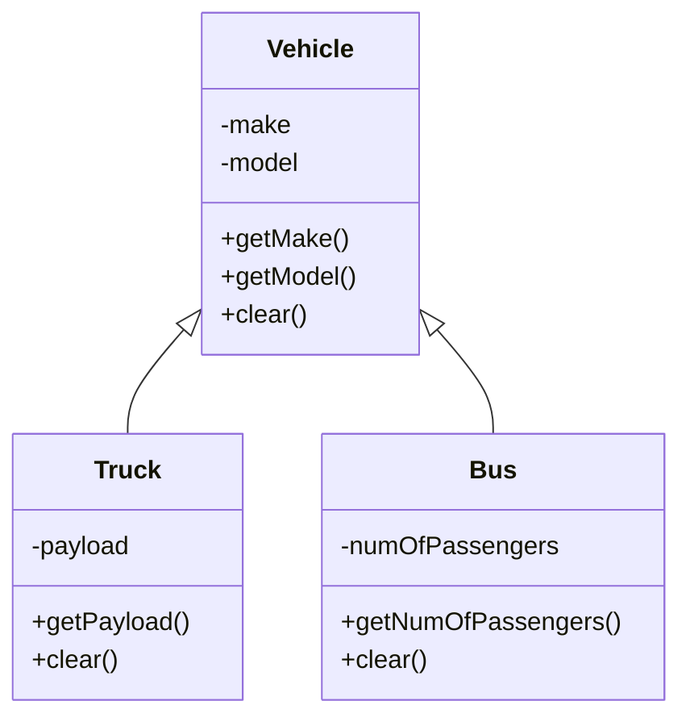
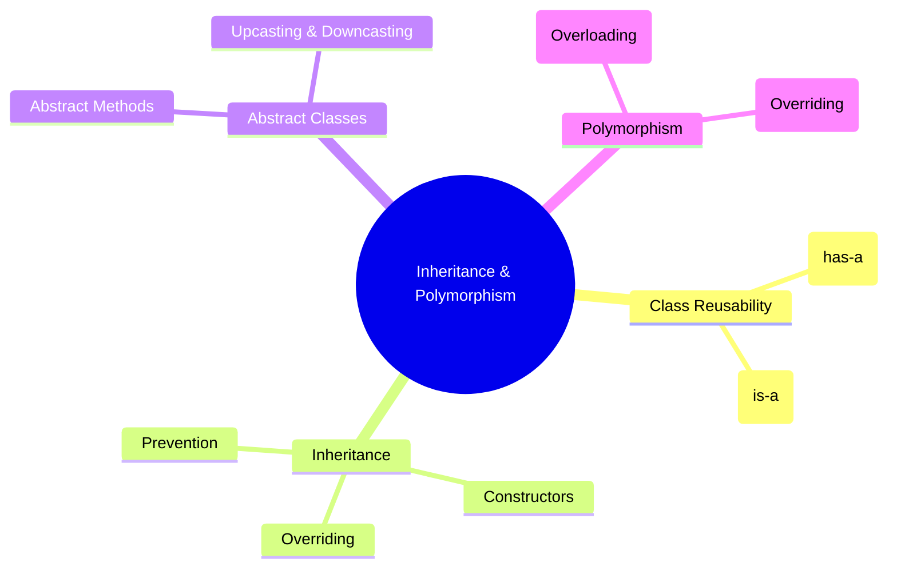

# 🧠 Object-Oriented Programming – Inheritance and Polymorphism

> [!note]
> This lecture explores **inheritance**, **method overriding**, **abstract classes**, and **polymorphism**—core OOP concepts enabling reusability, extensibility, and dynamic behavior in software design.

---

## 🧩 Continuity with Previous Lectures
> [!note]
> Builds upon prior discussions of **classes**, **objects**, and **method overloading**, extending these foundations into **reusability** and **runtime behavior** of objects.

---

## 🏗️ Class Reusability 🟢 Basic

### Composition (“has-a”)
- A class contains a **reference to another class**.
- Enables code reuse without inheritance.

```java
public class Department {
    Employee[] employees;
}

public class Employee {
    Department department;
}
```

> [!note]  
> **Composition** models a _has-a_ relationship between objects.

---

### Inheritance (“is-a”)

- A class **extends** another to reuse and specialize behavior.
    

```java
public class Employee extends Person { }
```

> [!note]  
> **Inheritance** expresses _is-a_ relationships and supports hierarchical modeling.

---

## 🧬 Inheritance 🟡 Intermediate

- **Definition:** A subclass inherits **fields and methods** from a superclass.
    
- Subclass can **add** or **override** functionality.
    
- Enables **code reuse** and **extension**.
    

```java
public class Person {
    private String name;
    String address;
    public Person(String name, String address) {
        this.name = name;
        this.address = address;
    }
}

public class Employee extends Person {
    private float salary;
}
```

### Subclass Constructors

- Must **call superclass constructor** using `super()`.
    
- Call to `super()` must be **the first statement** in the subclass constructor.
    

> [!warning]  
> If `super()` is omitted, the compiler inserts a default call to the **no-argument** superclass constructor.  
> If none exists, a **compilation error** occurs.

---

## 🔄 Method Overriding 🔴 Advanced

- A subclass defines a **method with the same name, parameters, and return type** as the superclass.
    
- Enables **behavior modification**.
    
- Must have the **same or higher** access modifier.
    
- Overridable unless marked **final**.
    

```java
public class Person {
    public void display() {
        System.out.println("Name = " + name);
        System.out.println("Address = " + address);
    }
}

public class Student extends Person {
    public void display() {
        System.out.println("Name = " + name + ", Address = " + address + ", Marks = " + marks);
    }
}
```

> [!tip]  
> **Overloading vs. Overriding:**
> 
> - Overloading → Same class, different parameters.
>     
> - Overriding → Different classes (inheritance), same method signature.
>     

---

## 🚫 Inheritance and Method Overriding Prevention 🟡 Intermediate

### Preventing Inheritance

- Use the **`final` keyword** in class declaration.
    

```java
public final class Person {
    private String name;
    String address;
}
```

> [!warning]  
> Attempting to extend a `final` class results in:  
> `Error: cannot inherit from final Person`

---

### Preventing Method Overriding

- Use **`final` keyword** in method definition.
    

```java
public class Person {
    public final void display() {
        System.out.println("Name = " + name);
        System.out.println("Address = " + address);
    }
}
```

> [!warning]  
> Overriding a `final` method triggers:  
> `Error: cannot override display() — overridden method is final`

---

## 🧱 Abstract Classes and Methods 🔴 Advanced

> [!note]  
> Abstract classes define **incomplete behavior** that must be implemented by subclasses.  
> They **cannot be instantiated directly**.

### Abstract Class Example

```java
public abstract class Vehicle {
    private String make;
    private String model;
    public Vehicle(String make, String model) {
        this.make = make;
        this.model = model;
    }
    public String getMake() { return make; }
    public String getModel() { return model; }
}
```

```java
public class Truck extends Vehicle {
    private float payload;
    public Truck(String make, String model, float payload) {
        super(make, model);
        this.payload = payload;
    }
    public float getPayload() { return payload; }
}
```

### Abstract Method

- Declared without implementation using `abstract` keyword.
    
- Must be implemented by subclasses.
    

```java
public abstract class Vehicle {
    public abstract void clear();
}
```

```java
public class Bus extends Vehicle {
    public void clear() { this.numOfPassengers = 0; }
}

public class Truck extends Vehicle {
    public void clear() { this.payload = 0; }
}
```

> [!warning]  
> Constructors and static methods **cannot** be abstract because:
> 
> - Constructors aren’t inherited.
>     
> - Static methods belong to the class, not instances.
>     

---

### UML: Abstract Class Structure



> [!tip]  
> An **abstract reference variable** can hold instances of any **non-abstract subclass**.  
> Example:
> 
> ```java
> Vehicle v = new Truck();
> v = new Bus();
> ```

---

## 🌀 Polymorphism 🔴 Advanced

### Concept

- “Many forms.”
    
- Two types:
    
    - **Compile-time:** Method overloading
        
    - **Runtime:** Method overriding (dynamic binding)
        

> [!note]  
> Dynamic binding decides **which method version** executes based on the object’s runtime type.

```java
public static void main(String[] args) {
    Vehicle v = new Truck("Ford", "Ranger");
    v.display();  // Calls Truck.display()

    v = new Bus("Toyota", "Coaster");
    v.display();  // Calls Bus.display()
}
```

> [!tip]  
> **Upcasting:** Subclass → Superclass (implicit)  
> **Downcasting:** Superclass → Subclass (explicit)

---

### Upcasting and Downcasting Examples

```java
Person p;
Employee emp = new Employee();
p = emp; // Upcasting (implicit)
```

```java
Person p = new Employee();
Employee emp = (Employee) p; // Downcasting (explicit)
```

> [!warning]  
> Downcasting may throw an exception if the actual object type is incompatible.

### instanceof Operator

```java
if (p instanceof Student) {
    System.out.println("p refers to a Student object");
}
```

---

## 🧩 Hands-On Practice

> [!example]  
> **Exercise:**  
> Create an abstract class `Employee` with field `baseSalary` and abstract method `calcSalary()`.  
> Derive subclasses:
> 
> - `Normal` → salary = base × 1.2
>     
> - `Manager` → salary = base × 1.5
>     
> - `Trainee` → salary = base × 1.0  
>     Store all in an array and compute their salaries polymorphically.
>     

---

## 🧭 Concept Hierarchy Diagram



---

## 📘 Glossary

|Term|Definition|
|---|---|
|**Inheritance**|Mechanism allowing one class to derive properties from another.|
|**Composition**|Using references to other classes for reuse.|
|**Method Overriding**|Redefining superclass behavior in subclass.|
|**Abstract Class**|A class with incomplete methods, requiring subclass implementation.|
|**Polymorphism**|Ability of an object to take multiple forms through inheritance.|

---

## 📍 Key Takeaways

- Inheritance promotes **reusability** and **hierarchical design**.
    
- Overriding allows **customizing inherited behavior**.
    
- `final` prevents inheritance or overriding.
    
- Abstract classes enable **template-based design**.
    
- Polymorphism supports **dynamic method invocation** and **flexibility**.
    

---

## 🧠 Quick Review Card

|Q|A|
|---|---|
|What is inheritance in OOP?|Mechanism for a class to reuse another’s properties and methods.|
|What keyword prevents inheritance?|`final`|
|Can abstract classes be instantiated?|No|
|What is dynamic binding?|Runtime decision of which method to call based on actual object type.|
|Difference between upcasting and downcasting?|Upcasting is implicit, downcasting is explicit.|

---

## 📚 Further Resources

- **Herbert Schildt, "Java: The Complete Reference"**
    
- **Oracle Java Tutorials: Inheritance and Polymorphism**
    
- **Head First Java – Chapter on Inheritance**
    
- **YouTube:** Telusko – “Java Inheritance & Polymorphism Explained”