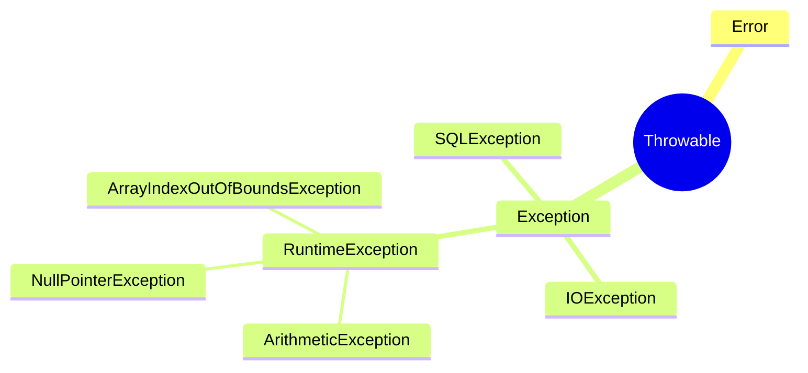
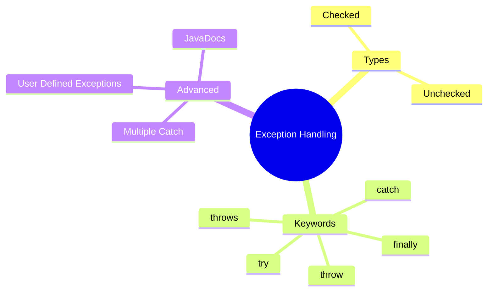

# 🧠 Object-Oriented Programming – Exception Handling & JavaDocs

> [!note]
> This lecture introduces **exception handling in Java**, covering how exceptions occur, how to handle them using `try-catch-finally`, how to define custom exceptions, and how to document code using **JavaDocs**. It also explores the distinction between **checked** and **unchecked** exceptions, best practices, and real-world use cases.

---

## 🧩 Continuity with Previous Lectures
This lecture extends the concept of **method control flow** from earlier OOP sessions. Previously, methods handled errors via conditional statements; here, **exceptions** provide a structured and reusable mechanism to handle runtime errors systematically.

---

## ⚙️ What Are Exceptions? 🟢

> [!note]
> **Exception:** An event that disrupts the normal flow of a program during execution.

When an error occurs within a method:
- The method **creates an exception object**.
- It **passes it to the runtime system** (known as *throwing an exception*).
- The runtime system searches for an appropriate **handler** (a `catch` block).

If no handler is found → the program **terminates abnormally**.

> [!example]
> Common exceptions in Java:
> - `ArithmeticException`
> - `ArrayIndexOutOfBoundsException`
> - `NullPointerException`
> - `FileNotFoundException`

---

## 💡 Why Handle Exceptions? 🟡
Letting a program crash is bad practice. Proper handling:
- Allows **recovery or retry**.
- Enables **meaningful error messages**.
- Lets you **gracefully terminate** programs.

---

## 🔧 Exception Handling Basics

### The `try-catch` Structure
```java
try {
    // Code that may throw an exception
} catch (ExceptionType e) {
    // Handler code
}
```

> [!example]  
> **Division Example**
> 
> ```java
> public float divide(int dividend, int divisor) {
>     try {
>         return dividend / divisor;
>     } catch (ArithmeticException e) {
>         System.out.println("Invalid division: cannot divide by zero.");
>         return -1F;
>     }
> }
> ```

> [!warning]  
> Failing to handle an exception (e.g., dividing by zero) causes the program to terminate with a runtime error.

---

## 🧠 Array Index Example

```java
public void displayArrayItem(int[] arr, int index) {
    try {
        System.out.println(arr[index]);
    } catch (ArrayIndexOutOfBoundsException e) {
        System.out.println("Invalid index: out of bounds.");
    }
}
```

> [!tip]  
> Think of exceptions like a **fire alarm** — the normal flow stops until someone (the `catch` block) responds.

---

## 🧩 Types of Exceptions

### 1. Checked Exceptions 🟡

> [!note]  
> **Checked exceptions** are checked at **compile time** and **must** be handled using `try-catch` or declared with `throws`.

- Extend the `Throwable` class.
    
- Examples: `IOException`, `SQLException`, `PrinterException`.
    

### 2. Unchecked Exceptions 🟢

> [!note]  
> **Unchecked exceptions** are not checked at compile time. Handling them is **optional**.

- Extend the `RuntimeException` class.
    
- Examples: `NullPointerException`, `ClassCastException`.
    

> [!tip]  
> **Mnemonic:**  
> “_Checked – must handle._  
> Unchecked – handle if you can.*”

---

## 🧱 Exception Hierarchy (Simplified)



---

## 🧰 Multiple Catch Blocks 🟡

```java
try {
    // Risky operations
} catch (IOException e) {
    System.out.println("I/O error: " + e.getMessage());
} catch (ArithmeticException e) {
    System.out.println("Math error: " + e.getMessage());
} catch (Exception e) {
    System.out.println("General error: " + e.getMessage());
}
```

> [!warning]  
> Always order exceptions from **specific → general**.  
> The `Exception` class must appear **last**.

---

## 🔁 Finally Block 🟢

> [!note]  
> The `finally` block executes **regardless** of whether an exception is thrown.  
> Commonly used to release resources (e.g., close files, database connections).

### Example

```java
public void writeArrayItemsToFile(int[] arr, int length) {
    PrintWriter writer = null;
    try {
        writer = new PrintWriter(new FileWriter("E:/input.txt"));
        for (int i = 0; i < length; i++) {
            writer.write(arr[i] + "\t");
        }
    } catch (IOException e) {
        System.out.println("I/O Error: " + e.getMessage());
    } finally {
        if (writer != null) writer.close();
    }
}
```

> [!tip]  
> Always close files in `finally` — or better yet, use **try-with-resources** in modern Java.

---

## 🎯 Throwing Exceptions 🔴

> [!note]  
> You can explicitly throw an exception using the `throw` keyword.

```java
throw new ArithmeticException("Division by zero not allowed");
```

To declare a method that might throw an exception:

```java
public void riskyOperation() throws IOException {
    // code
}
```

---

## 🧑‍💻 User-Defined Exceptions 🔴

> [!note]  
> Custom exceptions improve clarity when default Java exceptions don’t fit.

### Example

```java
public class NumberRangeException extends Exception {
    public NumberRangeException(int lower, int upper) {
        super("Number must be between " + lower + " and " + upper);
    }
}

public int add(int num1, int num2) throws NumberRangeException {
    if (num1 < 1 || num1 > 100 || num2 < 1 || num2 > 100)
        throw new NumberRangeException(1, 100);
    return num1 + num2;
}
```

> [!example]  
> Used in systems like **banking limits**, **sensor thresholds**, or **input validation**.

---

## 🧾 JavaDocs 🟢

> [!note]  
> **JavaDocs** provide structured documentation for code, aiding readability and reuse.  
> Written in `/** ... */` format and generate HTML pages describing classes and methods.

### Syntax Reference Table

|Tag|Description|
|---|---|
|`@param`|Describes method parameters|
|`@return`|Describes return value|
|`@throws`|Specifies exceptions thrown|
|`@author`|Identifies author|
|`@version`|Shows version info|
|`@deprecated`|Marks outdated methods|

### Example

```java
/**
 * Simple calculator class.
 * @author Amr
 * @version 1.0
 */
public class Calculator {

    /**
     * Adds two numbers and returns their sum.
     * @param num1 First number
     * @param num2 Second number
     * @return Sum of num1 and num2
     */
    public int add(int num1, int num2) {
        return num1 + num2;
    }
}
```

---

## 🧩 Hands-On Practice

1. **Write a program** that reads integers from a file and handles:
    
    - `FileNotFoundException`
        
    - `NumberFormatException`
        
2. **Create a custom exception** for invalid temperature input.
    
3. **Implement** a `try-catch-finally` structure that logs every execution attempt.
    
4. **Generate JavaDocs** for a small library class.
    

---

## 📊 Concept Hierarchy Diagram



---

## 📚 Glossary

|Term|Definition|
|---|---|
|**Exception**|Error event disrupting normal flow|
|**try-catch**|Block handling runtime exceptions|
|**finally**|Executes after try-catch regardless of error|
|**throw**|Manually generates an exception|
|**throws**|Declares that a method might throw an exception|
|**JavaDoc**|Java’s documentation generation tool|

---

## 🔑 Key Takeaways

- Exceptions separate **error handling** from normal logic.
    
- **Checked** exceptions → must handle; **Unchecked** → optional.
    
- `finally` ensures **resource cleanup**.
    
- **Custom exceptions** clarify error context.
    
- **JavaDocs** create professional, maintainable code documentation.
    

---

## 🧠 Quick Review Card

> **Q:** What’s the difference between checked and unchecked exceptions?  
> **A:** Checked → compile-time; must handle. Unchecked → runtime; optional.

> **Q:** What is the purpose of the `finally` block?  
> **A:** To ensure cleanup actions run regardless of exceptions.

> **Q:** How to define a custom exception?  
> **A:** Extend `Exception` or `RuntimeException`.

> **Q:** What does `throw` do?  
> **A:** Creates and sends an exception object to the runtime.

> **Q:** What is a JavaDoc comment format?  
> **A:** `/** ... */` before class or method with tags like `@param`, `@return`.

---

## 📘 Further Resources

- Oracle Docs – _Java Exceptions Tutorial_
    
- “Effective Java” by Joshua Bloch, Chapter 10
    
- Java SE Documentation – _JavaDoc Tool Guide_
    
- W3Schools – _Java Exception Handling_
    
- Baeldung – _Comprehensive Guide to Java Exceptions_
    

---