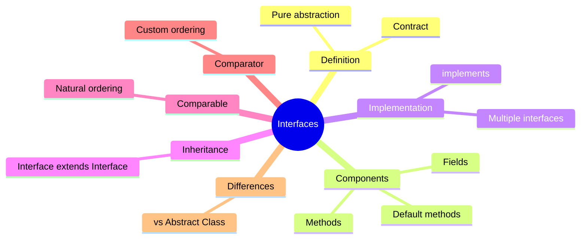

> [!note] Overview  
> This lecture introduces **Java interfaces**, their purpose, structure, default methods, inheritance, and practical usage. It also covers **Comparable** and **Comparator** for object comparison and sorting, and contrasts **interfaces vs abstract classes**.

---

## 🚀 Continuity With Previous Lectures
- Builds on **abstraction** and **polymorphism** foundations.
- Interfaces extend the abstraction model without the constraints of single inheritance.
- Sets the stage for upcoming topics like **Java Collections**, which heavily rely on Comparable/Comparator.

---

# 1. What are Interfaces? 🟡

> [!note] Definition  
> An **interface** is a **pure abstract type** in Java. It defines a **contract** that implementing classes must follow.  
> It cannot be instantiated and contains **abstract behaviors** a class must fulfill.

### Core Characteristics
- All variables are **public static final** by default.
- All methods are **public abstract** by default.
- Supports **multiple inheritance** (unlike classes).
- A class **must override all abstract methods** unless it is abstract.

---

# 2. Interface Components 🟢

### Fields
- Always **public static final**.
- Cannot be private/protected.

### Methods
- Default: **public abstract**.
- Java 8 introduced **default methods** with bodies.
- Default methods are implicitly **public**.

> [!example] Example  
>
> ```java
> public interface Calculator {
>     int MIN_NUMBER = 0;
>     int MAX_NUMBER = 100;
> 
>     int add(int a, int b);
>     int subtract(int a, int b);
> 
>     default int multiply(int a, int b) {
>         return a * b;
>     }
> }
> ```
> 

---

# 3. Implementing Interfaces 🟢

> [!note] Implementation Rules
> 
> - Use the `implements` keyword
>     
> - **Must** **override** all abstract methods
>     
> - **Cannot** define **constructors** in an interface
>     
> - Implementing class **may override default methods**
>     

```java
public class SimpleCalculator implements Calculator {
    @Override
    public int add(int a, int b) { return a + b; }

    @Override
    public int subtract(int a, int b) { return a - b; }
}
```

---

# 4. Default Methods in Interfaces 🟡

### Purpose

- Allow **non-breaking updates** to existing interfaces.
    
- Provide a **default implementation** to avoid forcing all implementing classes to update.
    

### Example Problem

Changing an interface by adding a new method breaks all implementing classes.

### Solution

Use **default methods**.

> [!example] Example
> 
> ```java
> public interface Vehicle {
>     float speedUp();
>     default float slowDown() {
>         return 0.0F;
>     }
> }
> ```

Now, existing implementations continue to function without modification.

> [!tip] Mnemonic  
> **“Default means backward-safe”** → If a method is added with a default implementation, existing code survives.

---

# 5. Interface Inheritance 🟡

### Key Rules

- Interfaces can extend other interfaces.
    
- A class implementing a child interface must implement all parent methods.
    

```java
public interface ScientificCalculator extends Calculator {
    float sin(int angle);
    float cos(int angle);
}
```

> [!warning]  
> Java supports **multiple inheritance only through interfaces**, <font color="#ff0000">not classes</font>.

---

# 6. Comparable Interface 🟡

### Purpose

Defines **natural ordering** of objects.

```java
public class Student implements Comparable {
    private int id;
    private String name;
    private float marks;

    public Student(...) { ... }

    @Override
    public int compareTo(Object obj) {
		Student otherStudent = (Student) obj;
		if(this.id < otherStudent.id){
			return -1;
		} else if(this.id > otherStudent.id) {
			return 1;
		} else {
			return 0;
		}
    }
}
```

> [!note] Return Values
> 
> - **Negative** → current < other
>     
> - **Zero** → current == other
>     
> - **Positive** → current > other
>     

> [!example] Sorting
> 
> ```java
> Arrays.sort(studentArray); // Uses natural ordering
> ```

> [!tip] Mnemonic  
> **Comparable = “I compare myself.”**  
> compareTo(this, other)

---

# 7. Comparator Interface 🟡

### Purpose

Provides **custom, alternative ordering** separate from natural ordering.

```java
public class StudentComparator implements Comparator {
    @Override
    public int compare(Object o1, Object o2) {
       Student student1 = (Student) obj1;
		Student student2 = (Student) obj2;
		if(student1.marks < student2.marks){
			return -1;
		} else if(student1.marks > student2.marks) {
			return 1;
		} else {
			return 0;
		}
    }
}
```

> [!example] Usage
> 
> ```java
> Arrays.sort(studentArray, new StudentComparator());
> ```

> [!tip] Mnemonic  
> **Comparator = “I compare two others.”**

---

## 8. Interfaces vs Abstract Classes 🔴

> [!note] High-Level Differences  
> | Feature | Interface | Abstract Class |  
> |--------|-----------|----------------|  
> | Methods | abstract + default | abstract + concrete |  
> | Fields | public static final | any access modifier |  
> | Inheritance | multiple | single |  
> | Constructors | not allowed | allowed |  
> | Use Case | capability/behavior | shared structure + partial implementation |

![[Pasted image 20251124135230.png]]
![[Pasted image 20251124135237.png]]

> [!tip] Mnemonic  
> **“Interface = What you can do; Abstract class = What you are.”**

---

# 9. Lecture Questions (Extracted)

> [!question]
> 
> - “How to use interfaces?”
>     
> - “Can you think of some interfaces?”
>     
> - “What would happen if we change the interface?”
>     
> - “Would that class work now?”
>     

---

# 10. 🧩 Hands-On Practice

### Exercise 1

Modify Student comparison to sort by **name descending** using Comparable.

### Exercise 2

Create a Comparator to sort students by **marks ascending**.

### Exercise 3

Add a new method to an interface and implement it using a **default method** to avoid breaking code.

---

# 11. Concept Hierarchy Diagram



---

# 📚 Glossary

- **Interface** → A pure abstract type defining a contract for behavior.
    
- **Default Method** → A method inside an interface with a body.
    
- **Comparable** → Interface for natural ordering.
    
- **Comparator** → Interface for custom ordering.
    
- **Multiple Inheritance** → Achieved only through interfaces in Java.
    

---

# 🔍 Key Takeaways

- Interfaces define behavior without implementation.
    
- Default methods allow safe evolution of interfaces.
    
- Comparable gives **natural ordering**, Comparator gives **custom ordering**.
    
- Java uses interfaces to enable multiple inheritance.
    
- Interfaces vs abstract classes differ in purpose and structure.
    

---

# 🧠 Quick Review Card

**Q:** What is a Java interface?  
**A:** A pure abstract contract that classes implement.

**Q:** Why use default methods?  
**A:** To avoid breaking existing implementations when adding new methods.

**Q:** Comparable vs Comparator?  
**A:** Comparable → natural ordering; Comparator → custom ordering.

**Q:** Can interfaces have fields?  
**A:** Yes, but they are always public static final.

**Q:** Can interfaces extend other interfaces?  
**A:** Yes—enabling multiple inheritance.

---

# 📘 Further Resources

- _Effective Java_ – Joshua Bloch
    
- Oracle Java Tutorials – Interfaces
    
- Java Language Specification – Interfaces
    
- Head First Java – Interface examples and exercises
    

```

---

If you'd like, I can also generate **Lecture 7** automatically when you upload it.
```