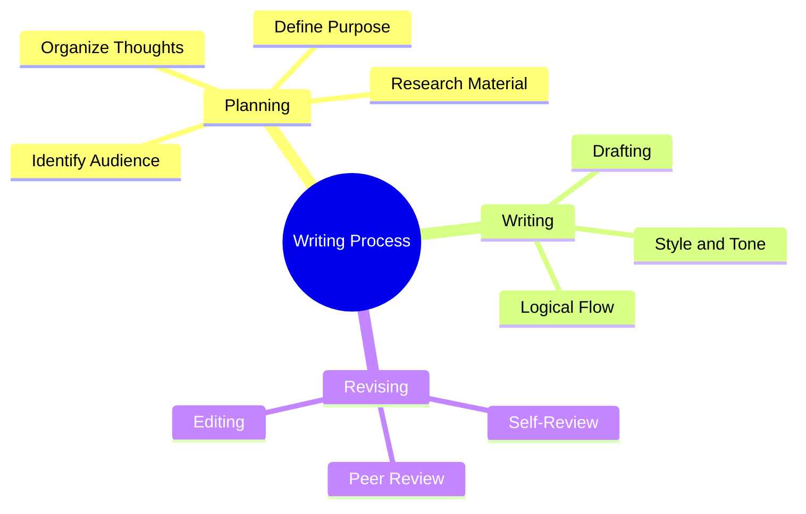

> [!note]
> This lecture introduces **soft skills** as foundational to effective communication and technical writing. It emphasizes clarity, planning, revision, and the elimination of clutter to achieve professional-level written communication.

---

## 🧩 Continuity with Previous Lectures
> [!note]
> As the first lecture, this session sets the foundation for report writing, communication skills, and professional behavior in technical environments. Future lectures will expand on specific writing types such as emails, reports, and presentations.

---

## 🎯 Course Objectives
- Prepare students to write professional reports and assignments.  
- Understand report organization and correct section structuring.  
- Develop writing style and clarity.  
- Analyze and prepare report content effectively.  
- Integrate **logical thinking** into the writing process.  
- Learn **online research and information retrieval** techniques.  

---

## 📚 Course Topics Overview
1. Good Technical Writing / Writing Skills  
2. Email Etiquette  
3. Reports (1,2,3)  
4. Presentation Skills  
5. CV Writing  
6. Minutes of Meeting  
7. Business Letters  
8. Writing in Computer Science  
9. Persuasive Writing  
10. Writing in Software Houses  

---

## 💼 Soft Skills Overview

> [!note]
> **Soft skills** are personal attributes that enhance an individual’s **interaction, career prospects, and job performance**. They relate to **Emotional Intelligence (EQ)** and determine how effectively one collaborates, communicates, and adapts.

### Key Elements of Soft Skills 🟢
- **Communication Skills**
- **Time Management**
- **Organizational Skills**
- **Analytical and Critical Thinking**
- **Problem Solving**
- **Creativity**
- **Motivation**
- **Writing Skills**

---

## 🗣 Communication Skills
> [!note]
> Communication is both **verbal and non-verbal**, covering listening, speaking, writing, and team collaboration.

**Components:**
- Listening and Speaking  
- Reading and Writing  
- Non-verbal Communication  
- Presentation Skills  
- Teamwork  
- Customer Service  
- Professional Behavior  

---

## 🧱 Technical Writing Foundations

> [!note]
> **Technical writing** involves conveying complex information clearly to enable readers to **complete tasks or understand processes**.

### Examples of Technical Writing 🟡
- Contracts and Design Documents  
- Requirements Specifications  
- Project Documents  
- User Manuals and Training Material  
- Product Catalogues  
- FAQs and Online Help  
- Emails, Memos, Business Letters  

---

## ✍️ Becoming a Good Technical Writer

> [!note]
> Writing well is a skill that can be **learned through discipline and revision**. It requires clarity, logic, and simplicity.

### Core Principles
1. **Clarity above all** – Write with grammatical and structural accuracy.  
2. **Respect the reader’s time** – Be concise and purposeful.  
3. **Craft your voice** – Match tone to audience; be confident, not arrogant.  
4. **Collaborate and edit** – Seek editors and feedback.

> [!example]
> Poor: “I think we might consider testing the module soon.”  
> Improved: “Test the module by Thursday to verify integration.”

---

## 🧠 Writing Process

### Three Phases
1. **Planning / Rethinking**  
   - Know your **audience**, **purpose**, and **material**.  
   - Allocate time for writing and revision.  
2. **Writing**  
   - Follow a logical structure; be direct.  
3. **Revising**  
   - Refine content for clarity, brevity, and precision.

---

## 🧩 Hands-On Practice

> [!example]
> **Task:** Rewrite this sentence to remove redundancy.  
> “An IQ test measures an individual’s ability to perform functions in verbal communication, reasoning, and performance on motor and spatial tasks.”  
>
> ✅ **Revised:** “An IQ test measures verbal, reasoning, and spatial abilities.”

---
## Writing Tips
- Having a **unique personal writing style** guarantees **poor technical writing**.
    
- **Avoid writing as you might speak**.
    
- **Use simple, direct sentences**.
    
- **Balance brevity and completeness** — be concise without omitting key details.
    
- **Do not underestimate layout and design**; visual clarity improves comprehension.
    
- **Choose sentence length carefully**:
    
    - Ideal length: **10–15 words**.
        
    - Never go below **7 words** or beyond **20 words** for readability.
        
    - Very short sentences may appear **cheap or abrupt**; overly long ones become **confusing**.
        
- **Never use “I”** in technical writing; maintain **objectivity**.
    
- **Avoid strong words** (e.g., “always,” “never,” “perfect,” “best”).
    
- **Avoid big or complex words** when simpler alternatives exist.

---

## 🧠 Principles of Effective Writing 🔴

> [!note]
> “The secret of good writing is to strip every sentence to its cleanest components.” – *William Zinsser, 1976*

### Guidelines
- Remove **unnecessary words** and **empty phrases**.  
- Prefer **short, active sentences**.  
- Avoid **personal pronouns** like *I*.  
- Use **simple vocabulary** over complex jargon.  
- Balance **brevity** and **completeness**.

> [!warning]
> Avoid over-short sentences that sound abrupt or robotic. Variety improves readability.

---

## 🧹 Common Writing Issues

| Problem Type        | Examples                  | Correction             |
| ------------------- | ------------------------- | ---------------------- |
| Dead weight phrases | “It can be regarded that” | Delete or simplify     |
| Empty phrases       | “basic principles of”     | Specify meaning        |
| Long phrases        | “give rise to” → “cause”  | Shorten                |
| Jargon              | “miR”, “gliomagenesis”    | Avoid unless necessary |
| Redundancy          | “illustrate/demonstrate”  | Choose one             |
| Weak adverbs        | “very, really, quite”     | Eliminate              |

> [!tip]
> Replace negatives with concise positives:  
> “Not honest” → “Dishonest”  
> “Did not remember” → “Forgot”

---
## 🧹 Common Clutter

> [!note]
> Clutter weakens technical writing by introducing unnecessary words, jargon, or repetition. Clear writing demands concise, direct language.

### 🔸 Types of Clutter

1. **Dead weight words and phrases**  
   - “As it is well known”  
   - “As it has been shown”  
   - “It can be regarded that”  
   - “It should be emphasized that”

2. **Empty words and phrases**  
   - “basic principles of”  
   - “methodologic”  
   - “important”

3. **Unnecessary jargon and acronyms**  
   - “muscular and cardiorespiratory performance”  
   - “Gliomagenesis”  
   - “miR”

4. **Repetitive words or phrases**  
   - “illustrate/demonstrate”  
   - “challenges/difficulties”  
   - “successful solutions”

5. **Adverbs**  
   - “very”  
   - “really”  
   - “quite”  
   - “basically”  
   - “generally”

---

## ✂️ Long Words and Phrases That Could Be Shortened

| Wordy Phrase | Concise Alternative |
|--------------|--------------------|
| A majority of | Most |
| A number of | Many |
| Are of the same opinion | Agree |
| Less frequently occurring | Rare |
| All three of the | The three |
| Give rise to | Cause |
| Due to the fact that | Because |
| Have an effect on | Affect |

> [!tip]
> Favor short, precise words to maintain clarity and reader engagement.

---

## 🔁 Eliminate Negatives

| Wordy / Negative Expression | Simplified Positive Form |
|------------------------------|---------------------------|
| Not honest | Dishonest |
| Not harmful | Safe |
| Not important | Unimportant |
| Does not have | Lacks |
| Did not remember | Forgot |
| Did not pay attention to | Ignored |
| Did not succeed | Failed |

> [!tip]
> Replacing negatives with their positive equivalents strengthens tone and improves readability.

---

## 🧠 General Writing Insights

- Writing improves **by consistent practice**.  
- **Revision** is essential for quality.  
- **Good layout and design** aid comprehension.  
- Avoid **academic over-complexity**; write to engage.  
- **Never attach ego** to your words; rewrite freely.

---

## 🧩 Hands-On Practice 2

> [!example]
> **Exercise:** Revise this bloated statement:  
> “Due to the fact that the system does not have the required parameters, it did not succeed in the implementation process.”  
>
> ✅ **Revised:** “The system lacked parameters and failed to implement.”

---

## 📖 Glossary

| Term | Definition |
|------|-------------|
| **Soft Skills** | Interpersonal abilities that enhance communication and teamwork. |
| **Technical Writing** | Structured communication of technical information. |
| **Clarity** | The quality of being easy to understand. |
| **Conciseness** | Expressing much with few words. |
| **Revision** | The process of improving drafts through editing and feedback. |

---

## 📌 Key Takeaways
- **Soft skills** drive technical and professional success.  
- **Effective writing** depends on clarity, planning, and revision.  
- **Eliminate clutter** to enhance reader understanding.  
- **Editing and feedback** are integral to improvement.  
- Writing is **learned by doing**, not by inspiration.

---

## 🎓 Quick Review Card

| Question | Answer |
|-----------|---------|
| What are soft skills? | Personal attributes enhancing interaction and job performance. |
| What are the phases of writing? | Planning, Writing, Revising. |
| What weakens a sentence? | Unnecessary words, adverbs, or passive constructions. |
| Why avoid “I” in technical writing? | It reduces objectivity and professionalism. |
| How can writing skills improve? | Through practice, revision, and feedback. |

---

## 📘 Further Resources
- *William Zinsser, “On Writing Well” (1976)*  
- Purdue OWL – Technical Writing Guidelines  
- Coursera: “Effective Communication for Engineers”  
- IEEE Author Center – Technical Writing Resources  
