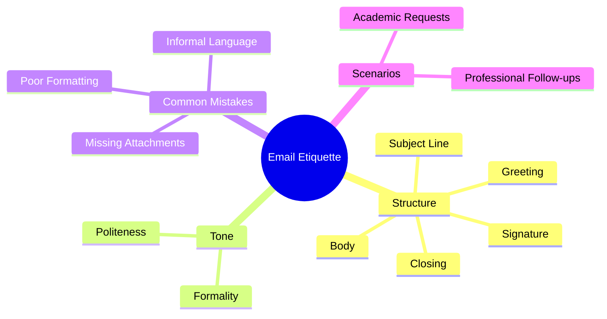

# 🧠 Report Writing – Lecture 2: Email Etiquette

> [!note]
> This lecture introduces the principles of **Email Etiquette**, focusing on how to compose effective, respectful, and professional emails for academic and business contexts.  
> It outlines structure, tone, common mistakes, and writing conventions essential for clear and polite digital communication.

---

## 📘 Continuity with Previous Lecture
- Builds upon **Lecture 1: Introduction to Professional Writing**.  
- Moves from **general writing conventions** to **digital communication** using email.  
- Emphasizes applying written communication rules in **academic and workplace correspondence**.

---

## 1. Understanding Email Etiquette 🟢
> [!note]
> **Email etiquette** is the use of proper language, structure, and tone when communicating via email.  
> It ensures professionalism, clarity, and respect for the recipient.

### Importance
- Demonstrates professionalism and good manners.  
- Reflects positively on the sender.  
- Helps ensure that messages are understood and receive timely responses.

---

## 2. Basic Structure of a Professional Email 🟢
Every email should include the following key components:

1. **Subject Line** – concise and relevant summary of the email.  
2. **Greeting/Salutation** – polite and context-appropriate.  
3. **Email Body** – organized and focused content.  
4. **Closing/Sign-off** – courteous end to the message.  
5. **Signature** – personal identification and contact details.

> [!example]
> ```
> Subject: Inquiry About Project Presentation Deadline
>
> Dear Dr. Ahmed,
>
> I hope this email finds you well. I am writing to confirm the final submission deadline for the group presentation, as the course portal shows two different dates.
>
> Thank you for your time and clarification.
>
> Best regards,  
> Amr Khaled  
> Computer Science Student, ASU
> ```

---

## 3. Subject Line Tips 🟢
> [!note]
> The **subject line** should summarize the email’s purpose in a few words.

### Tips
- Be clear, short, and specific (max 7–8 words).  
- Avoid vague or empty titles (e.g., *Hi*, *Question*, *Help!*).  
- Use action or topic keywords.

> [!example]
> ✅ *Meeting Agenda for Thursday, Oct 31*  
> ❌ *Important!!!* or *Quick Question*

---

## 4. Greeting and Salutation 🟢
> [!note]
> A professional greeting shows respect and sets the tone for your email.

| Context | Appropriate Greeting |
|----------|----------------------|
| Academic | Dear Dr./Professor [Last Name], |
| Workplace | Dear Mr./Ms. [Last Name], |
| Semi-Formal | Hello [First Name], |

> [!warning]
> Avoid “Hey,” “Hiya,” or using no greeting at all in formal emails.

---

## 5. Writing the Body of the Email 🟡

### Tips for a Clear Body
- Start with your purpose in the first line.  
- Use **short paragraphs** (2–3 sentences each).  
- Be polite and professional; avoid slang or abbreviations.  
- Use bullet points or numbering when listing.  
- Keep sentences clear and focused.

> [!example]
> ```
> Dear Professor,
>
> I would like to request feedback on my research proposal before next week’s submission.  
> Please let me know if you are available for a short meeting on Thursday morning.
>
> Thank you in advance for your time.
>
> Best regards,  
> Amr
> ```

---

## 6. Closing and Signature 🟢
> [!note]
> A courteous closing reinforces professionalism and respect.

### Common Closings
| Formal | Semi-Formal |
|--------|--------------|
| Best regards, | Kind regards, |
| Sincerely, | Thank you, |
| Yours faithfully, | Yours truly, |

### Signature Example
> [!example]
> ```
> Amr Khaled  
> Front-End Developer | Computer Science Student  
> amr.khaled@example.com  
> LinkedIn: linkedin.com/in/amrkhaled
> ```

> [!tip]
> Always include a **full signature block** in academic or professional emails.

---

## 7. Tone and Formality 🟡
> [!note]
> Tone reflects your attitude and professionalism. Maintain a respectful, calm, and polite tone at all times.

### Guidelines
- Avoid **ALL CAPS** and multiple exclamation marks.  
- Be polite even in disagreement.  
- Use neutral phrasing instead of emotional language.  
- Tailor tone to context (academic vs. business).

> [!example]
> ✅ *“Could you please review the attached document by Friday?”*  
> ❌ *“Please check this ASAP!!!”*

> [!warning]
> Informal language or an abrupt tone may appear disrespectful or unprofessional.

---

## 8. Common Email Mistakes 🔴

> [!warning]
> Avoid these common errors:
> - Forgetting the **subject line**.  
> - Using **improper greetings** (e.g., “Hey”).  
> - Writing **long, unstructured paragraphs**.  
> - Using **slang, abbreviations, or emojis**.  
> - Failing to attach mentioned files.  
> - Forgetting a **thank-you** or closing.  
> - Using “Reply All” inappropriately.

---

## 9. Real-World Scenarios 🟡

### Academic Request
> [!example]
> ```
> Subject: Request for Recommendation Letter
>
> Dear Dr. Alshaimaa,
>
> I hope you are doing well. I am applying for the Summer Internship Program at IBM and would be honored if you could write a recommendation letter for me.
>
> Please let me know if you need my CV or transcript.
>
> Kind regards,  
> Amr Khaled
> ```

### Business Email
> [!example]
> ```
> Subject: Follow-Up: Website Design Proposal
>
> Dear Ms. Rana,
>
> Thank you for our meeting last week. Attached is the updated proposal reflecting your feedback.
>
> Please confirm a suitable time for a follow-up meeting next week.
>
> Best regards,  
> Amr Khaled  
> Front-End Developer, Seratok Project
> ```

---

## 🧩 Hands-On Practice
1. Write a polite email to your instructor requesting feedback on your report.  
2. Rewrite an informal email using professional tone and structure.  
3. Compose a follow-up email after submitting a job application.  
4. Draft an apology email for a missed meeting.

---

## 🧠 Concept Hierarchy Diagram


---

## 📚 Glossary

|Term|Definition|
|---|---|
|**Etiquette**|Set of rules governing polite and respectful communication.|
|**Subject Line**|Short summary of email content.|
|**Tone**|Writer’s attitude conveyed through word choice and phrasing.|
|**Signature Block**|Section including sender’s name, position, and contact info.|
|**Reply All**|Function sending an email to every recipient in a thread.|

---

## 🏁 Key Takeaways

- A professional email must have a **clear subject, greeting, structured body, closing, and signature**.
    
- Maintain a **formal and respectful tone**.
    
- Proofread carefully before sending.
    
- Avoid slang, emojis, and unstructured text.
    
- Remember that **email represents your professionalism**.
    

---

## 🎯 Quick Review Card

|Question|Answer|
|---|---|
|What are the 5 parts of an email?|Subject, Greeting, Body, Closing, Signature.|
|What’s the main goal of email etiquette?|To communicate clearly and respectfully.|
|What’s one rule for subject lines?|Keep them short, clear, and relevant.|
|How should you start an academic email?|With a polite greeting like “Dear Professor [Name],”.|
|Why should you proofread before sending?|To ensure professionalism and avoid mistakes.|

---

## 🔗 Further Resources

- _The Essentials of Business Etiquette_ – Barbara Pachter
    
- Purdue OWL: [Email Etiquette for Students](https://owl.purdue.edu/owl/general_writing/email_etiquette.html)
    
- Coursera: _Writing Professional Emails in English_
    
- ASU Writing Center: _Professional Communication Guidelines_
    