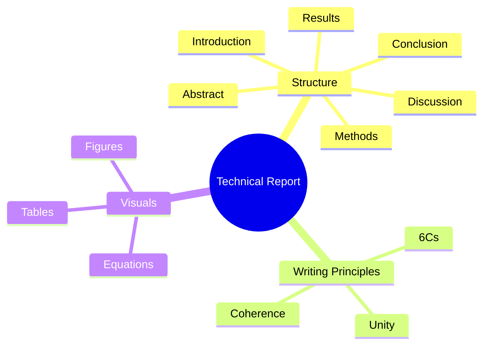

# 🧠 Report Writing – Technical Reports (Part 1)

> [!note] **Overview**  
This lecture introduces the structure, components, and writing techniques of **technical reports**, emphasizing clarity, completeness, and professionalism. It also contrasts the **abstract** and **conclusion**, explains report organization, paragraph structure, and provides formatting and visual presentation guidelines.

---

## 📘 Continuity with Previous Lectures
Builds upon earlier discussions on **effective writing and structure**, focusing now on applying these principles to **technical and academic reports** such as theses, research papers, and business plans.

---

## 🧩 Types of Reports
> [!note]
Common report types include:
- **Technical Reports** – Course or graduation projects  
- **Business Plans** – Market or product strategy documents  
- **Research/Scientific Papers** – Present new algorithms or experiments  
- **Academic Overviews** – Present a scientific topic from multiple perspectives  
- **Book Reports** – Summarize and evaluate written works  
- **Theses** – Comprehensive academic research projects  

> [!example]
A *technical report* may detail an engineering project’s design and testing.  
A *business plan* might propose a new app with financial projections.

---

## ✅ Good Writing Principles (6Cs)
> [!note]
>1. **Completeness** – Include all necessary information.  
>2. **Correctness** – Ensure factual accuracy.  
>3. **Credibility** – Support claims with evidence.  
>4. **Clarity** – Avoid vagueness or ambiguity.  
>5. **Conciseness** – Be direct and precise.  
>6. **Consideration** – Anticipate reader expectations.

> [!tip]
**Mnemonic:** *3C Writing* → *Complete, Clear, Concise* — then add *Correct, Credible, Considerate.*

🟢 Basic

---

## 🧱 Report Structure and Writing Order

> [!note]
**Sections of a Report**
>1. **Acknowledgment** *(optional)* – Who helped me out?  
>2. **Abstract** – What did I do in a nutshell?  
>3. **Introduction** – What is the problem?  
>4. **Materials and Methods** – How did I solve the problem?  
>5. **Results** – What did I find out?  
>6. **Discussion** – What does it mean?  
>7. **Conclusion** – What was done?  
>8. **Appendices** *(optional)* – Extra information.  
>9. **References** – Whose work did I refer to?

> [!tip]
**Mnemonic:** *AIMRDCAR* → *Acknowledgment, Introduction, Methods, Results, Discussion, Conclusion, Appendices, References.*

## Writing order (MR.CIA)
- Material and Methods
- Results and Discussion
- Conclusion
- Introduction
- Abstract

🟢 Basic

---

## 🙏 Acknowledgment
> [!example]
> “I would like to thank my family for their support and Dr. King for her guidance.”

> [!warning]
Avoid overly emotional or repetitive thanks. Focus on professional acknowledgments only.

🟢 Basic

---

## 🧾 Abstract

> [!note]
The **Abstract** is a concise summary including:
>- Topic and purpose  
>- Need for the work  
>- Methods and scope  
>- Optional: key results or conclusions  

> [!warning]
Do **not** include:
>- Figures, tables, references, acronyms, or lengthy background.

> [!example]
> “This project describes a new inertial navigation system that increases mapping accuracy by a factor of ten…”

> [!tip]
**Mnemonic:** *TPMSR* → *Topic, Purpose, Method, Scope, Results.*

> [!question]
What should be avoided when writing an abstract?

🟡 Intermediate

---

## ⚖️ Abstract Rules
- Follow report chronology.  
- Use past or present tense, **not future**.  
- Avoid “I” or “we.”  
- Meet word count limits.

🟢 Basic

---

## ❌ Bad Abstract Example
> [!example]
> “We present a framework for an engineering capstone program…”

> [!warning]
Errors:
>- Uses **first person** (“We”).  
>- Uses **future tense**.  
>- **No results** included.  
>- Describes structure, not findings.

🟡 Intermediate

---

## 🔍 Introduction
> [!note]
Typical content:
>1. Introduce **field and context**.  
>2. Summarize **previous research**.  
>3. Define **the problem or gap**.  
>4. Introduce **your work, objectives, and methods**.  
>5. Provide a **road map** of report sections.

> [!example]
> “Machine learning has become essential in predictive analytics; however, few studies address model interpretability…”

> [!warning]
Avoid excessive detail, poor organization, or unclear problem definition.

🟡 Intermediate

---

## 🧭 Conclusion

> [!note]
Key points:
>- Briefly restate purpose, findings, and recommendations.  
>- Link back to research context.  
>- Mention future work.

> [!warning]
Avoid:
>- Introducing **new ideas** or **emotional appeals**.  
>- Using phrases like *“In conclusion”* or *“In summary.”*

> [!example]
> “Design 1 is preferable due to its durability, lower cost, and ease of construction.”

> [!tip]
**Mnemonic:** *PRF → Purpose, Results, Future work.*

🟡 Intermediate

---

## ⚔️ Abstract vs. Conclusion

| Aspect | **Abstract** | **Conclusion** |
|--------|---------------|----------------|
| Position | Before body | Inside body |
| Purpose | Attract reader, summarize entire report | Reinforce value and results |
| Content | Brief overview (no tables/figures) | May include figures/tables |
| Focus | Overview and motivation | Implications and significance |
| Future Work | Optional | Common |

🟢 Basic

---

## 🧮 Report Front Matter

> [!note]
**Includes:**
>- Title Page  
>- Abstract  
>- Table of Contents  
>- List of Figures & Tables  
>- List of Abbreviations  

> [!tip]
Use **lowercase Roman numerals (i, ii, iii)** for front matter; **Arabic (1, 2, 3)** for body.

🟢 Basic

---

## 🧩 Report Body Essentials

### Paragraph Guidelines
- **Unity** – One idea per paragraph.  
- **Coherence** – Logical flow using transitions.  
- **Parallelism** – Maintain tense and structure.  

### Paragraph Structure
1. **Topic Sentence** – Introduce main idea.  
2. **Development Sentences** – Explain or provide examples.  
3. **Concluding Sentence** – Summarize and link to next idea.

> [!example]
> “Cities have grown due to industrialization, education, and cultural opportunities.”

> [!warning]
Avoid paragraphs that are **too long** (multiple ideas) or **too short** (insufficient development).

🟡 Intermediate

---

## 📊 Visual Aids and Data

> [!note]
**Tables:** For precise numeric data, comparisons, or presence/absence.  
**Figures:** For trends, architecture, or summarized visuals.  
**Text:** For brief or simple data.

> [!example]
> “As shown in Table 1, only 21% of respondents knew how to administer CPR.”

> [!tip]
Number separately: *Table 1, Figure 1,* etc.  
Tables → title above; Figures → title below.

🟢 Basic

---

## 🧮 Equations
- Centered on the page  
- Numbered (e.g., Eq. (1))  
- Reference as “Eq. (1)” in text  
- For multi-chapter reports: use *Chapter#.Equation#*

🟢 Basic

---

## 🎨 Formatting and Style

- Use clear fonts (**Times New Roman** or **Arial**).  
- Consistent font usage.  
- Use **bold headings** and **white space** for readability.  
- Avoid **Comic Sans** or decorative fonts.  
- Limit headings to **three levels**.

🟢 Basic

---

## 🧠 Concept Hierarchy Diagram

---

## 🧩 Hands-On Practice

1. Write an **abstract** summarizing your semester project in ≤150 words.
    
2. Identify one **poor abstract** and rewrite it using _TPMSR_.
    
3. Create a **table** and **figure** for a dataset from your project.
    
4. Draft a **topic sentence** for a paragraph on report clarity.
    

---

## 📚 Glossary

- **Abstract:** Summary of report objectives, methods, and results.
    
- **Introduction:** Context and problem definition.
    
- **Discussion:** Interpretation of findings.
    
- **Conclusion:** Final synthesis and future outlook.
    
- **Front Matter:** Preliminary pages (title, abstract, contents).
    
- **6Cs:** Core writing principles ensuring quality communication.
    

---

## 🔑 Key Takeaways

- Every section has a defined purpose and order.
    
- Abstract ≠ Conclusion.
    
- Clarity and organization define report quality.
    
- Visuals must complement text, not replace it.
    
- Formal tone and structure maintain credibility.
    

---

## 🧩 Quick Review Card

**Q1:** What are the 6Cs of good writing?  
**A:** Completeness, Correctness, Credibility, Clarity, Conciseness, Consideration.

**Q2:** What should an abstract never include?  
**A:** Figures, tables, references, or acronyms.

**Q3:** What tense should conclusions use?  
**A:** Present or past tense, not future.

**Q4:** Difference between abstract and conclusion?  
**A:** Abstract summarizes; conclusion synthesizes and interprets.

**Q5:** How are tables and figures numbered?  
**A:** Separately, with tables titled above and figures below.

---

## 📖 Further Resources

- _Alley, M._ (2018). **The Craft of Scientific Writing**. Springer.
    
- _Pears, R., & Shields, G._ (2019). **Cite Them Right**.
    
- Purdue OWL: [Technical Report Writing Guide](https://owl.purdue.edu/)
    
- IEEE Author Center: [Writing Effective Abstracts](https://journals.ieeeauthorcenter.ieee.org/)