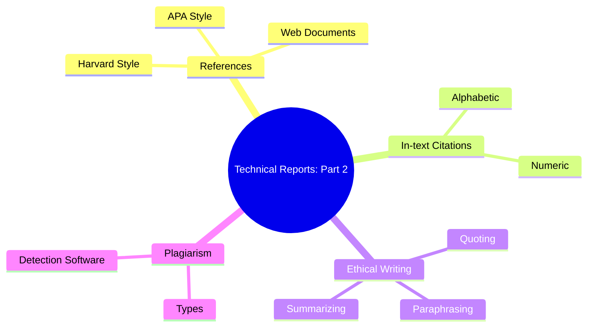

# 🧠 Report Writing – Technical Reports (Part 2)

> [!note] **Overview**
> This lecture focuses on **referencing styles**, **citation methods**, **plagiarism**, and techniques such as **quoting**, **paraphrasing**, and **summarizing** in academic writing. It concludes with practical insights on **plagiarism detection software** and exercises reinforcing citation ethics.

---

## 📚 Back Matter: References and Citations

> [!note]  
> The **Back Matter** of a report includes a **List of References**—a compilation of all sources cited during research.

**Includes:**
- Author(s) name(s)
- Title of the work
- Publisher or institution
- Publication location
- Year of publication

---

## 🧾 Reference Citation Styles

### 1. **Harvard Style**
**Format:**  
`Author(s). Year. Title. Edition (if any). Publisher.`  
> [!example]  
> Seifert, K.L., Hoffnung, R.J. & Hoffnung, M. 2000. *Lifespan Development.* 2nd ed. Boston: Houghton Mifflin.

### 2. **APA Style**
**Format:**  
`Author(s). (Year). Title. (Edition). Publisher.`  
> [!example]  
> Seifert, K.L., Hoffnung, R.J., & Hoffnung, M. (2000). *Lifespan Development* (2nd ed.). Boston: Houghton Mifflin.

---

### 📄 **Journals and Articles**

| Style | Example Format |
|-------|----------------|
| **Harvard** | Authors. Year. *Article Title*. Journal, Volume(Issue), pp. Pages. |
| **APA** | Authors (Year). *Article Title*. *Journal*, Volume(Issue), Pages. |

> [!example]
> Heinze, H.J. et al., 1994. Combined spatial and temporal imaging of brain activity during visual selective attention in humans. *Nature*, 372(6506), pp.543–546.  
> Heinze, H.J., Mangun, G.R., et al. (1994). *Nature*, 372(6506), 543–546.

---

### 🌐 **Web Documents**

| Style | Example |
|--------|----------|
| **Harvard** | Lane, C. et al. 2003. *The future of professionalized work: UK and Germany compared* [Online]. London: Anglo-German Foundation. Available at: <http://www.agf.org.uk/pubs/pdfs/1232web.pdf> [Accessed: 10 May 2007]. |
| **APA** | Wozniak, R.H. (1997). *Behaviourism: The Early Years.* Retrieved from Bryn Mawr College Psychology Department website: <http://www.brynmawr.edu/Acads/Psych/rwozniak/behaviorism.html> |

> [!tip]  
> If no author is visible, cite the **organization**. If no date is found, use `[no date]`.

---

## 🔢 Reference List Order

### (I) **Alphabetic Order** (APA & Harvard)
- Sort by **first author’s last name**.
- If no author: alphabetize by **title**, ignoring *a*, *an*, or *the*.

### (II) **Numeric Order**
- Order citations **by first appearance** in the report.  
> [!example]
> [1] Leskovec et al., 2005.  
> [2] Vanderwende et al., 2007.

---

## 💡 In-text Citations

| Style | Example |
|--------|----------|
| **Alphabetic (APA)** | (Lazar, 2006) / Lazar (2006) states that... |
| **Numeric** | Leskovec et al. [1] developed a new extraction model. |

---

## 🧭 Tools and Resources

> [!example] **Google Scholar**
> - Search by paper title or author.  
> - Use the *Cite* function to copy formatted citations (APA, MLA, etc.).  
> - Track citations and view related research.

> [!note] **Reference Management Software**
> - Records and manages bibliographic data.
> - Generates automated reference lists.
> - Common tools: **EndNote**, **Zotero**, **Mendeley**.

---

## ⚠️ Plagiarism

> [!note]  
> **Plagiarism** = Using someone else's work without proper acknowledgment.  
> It includes copying, reusing, or misrepresenting others’ ideas, visuals, or data.

### When to Give Credit
- Quoting or paraphrasing another’s words.  
- Using images, data, or interviews.  
- Reposting digital content.

### When Not to Give Credit
- **Common knowledge** (e.g., “Water freezes at 0°C”).  
- Your own thoughts, results, or experiences.

---

### 🚫 Types of Plagiarism

| Type | Description |
|------|-------------|
| **Clone** | Submitting someone’s entire work. |
| **Ctrl+C** | Copying text verbatim. |
| **Find–Replace** | Altering keywords but keeping same meaning. |
| **Recycle** | Reusing your past work. |
| **404 Error** | Incorrect or missing citations. |
| **Aggregator** | Citing all sources but adding no originality. |

---

## 🗣️ Ethical Referencing Techniques

### 1. **Quoting**
> [!note]  
> Taking the **exact words** from a source. Use only when the author’s phrasing is crucial.

**Rules:**
- Use quotation marks.
- Provide author, year, and page number.
- Long quotes → smaller font, double-indented, no quotation marks.

> [!example]
> Milan Kundera in *The Art of the Novel* wrote:  
> “If the novel should really disappear, it will do so not because it has exhausted its powers but because it exists in a world grown alien to it.”

---

### 2. **Paraphrasing**

> [!note]  
> Restating another’s idea **in your own words and structure**.

**Steps:**
1. Read the passage until fully understood.  
2. Rewrite without looking at the original.  
3. Compare for meaning accuracy.  
4. Credit the author.

> [!warning]  
> Changing only a few words ≠ paraphrasing.

> [!example]
> ✅ Legitimate Paraphrase:  
> Chase (1995) found a hierarchy in critical care nursing similar to that of educators, where senior nurses manage operations while staff nurses handle direct care.

> [!tip]  
> Use synonyms, alter grammar, and re-order ideas. Retain the author’s attitude.

## 🧩 Exam Question

### **Question:**
Study the following original passage and two rewritten versions.  
Identify which version is plagiarism and which is a legitimate paraphrase. Explain your reasoning.

> **Original Source (Chase, 1995, p.156):**  
> “Critical care nurses function in a hierarchy of seniority of roles. In this open-heart surgery unit, the nurse manager hires and fires the nursing personnel. The nurse manager does not directly care for patients but follows the progress of unusual or long-term patients. On each shift, a nurse assumes the role of resource nurse. This person oversees the hour-by-hour functioning of the unit as a whole, such as considering expected admissions and discharges of patients, ascertaining that beds are available for patients in the operating room, and covering sick calls.”

---

### **Version A – Word-for-word plagiarism**
> “Critical care nurses have a hierarchy of roles. The nurse manager hires and fires nurses. S/he does not directly care for patients but does follow unusual or long-term cases. On each shift, a resource nurse attends to the functioning of the unit as a whole, such as making sure beds are available in the operating room, and also has a patient assignment.”

---

### **Version B – Legitimate paraphrase**
> “In her study of the roles of nurses in a critical care unit, Chase (1995) also found a hierarchy that distinguished experts from others. Like educational experts who do not directly teach students, senior nurses in this unit do not directly attend to patients. That is the responsibility of staff nurses, who have their own ‘hierarchy of seniority’ (p.156). In between lies the resource nurse—an experienced staff member who both provides patient care and ensures the smooth operation of the entire facility.”

---

## ✅ **Answer Key and Explanation**

| Version | Evaluation | Reason |
|----------|-------------|--------|
| **A** | ❌ **Plagiarism** | The writer copied sentence structure and most wording from the source. Minor word changes (e.g., “attends to” → “oversees”) do not make it original. |
| **B** | ✅ **Legitimate Paraphrase** | The writer restructured the passage, summarized key ideas, and integrated comparison and analysis while crediting the author clearly. |

> [!tip]
> **Effective Paraphrasing Formula:**  
> *Understand → Rewrite → Compare → Credit.*

---

### 3. **Summarizing**

> [!note]  
> Condensing the **main points** of a text in a much shorter form.

**Steps:**
1. Identify the main idea.  
2. Take notes of major points.  
3. Rewrite concisely in your own words.  
4. Include the author and year.

> [!example]
> Lester (1976) advised limiting direct quotations to about 10% of a research paper to avoid overdependence on source text.

![[Pasted image 20251026213248.png]]

---

## 🔍 Plagiarism Detection Software

> [!note]  
> Compares submitted work with databases to detect similarities.

**Types:** 
* Local checker: search a database of documents. 
* Search engine-based systems: run search engine queries

**Preprocessing Steps:**
- Tokenization  
- Stop-word removal  
- Stemming

**Examples:**
- **Turnitin**
- **Plagium**
- **SeeSources**
- **WCopyfind**

> [!tip]  
> These tools function like search engines that match word patterns and phrasing.

---

## 🧩 Hands-On Practice

> [!question] **Identify the Correct Citation:**
> Choose between APA and Harvard for the following sources.

> [!question] **Spot the Error:**
> Which of the following paraphrases still counts as plagiarism?

> [!example]  
> Use Google Scholar → search for “Artificial Intelligence in Education” → click *Cite* → copy APA format.

---

## 🧠 Continuity with Previous Lecture

> [!note]  
> This lecture builds on *Technical Reports (Part 1)* by expanding from **report structure** to **academic integrity** and **ethical writing** practices.

---

## 🗺️ Concept Hierarchy Diagram

---

## 📘 Glossary

|Term|Definition|
|---|---|
|**Back Matter**|Final section containing references and appendices.|
|**Citation**|Acknowledgment of a source in text.|
|**Plagiarism**|Using others' ideas or words without credit.|
|**Paraphrase**|Rewriting ideas in new form while keeping meaning.|
|**Summary**|Condensed version highlighting main points.|
|**Quotation**|Exact replication of source text with attribution.|

---

## 🧾 Key Takeaways

- Always **cite** sources accurately using a consistent style.
    
- **Plagiarism** includes both direct copying and poor paraphrasing.
    
- **APA** emphasizes year placement; **Harvard** emphasizes structure.
    
- **Summarizing** is for brevity; **paraphrasing** is for clarity.
    
- Use **reference tools** and **detection software** to ensure integrity.
    

---

## 🎓 Quick Review Card

**Q1:** What is the difference between APA and Harvard citation styles?  
**A1:** APA uses parentheses with year immediately after the author; Harvard separates the year with a period.

**Q2:** When should quotation marks be used?  
**A2:** Only for exact wording from a source.

**Q3:** Is changing a few words paraphrasing?  
**A3:** No; it’s still plagiarism.

**Q4:** Name two plagiarism detection tools.  
**A4:** Turnitin and Plagium.

**Q5:** What part of a technical report contains the list of sources?  
**A5:** Back Matter.

---

## 📚 Further Resources

- _APA Publication Manual (7th Edition)_
    
- _Pears & Shields (2019): Cite Them Right_
    
- _OWL Purdue Online Writing Lab – Citation Guidelines_
    
- _Turnitin Blog: Academic Integrity and Plagiarism Prevention_
    

---