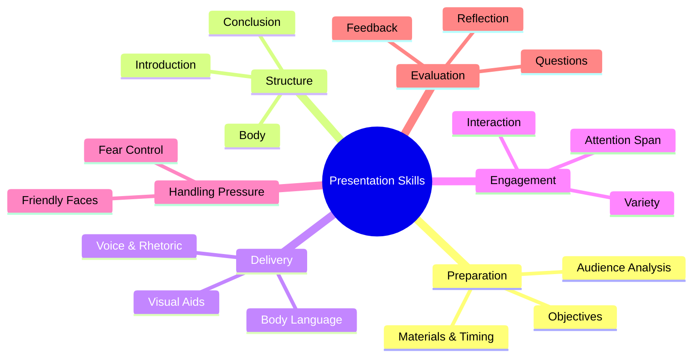

# 🧠 Report Writing – Presentation Skills

> [!note]
> This lecture focuses on the essential techniques and psychological strategies behind delivering powerful and professional presentations. It covers planning, structuring, capturing audience attention, handling fear, teamwork in group presentations, and the dos and don’ts of presenting.

---

## ⚙️ Continuity with Previous Lectures
This lecture builds on **Soft Skills** and **Technical Writing** topics. Presentation is the spoken extension of report writing—where clarity, structure, and confidence transform written work into persuasive delivery.

---

## 📋 Agenda
- General Tips  
- Planning  
- Structuring a Presentation  
- Capturing Attention  
- Handling Pressure  
- Do’s and Don’ts  
- Presentation Assignment Task  

---

## 💡 General Tips

> [!note]
> - **Preparation** and **knowledge** are prerequisites for a successful presentation.  
> - **Passion** fuels confidence and engagement.  
> - A great presentation informs **and** entertains.

---
### Planning 

**Key considerations:**
- Who is your audience?  
- What are your key messages?  
- How much time do you have?  
- What visual aids are available? (Optional)

> [!tip]
> Mnemonic for Pre-presentation Planning: **A.I.M.**
> - **A**udience – Know who you’re speaking to  
> - **I**ntent – Clarify your goal  
> - **M**aterials – Prepare visuals and data  

- What is the **aim**?
	- What are the **main points** I want to make?
- What is my **title**?
- Who am I **speaking** to?
	- What are the benefits to the audience of my product/report/speech?
	- What do they know of the subject?
	- What sort of questions will they ask me?
- What do I want the **audience** to **do after** listening to my presentation?
	- Are these people “Decision Makers”?

---

## 🧭 Planning Your Presentation

> [!note]
> Proper planning shapes clarity and delivery.

Steps:
1. Write your main **argument or conclusion**.
2. Outline **key points as bullet notes**.
3. **Visit the room**; test equipment.
4. **Time** your presentation.
5. Check event **dress code**.

---

## 🧱 Structuring a Presentation

> [!note]
> Use the **3-T Rule**:
> >  - Tell them what you will tell them (Introduction),
> >  - tell them (development),
> >  - tell them what you told them. (conclusion)

**Phases:**
1. **Introduction** – Announce purpose and scope.  
2. **Body** – Present evidence logically or chronologically.  
3. **Conclusion** – Summarize and end on a strong note.  

---

### 🏁 Starting a Presentation

Essential Steps:
1. Get **attention**.  
2. **Welcome** the audience.  
3. **Introduce** yourself.  
4. State **purpose** and structure.  
5. Explain **how questions will be handled**.  
6. **Give credit** to collaborators.

> [!example]
> **Sample Opening Lines**
> - “Good morning, ladies and gentlemen. Today, I’d like to discuss our success in the Egyptian AI market.”  
> - “Perhaps we can leave questions until the end.”  

![[Pasted image 20251113213046.png]]

---

## 🔀 Signposting

> [!note]
> **Signposts** are phrases guiding listeners through your presentation’s flow.

**Examples:**
- “Let’s turn now to…” – Change topic  
- “Going back to…” – Reference earlier point  
- “If I could just summarize…” – Recap main ideas  
- “I’d like to conclude by leaving you with this thought…” – Close strongly  
![[Pasted image 20251113213216.png]]

> [!tip]
> Mnemonic: **S.T.E.P.**
> - **S**tart (introduce)
> - **T**ransition (move between topics)
> - **E**laborate (expand ideas)
> - **P**resent summary  

---

## 🧩 Presentation Body

> [!note]
> The **body** delivers the content supporting your purpose.

**Key factors:**
- **Content:** All data must support the objective.  
- **Quantity:** Be concise yet complete.  
- **Sequence:** Choose structure—**logical**, **chronological**, **known-to-unknown**, or **problem-solution**.  

---

## 🧱 Concluding

> [!note]
> The **conclusion** reinforces impact.

Steps:
1. **Summarize** key points.  
2. End with **appreciation**.  
3. Finish **positively** or **motivationally**.  

> [!example]
> “Thank you for your attention. Let’s continue creating solutions that matter.”

---

## 🎯 Capturing Audience Attention

> [!note]
> The first 60 seconds determine engagement.

> The average attention span of an average listener is **5-10 minutes** for any single unbroken subject.

##### Strategies:
- Relate the topic to the audience’s lives.  
- Make it **personal**.  
- Break long sections every **5–10 minutes**.  

##### Tips for capturing attention
- Use **silence** to emphasize points.
- **Eye contact** is crucial to holding the attention of your audience.
- **Involve your audience** by asking them a question.
- **Don't read out** your talk.
- **Build variety** into the talk.
- Give an **unusual fact** or statistic.
- Use words like **you, we, us, our**.
- Illustrate with a **real life story**.
- Ask the audience to do something. "**Raise your hands if you know**”.
- **Ask the audience** direct or rhetorical questions.

> [!tip]
> Use **V.A.R.I.E.T.Y.** to maintain interest:  
> - **V**oice modulation  
> - **A**ctivity (ask questions)  
> - **R**eal-life examples  
> - **I**nteraction  
> - **E**ye contact  
> - **T**iming  
> - **Y**our energy  

---

### 💬 Rhetorical Questions
A question that you ask without expecting it to be answered.

> [!example]
> - “How can we explain this?”  
> - “What can be done about it?”  
> - “What does that mean for us?”  

They create dialogue and provoke thought.

---
## 🧍‍♂️ Body Language

> [!note]
> Non-verbal communication enhances credibility.

**Positive:**
- Maintain **eye contact**.  
- Natural **facial expressions**.  
- Confident **posture**.  
- **Movement** to emphasize transition.

**Negative:**
- Avoid swaying, fidgeting, or turning your back.  
- Don’t keep hands in pockets.
- **Loss of eye contact**.
- **Don't stare,** or look blankly into people's eyes.
- **Swaying back and forth.**
- **Back turned** to the audience.
- **Nervous ticks.**
- **Hands in pockets.**

---

## 😰 Handling Pressure and Fear

> [!note]
> Everyone feels nervous—control comes from preparation and practice.

**Techniques:**
- **Rehearse** and **Prepare** multiple times.  
- **Experience :** Seek opportunities for public speaking.  
- **Focus on friendly faces** in the audience.  
- **Don’t get hung up about being nervous**.  
- **Avoid** challenging audience.
- Look at your audience as **individuals**.

> [!tip]
> Mnemonic: **C.A.L.M.**
> - **C**ontrol breathing  
> - **A**cknowledge nerves  
> - **L**ook at friendly faces  
> - **M**ove naturally  

---

## 🙋 Handling Questions

Guidelines:
- **Good question:** Thank and answer.  
- **Irrelevant:** Redirect politely.  
- **Repeated:** Summarize and move on.  
- **Don’t know:** Admit honestly and offer to follow up.

---

## 👥 Group Presentations

> [!note]
> Team coordination impacts professional impression.

**Best practices:**
- Appoint a **group coordinator** and **plan a timetable together.**
- **Rehearse together** and get the timing right.
- **Move** from group member to another **smoothly** .
- **Organize** how you are going to **answer questions between you.**
- **Introduce everyone** at the **start** of the presentation.
- Don’t sell out your team members ☺.

---
## Presenting Your Work
- Be **enthusiastic**.
- Be **clear** and **confident**.
- Be **honest**.

---
## 🎤 Do’s and Don’ts

### ✅ Do
- **Know** your audience.
- **Plan** your presentation.
- **Rehearse**... Rehearse...Rehearse.
- **Check** the Presentation Language Grammar and Sentence Structure.
- Use **graphs** and **charts** instead of words whenever possible.
- Speak **clearly**, firmly and confidently.
- **Smile** ☺

### ❌ Don’t
- Say you did something that **you didn’t.**
- **Put** anything in a presentation that you **don’t fully understand.**
- **Respond** in a hurry (Listen carefully first).
- **Overuse** humor.
- Use **Slang**.
- **Exceed** the **allocated time** for your talk.
- **Plagiarize** a presentation without giving credit to the owner.
---
## 📝 Tips for PowerPoint Presentation 
- Keep it Simple
- Choose readable colors and fonts
	![[Pasted image 20251113214845.png]]
- No Paragraphs
	![[Pasted image 20251113214903.png]]
 - Don't overload your presentation with animations

---

## 🧩 Hands-On Practice

1. Prepare a **2-minute introduction** for a topic of your choice.  
2. Record yourself and evaluate **eye contact, tone, and clarity**.  
3. Deliver it again after applying **C.A.L.M.** technique.

---

## 🧠 Difficulty Tags
- 🟢 Basic: Presentation Structure, Signposting  
- 🟡 Intermediate: Capturing Attention, Handling Questions  
- 🔴 Advanced: Managing Fear, Group Coordination  

---

## 🗺️ Concept Hierarchy Diagram

---

## 📚 Glossary

|Term|Definition|
|---|---|
|**Signposting**|Verbal cues that indicate structure and transitions in a presentation.|
|**Rhetorical Question**|A question asked to provoke thought, not elicit an answer.|
|**Body Language**|Non-verbal signals like posture, gestures, and expressions.|
|**A.I.M.**|Mnemonic for audience, intent, materials.|
|**C.A.L.M.**|Mnemonic for controlling nerves while speaking.|

---

## 🧩 Key Takeaways

- Preparation, passion, and structure drive impactful presentations.
    
- Engage your audience through variety and connection.
    
- Handle questions with professionalism.
    
- Practice and feedback transform anxiety into mastery.
    

---

## 🧾 Quick Review Card

> **Q:** What are the three main parts of a presentation?  
> **A:** Introduction, Body, Conclusion.

> **Q:** What is the 3-T rule?  
> **A:** Tell them what you’ll tell them, tell them, tell them what you told them.

> **Q:** How can you handle fear of public speaking?  
> **A:** Through preparation, rehearsal, and focusing on friendly faces.

> **Q:** What is signposting?  
> **A:** Phrases guiding the audience through presentation stages.

> **Q:** List two don’ts of presenting.  
> **A:** Avoid slang and exceeding time limits.

---

## 🔗 Further Resources

- Garr Reynolds – _Presentation Zen_
    
- Nancy Duarte – _Resonate: Present Visual Stories That Transform Audiences_
    
- TED Talks by Chris Anderson on Public Speaking
    
- Toastmasters International: [toastmasters.org](https://www.toastmasters.org/)