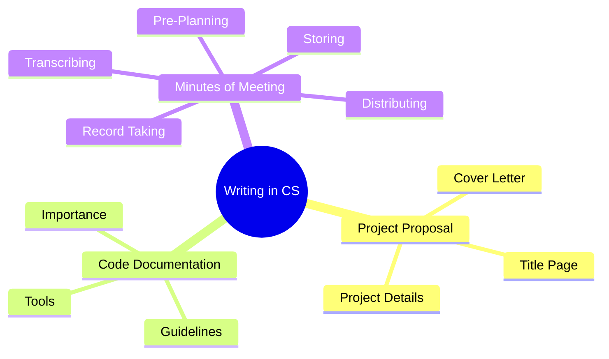

# 🧠 Report Writing – Writing in the Field of Computer Science and Minutes of Meeting

> [!summary] **Overview**
> This lecture explores writing practices specific to the field of Computer Science, including **project proposals**, **code documentation**, and **Minutes of Meeting (MoM)**. It emphasizes persuasion, clarity, structure, and accountability — key skills for professional engineers and software developers.

---

## 🧩 Continuity with Previous Lectures
This lecture builds on:
- **Technical Reports (Parts 1 & 2):** which covered report structure, referencing, and plagiarism.
- **Email Etiquette:** focusing on professional communication tone.
It now extends these skills into **Computer Science proposal writing** and **team documentation practices**.

---

## 🧱 Why Writing in CS Is Needed
> [!note]
> Writing in CS is essential for **approval**, **sponsorship**, and **funding** — you must **convince** someone to believe in your idea.

🟢 **Purposes:**
- To **obtain project approval** from supervisors or clients.
- To **secure sponsorship** or financial support.
- To **justify the value** and feasibility of your technical idea.

> [!tip]
> Think of your proposal as your project’s *sales pitch* — your job is to persuade your reader to trust you with their resources.

---

## 🧭 General Guidelines for Writing a CS Proposal

> [!note]
> Every Computer Science proposal should be clear, targeted, and persuasive.

### 1. **Introduce Yourself and Your Project**
- Provide a concise background of your team and objectives.

### 2. **Describe the Problem and Need**
- Define the **existing gap** and **why your project matters**.
- Emphasize the **impact** or **innovation** your work introduces.

### 3. **Propose the Solution**
- Explain your **technical approach**, **methods**, and **tools**.

### 4. **Justify Feasibility**
- Convince reviewers of your capability and preparedness.
- Mention relevant **skills**, **tools**, or **previous experience**.

### 5. **End with a Call to Action**
- Request a **meeting**, **endorsement**, or **collaboration**.

> [!warning]
> Avoid generic language like *“our project will help everyone”* — be specific about *who benefits* and *how*.

---

## 🎯 Knowing Your Audience
🟢 Always write a **customized proposal** — one size does not fit all.

- Identify **who** will read it (sponsors, supervisors, committees).
- Emphasize **their interests and benefits**.
- Adapt tone and technical depth accordingly.

> [!example]
> - **For an investor:** focus on ROI, scalability, and feasibility.  
> - **For an academic advisor:** focus on originality, methodology, and learning outcomes.

---

## 🧾 Structure of a CS Project Proposal

> [!note]
> Most Computer Science proposals share a standardized structure.

### **1. Cover Letter**
- A brief personal introduction and purpose.
- The **action** you expect after reading (e.g., scheduling a meeting).
- Include **contact information**.
![[Pasted image 20251113220235.png]]
### **2. Title Page**
- Project title and organization.
- Example titles:
  - *Streamlining Our Order Process*
  - *Candy Crush Project*
  - *Converting XYZ’s Fleet to Hybrid Vehicles*
![[Pasted image 20251113220301.png]]
### **3. Suggested Content**

#### **I. Introduction**
- Background and **problem history**.
- Why the issue is **important or interesting**.
- What has been **done before** (existing systems or solutions).
- Possible **improvements** and **innovation**.

#### **II. Project Summary**
- High-level overview of what the project aims to achieve.

#### **III. Project Details**
- **Architecture and Environment:** tools, hardware, software.
- **Implementation Challenges:** technical difficulties, constraints.
- **Deliverables:** specific outputs (programs, reports, models).
- **Time Plan:** milestones, Gantt chart, expected delivery dates.

#### **IV. Conclusion**
- Summarize **problem, motivation, and expected outcomes**.
- Reiterate **project contribution**.

#### **V. References**
- Include **academic or technical sources** you used or plan to use.

> [!tip]
> Mnemonic for proposal writing: **C-TIPS**  
> **C**over Letter → **T**itle Page → **I**ntroduction → **P**roject Details → **S**ummary/Conclusion.

---

## 💻 Code Documentation

> [!note]
> Code documentation communicates your logic, design, and purpose to future developers.

### **Importance**
- Software lifecycle: **10% development, 90% maintenance**.
- Developers change — documentation ensures continuity.
- Reduces **time wasted debugging** and **re-learning**.

### **Best Practices**
- Follow **naming conventions**.
- Maintain **readable code**, minimal but clear comments.
- Avoid over-commenting or restating the obvious.
- Always write **why**, not just **what**, a block of code does.
- **One liner comment** is best.
- Write in **English** and keep comments concise.

> [!example]
> ```cpp
> // This function adds two integers
> int Add(int num1, int num2) {
>     return num1 + num2;
> }
> ```
> versus
> ```cpp
> // The width of the line is 2
> lineWidth = 2; // Bad comment — obvious
> ```

> [!tip]
> Use documentation tools like **Doxygen**, **Sphinx**, or **JSDoc** to automate and standardize code documentation.

---

## 📈 Benefits of Documentation
🟢 Enhances collaboration and readability.  
🟢 Eases open-source contribution and debugging.  
🟡 Strengthens understanding of your own logic.  
🔴 Poor documentation causes maintenance overhead.

> [!warning]
> Both extremes — *no comments* or *too many comments* — harm code quality.

---

## 🗒️ Minutes of Meeting (MoM)

> [!note]
> **Minutes** are the official written record of what occurred during a meeting — including key topics, decisions, and action items.

### **Purpose**
- Acts as a **record** for participants and absentees.
- Provides **evidence of decisions**.
- Serves as a **reference point** for accountability.

### **Who Takes the Notes**
- Usually the **secretary**, or the role can **rotate** among attendees.

### **Stages of MoM Preparation**

1. **Pre-Planning**
   - Gather:
     - Agenda
     - Previous meeting minutes
     - Relevant documents
   - Assign a **recorder**.

2. **Record Taking**
   Include:
   - Purpose, date, time, and participants.
   - **Decisions and actions** on each agenda item.
   - **Next steps**, **votes**, and **next meeting date**.

3. **Transcribing**
   - Prepare a **clean formatted document** summarizing the key points.
   - Highlight **responsibilities and deadlines**.

4. **Distributing**
   - Share minutes via email or internal system.
   - Ensure acknowledgment from recipients.

5. **Storing**
   - Archive for **future reference** and **project continuity**.

> [!example]
> **Minutes of Meeting (Example)**
> - **Date:** Nov 10, 2025  
> - **Attendees:** Dr. Sally, Ahmed, Amr, Doaa  
> - **Topic:** System architecture finalization  
> - **Decisions:** Use microservice design for backend  
> - **Action:** Amr to finalize Docker setup by Nov 15  
> - **Next Meeting:** Nov 17, 2025 at 2 PM  

> [!tip]
> Mnemonic for MoM steps: **P-R-T-D-S**  
> **P**re-planning → **R**ecord-taking → **T**ranscribing → **D**istributing → **S**toring.

![[Pasted image 20251113224007.png]]
![[Pasted image 20251113224015.png]]
![[Pasted image 20251113224021.png]]

---

## 🧩 Hands-On Practice

### Exercise 1 – Draft a Proposal Outline
Write a short proposal for a **“Smart Waste Management System”**, including:
1. Problem description.
2. Proposed solution.
3. Deliverables.
4. Timeline.

### Exercise 2 – Code Documentation
Add proper comments to a function that sorts an array.

### Exercise 3 – Meeting Minutes
Document the key points from a **team stand-up meeting** using the five-step MoM structure.

---

## 🧭 Concept Hierarchy Diagram



---

## 📚 Glossary

|Term|Definition|
|---|---|
|**Proposal**|A formal written plan submitted for approval or funding.|
|**Deliverables**|Tangible outputs or results from a project.|
|**Documentation**|Written text explaining code, system logic, or design decisions.|
|**Minutes of Meeting (MoM)**|Official record summarizing a meeting’s discussions and decisions.|
|**Call to Action**|Closing statement encouraging the reader to take the next step.|

---

## 🔑 Key Takeaways

- Writing in CS merges **technical precision** with **persuasive communication**.
    
- Effective proposals **convince**, not just **describe**.
    
- Code documentation ensures **maintainability** and **team efficiency**.
    
- Minutes of Meeting provide **transparency** and **accountability**.
    
- Always write with your **audience** and **purpose** in mind.
    

---

## 🧠 Quick Review Cards

> [!question] What is the main goal of writing a project proposal?  
> To convince readers to approve, fund, or support your project.

> [!question] What is the golden rule for commenting code?  
> Always write **why** the code exists, not **what** it does.

> [!question] Who is responsible for taking meeting minutes?  
> Typically the **secretary** or a **rotating attendee**.

> [!question] What does the acronym **P-R-T-D-S** stand for in MoM?  
> **Pre-Planning, Record-taking, Transcribing, Distributing, Storing.**

> [!question] Why is documentation critical in software maintenance?  
> Because **90% of a software’s lifetime** is spent in maintenance, not development.

---

## 📘 Further Resources

- Zinsser, W. _On Writing Well_ (1976).
    
- IEEE Guide to Technical Writing.
    
- Atlassian Team Playbook – _Effective Meetings_.
    
- Doxygen & Sphinx official documentation.
    
- Ain Shams University Report Writing Repository (Google Drive).
    

---