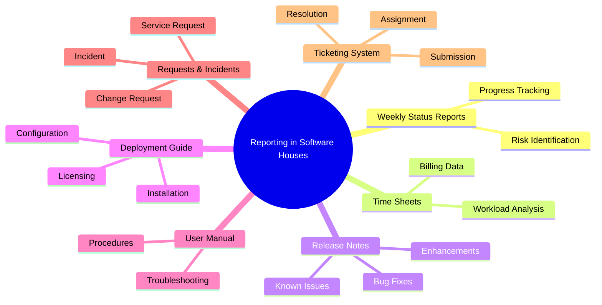

> [!note] Overview  
> This lecture covers the core documentation and reporting artifacts used inside software houses: **Weekly Status Reports, Time Sheets, Release Notes, Deployment Guides, User Manuals, Service Requests, Incidents, Change Requests, and Ticketing Systems.**  
> You will learn their purpose, structure, workflows, and differences—essential knowledge for real-world software engineering environments.

---

# 1. Weekly Status Reports (WSR)

## Purpose
> [!note]  
> A **Weekly Status Report (WSR)** updates stakeholders about project *progress*, *risks*, *issues*, and *accomplishments*.

## Key Points 🟢 Basic
- Tracks **budget**, **milestones**, **risks**, **progress**.
- Frequency & detail level depends on **audience**.
  - Team & managers → weekly, detailed  
  - Executives → highlights only  
- Provides a **paper trail** and enforces accountability.

## Benefits 🟡 Intermediate
- Early identification of risks and deviations.
- Enables timely team adjustment.
- Prevents surprises to clients/stakeholders.
- Shows progress of individuals and teams.
- Keep project members and leaders accountable
- Provide a paper trail

##### Example

![[Pasted image 20251123001512.png]]

---
# 2. Project Time Sheets

## Purpose
> [!note]  
> A **Project Time Sheet** tracks time spent on tasks, enabling performance measurement, historical estimation, and client billing.

## Why Time Tracking Matters 🟢 Basic
- Understand actual vs. planned effort.
- Improves future **estimations**.
- Essential for **billing**, especially for customized solutions.
- Helps diagnose productivity issues and workload imbalance.

## Best Practices
- Filled **daily** for accuracy.
- Records **billable vs. non-billable** hours.
- Builds historical datasets for estimation.

##### Examples

![[Pasted image 20251123001711.png]]
![[Pasted image 20251123001722.png]]
![[Pasted image 20251123001730.png]]
![[Pasted image 20251123001740.png]]
![[Pasted image 20251123001747.png]]![[Pasted image 20251123001754.png]]
![[Pasted image 20251123001812.png]]

---
# 3. Release Notes

## Purpose
> [!note]  
> Release Notes are distributed with every product version to communicate **changes, bug fixes, enhancements, known issues**, and **workarounds**.

## Types 🟢 Basic
- **Internal Release Note**: detailed, for development teams.
- **Public Release Note**: simplified, for customers.

## Characteristics
- Not a substitute for a User Manual.
- Must be **clear, correct, complete**.
- Level of detail depends on release type:
  - New product → extensive  
  - Bug fix → concise  
- For some businesses, release notes are the only way product enhancements are communicated to customers.
- **no standard format**
- Often written by the development team/technical writers.
## Standard Sections 🟡 Intermediate
- **Header** – Document Name, product name, release number, release date, note date, note version.
- **Overview** - A brief overview of the product and changes.
- **Purpose** - A brief overview of the purpose of the release note with a listing of what is new in release, including bug fixes and new features.
- **Issue Summary** - A short description of the bug or the enhancement in the release.
- **Steps to Reproduce** - The steps that were followed when bug was encountered.
- **Resolution** - A short description of the modification/enhancement that was made to fix the bug.
- **End-User Impact** - What different actions are needed by the end users of the application. This should include whether other functionality is impacted by these changes.
- **Support Impacts** - Changes required in the daily process of administering the software.
- **Notes** - Notes about software or hardware installation, upgrades and product documentation (including documentation updates)
- **Disclaimers** - Company and standard product related messages. e.g.; freeware, anti-piracy, duplication etc..
- **Contact** - Support contact information.

##### Release Notes Template
![[Pasted image 20251123002412.png]]
![[Pasted image 20251123002420.png]]
##### Example
![[Pasted image 20251123002437.png]]

---

# 4. Deployment Guide

## Purpose
> [!note]  
> A Deployment Guide documents **installation, configuration, licensing, tuning**, and administration needed to deploy a system.

## Key Elements 🟡 Intermediate
- Introduction  
- Hardware & software requirements  
- Installation/deployment procedures  
- Licensing  
- Performance tuning  
- Technical support info  
- Additional resources  

## Notes
- Must be **tested** to ensure accuracy.
- Usually written by developers / technical writers.

##### Examples
![[Pasted image 20251123002630.png]]
![[Pasted image 20251123002637.png]]

---

# 5. User Manual

## Definition
> [!note]  
> A **User Manual** helps non-technical users operate a system, using simple language, examples, and screenshots.

- A **user guide** (**manual**) is a technical document that helps users operate a system.
- Written in simple, **non-technical** language for general audiences.
- Includes both text instructions and visuals such as screenshots and diagrams.
- Adjusts terminology to the audience and explains **any necessary jargon**.
- Created by technical writers with support from business teams.
## Audience Analysis 🟢 Basic
- Who are the users?  
- Are there multiple user groups?  
- What tasks will they perform?  
- How technical are they?  
- How much time will they spend reading?  

## Structure 🟡 Intermediate
1. **Preface**
   - Use this section to reference other documents related to the software.
   - If needed include a “How to use this guide” section
1. **Table of Contents**
2. **Body/Procedures**
3. **Reference Materials**
   - Error messages  
   - Troubleshooting  
   - FAQs  
1. **Glossary** : All acronyms and terms in document.
2. **Index**: Locate specific items very fast without having to search through the entire document manually.

### Procedures
- Procedures help the user perform specific tasks.
- **Examples**:
  - When, why, and how you can perform a task.
  - What the screen will show after you perform a task.
  - Examples of tasks and program operation.
- **Tasks** include:
  - Identifying the major tasks.
  - Separating each major task into subtasks.
  - Writing a series of steps that walk the user through each subtask.
  - Using an "if-then" approach when explaining decisions that users can make.

## Guidelines 🔴 Advanced
> [!warning] Common mistakes: assuming prior knowledge, overusing jargon, writing long paragraphs.
> 
> - Use **step-by-step procedures**.
> - Include **quick start guide**.
> - Use simple language.
> - Explain icons and symbols early.
> - Write in **present tense**, active voice.
> - Ensure content accurately reflects the product.

##### Example
![[Pasted image 20251123005912.png]]
![[Pasted image 20251123005920.png]]


---

# 6. Service Requests, Incidents & Change Requests

## Service Request (SR) 🟢 Basic
> [!note]  
> A request for a **pre-approved service** (e.g., password reset, device access).

**Characteristics**
- Automatically approved.  
- Tasks are well-documented.  
- Authority is effectively given in advance for the change.
- Low-risk.  
- Included in service catalog.  

---

## Incident 🟢 Basic
> [!note]  
> **Unplanned interruption** or reduction of an IT service.

**Examples**
- Broken printer  
- Application not loading  
- User cannot access expected services  

---

## Change Request (CR) 🟡 Intermediate
> [!note]  
> Formal proposal to **alter or add** to an existing system or agreed-upon deliverable.

Characteristics:
- Outside project scope → **client pays extra**.
- May require developer or DB admin involvement.
- Handled by product support → escalated if needed to developers and DB administrators.

---

# 7. IT Ticketing System

## Purpose
> [!note]  
> Manages the full lifecycle of IT requests—from **submission → assignment → resolution**.

## Ticket vs. Incident
> [!example]
> - **Incident** = the event/problem  
> - **Ticket** = the documentation and tracking of that event  

## Features 🟡 Intermediate
- **Self Service Portal:** A one-stop shop where workers and customers can quickly and easily submit their tickets.
- **Ticket Log:** Sorting tickets by issue type, forwarding requests to appropriate team member and tracking tickets.
- **Assigning Tickets:** Tickets are assigned to a single “owner” who will work on ticket from start to end.
- **Live Support:** 24/7 staffed help-desk or chat service.
- **Multiple Channel Support:** Phone, email or mobile application.
- **File Attachments:** Users attach screenshots of problem or add documents relevant to their current issue.
- **Multi-lingual systems**

![[Pasted image 20251123010636.png]]

---

# 8. Lecture Questions
## 🟢Complete

> [!question] Complete the blanks
> 
> • IT ticketing system manages ----- from other departments in a company and ----- from customers.  
> • Assessing the performance of your project team members and monitoring their workload is much easier using -----.  
> • Incident is the event, and the ticket is ----- of the event.  
> • Hardware and software configuration, installation, licensing, performance tuning tips are parts of -----.  
> • ----- is issued for a pre-approved service that your organization can offer to its end users.  
> • ----- explains how to use a software in language that a non-technical person can understand.  
> • Self-service portal, file attachments and multi-lingual are characteristics of -----.  
> • ----- pinpoint the progress of the work done by individuals, teams, and resources, so you can bring in staff in a timely manner.

---

> [!question] Complete the blanks
> 
> • For -----, approval is automatically granted by authority and tasks are known and documented.  
> • ----- assumes the user has no prior experience or product knowledge and keeps jargon to minimum.  
> • Issues, steps to reproduce and resolutions are part of -----.  
> • Because ---- are beyond the scope of agreement, they generally mean that client will have to pay for extra resources required to satisfy them.  
> • The ----- provides relevant information regarding the SW installation, configuration and administration.  
> • ------ is an unplanned interruption of an IT service or reduction in the quality of an IT service.  
> • ----- present instructions as step-by-step procedures and tell the user what functions there are, and what they are for in addition to how to use them.

---

## 🟢 Key Terms

> [!question] Replace with the correct key term
> 
> • System that manages the lifecycle of every individual IT request from submission to resolution.  
> • Technical communication document intended to give assistance to people using a particular system.  
> • Include all of the activities that make a software system available for use.  
> • Documents that are distributed with every version of the product.  
> • A one-stop shop where workers and customers can quickly and easily submit their problems with SW.

---

> [!question] Replace with the correct key term
> 
> • Provide the necessary information about recent changes, enhancements, bug fixes, new features and workarounds.  
> • Used to update stakeholders on project progress, which includes the business-critical activities, developments and risks associated.  
> • Arise when client wants an addition/alteration to agreed-upon deliverables for a project.

---

## 🟢 Differentiate

> [!question] Differentiate between:
> 
> • Service request vs. change request  
> • Incident vs. ticket  
> • Release notes vs. user manual vs. deployment guide

## Model Answer
### Complete the blanks – Model Answers

1. requests
    
2. issues
    
3. project management tools
    
4. the record
    
5. technical documentation
    
6. service request
    
7. user manual
    
8. IT service management (ITSM) portals
    
9. timesheets or progress tracking tools
    

---

### Complete the blanks – Model Answers (Part 2)

1. standard changes
    
2. user manuals
    
3. incident reports or tickets
    
4. out-of-scope requests
    
5. deployment guide
    
6. incident
    
7. user manuals
    

---

### Key Terms – Model Answers

1. IT ticketing system
    
2. user manual
    
3. software deployment
    
4. release notes
    
5. self-service portal
    

---

### Updates & Reports – Model Answers

1. release notes
    
2. weekly status reports (WSR)
    
3. change requests
    

---

### Differentiate – Model Answers

1. Service request – pre-approved, standard service offered; Change request – client-requested change beyond agreed scope
    
2. Incident – unplanned interruption or degradation of service; Ticket – record of the incident or request
    
3. Release notes – software updates and fixes; User manual – step-by-step guide for users; Deployment guide – instructions for installation, configuration, and maintenance

---
# 9. Continuity With Previous Lectures

This lecture connects with:
- **Technical Reports** → understanding structured documentation.
- **Professional Writing** → writing concise, functional documents.
- **Email Etiquette** → communicating progress and incidents.

It expands your toolkit for real-world reporting and documentation inside software engineering environments.

---

# 🧩 Hands-On Practice

1. Write a **Weekly Status Report** for a mock project.  
2. Draft a **Release Note** for a version 1.1 bug fix.  
3. Outline a **Deployment Guide** for a small web app.  
4. Write sample **User Manual steps** for logging into a system.  
5. Classify example scenarios into: SR, Incident, CR.

---

# 10. Concept Hierarchy Diagram



---

# Glossary

- **WSR**: Weekly Status Report.
    
- **Time Sheet**: Daily record of hours spent on tasks.
    
- **Release Note**: Document describing changes in a new version.
    
- **Deployment Guide**: Instructions to install and configure a system.
    
- **User Manual**: Guide for end users explaining how to use the software.
    
- **Service Request**: Pre-approved low-risk request.
    
- **Incident**: Unplanned interruption.
    
- **Change Request**: Formal request to modify/add features.
    
- **Ticket**: Logged documentation of an issue or request.
    

---

# Key Takeaways

- Reporting is critical for transparency in software projects.
    
- Time Sheets and WSRs help track progress and estimate future work.
    
- Release Notes, Deployment Guides, and User Manuals serve different users and purposes.
    
- Service Requests, Incidents, and Change Requests must be clearly differentiated.
    
- Ticketing systems streamline IT service workflows and communication.
    

---

# Quick Review Card

**Q:** What is the purpose of Release Notes?  
**A:** Communicate changes, bug fixes, enhancements, and known issues in a new software version.

**Q:** How does a Service Request differ from a Change Request?  
**A:** SR is low-risk and pre-approved; CR modifies scope and requires extra cost.

**Q:** What is an Incident?  
**A:** An unplanned interruption to an IT service.

**Q:** What distinguishes a User Manual from a Deployment Guide?  
**A:** User Manual = for end users; Deployment Guide = for installation/configuration teams.

**Q:** Why must time sheets be recorded daily?  
**A:** To ensure accuracy and support billing and workload analysis.

---

# Further Resources

- _IEEE Guide to Software User Documentation_
    
- _PMBOK – Project Management Body of Knowledge_
    
- Atlassian Jira Service Management documentation
    
- ITIL Foundation resources
    

```

If you want, I can also generate **flashcards**, **printable revision sheets**, or **integrated Obsidian vault templates** for this course.
```