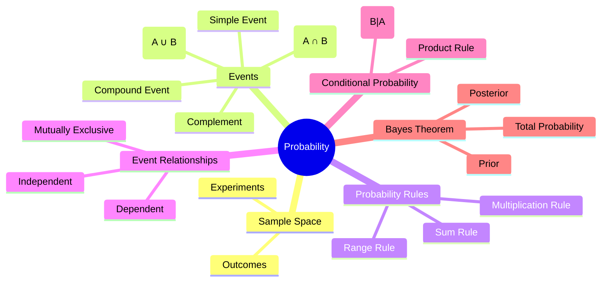
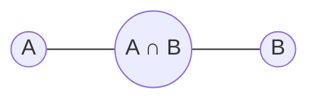
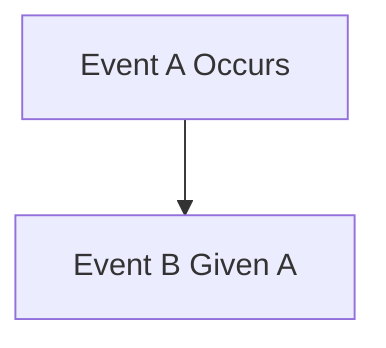
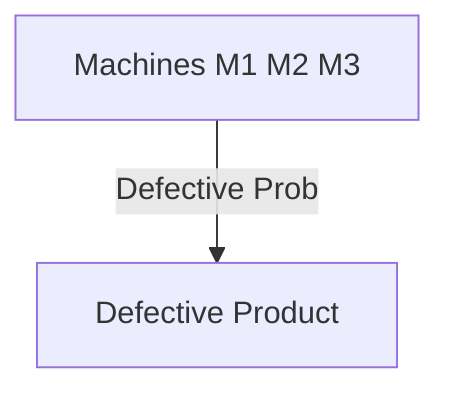
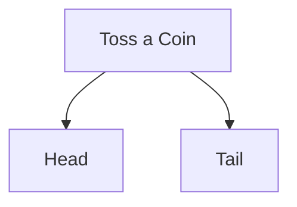

# 🧠 Statistical Analysis – Probability: Fundamentals, Events, and Bayes Theorem

> [!note] **Overview**
> This lecture introduces **probability theory**, covering **sample spaces**, **events**, and **rules of probability**. It progresses through **independent and dependent events**, **conditional probability**, and **Bayes’ theorem**, with applied examples.  
> Builds on earlier lectures on **data description** and **random variables** to quantify uncertainty in statistical experiments.

---

## 🧩 Concept Hierarchy

---

## 🧱 Continuity with Previous Lectures

- Earlier topics covered **data types, frequency distributions, and descriptive measures** (mean, variance).
    
- Probability extends those concepts by modeling **uncertainty** before data collection.
    
- It forms the foundation for **inferential statistics**—used in **hypothesis testing** and **regression** later in the course.
    

---

## 🎯 Core Concepts

### 1. **Probability Definition**

> [!note]  
> **Probability** measures the likelihood of outcomes in a random phenomenon.  
> Formally, for an event **E** within a **sample space S**,  
> $$ P(E) = \frac{n(E)}{n(S)} $$  
> where:
> 
> - **n(E)** = number of favorable outcomes
>     
> - **n(S)** = total possible outcomes
>     

---

### 2. **Sample Space (S)**

> [!note]  
> The **sample space** is the set of all possible outcomes of an experiment.

|Experiment|Sample Space|n(S)|
|---|---|---|
|Tossing a coin|{H, T}|2|
|Rolling a die|{1, 2, 3, 4, 5, 6}|6|
|Tossing a coin twice|{(H,H), (H,T), (T,H), (T,T)}|4|

> [!tip]  
> 🔹 Formula for multi-trials:  
> $$ n(S) = N^n $$  
> Where **N** = possible outcomes per trial, **n** = number of trials.

---

### 3. **Events**

> [!note]  
> An **event (E)** is any subset of the sample space **S**.
> 
> - If **E = {1,3,5}**, then **E** is the event of rolling an odd number.
>     
> - $( E \subseteq S )$
>     

---

### 4. **Event Probability**

> [!note]  
> $$ P(E) = \frac{n(E)}{n(S)} $$  
> Example:
> 
> - Rolling a die: $( P(\text{number > 2}) = \frac{4}{6} = \frac{2}{3} )$
>     

---

## ⚙️ Probability Rules

> [!note] **Rule 1: Range Rule**  
> $( 0 \leq P(A) \leq 1 )$

> [!note] **Rule 2: Sum of Probabilities**  
> $( \sum P(S_i) = 1 )$

---

### 5. **Types of Events**

#### 🟢 Impossible Event

> [!note]  
> ( P(∅) = 0 )

#### 🟢 Complementary Event

> [!note]  
>$ $( P(\bar{E}) = 1 - P(E) )$

> [!example]  
> Rolling a die:
> 
> - $( P(E) = P(\text{>4}) = 2/6 = 1/3 )$
>     
> - $( P(\bar{E}) = 1 - 1/3 = 2/3 )$
>     

#### 🟡 Intersected Event (A ∩ B)

> [!note]  
> Both A and B occur simultaneously.  
> Represented by the **intersection** of two sets.

#### 🟡 Mutually Exclusive Events

> [!note]  
> Events that **cannot occur together**.  
> ( P(A ∩ B) = 0 )

#### 🟡 Union of Events (A ∪ B)

> [!note]  
> ( P(A ∪ B) = P(A) + P(B) - P(A ∩ B) )

> [!example]  
> S = {1,…,10},  
> A = {1–5}, B = {4–8}  
> ( P(A ∪ B) = 0.8 )

#### 🟡 Difference of Events

> [!note]  
> ( P(A - B) = P(A) - P(A ∩ B) )

---

### 6. **Independent and Dependent Events**

#### Independent Events

> [!note]  
> Events where occurrence of one does not affect the other.  
> ( P(A ∩ B) = P(A) P(B) )

> [!example]  
> Rolling a die twice:  
> ( P(6,6) = (1/6)(1/6) = 1/36 )

#### Dependent Events

> [!note]  
> Occurrence of one **affects** the probability of the other.  
> ( P(A ∩ B) = P(A) P(B|A) )

> [!example]  
> Drawing 2 red balls **without replacement**:  
> ( P = (3/7)(2/6) = 1/7 )

---

### 7. **Conditional Probability**

> [!note]  
> Probability that event B occurs given that A has occurred:  
> $$ P(B|A) = \frac{P(A ∩ B)}{P(A)} $$

> [!example]  
> From data:  
> ( P(\text{Male|Secondary}) = 28/78 = 0.359 )

> [!tip]  
> **Mnemonic:**  
> “Condition first, then divide.”  
> (Always divide joint probability by the conditioning event.)

---

### 8. **Bayes’ Theorem**

> [!note]  
> Used to update probabilities based on new information.  
> $$ P(Y|X) = \frac{P(X|Y) P(Y)}{P(X)} $$

> [!example]  
> **Factory Machines**
> 
> - M1: 30%, defect 2%
>     
> - M2: 45%, defect 3%
>     
> - M3: 25%, defect 2%
>     
> 
> 1️⃣ Find $( P(\text{Defective}) )$ 
> $$ P(D) = (0.02)(0.3) + (0.03)(0.45) + (0.02)(0.25) = 0.0245 $$
> 
> 2️⃣ Find $( P(M3|D) )$  
> $$ P(M3|D) = \frac{(0.02)(0.25)}{0.0245} = 0.20 $$

---

## 📊 Visual Representation

---

## 🧩 Hands-On Practice

1. Roll two dice and find ( P(\text{sum = 7}) ).
    
2. Draw two cards from a deck **without replacement**, find ( P(\text{both red}) ).
    
3. Apply Bayes’ theorem for a diagnostic test with sensitivity 95%, specificity 98%, and prevalence 1%.
    

---

## 🧠 Study Aids

> [!tip]  
> **Probability Quick Codes**
> 
> - **AND = ×** → Multiply for joint events
>     
> - **OR = +** → Add for union
>     
> - **NOT = 1 -** → Complement rule
>     
> - **IF GIVEN = ÷** → Conditional division
>     

> [!tip]  
> **Mnemonic for Independence:**  
> “Independent = Multiply freely.”

> [!tip]  
> **Mnemonic for Bayes:**  
> “Flip the condition, multiply, then divide by total.”

---

## 🔍 Glossary

|Term|Definition|
|---|---|
|Sample Space (S)|All possible outcomes|
|Event (E)|Subset of S|
|Independent Events|Events not affecting each other|
|Mutually Exclusive|Events that cannot occur together|
|Conditional Probability|Probability of one event given another|
|Bayes’ Theorem|Rule to update probabilities with new info|

---

## 🚀 Key Takeaways

- Probability quantifies uncertainty through ratios of outcomes.
    
- Sample spaces define the foundation for all probabilistic models.
    
- Independent and dependent events dictate which rule to apply.
    
- Conditional probability and Bayes’ theorem are essential for decision-making under uncertainty.
    
- The **Sum**, **Multiplication**, and **Complement** rules are core operational tools.
    

---

## 🎓 Quick Review Card

> **Q:** What is the probability of the complement of E?  
> **A:** $( 1 - P(E) )$

> **Q:** When are events independent?  
> **A:** When $( P(A ∩ B) = P(A)P(B) )$

> **Q:** Formula for Bayes’ Theorem?  
> **A:** $( P(A|B) = \frac{P(B|A)P(A)}{P(B)} )$

> **Q:** Rule for “A or B”?  
> **A:** $( P(A ∪ B) = P(A) + P(B) - P(A ∩ B) )$

> **Q:** What does the Sum Rule compute?  
> **A:** Total probability of an event over all possible conditions.

---

## 📚 Further Resources

- _Statistics for Engineers and Scientists_ by William Navidi
    
- _Introduction to Probability_ by Sheldon Ross
    
- _Khan Academy – Probability & Statistics_ (Video Series)
    
- _MIT OCW 18.05 – Introduction to Probability and Statistics_
    

---