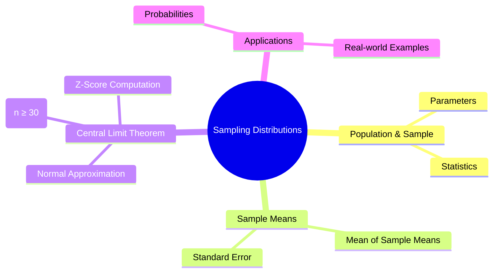

> [!note] **Overview**  
> This lecture introduces **population vs sample**, **sampling distributions**, **standard error**, and the **Central Limit Theorem (CLT)**. It explains how sample means behave, how to compute probabilities using the Z-distribution, and provides multiple applied examples.

---

# 1. Population, Sample, and Parameters 🟢

> [!note] **Core Definitions**
> 
> - **Population:** Complete set of all items of interest.
>     
> - **Sample:** Subset drawn from the population.
>     
> - **Parameter:** Fixed numerical measure describing the population (μ, σ, N).
>     
> - **Statistic:** Numerical measure describing the sample (x̄, s, n).
>     
> - **Statistics:** Methods used to infer population parameters.
>     

### Comparison Table

|Concept|Population (Parameter)|Sample (Statistic)|
|---|---|---|
|Size|**N**|**n**|
|Mean|**μ**|**x̄**|
|Variance|**σ²**|**s²**|
|Std. Dev.|**σ**|**s**|

> [!warning]  
> **Parameters are fixed. Statistics vary** depending on which sample is drawn.

---

# 2. Sampling Distributions 🟡

A **sampling distribution** is the distribution of a statistic (usually **x̄**) across all possible samples of size **n**.

> [!note]  
> **Sampling Error:** Difference between a sample statistic and the true population parameter.

### Key Properties

1. **Mean of sample means:**  
    $$\mu_{\bar X} = \mu$$
    
2. **Standard error of the mean (SEM):**  
    $$\sigma_{\bar X} = \frac{\sigma}{\sqrt{n}}$$
    

> [!tip]  
> Larger sample size ⇒ smaller standard error ⇒ more stable estimates.

---

# 3. The Central Limit Theorem (CLT) 🔴

> [!note] **Definition**  
> As sample size **n → ∞**, the distribution of the sample mean **approaches a normal distribution** with mean **μ** and standard deviation **σ/√n**, regardless of the population’s shape.

### When CLT Applies

- Population **normal** → sample means normal for **any n**
    
- Population **not normal** → need **n ≥ 30** for approximation
    

### Z-Score for Sample Means

$$  
z = \frac{\bar X - \mu}{\sigma / \sqrt{n}}  
$$

> [!warning]  
> Students often confuse **standard deviation** with **standard error**. Always use **σ/√n** when dealing with **sample means**.

##### ❑ To solve the question about sample means we must use three steps.
**First Step**: find the z , using the formula. 
**Second Step**: draw the figure and Shading the area. 
**Third Step** : find the areas under ,using table E

---

# 4. Continuity With Previous Lectures

This lecture builds directly on:

- **Measures of central tendency** (because x̄ is central here)
    
- **Normal distribution concepts** (used extensively for probability calculations)
    
- **Standard deviation and variance** (SEM depends on σ)
    

---

# 5. Worked Examples 🧩

> [!example] **Example 1 – Find Population σ**  
> Given:
> 
> - n = 40
>     
> - σₓ̄ = 3.95
>     
> 
> Compute population σ:  
> $$\sigma = \sigma_{\bar X} \sqrt{n} = 3.95 \sqrt{40}$$
> 

---

> [!example] **Example 2 – Find Standard Error**  
> Given:
> 
> - Variance = 16 → σ = 4
>     
> - n = 80  
>     $$\sigma_{\bar X} = \frac{4}{\sqrt{80}}$$
>     
 
---

> [!example] **Example 3 – Probability TV Hours**  
> Given: μ=25, σ=3, n=20, find P(x̄ > 26.3):  
> $$z=\frac{26.3 - 25}{3/\sqrt{20}}=1.94$$  
> $$P(Z>1.94)=0.0262$$

---

> [!example] **Example 4 – Vehicle Age**  
> Compute P(90 < x̄ < 100).  
> z-values: –2.25 and 1.50  
> Final probability = **92.1%**

---

> [!example] **Example 5 – Meat Consumption**  
> (a) Single person: z = 0.22 → P = 0.5871  
> (b) Sample mean (n=40): z = 1.42 → P = 0.9222

---

> [!example] **Example 6 – Cranial Length**  
> Compute P(x̄ > 190).  
> z = 1.1 → P = 0.1357

---

> [!example] **Example 7 – Serum Iron Levels**  
> Range: 115 ≤ x̄ ≤ 125  
> z-values: –2.36, 2.36  
> P = 0.9818

---

> [!example] **Example 8 – Sodium Intake (n=75)**  
> Includes probabilities for:
> 
> - (a) x̄ < 2450
>     
> - (b) x̄ > 3100
>     
> - (c) 2500 < x̄ < 3300
>     
> - (d) 2500 < x̄ < 2900
>     
> 
> Worked using σₓ̄ = 170.43.

---

# 6. Lecture Questions

> [!question]  
> All questions embedded in examples (e.g., probability of x̄ > value, between two values, etc.) originate from instructor slides.

---

# 7. Concept Hierarchy Diagram

---

# 8. Glossary

- **Population:** Entire group of interest.
    
- **Sample:** Subset used to estimate population.
    
- **Parameter (μ, σ):** Population descriptors.
    
- **Statistic (x̄, s):** Sample descriptors.
    
- **Sampling Distribution:** Distribution of a statistic across all samples.
    
- **Standard Error (SEM):** σ/√n, variability of sample means.
    
- **CLT:** Guarantees normality of sample means for large n.
    
- **Z-score:** Standardized distance from mean.
    

---

# 9. Key Takeaways

- Sample means are **less variable** than raw data.
    
- CLT ensures **normality** of the sampling distribution for large n.
    
- Standard error is essential for computing probabilities.
    
- Z-scores enable calculation of probabilities for sample means.
    
- Sampling distributions form the backbone of **inferential statistics**.
    

---

# 10. Quick Review Card

**Q:** What is standard error?  
**A:** σ/√n

**Q:** When does CLT guarantee normality?  
**A:** Always if population is normal; otherwise if n ≥ 30.

**Q:** What is μₓ̄ equal to?  
**A:** μ

**Q:** What increases sampling accuracy?  
**A:** Larger sample size (reduces SEM)

**Q:** Formula for z-score of sample mean?  
**A:** (x̄ − μ) / (σ/√n)

---

# 11. Further Resources

- _OpenIntro Statistics_ (free textbook)
    
- Khan Academy – “Sampling Distributions”
    
- MIT OCW – Statistics & Probability
    
- _Introduction to Probability & Statistics_ by Wackerly, Mendenhall & Scheaffer
    

---

If you'd like, I can also generate:

- An **Anki-ready flashcard deck**
    
- A **cheat sheet** for CLT
    
- A **problem set with solutions**