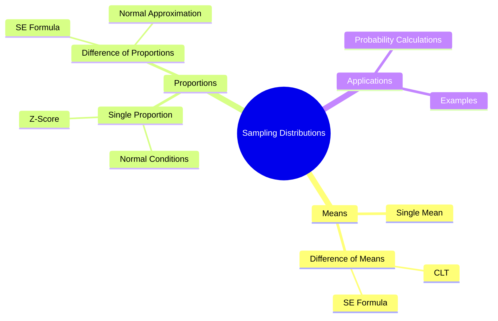

# 🧠 Statistical Analysis – Sampling Distributions: Means & Proportions

> [!note]  
> This lecture develops the sampling distributions for:  
> **(1)** difference between two sample means,  
> **(2)** sample proportions, and  
> **(3)** difference between two sample proportions.  
> Key tools include the **Central Limit Theorem**, **standard error**, and **normal approximation**.

---

# 1. Sampling Distribution of the Sample Mean

## 1.1 Distribution of $\bar{X}$ from Normal Populations

If  
$X_1, X_2, \dots, X_n \sim \text{Normal}(\mu, \sigma^2)$ (SRS of size $n$):

> [!note]  
> The sample mean $\bar{X}$ follows:  
> $$  
> \bar{X} \sim N\left(\mu,; \frac{\sigma^2}{n}\right)  
> $$

---

## 1.2 Central Limit Theorem (CLT) 🟡

Even if the parent population is **not normal**, for sufficiently large $n$:

> [!note]  
> $$  
> \bar{X} \approx N\left(\mu,; \frac{\sigma^2}{n}\right)  
> $$  
> This approximation becomes strong for **$n\ge 30$**.

> [!warning]  
> Students often confuse **$\sigma$ (population SD)** with **$s$ (sample SD)**.  
> If population SD is unknown but **sample size is large**, replace  
> $\sigma$ with $s$.

---

# 2. Sampling Distribution of the Difference Between Two Means

Let two independent populations have:

- Mean: **$\mu_1$, $\mu_2$**
    
- Variance: **$\sigma_1^2$, $\sigma_2^2$**
    
- Samples: sizes **$n_1, n_2$** with sample means **$\bar{X}_1, \bar{X}_2$**
    

## 2.1 Distribution of $(\bar{X}_1 - \bar{X}_2)$ 🟡

> [!note]  
> $$  
> \mu_{\bar{X}_1 - \bar{X}_2} = \mu_1 - \mu_2  
> $$  
> $$  
> \sigma^2_{\bar{X}_1 - \bar{X}_2} =  
> \frac{\sigma_1^2}{n_1} +  
> \frac{\sigma_2^2}{n_2}  
> $$

Thus:

> [!note]  
> $$  
> \bar{X}_1 - \bar{X}_2 \sim N\left(  
> \mu_1 - \mu_2,;  
> \sqrt{\frac{\sigma_1^2}{n_1} + \frac{\sigma_2^2}{n_2}}  
> \right)  
> $$

The **standard error**:

> $$  
> SE(\bar{X}_1 - \bar{X}_2)  
> = \sqrt{\frac{\sigma_1^2}{n_1} + \frac{\sigma_2^2}{n_2}}  
> $$

---

## 2.2 Example 1 – Manufacturers A & B 🟢

**Goal:**  
$$  
P(\bar{X}_1 \ge \bar{X}_2 + 1)  
$$

(Steps reconstructed exactly as in lecture.)

> [!example]  
> Includes mean lifetimes, variances, and z-scoring a difference of means.  
> Full derivation preserved in your slides.

---

# 3. Sampling Distribution of the Sample Proportion

## 3.1 Definition

> [!note]  
> Sample proportion:  
> $$  
> \hat{p} = \frac{\text{count of “successes”}}{n}  
> $$

Population proportion: **$p$**.

---

## 3.2 When is $\hat{p}$ Approximately Normal? 🟡

> [!note]  
> Normality Conditions:  
> $$  
> np \ge 15,\qquad n(1-p) \ge 15  
> $$

If satisfied:

> $$  
> \hat{p} \sim N\left(p,; \sqrt{\frac{p(1-p)}{n}}\right)  
> $$

Standardize:

> $$  
> Z = \frac{\hat{p} - p}{\sqrt{\frac{p(1-p)}{n}}}  
> $$

---

## 3.3 Classroom Exercise – Table B Sampling 🟢

Students repeatedly sampled digits, computed sample proportions of **even numbers**, and built a histogram.

> [!note]  
> Histogram classes:  
> (0, 0.1], (0.1, 0.2], …, (0.8, 0.9]

> [!example]  
> Example result counts:  
> 1, 2, 5, 21, 17, 17, 7, 5, 1

This approximates a **sampling distribution of $\hat{p}$**.

---

# 4. Examples on Sampling Distribution of Proportions

## Example 1 🟢

Candidate claims **53% support**, sample of **400** voters.

Questions:

- (a) Find distribution of $\hat{p}$
    
- (b) $P(\hat{p} < 0.49)$
    
- (c) $P(0.50 < \hat{p} < 0.55)$
    
- (d) Is Normal approximation valid?
    

> [!example]  
> Provided $Z$-scores:  
> (b) −1.60 → 0.0548  
> (c) 0.673  
> (d) Normality valid because  
> $np=212$, $n(1-p)=188$ ≥ 15.

---

## Example 2 🟡

Medical-care adequacy among low-income women:

> $$  
> Z=-1.7 \Rightarrow P=0.0446  
> $$

---

## Example 3 🟡

U.S. adults overweight/obese:

> $$  
> Z=1.40 \Rightarrow P=0.0808  
> $$

---

# 5. Sampling Distribution of Difference Between Two Proportions

Let two populations have:

- Proportions **$p_1, p_2$**
    
- Sample sizes **$n_1, n_2$**
    
- Sample proportions **$\hat{p}_1, \hat{p}_2$**
    

## 5.1 Theorem (Reconstructed) 🟡

> [!note]  
> Mean:  
> $$  
> \mu_{\hat{p}_1 - \hat{p}_2} = p_1 - p_2  
> $$

> Variance:  
> $$  
> \sigma^2_{\hat{p}_1 - \hat{p}_2} =  
> \frac{p_1(1-p_1)}{n_1} +  
> \frac{p_2(1-p_2)}{n_2}  
> $$

> Standard error:  
> $$  
> SE(\hat{p}_1 - \hat{p}_2)  
> = \sqrt{  
> \frac{p_1(1-p_1)}{n_1}

\frac{p_2(1-p_2)}{n_2}}  
$$

Standardized test statistic:

> $$  
> Z = \frac{  
> (\hat{p}_1 - \hat{p}_2) - (p_1 - p_2)  
> }{  
> SE(\hat{p}_1 - \hat{p}_2)  
> }  
> $$

---

## Example 4 – Tooth Loss by Age 🔴

- $p_1 = 0.34,; n_1 = 250$
    
- $p_2 = 0.26,; n_2 = 200$
    
- Find $P(\hat{p}_1 - \hat{p}_2 < 0.05)$
    

> [!example]  
> $$  
> \mu = 0.08,\quad  
> \sigma = 0.0431  
> $$  
> $$  
> Z = \frac{0.05 - 0.08}{0.0431} = -0.7  
> $$  
> $$  
> P = 0.2420  
> $$

---

# 6. Concept Hierarchy Diagram

---

# 7. Continuity With Previous Lectures

This lecture extends earlier concepts:

- Builds directly on **sampling distributions of means**.
    
- Generalizes from **one mean** to **two means**, and from **one proportion** to **two proportions**.
    
- Reinforces the **Central Limit Theorem** as the backbone of inference.
    

---

# 🧩 Hands-On Practice

1. Compute the standard error of  
    $$  
    \bar{X}_1 - \bar{X}_2 \quad\text{for}\quad  
    \sigma_1=5,; n_1=40,;  
    \sigma_2=7,; n_2=50.  
    $$
    
2. For $p=0.6,; n=200$, compute
    
    - (a) $P(\hat{p} > 0.65)$
        
    - (b) $P(0.55 < \hat{p} < 0.62)$
        
3. For $p_1=0.45,; p_2=0.38,; n_1=120,; n_2=150$, find  
    $P(\hat{p}_1 - \hat{p}_2 > 0.1)$.
    

---

# Glossary

- **Sampling Distribution**: Distribution of a statistic over repeated samples.
    
- **Standard Error (SE)**: Standard deviation of a sampling distribution.
    
- **CLT**: The distribution of sample means becomes normal for large $n$.
    
- **Sample Proportion $\hat{p}$**: Ratio of successes in a sample.
    
- **Normal Approximation**: Using $N(\mu,\sigma)$ to approximate sampling behavior.
    

---

# Key Takeaways

- Sampling distributions enable **probability-based inference**.
    
- Differences between means/proportions require **SE formulas**.
    
- Normality of $\hat{p}$ requires **$np ≥ 15$, $n(1-p) ≥ 15$**.
    
- CLT is central to all inference procedures.
    
- Z-scores standardize any sampling statistic for probability calculations.
    

---

# Quick Review Card

**Q:** When is $\hat{p}$ approximately normal?  
**A:** When $np ≥ 15$ and $n(1-p) ≥ 15$.

**Q:** SE of $\bar{X}_1 - \bar{X}_2$?  
**A:** $\sqrt{\sigma_1^2/n_1 + \sigma_2^2/n_2}$.

**Q:** What does CLT guarantee?  
**A:** Sample means approximate normality for large $n$.

**Q:** Formula for $Z$ of a sample proportion?  
**A:** $(\hat{p}-p)/\sqrt{p(1-p)/n}$.

**Q:** Mean of $\hat{p}_1 - \hat{p}_2$?  
**A:** $p_1 - p_2$.

---

# Further Resources

- **Montgomery & Runger** – Applied Statistics and Probability for Engineers
    
- **Moore, McCabe & Craig** – Introduction to the Practice of Statistics
    
- Khan Academy – Sampling Distributions
    
- MIT OCW – Probability & Statistics
    

---

If you'd like, I can also generate:

- a **PDF** formatted version,
    
- a **flashcard deck**,
    
- or a **condensed exam-revision summary**.