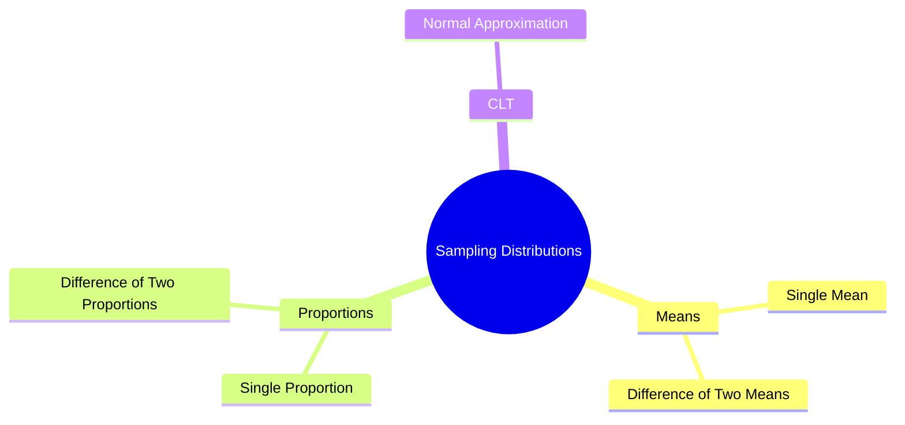
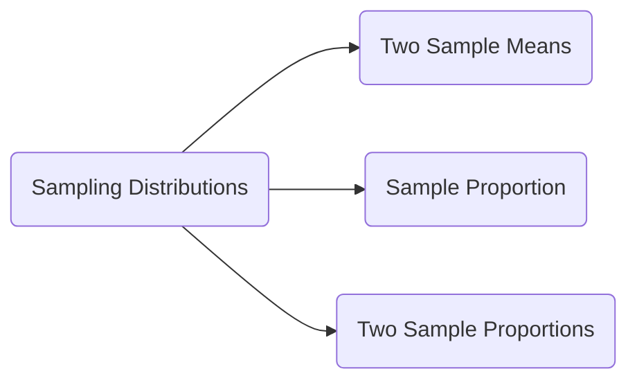

> [!note]
> This lecture operationalizes the sampling distributions for **sample means**, **sample proportions**, and **their pairwise differences**, building a scalable framework for inference on population parameters.

---

## 🔍 Overview
Sampling distributions quantify how statistics (means, proportions) behave across repeated samples. This lecture unifies the theory behind:
- Difference between **two sample means**
- Sampling distribution of a **sample proportion**
- Difference between **two sample proportions**
Grounded in the **Central Limit Theorem (CLT)** and normal approximations.

---

# 1. Sampling Distribution of a Single Sample Mean

> [!note]
> If $X_1, X_2, \dots, X_n$ is a random sample from $N(\mu, \sigma^2)$, then the sample mean $\bar{X}$ follows  
> **Normal distribution:**  
> $$\bar{X} \sim N\left(\mu,\ \frac{\sigma^2}{n}\right)$$

### Central Limit Theorem (CLT) 🟡 Intermediate
Even if population is non-normal, for large $n$:
$$\bar{X} \xrightarrow{approx} N\left(\mu,\ \frac{\sigma^2}{n}\right)$$

> [!tip]
> Use CLT confidently when **$n \ge 30$** or population is already normal.

---

# 2. Sampling Distribution of the Difference Between Two Sample Means

### Setup  
Two independent populations:

- Population 1: mean **$\mu_1$**, variance **$\sigma_1^2$**, sample size **$n_1$**
- Population 2: mean **$\mu_2$**, variance **$\sigma_2^2$**, sample size **$n_2$**

Statistic of interest:  
$$\bar{X}_1 - \bar{X}_2$$

### Distribution 🟡 Intermediate
$$
\bar{X}_1 - \bar{X}_2 \sim N\left(\mu_1 - \mu_2,\ 
\frac{\sigma_1^2}{n_1} + \frac{\sigma_2^2}{n_2}\right)
$$

Standard deviation:
$$
\sigma_{\bar{X}_1 - \bar{X}_2} = 
\sqrt{\frac{\sigma_1^2}{n_1} + \frac{\sigma_2^2}{n_2}}
$$

> [!warning]
> If $\sigma$ is unknown, use sample standard deviation **only when sample sizes are large ($n ≥ 30$)**.

---

## Example 1 – Comparing Lifetimes of Two TV Manufacturers
> [!example]
> A: $\mu_1 = 6.5$, $\sigma_1 = 0.9$, $n_1=36$  
> B: $\mu_2 = 6$, $\sigma_2 = 0.8$, $n_2=49$  
> Find:  
> $$P(\bar{X}_1 \ge \bar{X}_2 + 1)$$  
The method uses:
1. Compute distribution of $\bar{X}_1 - \bar{X}_2$
2. Standardize to Z
3. Use Z-table

---

## Example 2 – Home Visit Duration Difference
> [!example]
> $\mu_1=45$, $\sigma_1=15$, $n_1=35$  
> $\mu_2=30$, $\sigma_2=20$, $n_2=40$  
> Compute $P(\bar{X}_1 - \bar{X}_2 ≥ 20)$ → Z = 1.23 → Probability = **0.1093**

---

# 3. Sampling Distribution of a Sample Proportion

### Definition 🟢 Basic
Sample proportion:
$$\hat{p} = \frac{\text{count of successes}}{n}$$

### Conditions for Normality  
> [!note]
> Approximation holds when:  
> **$np ≥ 15$ and $n(1-p) ≥ 15$**

### Distribution
$$
\hat{p} \approx N\left(p,\ \sqrt{\frac{p(1-p)}{n}}\right)
$$

---

## Example (Random Digits Experiment)
Students repeatedly selected 10 random digits and computed $\hat{p}$ = proportion of even digits.

Histogram classes:

| Class | Count |
|-------|-------|
| (0,0.1] | 1 |
| (0.1,0.2] | 2 |
| (0.2,0.3] | 5 |
| (0.3,0.4] | 21 |
| (0.4,0.5] | 17 |
| (0.5,0.6] | 17 |
| (0.6,0.7] | 7 |
| (0.7,0.8] | 5 |
| (0.8,0.9] | 1 |

> [!question]
> Write a journal answering:
> - How to obtain $\hat{p}$ from Table B?
> - Total number of $\hat{p}$ values?
> - How to construct histogram & its name?
> - What does the smooth curve represent?
> - What are the axes?

---

## Example 1 – Election Proportion
> [!example]
> $p=0.53$, $n=400$  
> (b) $P(\hat{p} < 0.49)$ → **0.0548**  
> (c) $P(0.50 < \hat{p} < 0.55)$ → **0.673**

---

## Example 2 – Medical Care Adequacy
> [!example]
> $p=0.51$, $n=200$, $\hat{p}=0.45$  
> Z = –1.7 → Probability = **0.0446**

---

## Example 3 – Obesity Proportion
> [!example]
> $p=0.64$, $n=125$, $\hat{p}=0.70$  
> Z = 1.40 → Probability = **0.0808**

---

# 4. Sampling Distribution of the Difference Between Two Sample Proportions

### Setup  
Two independent proportions:
- $p_1$ with $n_1$
- $p_2$ with $n_2$

Statistic:
$$\hat{p}_1 - \hat{p}_2$$

### Distribution 🟡 Intermediate
$$
\hat{p}_1 - \hat{p}_2 \approx N\left(
p_1 - p_2,\ 
\sqrt{\frac{p_1(1-p_1)}{n_1} + \frac{p_2(1-p_2)}{n_2}}
\right)
$$

---

## Example 4 – Tooth Loss in Older Adults
> [!example]
> $p_1=0.34$, $n_1=250$  
> $p_2=0.26$, $n_2=200$  
> Find $P(\hat{p}_1 - \hat{p}_2 < 0.05)$  
> Z = –0.7 → Probability = **0.2420**

---

# 5. Continuity With Previous Lectures
> [!note]
> Builds directly on prior work on **sampling distributions of one mean** and extends the inference framework to:
> - Comparative inference (two means / two proportions)
> - Proportion-based inference
> - Central Limit Theorem applications

---

# 🧩 Hands-On Practice

1. Compute the SD of $\bar{X}_1 - \bar{X}_2$ for:  
   $\sigma_1=3$, $n_1=40$, $\sigma_2=4$, $n_2=50$.

2. Check if $\hat{p}$ is approximately normal for $p=0.12$, $n=60$.

3. Two proportions:  
   $p_1=0.3$, $n_1=90$ and $p_2=0.35$, $n_2=120$.  
   Compute $P(\hat{p}_1 - \hat{p}_2 > -0.02)$.

---

# 6. Lecture Questions
- How to obtain $\hat{p}$ from Table B?
- How many $\hat{p}$'s were generated in class?
- How to create the histogram of $\hat{p}$?
- What does the smooth curve represent?
- What do the axes represent?

---

# 7. Concept Hierarchy Diagram (Mind Map)

---

# 8. Higher-Level Structure of the Lecture

---

# 📘 Glossary

- **Sampling Distribution**: Distribution of a statistic over repeated samples.
    
- **Sample Mean ($\bar{X}$)**: Average value of sample observations.
    
- **Sample Proportion ($\hat{p}$)**: Fraction of successes in a sample.
    
- **CLT**: Ensures normality of sample mean for large $n$.
    
- **Standard Error (SE)**: Standard deviation of a statistic’s sampling distribution.
    

---

# ⭐ Key Takeaways

- Difference of means and proportions both converge to normal distributions under large samples.
    
- Normality of $\hat{p}$ requires: $np ≥ 15$, $n(1-p) ≥ 15$.
    
- Comparative inference uses distribution of differences.
    
- Standardizing to Z enables probability calculations.
    
- CLT underpins almost all approximations in this lecture.
    

---

# 🎯 Quick Review Card

**Q:** When is $\hat{p}$ approximately normal?  
**A:** When $np ≥ 15$ and $n(1-p) ≥ 15$.

**Q:** Formula for SD of $\bar{X}_1 - \bar{X}_2$?  
**A:** $\sqrt{\sigma_1^2/n_1 + \sigma_2^2/n_2}$.

**Q:** What does CLT guarantee?  
**A:** Approximate normality of sample mean for large $n$.

**Q:** Distribution of $\hat{p}$?  
**A:** $N\left(p,\ \sqrt{p(1-p)/n}\right)$.

**Q:** What statistic compares two proportions?  
**A:** $\hat{p}_1 - \hat{p}_2$.

---

# 📚 Further Resources

- _Introduction to Probability and Statistics_ – Mendenhall, Beaver & Beaver
    
- Khan Academy – Sampling Distributions
    
- UCLA Stats Handbook – CLT and Proportion Inference